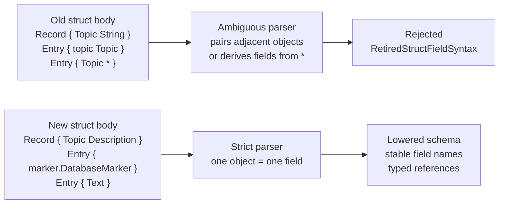
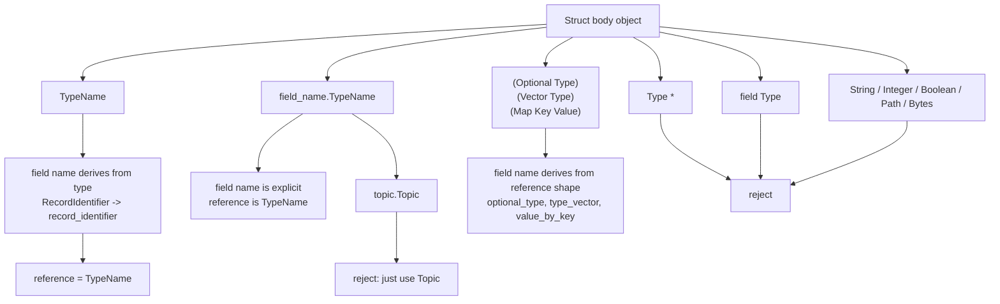
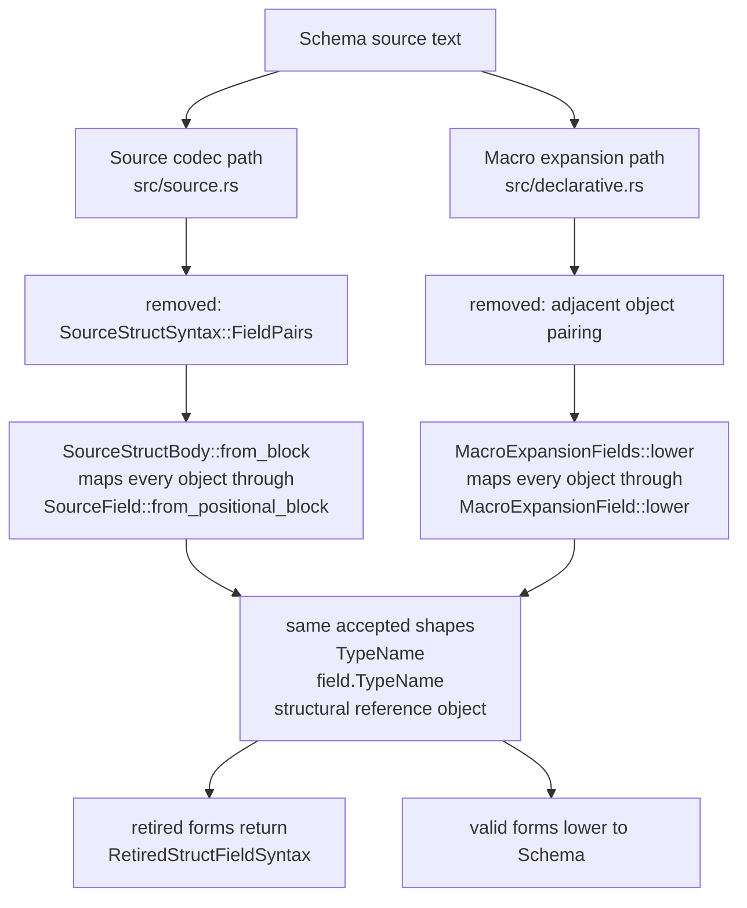
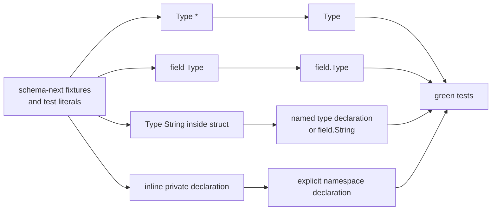
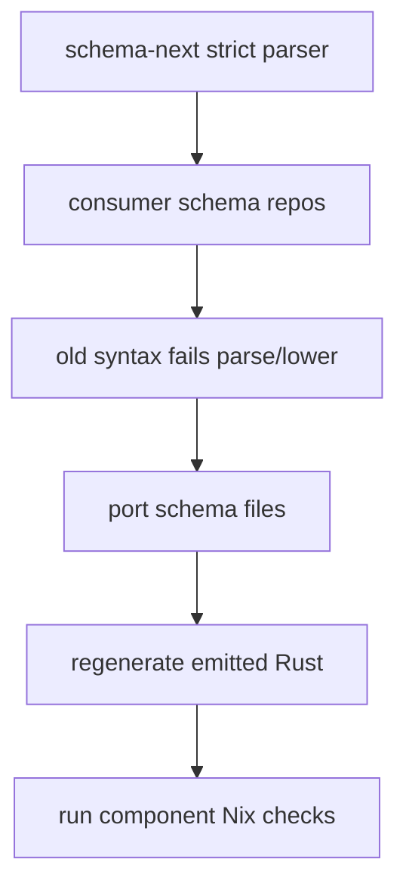

# 412 — Schema strict positional structs

## Why this exists

The psyche corrected the schema language direction: the old struct-body
pair surface is deprecated and must not be accepted.

Retired:

```nota
Record { Topic String }
Entry { Topic * Kind * }
Entry { topic Topic }
```

Accepted:

```nota
Record { Topic Description }
Entry { Topic Kind }
Entry { marker.DatabaseMarker }
Text String
Entry { Text }
Entry { text.String }
```

The Spirit capture for this correction is `lpk9`: struct bodies are
positional lists of field types; explicit field names use the dot
differentiator; the schema reader rejects the old pair form.

Follow-up Spirit capture `i3p0`: dotted explicit field names are only for
roles that differ from the type-derived field name:

```nota
Entry { topic.Topic }  ;; invalid
Entry { Topic }        ;; correct
```

## Visual Summary

### Syntax Shift



### What One Field Means Now



### Concrete Translation Examples

| Intent | Retired | Strict |
|---|---|---|
| Use existing field types | `Entry { Topic * Kind * }` | `Entry { Topic Kind }` |
| Explicit field role | `Entry { marker DatabaseMarker }` | `Entry { marker.DatabaseMarker }` |
| Redundant explicit role | `Entry { topic Topic }` | `Entry { Topic }`; `Entry { topic.Topic }` is rejected |
| Scalar wrapper type | `Topic { string String }` | `Topic String` |
| Struct-local scalar role | `Entry { text String }` | `Entry { text.String }` |
| Named scalar role | `Entry { value String }` | `Value String` then `Entry { Value }` |
| Collection field | `Query { topics (Vector Topic) }` | `Query { (Vector Topic) }` or `Topics (Vector Topic)` then `Query { Topics }` |

## Implementation

Branch:

`/home/li/wt/github.com/LiGoldragon/schema-next/schema-namespaces-poc`

Changed parser surfaces:

- `src/source.rs`: removed the `FieldPairs` mode from source struct
  bodies. A struct field is now one object: `TypeName`,
  `field_name.TypeName`, or a structural reference object such as
  `(Optional Integer)`.
- `src/declarative.rs`: removed the macro-expansion compatibility path
  that paired adjacent struct-field objects. The macro path now follows
  the same one-object-per-field rule.
- `src/engine.rs`: added `RetiredStructFieldSyntax` for direct retired
  syntax diagnostics.
- Bare scalar fields inside struct bodies are rejected to close the
  `Record { Topic String }` ambiguity. Use `Text String` + `{ Text }`,
  or `text.String` when the scalar role must be local to that struct.

### Parser Closure



## Fixture Migration

The schema-next tests and fixtures were migrated away from:

- star shorthand: `Type *`
- lower-case field pairs: `field Type`
- Pascal-scalar ambiguity: `Topic String` inside a struct body
- inline private field declarations inside struct bodies

The last item is a real semantic change: private helper types are no
longer invented from inside a struct field. If a type is needed, declare
it in the namespace.

### Migration Shape



## Verification

Passed locally:

```sh
cargo test -- --nocapture
cargo fmt -- --check
cargo clippy --all-targets -- -D warnings
nix flake check
```

`nix flake check` ran all 18 flake checks successfully.

## Migration Surface

Token-level scan across `/git/github.com/LiGoldragon` found 52 `.schema`
files with likely old struct-body tokens. This is a heuristic; it still
includes metadata forms such as `Stream { token ... }` and raw-core
fixtures that are not the strict source language. The live component
repos with likely work include `spirit`, `mind`, `lojix`, `terminal`,
`mirror`, `criome`, `cloud`, `orchestrate`, and the signal/meta-signal
contract repos.

### Broader Porting Surface



High-count areas:

- `schema-rust-next`: 10 test fixtures still use old examples.
- `schema-next`: remaining hits are intentional macro/raw fixtures or
  negative retired-syntax tests after this branch.
- component contracts: mostly `Type *`, `field Type`, and direct scalar
  wrappers such as `value String`.

The next practical step is to land this parser change, then migrate each
consumer schema repo as it repins to the strict schema-next.
