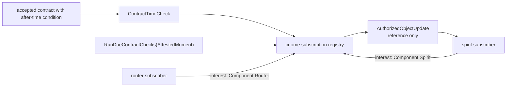

# 414 — criome classified object pulse POC

## Frame

The psyche asked for a POC of the agreement-machine direction: accepted
objects propagate as pulses, components subscribe to events related to their
function, and time-based contracts trigger later checks instead of relying on
an ambient heartbeat.

Two subagents checked the design pressure while the implementation proceeded:

- Copernicus searched for an existing universal component classifier and found
  none. Its recommendation was to keep the POC in `signal-criome`, and not turn
  `signal-frame` into a workspace-wide object wrapper.
- Euclid traced the current criome policy/time code and recommended explicit
  `ScheduleContractTimeCheck` / `RunDueContractChecks` roots first, with a
  future scheduler actor or SEMA table replacing the explicit trigger.

The result is on main in both code repos:

- `signal-criome` `f779f02a` — schema roots, classifier, interests, docs.
- `criome` `b9bc29f0` — daemon POC, filters, time-check trigger, docs.

## The wrapper answer

Yes: the same contract library can carry both forms.

The embeddable form is the unit enum:

```nota
ComponentKind [Spirit Criome Router Mirror Lojix Persona Agent]
```

That is the small identity vocabulary. It fits anywhere a component
differentiator is needed.

The wrapper forms are records that use that vocabulary in a concrete context:

```nota
AuthorizedObjectReference {
  component ComponentKind
  digest ObjectDigest
  kind AuthorizedObjectKind
}

AuthorizedObjectUpdate {
  object AuthorizedObjectReference
  contract ContractDigest
  decision Decision
  stamp AttestedMoment
}
```

This keeps the universal piece small and embeddable while avoiding a
workspace-wide "everything envelope." For criome, the wrapper belongs in
`signal-criome` because it is an authorization pulse. If router later needs the
same component vocabulary, extract `ComponentKind` and perhaps the interest
shape to a shared contract crate. Do not move the pulse wrapper upward until
there is a second real owner.

## Signal Shape

`signal-criome/schema/lib.schema` now has subscriber-owned filtering:

```nota
AuthorizedObjectInterest [
  AnyAuthorizedObject
  (Component ComponentKind)
  (ObjectKind AuthorizedObjectKind)
  (ComponentObject ComponentObjectInterest)
]
```

The new request/reply roots are:

```nota
(ObserveAuthorizedObjects AuthorizedObjectObservation)
(ScheduleContractTimeCheck ContractTimeCheck)
(RunDueContractChecks AttestedMoment)

(AuthorizedObjectSnapshot AuthorizedObjectSnapshot)
(ContractTimeCheckScheduled ContractTimeCheckScheduled)
(DueContractChecksEvaluated DueContractChecksEvaluated)
```

`ContractTimeCheck` is the programmed-heartbeat POC:

```nota
ContractTimeCheck {
  contract ContractDigest
  due_at TimestampNanos
  result AuthorizedObjectReference
  absent AuthorizedObjectInterest
}
```

That says: after this attested moment reaches `due_at`, check whether matching
events have already happened. If not, emit the configured authorized object
update for signing/observation.

## Criome Behavior

`criome/src/actors/subscription.rs` now stores subscriptions as token plus
interest, not token alone. The filter is a local trait over the schema-emitted
interest noun:

```rust
trait AuthorizedObjectFilter {
    fn accepts(&self, update: &AuthorizedObjectUpdate) -> bool;
}
```

The POC supports all four interest shapes:

- any authorized object;
- any object for one component;
- any object of one authorized-object kind;
- one component plus one authorized-object kind.

`EvaluateAuthorization` publishes a reference-only pulse with the component
from the evidence:

```rust
AuthorizedObjectReference {
    component: evaluation.evidence.component,
    digest: evaluation.evidence.operation.object_digest().clone(),
    kind: AuthorizedObjectKind::Operation,
}
```

`ScheduleContractTimeCheck` records a check in the subscription actor.  
`RunDueContractChecks(stamp)` uses the crystallized attested moment as the only
clock, evaluates due checks, suppresses any check whose `absent` interest
already has a matching update, then emits `DueContractChecksEvaluated`.

## Flow



The key move is subscriber-owned meaning. Criome does not compute a universal
"affected components" set. Components describe what they care about with
`AuthorizedObjectInterest`; criome stores the pulse and filters snapshots.

## Tests

Local checks run before commit:

```sh
cargo test --features nota-text --all-targets
cargo clippy --features nota-text --all-targets -- -D warnings
```

Remote Nix checks used GitHub revisions only, no local path overrides:

```sh
nix flake check github:LiGoldragon/signal-criome/f779f02a6ece753f063909ef9d4ee457c8672f02
nix flake check github:LiGoldragon/criome/b9bc29f0b2d160d81c949996155f46599a6f8e39
```

Both passed. `signal-criome` passed build, tests, docs, format, clippy, contract
discipline checks, and `nota-text`. `criome` passed build, docs, format, clippy
with and without `nota-text`, daemon skeleton tests, language tests, actor
discipline tests, and contract-boundary checks.

## Limits

This is a POC for the pulse shape, not the finished scheduler.

- Scheduled contract checks are in-memory. The next hardening slice is a SEMA
  family or scheduler actor that persists due checks and resumes them.
- `RunDueContractChecks` is an explicit signal request. A future scheduler can
  send that same request when a time window crystallizes.
- Socket-level fanout is still a transport follow-up. The current implementation
  proves filtered snapshots and stored pulses inside the daemon.
- `ComponentKind` is currently local to `signal-criome`. Extract it only when
  router or another contract crate actually needs the same classifier.

## Verdict

The universal wrapper should not be the root abstraction. The root abstraction
is a small component differentiator plus context-specific wrappers. The POC now
demonstrates both: `ComponentKind` as the embeddable unit-variant vocabulary,
and `AuthorizedObjectReference` / `AuthorizedObjectUpdate` /
`AuthorizedObjectInterest` as criome-specific wrapper records.
