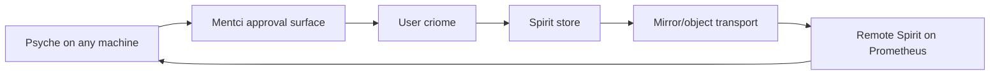

# 419 — Mentci approval surface and Prometheus Spirit

## Trigger

The psyche described the next local-approval shape for criome: mirrored Spirit state across machines, edits authorized through criome, and a psyche-facing Mentci interface that can receive escalated questions, show an LLM's suggested answer with context, and return the human approval decision.

The durable part was captured as Spirit `7x5z`:

> Mentci becomes the psyche-facing criome approval component: a daemon plus a Mentci TUI and NOTA CLI surface that presents escalated criome approval questions to the psyche, carries LLM-suggested answers with explanation and context, and returns an approval decision into criome. Mentci owns the interactive approval surface while status bar, popup, and email clients are future notification clients. This is the concrete local-user approval path for criome escalations to the psyche.

The home-vs-system criome split, encrypted multi-key daemon store, Prometheus live node, and Spirit/mirror authorization flow are kept as design questions here because the prompt used exploratory language around them and they cross into system-operator deployment.

## Implemented Slice

### mentci-lib

Branch: `main`

Commit: `b0385ce3` — `mentci-lib: add psyche approval flow model`

Files:

- `/git/github.com/LiGoldragon/mentci-lib/src/approval.rs`
- `/git/github.com/LiGoldragon/mentci-lib/src/lib.rs`
- `/git/github.com/LiGoldragon/mentci-lib/src/cmd.rs`
- `/git/github.com/LiGoldragon/mentci-lib/src/event.rs`
- `/git/github.com/LiGoldragon/mentci-lib/src/state.rs`
- `/git/github.com/LiGoldragon/mentci-lib/src/view.rs`
- `/git/github.com/LiGoldragon/mentci-lib/tests/approval.rs`

What changed:

- Added the approval domain model: `ApprovalQuestion`, `SuggestedAnswer`, `ApprovalContext`, `ApprovalDecision`, `ApprovalResponse`, `ApprovalState`, and `ApprovalView`.
- Added runtime commands for approval flow:
  - `Cmd::NotifyApproval { question }`
  - `Cmd::SubmitApproval { response }`
- Added user and engine events:
  - `EngineEvent::ApprovalQuestionArrived { question }`
  - `UserEvent::SelectApproval { identifier }`
  - `UserEvent::AnswerApproval { response }`
- Integrated the queue into `WorkbenchState`, so incoming questions become visible state and answered questions emit a submit command.
- `Defer` keeps the question pending and emits no command, which matches the approval UI's natural behavior.
- Updated the connection driver to box frames in `DriverCmd::SendFrame(Box<Frame>)`, closing the pre-existing large-enum clippy issue that blocked `-D warnings`.

Verification:

- `cargo test` passed.
- `cargo clippy --all-targets -- -D warnings` passed.
- `nix flake check --print-build-logs` passed.

### mentci-egui

Branch: `main`

Commit: `70292817` — `mentci-egui: consume approval flow commands`

Files:

- `/git/github.com/LiGoldragon/mentci-egui/INTENT.md`
- `/git/github.com/LiGoldragon/mentci-egui/src/app.rs`
- `/git/github.com/LiGoldragon/mentci-egui/Cargo.lock`
- `/git/github.com/LiGoldragon/mentci-egui/flake.lock`

What changed:

- Added `INTENT.md`, because the repo did not have one.
- Recorded that `mentci-egui` is a thin egui shell over `mentci-lib`, not the owner of approval semantics.
- Updated the shell to consume the new boxed frame command shape from `mentci-lib`.
- Added no-op handling for approval commands in the current egui shell, so the library model can advance without pretending the TUI/status-bar/email notification clients exist yet.
- Updated the lock file to consume `mentci-lib` `b0385ce3` and the current `signal`/`nota-next` stack.

Verification:

- `cargo test` passed.
- `cargo clippy --all-targets -- -D warnings` passed.
- `nix flake check --print-build-logs` passed on the dirty snapshot. The release test derivation ran on `prometheus.goldragon.criome` and completed `cargo test --release --locked` with `0` tests, `0` failures.
- `nix flake check --print-build-logs` passed again after committing; this second clean run was cached and verified the same derivations.

## Architecture Consequence

Mentci should be treated as the psyche approval surface, not as criome itself.

The clean split is:

- `criome` decides whether an object/action needs psyche approval and emits an escalation question.
- `mentci-lib` owns the interactive approval model: question, suggested answer, explanation, context, decision, queue, and state transition.
- A Mentci daemon owns the user's interactive approval session and key material.
- `mentci-tui`, `mentci-egui`, status-bar popups, and email bridges are clients over the same model.
- The NOTA CLI mode is the text projection of the same approval verbs, not a separate state machine.

This keeps the approval path testable before the actual TUI is built: the state model and command/event boundary already exist, and UI shells can be added without inventing another approval semantic.

## Mirror, Spirit, and Prometheus

The prompt's mirror/Spirit path looks like this:

The important interpretation: the edit is not just "write a file on another machine." The edit is an authorized head/state change. Spirit can learn the latest authorized head from criome, while mirror/router move the referenced objects or make them fetchable.

That suggests the next real system slice is not "run a second Spirit somehow." It is:

- define the authorized Spirit-head reference object or reuse the existing authorized-object pulse if it already fits;
- make Spirit publish the new authorized head after a Mentci/criome approval;
- make a second Spirit instance follow that head and fetch missing objects through the transport layer;
- run the second instance in a real user session on Prometheus.

The Prometheus deployment itself is system-operator or cluster-operator work because it touches host naming, user services, persistent state, network reachability, and the live-machine boundary.

## Open Questions

1. Should the home-user criome vs system criome split be recorded as durable intent?

   My current read: yes, but it was still exploratory in the prompt. The likely split is user criome for psyche approvals and user-owned keys, system criome for privileged service/root actions, with privileged actions able to depend on user-approval contracts.

2. Should criome's key storage intent supersede the current first-run plain `0600` key-file shape?

   The prompt points toward an encrypted multi-key daemon keystore, with a bootstrapping key readable by the user/session and hardware-backed keys later. That is probably a real direction change, but it needs an explicit confirmation because it changes a security primitive.

3. Should Prometheus Spirit be handed to system-operator now?

   If yes, the handoff should ask for a real user-session service on `prometheus.goldragon.creom` or the correct current name, with persistent state and a narrow end-to-end smoke test from local Spirit to remote Spirit.

4. Do we keep the repository spelling `mentci-*` while the product/interface is called Mentci?

   The existing repos are `mentci-lib` and `mentci-egui`. I used "Mentci" in prose and kept repo names unchanged.
