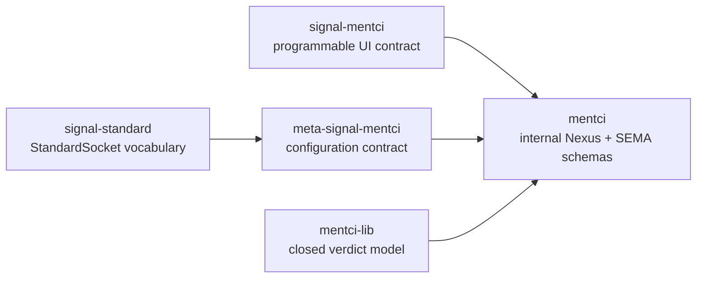

# 422 — Mentci component implementation slice

## What landed

This slice implements the parts of Designer 687 that can be landed without
creating new GitHub remotes or introducing local path dependencies.

### signal-standard

Local main commit: `aa672cc8` — `signal-standard: add typed standard socket vocabulary`.

Added the first shared connection-point vocabulary:

- `SocketPath`
- `HostName`
- `NetworkPort`
- `NetworkEndpoint`
- `StandardSocket = UnixSocket | NetworkSocket`

Generated Rust is checked in. Public helpers cover string accessors,
`NetworkPort::into_u16`, `NetworkEndpoint::new`, and `StandardSocket`
round-trip coverage.

### signal-mentci

Local main commit: `97730d56` — `signal-mentci: bootstrap programmable UI contract`.

Created the working signal contract as a Rust crate with generated schema
artifacts. The contract carries:

- `PresentQuestion`
- `PushUpdate`
- `ObserveInterfaceState`
- `AnswerQuestion`
- `ProposeEditedAnswer`
- `RetractInterfaceObservation`

It uses the closed verdict set:

- `ApproveSuggestedAnswer`
- `Reject`
- `Defer`

`PendingAnswer` is absent. Edited answers are modeled as `AnswerProposal`,
not as a verdict variant. I fixed the PoC duplicate wrapper name by using
`VisibleQuestions` in `PendingQuestionsView`.

### meta-signal-mentci

Local main commit: `270cd909` — `meta-signal-mentci: bootstrap daemon configuration contract`.

Created the meta policy contract as a Rust crate with generated schema
artifacts. The contract carries the typed daemon configuration:

- generation
- home criome socket
- persona identity
- notification clients

### mentci

Local main commit: `ac37ee5e` — `mentci: bootstrap daemon-local schemas`.

Created the daemon repository skeleton with:

- `schema/nexus.schema`
- `schema/sema.schema`
- `INTENT.md`
- `ARCHITECTURE.md`
- `AGENTS.md`
- `README.md`

The Nexus schema is the internal operations vocabulary: admit question,
retire question, admit edited-answer proposal, apply interface update,
register/drop subscriber, frame criome escalation, route verdict, and publish
interface state.

The SEMA schema is the canonical state vocabulary: pending questions,
decisions, edited-answer proposals, active subscriptions, and the singleton
revision family.

### mentci-lib

Pushed main commit: `c5a80852` — `mentci-lib: model edited answers as proposals`.

Aligned the shared model library with the contract:

- removed the open `Answer(...)` verdict variant;
- added `AnswerBody` and `AnswerProposal`;
- added `UserEvent::ProposeApprovalAnswer`;
- added `Cmd::SubmitAnswerProposal`;
- kept `AnswerApproval` strictly closed-verdict;
- added a test proving edited answers produce a proposal command and do not
  remove the pending question.

## Verification

Ran:

- `signal-standard`: `cargo test --all-targets --features nota-text`; `cargo clippy --all-targets --features nota-text -- -D warnings`
- `signal-mentci`: `cargo test --all-targets --features nota-text`; `cargo clippy --all-targets --features nota-text -- -D warnings`
- `meta-signal-mentci`: `cargo test --all-targets --features nota-text`; `cargo clippy --all-targets --features nota-text -- -D warnings`
- `mentci-lib`: `cargo test --all-targets`; `cargo clippy --all-targets -- -D warnings`
- temporary schema validator over all four Mentci schemas from local repos:
  `signal-mentci`, `meta-signal-mentci`, `mentci/schema/nexus.schema`, and
  `mentci/schema/sema.schema`

Results:

- `signal-standard`: 8 tests pass, clippy clean.
- `signal-mentci`: 5 tests pass, clippy clean.
- `meta-signal-mentci`: 3 tests pass, clippy clean.
- `mentci-lib`: 9 approval tests pass, clippy clean.
- schema validation: all four schemas lower through current `schema-next`;
  `PendingAnswer` is absent in both contract and internal schemas.

The only warning observed was pre-existing in `mentci-lib`: Cargo reports
`examples/handshake.rs` as both a named binary target and an example target.
It does not affect tests or clippy.

## Why the daemon binary is not landed yet

The daemon cannot be wired correctly until the new contract repositories have
canonical remotes. A production daemon should depend on generated nouns from
`signal-mentci`, `meta-signal-mentci`, and `signal-standard`. Adding local
path dependencies would violate the remote-only dependency discipline we just
established, and copying the PoC transport into the daemon would duplicate the
wrong layer.

I therefore landed the daemon-local schemas and repo contract, but not a fake
binary.

## Remaining gate

Create or confirm canonical remotes for:

- `signal-standard`
- `signal-mentci`
- `meta-signal-mentci`
- `mentci`

One caveat: `gh repo view LiGoldragon/mentci` currently resolves to a repo
named `workspace`, so the daemon remote name needs explicit confirmation
before pushing or wiring dependencies.
