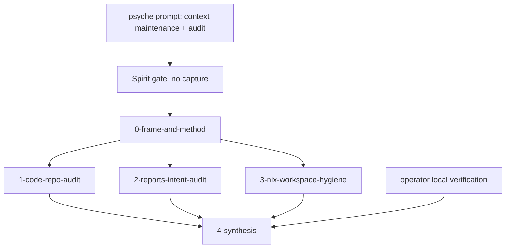

# 424 — Context maintenance and audit: frame and method

## Trigger

The psyche asked for a broad context-maintenance pass over the operator work
from the last few days, explicitly authorizing subagents and asking for a
meta-report with visuals and code.

Spirit gate: no capture. The prompt is a task order to audit and preserve
working context, not a new durable Decision, Principle, Correction,
Clarification, or Constraint.

## Scope

Primary scope:

- operator reports `406` through `423`;
- code repositories touched by those reports, especially `criome`,
  `signal-criome`, `meta-signal-criome`, `signal-standard`, `signal-mentci`,
  `meta-signal-mentci`, `mentci`, and `mentci-lib`;
- workspace hygiene around remotes, active repository registration, Nix path
  discipline, locks, and push/bookmark state.

Out of scope:

- deleting older committed reports in this pass. This report is a Refresh
  inventory and synthesis, not a bulk-retirement commit. Report retirement can
  follow once the psyche and peer lanes have read the synthesis.
- changing code unless the audit finds a small, unambiguous maintenance defect.

## Subagent Allocation

The following report slots were allocated before dispatch:

- `1-code-repo-audit.md` — code repository state, commits, tests, main/origin,
  current blockers.
- `2-reports-intent-audit.md` — report/intent spine, stale or superseded
  narratives, open design questions.
- `3-nix-workspace-hygiene.md` — Nix and workspace hygiene, remote-only
  discipline, active repository map, locks and bookmarks.

The orchestrator writes:

- this frame;
- `4-synthesis.md` — final overview, diagrams, code excerpts, audit verdict,
  and recommended next moves.

## Method

1. Read the workspace and operator discipline.
2. Run the Spirit gate on the prompt.
3. Dispatch bounded subagents with disjoint report files.
4. Do local verification in parallel:
   - repository clean-state checks;
   - main/origin checks;
   - focused Cargo/Nix witnesses already known from the landing;
   - report and active-repository inspection.
5. Synthesize the findings into one meta-report directory.

## Visual Map

