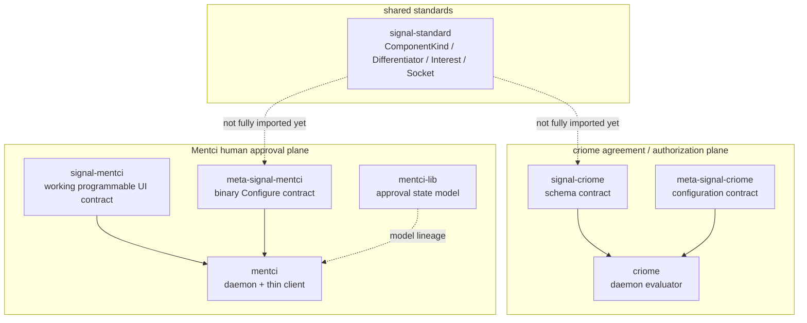
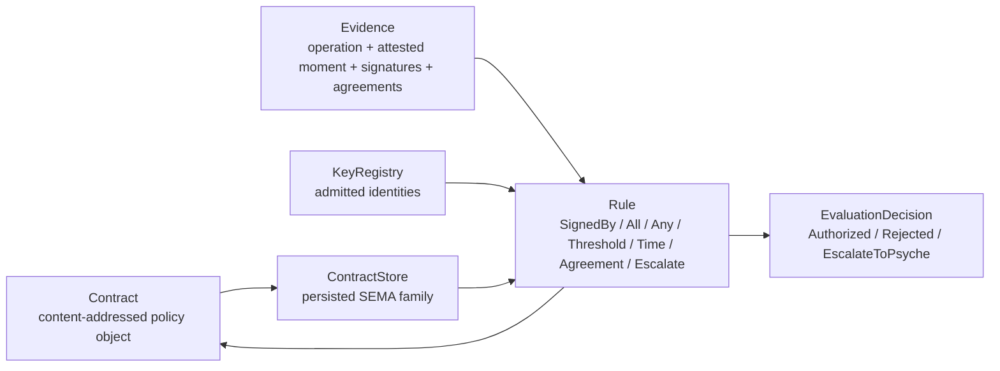
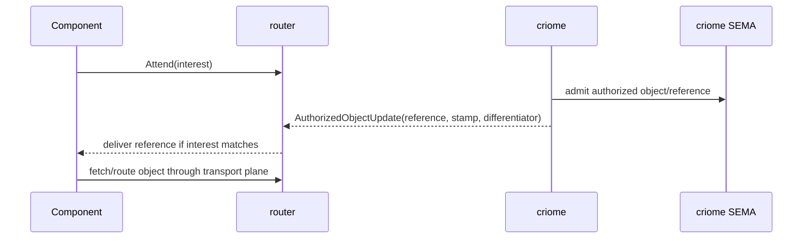
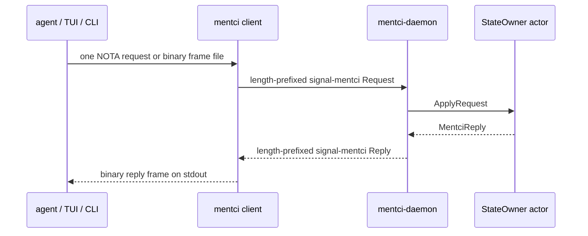

# 424 — Context maintenance and audit synthesis

## Verdict

The last few days of operator work did not vanish into prototypes. The current
mainline has a coherent spine:

1. `criome` has a schema-first identity-policy evaluator over `signal-criome`
   nouns, with real BLS verification, content-addressed contracts, persisted
   policy contract storage, attested moments, agreement facts, and strict
   contract tests.
2. `signal-standard` exists as the shared cross-component vocabulary crate.
3. `signal-mentci`, `meta-signal-mentci`, and `mentci` exist as public remotes.
4. `mentci` has a real daemon runtime slice plus a thin client over the
   generated `signal-mentci` and `meta-signal-mentci` contracts.

The current open work is also clear:

- router fan-out is still the next system-level implementation slice;
- the attested-moment/head quorum majority guard is on a feature branch, not
  on `criome` main;
- `signal-standard` consumers still need migration;
- Mentci state is still in-memory and verdict egress still waits on criome key
  custody;
- `signal-mentci`, `meta-signal-mentci`, and `mentci` still need flakes.

## Sources

Subreports:

- `1-code-repo-audit.md` — code repository state, commits, tests, blockers.
- `2-reports-intent-audit.md` — report supersession and intent spine.
- `3-nix-workspace-hygiene.md` — Nix, locks, active repo map, worktree hygiene.

Local verification performed by the orchestrator:

- clean-state and main/origin checks for `criome`, `signal-criome`,
  `meta-signal-criome`, `signal-standard`, `signal-mentci`,
  `meta-signal-mentci`, `mentci`, and `mentci-lib`;
- current Cargo test/clippy witnesses for `criome`, `signal-criome`, and
  `meta-signal-criome`;
- focused code reads for Mentci daemon/client/state and `signal-mentci`
  observation-token shape;
- recent operator/designer/system-designer report reads for supersession.

## Current Mainline Map



### Repository State

| Repository | Current main commit | Audit result |
|---|---|---|
| `criome` | `068f9db9` — `criome: port to strict signal-criome contract` | clean, matches origin, tests pass |
| `signal-criome` | `521a8ed3` — `signal-criome: expose snapshot collection accessors` | clean, matches origin, tests pass |
| `meta-signal-criome` | `16b9a196` — `meta-signal-criome: refresh schema support pins` | clean, matches origin, tests pass |
| `signal-standard` | `aa672cc8` — `signal-standard: add typed standard socket vocabulary` | clean, matches origin, tests pass, flake passes |
| `signal-mentci` | `d0fea7bf` — `signal-mentci: return observation token with snapshot` | clean, matches origin, tests pass |
| `meta-signal-mentci` | `270cd909` — `meta-signal-mentci: bootstrap daemon configuration contract` | clean, matches origin, tests pass |
| `mentci` | `5ddd3b4e` — `mentci: add daemon runtime and thin client` | clean, matches origin, 10 tests pass |
| `mentci-lib` | `c5a80852` — `mentci-lib: model edited answers as proposals` | clean, matches origin, 9 tests pass, flake passes |

## Criome: What Is Real

The old `criome` story started as a policy-language POC (`operator 406`) and
branch work (`operator 408`, `409`). Current main is beyond that. The current
state is:

- `signal-criome` owns the public policy nouns and verb roots.
- `criome` evaluates those generated nouns in hand-written Nexus logic.
- contracts are content-addressed and composable by digest;
- duplicate quorum members are rejected before evaluation;
- operation signatures and agreement signatures bind to the attested moment;
- policy contracts persist across daemon restart;
- the contract repo has truth tests preventing it from absorbing daemon/runtime
  or meta-policy responsibilities.

The useful policy-language shape:



Current tests that matter:

```rust
// /git/github.com/LiGoldragon/criome/tests/language.rs
#[test]
fn admission_rejects_duplicate_quorum_members_before_evaluation() { ... }

#[test]
fn operation_signature_is_bound_to_the_attested_moment() { ... }

#[test]
fn agreement_signature_is_bound_to_its_attested_moment() { ... }
```

The earlier blocker from `operator 407` — duplicate quorum members satisfying a
threshold by repetition — is closed on main. The current open edge is narrower:
the fork-safe majority rule for attested-moment/head quorums is not on main yet.
The feature branch exists as `criome` branch `attested-moment-majority-guard-139`.

## Object-Update Pulse And Router Fan-Out

The current intent spine has resolved the old fork:

- criome authenticates and emits reference-only updates;
- router owns operational subscription matching and fan-out;
- components subscribe by interest/differentiator;
- criome-local subscription state, if present, is observation/audit only.

The target shape:



This is not fully implemented. The open implementation work is router-side:
`Attend` / `Withdraw`, a durable attendance table, and delivery of reference
updates to matching subscribers. The audit specifically warns not to turn
criome's local registry into a second operational matcher.

## Signal-Standard: Real But Not Yet Everywhere

`signal-standard` is a real crate with a remote, not just a design placeholder.
It owns shared vocabulary such as component kind, differentiator, authorized
object interest, authorized object reference, and standard socket vocabulary.

The remaining work is consumer migration. Current local declarations still
exist in places such as:

- `signal-criome` local component/object-interest vocabulary;
- `meta-signal-mentci` local `ComponentKind` / socket stand-ins;
- other older signal contracts (`signal-persona`, `signal-message`) still using
  local rosters.

This means `signal-standard` is a landed foundation, not yet a fully consumed
foundation.

## Mentci: What Landed

The Mentci line had three important corrections before landing:

- spelling is `Mentci` / `mentci`;
- verdicts are closed: approve suggested answer, reject, or defer;
- editing an answer creates a new typed proposal object, not a free-text verdict.

The mainline runtime now has:

- `signal-mentci`: programmable UI request/reply/event contract;
- `meta-signal-mentci`: daemon startup/reconfiguration contract;
- `mentci`: daemon runtime + thin client;
- `mentci-lib`: reusable approval state model lineage.

Mentci request path:



Critical code facts:

```rust
// /git/github.com/LiGoldragon/mentci/src/daemon.rs
let frame = codec.read_mentci_frame(stream)?;
let MentciFrameBody::Request { exchange, request } = frame.into_body() else {
    return Err(Error::ExpectedRequest);
};
let request = request.payloads.into_head();
let reply = runtime
    .block_on(state.ask(ApplyRequest { request }).send())
    .map_err(|error| Error::ActorCall(error.to_string()))?
    .into_reply();
```

```rust
// /git/github.com/LiGoldragon/mentci/src/state.rs
fn observe(&mut self, observation: InterfaceStateObservation) -> MentciReply {
    let token = self.mint_subscription_token();
    self.subscriptions
        .insert(token.as_str().to_owned(), observation.interest);
    MentciReply::InterfaceObservationOpened(InterfaceObservationOpened {
        token,
        state: self.project(observation.interest),
    })
}
```

```rust
// /git/github.com/LiGoldragon/mentci/src/client.rs
fn request_frame_from_nota(&self, source: &str) -> Result<MentciFrame> {
    let request = NotaSource::new(source).parse::<MentciRequest>()?;
    Ok(MentciFrame::new(MentciFrameBody::Request {
        exchange: self.exchange(),
        request: request.into_request(),
    }))
}
```

Contract correction:

```schema
;; /git/github.com/LiGoldragon/signal-mentci/schema/lib.schema
InterfaceObservationOpened {
  token.SubscriptionToken
  state.ProjectedInterfaceState
}
```

Behavior tests:

```rust
// /git/github.com/LiGoldragon/mentci/tests/state.rs
#[test]
fn observe_returns_subscription_token_and_current_projection() { ... }

#[test]
fn defer_keeps_question_open_for_later_answer_proposal() { ... }

#[test]
fn approving_question_closes_it_against_later_edits() { ... }
```

Startup tests:

```rust
// /git/github.com/LiGoldragon/mentci/tests/configuration.rs
#[test]
fn startup_configuration_round_trips_as_meta_signal_frame() { ... }

#[test]
fn daemon_rejects_nota_startup_path() { ... }
```

Remaining Mentci work:

- durable SEMA/redb state and restart recovery;
- notification fan-out;
- real verdict signing/egress through criome key custody;
- flakes for `signal-mentci`, `meta-signal-mentci`, and `mentci`;
- migration from local stand-ins to `signal-standard` imports.

## Nix And Workspace Hygiene

The old disk-jamming pattern was not found in the audited code/config:

- no `path:/git/...`;
- no `git+file:`;
- no absolute `/git/...` Cargo dependency paths;
- no raw `/nix/store` literals in audited manifests/locks/Nix files.

Nix gates that exist and passed recently:

- `signal-standard`: remote flake check passed.
- `mentci-lib`: remote flake check passed.
- `criome` / `signal-criome`: current Cargo witnesses passed in this session;
  older reports include remote Nix proof for the earlier policy stack.

Nix gaps:

- `signal-mentci`, `meta-signal-mentci`, and `mentci` have no flakes.
- `operator 410` pasted raw `/nix/store/...` output paths in a report. That is
  not a code/config defect, but future reports should avoid raw store paths and
  cite the command/result instead.

Workspace state:

- touched canonical repos are clean and match origin;
- active repo map now includes `signal-standard`, `mentci`, `signal-mentci`,
  and `meta-signal-mentci`;
- `mentci-egui` is not active-map registered, which may be fine if it is now
  adjacent rather than active;
- `tools/orchestrate verify-jj` still reports unrelated stale `push-*`
  bookmarks in primary and `signal-spirit`;
- operator lock only holds the pre-existing `/git/github.com/LiGoldragon/mind`
  claim.

## Report Maintenance Ledger

The reports/intent audit gives the useful retirement order. I am not deleting
reports in this pass; this synthesis is the landing witness first.

### Retire Candidates After This Refresh

- `operator 406` — Criome internal language POC.
- `operator 407` — audit of designer content-addressed BLS prototype.
- `operator 408` — policy triad schema branches.
- `operator 409` — attested moment POC.
- `operator 416` — signal-standard catch-up.
- `operator 417` — designer 682 feedback.
- `operator 419` — Mentci approval surface and Prometheus Spirit.
- `operator 421` — Mentci PoC feedback.

These are superseded by current code, Spirit records, newer reports, or this
refresh.

### Forward Before Retiring

- `operator 410` — still the best code-rich Criome policy landing narrative,
  but stale on persisted SEMA and strict schema.
- `operator 414` / `415` — object-pulse and interest-token rationale, but
  router-sole is now settled.
- `operator 418` — keeps direct-lane/majority-guard nuance, but duplicate
  quorum warning is fixed.
- `operator 420` — useful state/subscription rationale, but stale because
  `mentci-daemon` now exists.
- `operator 422` — useful schema implementation ledger, but superseded by
  remote/runtime landing in `423`.

### Keep For Now

- `operator 412` — strict positional structs, until migrated into schema docs.
- `operator 413` — strict positional open questions, until surviving questions
  are migrated or closed.
- `operator 423` — current Mentci remotes/runtime report.

## What I Would Do Next

1. **Router fan-out.** Implement the router attendance table and delivery path:
   `Attend` / `Withdraw`, durable subscriptions keyed by `signal-standard`
   interest/differentiator, reference-only delivery from criome pulses.

2. **Attested moment majority guard.** Integrate or explicitly defer the
   `criome` feature branch `attested-moment-majority-guard-139`. It is the
   narrow fork-safety fix for time/head quorums.

3. **Mentci Nix gates.** Add flakes for `signal-mentci`, `meta-signal-mentci`,
   and `mentci`, then run remote flake checks. This closes the cleanest
   operator-quality gap in the new component.

4. **Mentci persistence.** Replace in-memory `State` with a durable SEMA/redb
   family while preserving the current request/reply behavior tests.

5. **Signal-standard consumer migration.** Port local rosters/socket types in
   `signal-criome`, `meta-signal-mentci`, and other signal contracts to
   `signal-standard`, one component at a time.

6. **Report retirement pass.** After the psyche and peer lanes accept this
   synthesis, delete the fully superseded operator reports in one context
   maintenance commit, keeping this directory as the current landing witness.

## Audit Close

The implementation arc is coherent. The main mistake pattern from earlier in
the conversation — treating prototypes, branches, or reports as if they were
mainline production — is now explicitly separated:

- mainline implemented: criome policy evaluator, signal-standard crate, Mentci
  contracts/remotes/runtime slice;
- branches/prototypes: majority guard, some router fan-out design, older POCs;
- open: router delivery, Mentci persistence/signing/Nix gates, consumer
  migration.

That separation should be the standard for future status reports: name the repo
and commit, name the test, and say whether the thing is on main, on a branch, or
only in a report.
