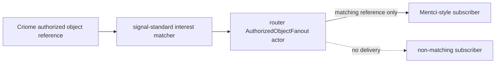
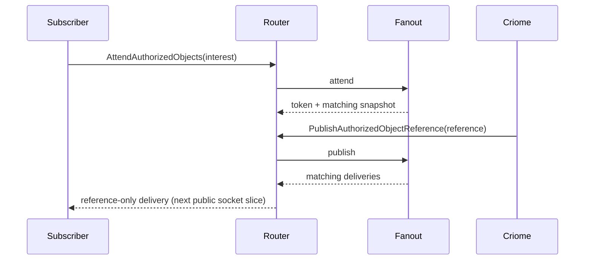
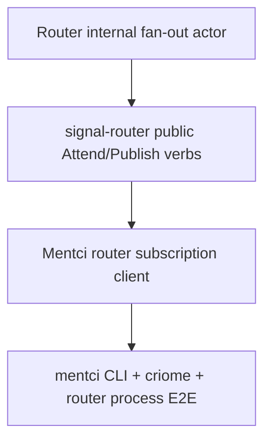

# 424 — Authorized-object pulse integration

## Frame

The requested target was "implement what you can" toward a real multi-component path:
Mentci client/UI, Criome authorized objects, and Router fan-out in a multi-node
scenario. The concrete slice implemented here is the missing router-side
fan-out mechanism for reference-only authorized-object pulses:



This intentionally does not inline object payloads. The routed item is an
`AuthorizedObjectReference`: component, digest, kind.

## Implemented

### signal-standard

Commit `0b7ae20c` — `signal-standard: add authorized object interest matcher`

Added the shared lattice predicate:

```rust
impl AuthorizedObjectReference {
    pub fn matches_interest(&self, interest: &AuthorizedObjectInterest) -> bool {
        match interest {
            AuthorizedObjectInterest::AnyAuthorizedObject => true,
            AuthorizedObjectInterest::Component(component) => self.component == *component,
            AuthorizedObjectInterest::ObjectKind(kind) => self.kind == *kind,
            AuthorizedObjectInterest::ComponentObject(component_object) => {
                self.component == component_object.component && self.kind == component_object.kind
            }
        }
    }
}
```

This keeps the differentiator logic in the shared vocabulary crate, not in each
component.

### router

Commit `ce578f12` — `router: add authorized object fanout`

Added `src/authorized_object.rs`, a data-bearing Kameo actor:

```rust
pub struct AuthorizedObjectFanout {
    subscriptions: Vec<AuthorizedObjectAttendanceToken>,
    updates: Vec<AuthorizedObjectReference>,
    deliveries: Vec<AuthorizedObjectDelivery>,
}
```

The runtime now starts it as a child and exposes internal messages:

```rust
AttendAuthorizedObjects
WithdrawAuthorizedObjects
PublishAuthorizedObjectReference
ReadAuthorizedObjectFanoutStatus
```

The behavior is deliberately small:



## Integration Tests Added

`router/tests/authorized_object_fanout.rs` proves three things:

1. A Criome component reference is delivered to a Mentci-style subscriber but
   not to a non-matching Mirror subscriber.
2. A late subscriber receives a snapshot of already-seen matching references,
   which is the recovery path that avoids "missed pulse" fragility.
3. A current `signal-criome::AuthorizedObjectReference` projects to the shared
   `signal-standard::AuthorizedObjectReference` and routes through Router.

That third test is the cross-contract bridge:

```rust
let criome_reference = signal_criome::AuthorizedObjectReference {
    component: signal_criome::ComponentKind::Criome,
    digest: signal_criome::ObjectDigest::new("criome-contract-digest"),
    kind: signal_criome::AuthorizedObjectKind::Contract,
};
```

It is then projected into `signal-standard` and published through Router.

## Verification

All commands used remote Git dependencies. No local `path:/git/...` Nix or Cargo
override pattern was used.

### Touched Repos

`/git/github.com/LiGoldragon/signal-standard`

```text
cargo test --all-targets --features nota-text
cargo clippy --all-targets --features nota-text -- -D warnings
```

Result: green.

`/git/github.com/LiGoldragon/router`

```text
cargo test --all-targets
cargo test --all-targets --features nota-text
cargo clippy --all-targets --features nota-text -- -D warnings
```

Result: green. The feature pass includes CLI binaries and process-boundary
tests.

### Adjacent Component Checks

`/git/github.com/LiGoldragon/mentci`

```text
cargo test --all-targets
cargo clippy --all-targets -- -D warnings
```

Result: green.

`/git/github.com/LiGoldragon/signal-mentci`

```text
cargo test --all-targets --features nota-text
cargo clippy --all-targets --features nota-text -- -D warnings
```

Result: green.

`/git/github.com/LiGoldragon/meta-signal-mentci`

```text
cargo test --all-targets --features nota-text
cargo clippy --all-targets --features nota-text -- -D warnings
```

Result: green.

`/git/github.com/LiGoldragon/criome`

```text
cargo test --all-targets
cargo clippy --all-targets -- -D warnings
```

Result: green.

## What Is Still Not a Full Process E2E

The implemented path is a real multi-crate integration test, but not yet a
three-daemon process E2E. The reason is concrete:



Router now has the fan-out engine, but the public socket contract does not yet
expose `AttendAuthorizedObjects` or `PublishAuthorizedObjectReference`.
Mentci likewise has no router-subscription client yet. A fake process test
would only call unrelated daemons side by side; it would not prove propagation.

## Next Build Slice

The next landable slice is:

1. Add authorized-object attend/publish/read verbs to `signal-router`.
2. Project those verbs in `router` onto the fan-out actor added here.
3. Add a Mentci notification/subscription client that attends for Criome
   authorized-object references.
4. Add a process E2E: start Router daemon, start Mentci daemon, publish a
   Criome reference through Router, prove Mentci receives the projected update,
   then prove late subscribe receives the snapshot.

That is the first honest "mentci CLI + criome + router" E2E. The core matcher
and fan-out state are now in place and tested.
