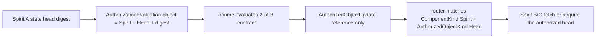

# 426 — Cluster propagation authorization reference surface

## Frame

The psyche asked Designer for a large workflow to prove a Spirit / criome / router propagation loop:

```text
Spirit A accepts state
  -> criome authorizes an authorized head under a 2-of-3 root contract
  -> router fans the reference by signal-standard type
  -> Spirit B/C acquire the head and become interchangeable
```

Designer left the real criome lane to operator. I aligned with `reports/designer/694-cluster-propagation-poc/0-frame-and-method.md` and implemented the smallest production-facing contract gap that blocked this loop: criome could authorize an operation digest, but the authorization request did not name the exact typed object reference being authorized. The daemon therefore published every successful evaluation as `AuthorizedObjectKind::Operation`, which could not represent "Spirit latest head" cleanly.

## What Landed

### signal-criome

Commit `9194c795` (`signal-criome: authorize typed object references`) on `signal-criome` main.

`AuthorizationEvaluation` now carries the object reference that should be published if the contract authorizes:

```nota
AuthorizationEvaluation {
  contract.ContractDigest
  object.AuthorizedObjectReference
  Evidence
}
```

`AuthorizedObjectKind` now includes `Head`:

```nota
AuthorizedObjectKind [Operation Contract Agreement Time Head]
```

The canonical examples now demonstrate the target case directly:

```nota
(EvaluateAuthorization
  (contract-digest-1
   (Spirit operation-digest-1 Head)
   (Spirit operation-digest-1 ...)))

(AuthorizedObjectUpdate
  ((Spirit operation-digest-1 Head) contract-digest-1 Authorized ...))
```

This keeps the update pulse reference-only: the pulse carries `(ComponentKind, ObjectDigest, AuthorizedObjectKind)`, not an inline Spirit payload.

### criome

Commit `475075fa` (`criome: publish authorized object references`) on `criome` main.

Criome now publishes the caller-provided `AuthorizationEvaluation.object` when a contract evaluates to `Authorized`:

```rust
if decision == EvaluationDecision::Authorized {
    self.publish_authorized_object_update(AuthorizedObjectUpdate {
        object: evaluation.object,
        contract: evaluation.contract.clone(),
        decision: decision.clone(),
        stamp: evaluation.evidence.stamp.clone(),
    })
    .await;
}
```

It also rejects malformed requests where the published object digest does not match the operation digest signed in the evidence:

```rust
if &evaluation.object.digest != evaluation.evidence.operation.object_digest() {
    return rejection(RejectionReason::MalformedRequest);
}
```

That preserves the current evidence invariant while allowing the caller to classify the authorized object as a `Head`.

## Why This Matters

Before this slice, a Spirit head could be signed and authorized, but the pulse emitted by criome would still be typed as an `Operation`. Router fan-out by `AuthorizedObjectKind` would not be able to distinguish "latest Spirit head" from ordinary component operations.

After this slice, the target propagation path has the correct wire shape:



This does not implement router delivery or Spirit state acquisition. It makes criome emit the right authorized reference for those pieces to consume.

## Verification

`signal-criome`:

```text
cargo test --features nota-text
17 round-trip tests + 3 canonical example tests passed

cargo clippy --all-targets --features nota-text -- -D warnings
passed
```

`criome`:

```text
cargo test --all-targets
52 tests passed

cargo test --all-targets --features nota-text
54 tests passed

cargo clippy --all-targets --features nota-text -- -D warnings
passed

nix flake check --builders '' --no-write-lock-file --log-format bar-with-logs
all checks passed
```

The Nix check used remote git dependencies, including `signal-criome` at `9194c795`; no forbidden local path override was used.

## Remaining Edges

Router fan-out is still the next integration boundary. Designer's frame points at `attendance-fanout-139` as the relevant in-flight router matcher branch. This operator slice gives it a real `Head` kind to route.

Spirit state acquisition is also still outside this slice. The target e2e needs Spirit B/C to fetch or acquire the authorized head and prove byte-identical state.

The 2-of-3 root contract majority guard is already enforced on criome main from the previous operator slice (`22801af6`, `criome: enforce majority quorums`). This slice does not add a new root-contract fixture; it makes successful authorization publish the correct typed reference.

