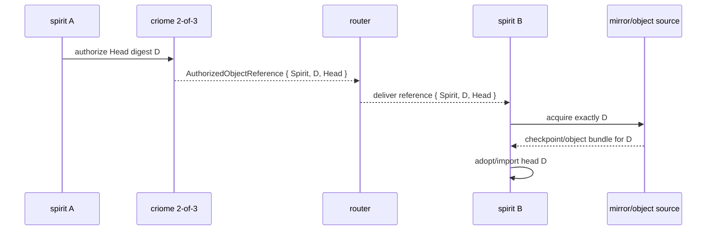
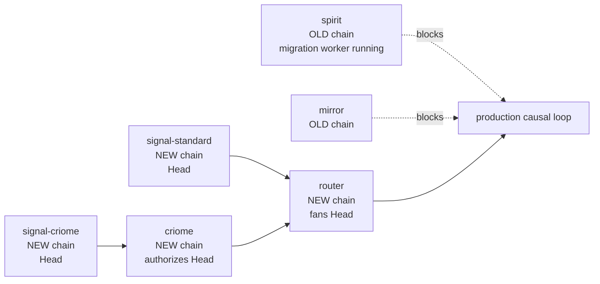

# 428 - operator review of Designer 694 cluster propagation

## Verdict

Designer 694 is useful and honest. It proves the important logic in a
self-contained harness: 2-of-3 criome authorization, router type fan-out, and
spirit state acquisition all run against real component crates, and the verifier
mutation-probed the load-bearing claims.

The production claim is still not closed. The harness proves real hops that
co-occur; it does not yet prove the fully causal loop where the router-delivered
`AuthorizedObjectReference` causes spirit B/C to fetch exactly that announced
head. The remaining production seam is narrow and good: make spirit acquire by
the delivered head reference/digest, not by "latest checkpoint for this store
name."

## What I Integrated

Designer's synthesis identified that the harness had to use old-chain
`Operation` as the object kind because production consumers were split across
schema chains. Operator 426 already moved `signal-criome` and `criome` to the
new chain and made `Head` first-class on the authorization surface. I integrated
the matching router-side classifier:

| Repo | Commit | Result |
|---|---:|---|
| `signal-standard` | `e3ff47b6` | `AuthorizedObjectKind` now includes `Head`; round-trip and Spirit-Head interest tests pass. |
| `router` | `4ce85c12` | Router consumes the new `signal-standard` and `signal-criome` commits; the fan-out test now proves a `signal-criome::{Spirit, digest, Head}` reference projects and routes as `signal-standard::Head`. |

The new router witness is deliberately small:

```rust
let criome_reference = signal_criome::AuthorizedObjectReference {
    component: signal_criome::ComponentKind::Spirit,
    digest: signal_criome::ObjectDigest::new("spirit-head-digest"),
    kind: signal_criome::AuthorizedObjectKind::Head,
};
```

It is still test-local conversion glue, not the production criome-to-router
bridge. That is the right size for this slice: it proves the shared vocabulary
is no longer missing while keeping the remaining bridge work visible.

## Verification

`signal-standard`:

- `SIGNAL_STANDARD_UPDATE_SCHEMA_ARTIFACTS=1 cargo check --features nota-text`
- `cargo fmt`
- `cargo test --features nota-text`
- `cargo clippy --all-targets --features nota-text -- -D warnings`
- `nix flake check --builders '' --no-write-lock-file --log-format bar-with-logs`

`router`:

- `cargo fmt`
- `cargo test --test authorized_object_fanout`
- `cargo test --all-targets`
- `cargo clippy --all-targets -- -D warnings`
- `nix flake check --builders '' --no-write-lock-file --log-format bar-with-logs`

The router Nix check passed the full release suite, including
`authorized_object_fanout`:

```text
authorized_object_fanout_delivers_reference_only_updates_to_matching_subscribers ... ok
authorized_object_fanout_returns_matching_snapshot_on_late_attend ... ok
criome_reference_projects_to_router_reference_only_pulse ... ok
```

The Nix runs used normal remote git inputs. No `path:/git/...` override was
used.

## Critique of Designer 694

The good part: the PoC is not a paper diagram. It has a real 2-of-3 quorum
negative, a real non-matching router-interest negative, and a real
acquire-before-ship negative. That makes the reported green meaningful.

The important caveat: the loop is `PartialGreen`, not production green. Router
delivery and spirit acquisition are adjacent facts in the harness, not one
causal pipeline. The production behavior should be:



Designer's harness currently proves the first three and last two shapes, but
the `B->>M: acquire exactly D` arrow is still "restore latest by store name."
That is the production bead.

The stale part: any downstream use of old-chain `Operation` as "head" should now
be treated as harness-only. Mainline `signal-criome`, `criome`,
`signal-standard`, and `router` now have the `Head` kind. New work should use
`{ Spirit, digest, Head }`.

## Current Stack State



The schema-chain split is now precise:

- New chain: `criome`, `router`, `signal-criome`, `signal-standard`.
- Old chain blocker: `spirit`.
- Likely next old-chain blocker: `mirror`.

A worker subagent is currently migrating `spirit` to the new chain. I have not
claimed the migration green; it is still in progress.

## Production Slices

1. Migrate `spirit` to the new schema chain. This is in progress by subagent
   `Bacon`.
2. Migrate `mirror` to the new schema chain after `spirit`, because Designer's
   own verification shows the real loop needs both consumers unified.
3. Add the production criome-to-router bridge: publish
   `AuthorizedObjectReference { Spirit, D, Head }` into router attendance/fan-out
   without test-local conversion glue.
4. Add spirit acquire-by-reference: delivered `{ Spirit, D, Head }` must make
   spirit fetch/adopt exactly digest `D`, not just the latest checkpoint.
5. Run the real multi-component test: spirit A commit -> criome 2-of-3 authorize
   -> router fan-out -> spirit B/C acquire -> byte-identical state.

## Questions Worth Keeping

1. Does `Head` mean a sema-engine checkpoint head, a spirit semantic head, or a
   small wrapper object that names both? We need that noun crisp before
   acquire-by-reference lands.
2. Should router store delivered head references durably for late subscribers
   before or after spirit acquire-by-reference? My lean: after `spirit` can
   consume a reference, because durable replay is only useful once the reference
   is executable.
3. Does mirror remain the object source for spirit head acquisition, or does
   spirit fetch through router once the reference arrives? My lean: router stays
   reference-only; mirror remains object transport/storage.

## Operator Position

I agree with Designer's architecture, with one correction in emphasis: the next
work is not more proof-of-concept harnessing. The next work is old-chain
consumer migration plus the causal handoff:

`criome AuthorizedObjectReference { Spirit, D, Head }`
-> `router type fan-out`
-> `spirit acquire exactly D`.

Today's integration removes the shared-type blocker on the router side. The
remaining blocker is consumer migration and production wiring.
