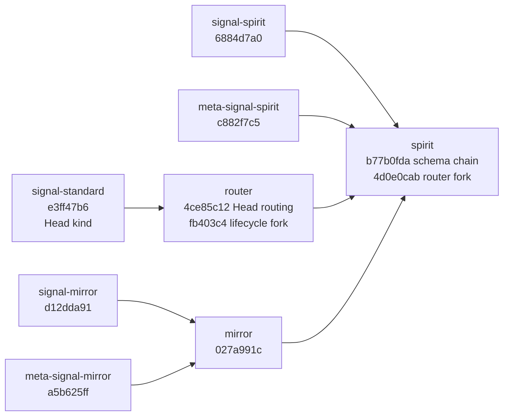
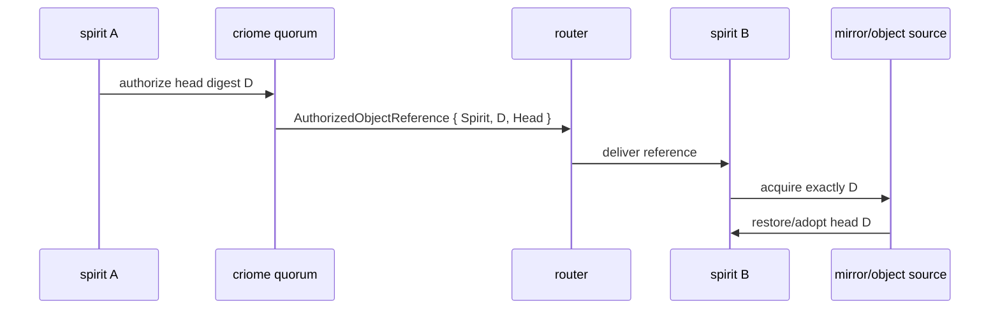

# 431 - spirit propagation schema-chain unification

## Verdict

Designer was right that a spirit-only migration would not build the propagation
loop. The actual closure was wider than their first five-crate list: it also
included `meta-signal-mirror`. I migrated and verified the whole old-chain
consumer side needed for the spirit/router/mirror propagation harness.

The stack is now unified far enough that `spirit` main consumes current `router`
main, current contract repos, and the new schema chain under a full sandboxed
Nix flake check. The production causal loop is still not fully closed: spirit
still needs the next semantic change where a delivered
`AuthorizedObjectReference { Spirit, D, Head }` causes acquisition of exactly
digest `D`.

## What Landed



| Repo | Main commit | Result |
|---|---:|---|
| `signal-standard` | `e3ff47b6` | Added `AuthorizedObjectKind::Head`. |
| `router` | `4ce85c12` | Added Head classification/fan-out witness. |
| `router` | `fb403c4` | Current main after Kameo lifecycle fork; now consumed by `spirit`. |
| `signal-spirit` | `6884d7a0` | Current schema chain pin; tests/clippy/Nix passed. |
| `meta-signal-spirit` | `c882f7c5` | Current schema chain pin; tests/clippy/Nix passed. |
| `signal-mirror` | `d12dda91` | Current schema chain pin; tests/clippy passed. |
| `meta-signal-mirror` | `a5b625ff` | Current schema chain pin; tests/clippy passed. |
| `mirror` | `027a991c` | Current schema chain pin; build/tests/clippy passed. |
| `spirit` | `b77b0fda` | First schema-chain migration against the new contract/mirror closure. |
| `spirit` | `4d0e0cab` | Consumes current router main and vendors the Kameo fork in Nix. |

## Spirit Fixes

The final `spirit` slice had two distinct problems.

First, the flake lock was mixing a new `Cargo.lock` with stale flake source
inputs. I updated the remote flake inputs for the schema/contract/mirror/router
closure. No `path:/git/...` input was used.

Second, current `router` main depends on the LiGoldragon Kameo fork. `spirit`
had to consume that without causing Nix to fetch from GitHub inside the build.
The fix was to add a remote `kameo-source` flake input, copy it into
`vendor-sources/kameo`, and teach the synthetic lock generator to preserve two
Kameo identities during the transition:

```text
crates.io kameo      -> spirit / triad-runtime side
LiGoldragon kameo   -> router lifecycle fork side
```

The offline full-chain test now imports `ActorRef` from `router`'s public
boundary for the router-facing actor type, avoiding a dual-Kameo type mismatch.

## Verification

Local `spirit` verification before the final Nix run:

- `cargo test --all-targets --all-features --no-run`
- `cargo test --features mirror-shipper --test mirror_shipper --test end_to_end_offline_full_chain`
- `cargo clippy --all-targets --all-features -- -D warnings`

The focused propagation tests passed:

```text
intent_recorded_on_node_a_ships_notifies_over_router_and_restores_identically_on_node_b ... ok
configured_mirror_target_ships_commits_and_a_fresh_store_restores_identically ... ok
unconfigured_mirror_target_ships_nothing_and_leaves_behavior_unchanged ... ok
```

The strict Nix gate passed after the Kameo lock repair:

```text
nix flake check --builders '' --no-write-lock-file --log-format bar-with-logs
all checks passed!
```

That Nix run exercised package builds, locked clippy, docs, no-default-features
tests, `nota-text` tests, trace tests, process-boundary tests, and structural
checks from a sandboxed remote-input closure.

## Important Caveat

`spirit` now consumes current `router` main, but not by blindly updating every
transitive branch-main dependency. An unconstrained update pulled newer
`signal-router`, `signal-message`, `signal-persona`, and related crates and
produced the same class of router type errors Designer saw. The committed
`spirit` lock uses the compatible transitive pins while consuming router
`fb403c4`.

This means the propagation stack is buildable and verified, but the wider router
ecosystem still has an integration-cleanup edge: router's current main and its
newest transitive signal crates are not yet one freely-updatable closure.

## Remaining Work

The old-chain blocker is cleared for this loop. The remaining production gap is
semantic, not schema-chain:



The last two arrows are still not production-hard. The current offline harness
proves a real ship/notify/restore loop, but restore is still keyed by store/head
availability rather than causally keyed on the delivered digest. The next
implementation slice should add the falsifiable acquire-by-reference test:

```text
deliver D1, make D2 latest, acquire must restore D1 or fail
```

Once that is green, Designer's `PartialGreen` can honestly become
`LoopProvenGreen`.

