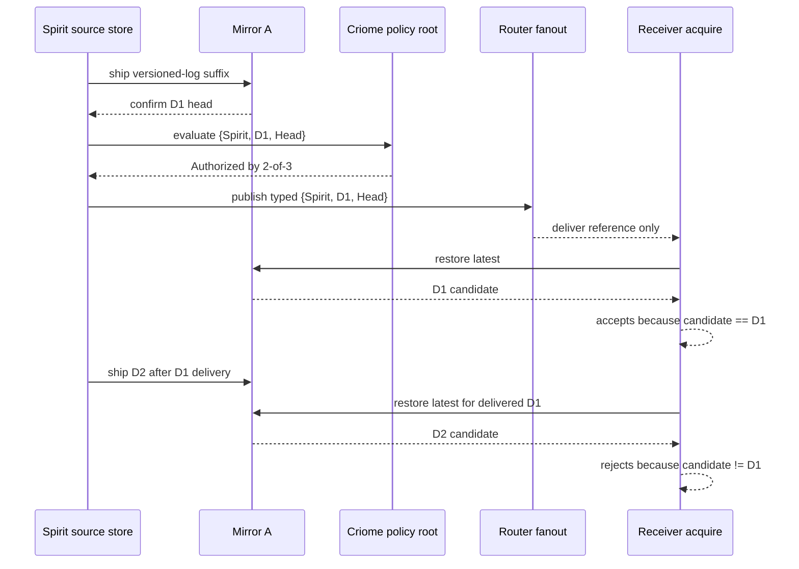

# 434 — criome-gated typed propagation loop branch stack

## Result

The single-host proof from designer report 700 is implemented as a three-repo
feature branch stack:

| Repo | Branch | Head | What changed |
|---|---|---:|---|
| `criome` | `criome-gated-propagation-loop` | `6c75804c` | Retired publish-side subscriber filtering: criome records authorized-object updates once; observers filter by interest when they subscribe. |
| `router` | `criome-gated-propagation-loop` | `94712199` | Added the production `StandardReference` projection from `signal-criome::AuthorizedObjectReference` into the shared `signal-standard` reference, and tested typed fanout. |
| `spirit` | `criome-gated-propagation-loop` | `a9182f42` | Rewrote `tests/end_to_end_offline_full_chain.rs` from the old chat-shaped `MirrorObjectNotice` proof to the criome-gated typed reference proof. |

## Flow Proven

The important point is the last leg: the test does not pretend mirror has
fetch-by-digest. It proves the current interim rule: when a delivered D1
reference can only restore newer D2, acquire must reject instead of silently
accepting D2 as D1.

## Checks

- `criome`: `cargo fmt --check && cargo test`
- `router`: `cargo fmt --check && cargo test --test authorized_object_fanout`
- `spirit`: `cargo fmt --check && cargo test --features mirror-shipper --test end_to_end_offline_full_chain`

All passed.

## Remaining Gap

This is pushed feature-branch work, not mainline integration. Nix flake checks
were not run in this slice. The next operator step is to mainline the branch
stack in dependency order, then replace the interim restore-latest check with a
real mirror fetch-by-digest surface when that contract lands.
