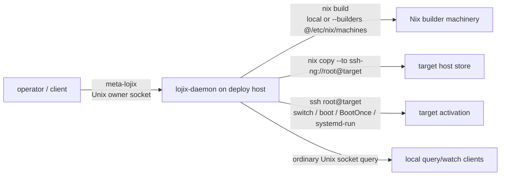
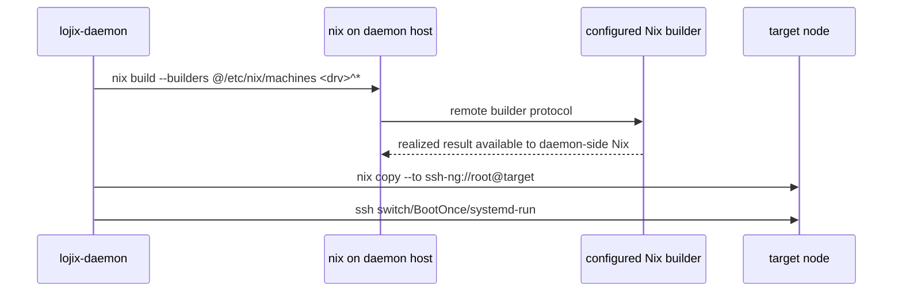

# 436 - Lojix inter-daemon communication investigation

## Conclusion

Inter-lojix communication is **not started** in the sense of one `lojix-daemon`
handing a job to another `lojix-daemon` on a different host.

What exists today is a **single coordinating daemon** model:

- clients submit typed requests to one local daemon over Unix sockets;
- that daemon owns durable job state and runs the deploy/test pipeline;
- remote effects happen through Nix remote builder machinery, `nix copy`, SSH,
  and target-side `systemd-run`;
- the remote target does not run a lojix peer protocol for that job.

The current repo intent even says lojix is "cluster-operator-owned, not
per-host": one instance per operator workstation or shared deploy host, not one
daemon on every cluster node. That may need to change if the desired model is
daemon federation, but it is not the implemented design.

## Current Shape

There is no edge like this today:

## Evidence

Code boundaries:

- `lojix/src/daemon.rs` binds two `AsyncListenerSocket`s from
  `DaemonConfiguration`: ordinary and owner. Both are Unix socket paths.
- `lojix/src/client.rs` connects with `std::os::unix::net::UnixStream` to
  `/run/lojix/ordinary.sock` or `/run/lojix/owner.sock`.
- `lojix/src/lib.rs` `DaemonConfiguration` contains socket paths/modes and state
  directory. It has no remote daemon address, peer registry, node daemon map, or
  router/Yggdrasil endpoint.
- `OwnerPeerAuthority` explicitly refuses TCP peers on the privileged owner
  surface because TCP has no Unix credentials.

Deploy/build behavior:

- `DeployPipeline::build_target()` lowers `builder: Option<NodeName>` to
  `BuildTarget::Local` or `BuildTarget::Remote`.
- `BuildTarget::Remote` is implemented as `nix build --builders
  @/etc/nix/machines`, not as a request to a remote lojix daemon.
- Copy and activation are direct target effects: `nix copy --to
  ssh-ng://root@<node>.<cluster>.criome` and `ssh root@...`.

Branch state:

- `lojix/main` has the deploy daemon, durable jobs, and hermetic Test-op work.
- `lojix/live-deploy-test-chain` adds live VM bring-up / deploy-into-VM /
  assert effects, but it still uses SSH, `systemd-run`, and guest IPs. It does
  not add a remote lojix peer protocol.

Reports:

- `reports/system-maintainer/10` and `11` prove installed daemon deploy through
  Ouranos to Zeús, but the daemon was on Ouranos and drove remote effects
  itself.
- `reports/system-designer/150` says safe Prometheus deployment needs
  build-on-target because the current daemon builds on the daemon host or via
  Nix remote builders that still realize back into the daemon host's store. That
  is another sign that remote lojix delegation is not implemented.

## What "Remote" Means Today

`builder = Some(prometheus)` does **not** mean "ask prometheus's lojix daemon to
build this."

It means:

This is why the Prometheus model issue exists: even remote-builder mode is not a
"build and keep it only on Prometheus" protocol. It is still centered on the
dispatcher daemon's Nix store.

## Missing Pieces For Inter-Daemon Delegation

To hand a job to another lojix daemon, the system would need at least:

- a remote transport surface: router/Yggdrasil/TCP framing for lojix requests;
- a daemon identity/auth story: likely criome-backed, not Unix peer credentials;
- a contract distinction between local owner authority and delegated remote
  daemon authority;
- an operation such as `AcceptDelegatedDeploy`, `BuildOnThisNode`, or
  `RunTargetLocalBuild`, with typed replies and failure modes;
- state synchronization: who owns the deployment row, who emits phase events,
  and how the origin daemon learns terminal success/failure;
- idempotency/resume semantics across two durable stores;
- policy: which daemon may ask which host to build or activate what.

None of those are present in the lojix triad today.

## Practical Answer For The Current Prometheus Problem

There are two possible paths:

1. **Small immediate fix:** implement build-on-target inside the current single
   daemon. The Ouranos daemon SSHes to Prometheus and runs the heavy `nix build`
   on Prometheus, then uses BootOnce. This is not daemon federation; it is still
   single-coordinator, but it solves the model-pull risk.
2. **Larger architecture shift:** make lojix daemons federate. Ouranos submits a
   typed delegated job to Prometheus's daemon; Prometheus owns the local build
   and reports phases back. This is cleaner long-term for node-local authority,
   but it is not started and it crosses into router/criome auth design.

My recommendation for now: do the small build-on-target fix first, and record
daemon federation as a separate design bead if the desired future is one
lojix-daemon per deploy-capable node.
