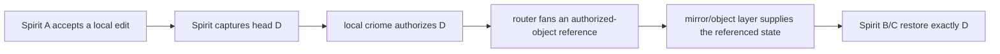

# 439 — criome, Spirit, router, mirror: what is going on

## The Short Version

This whole arc is about making Spirit edits into authorized, propagating,
cross-machine state transitions.

The desired loop is:



The intent behind it is bigger than Spirit: criome is becoming the local
agreement machine. It validates whether an object/state transition is
authorized. Router moves references and messages. Mirror/version-control moves
or restores the object state. Spirit is the first serious consumer.

## What The System Is About

There are four concepts that explain most of the recent work.

1. **Content-addressed heads.** Spirit's durable store has a versioned log. A
   new edit produces a head digest `D`. That digest is the thing that must be
   authorized and propagated.
2. **Criome as agreement/authorization.** Spirit should not just push its new
   state because it wrote it. It asks criome to authorize the exact head. Near
   term this is a local 1-of-1 gate; the later target is quorum-backed,
   multi-node criome.
3. **Reference-only pulse.** Criome/router should propagate typed references to
   authorized objects, not inline payload blobs. Components then fetch/restore
   what the reference names.
4. **Reusable networked test substrate.** The stack needs a hermetic NixOS VM
   cluster test first, then durable/prometheus VM tests, then DigitalOcean or
   real-host tests. The same propagation script should run across substrates.

That is the shape behind the labels in Spirit:

- `d6he` says the first e2e milestone is `spirit -> criome -> router -> mirror`.
- `xhwa` says the first production gate is 1-of-1 local criome, not full
  quorum.
- `p3td` says the bigger criome direction is "everything meaningful is a
  quorum".
- `jk1w` says multi-machine criome is near-term, not vague future.
- `cpip` says validation should be through actually-networked reusable test
  substrates.

## What Is Actually Green

### 1. Spirit production daemon has a fail-closed criome gate primitive

On `spirit` main:

```text
90875f2 spirit: fail-closed local criome gate before fanout
```

The gate sits after a local working write and before mirror fan-out. It captures
the local versioned-log head, projects it to `AuthorizedObjectReference`, calls
local criome, and ships only on `Authorized`.

That is real, but it is not fully production-wired: the current test arms it
directly with a prepared attestor. The documented missing piece is still
"signer key/config -> mint fresh per-head evidence."

### 2. The typed single-host propagation harness exists

Operator report 435 says `criome`, `router`, and `spirit` mainline branches
passed a cargo-level, single-host offline chain:

```text
spirit records D1 -> criome authorizes typed reference -> router fans -> mirror restore guard rejects wrong latest
```

That was targeted cargo testing, not a NixOS VM cluster and not a
multi-machine run.

### 3. Production Spirit outage was real and is fixed

Operator report 437 found the production failure:

- installed service/CLI skewed from the live v10 store,
- source migration also missed one live schema-10 family-identity half-step,
- Spirit main fixed it in `f1bc797`,
- live `spirit` now responds and `PublicTextSearch` works.

So "Spirit is defective" was true for the live deployment, but that specific
store-version defect is closed.

### 4. Designer's Stage A VM proof is real

Designer report 704 and operator report 438 agree:

```text
criome-cluster-1of1 boots a NixOS guest
starts real criome-daemon as systemd service
runs a witness over the daemon socket
proves authorized head -> Authorized
proves threshold-short -> Rejected(QuorumShort)
```

I independently ran the designer branch VM check before integration and it
passed.

### 5. The criome package half is now on main

I ported the reusable criome half to `criome` main:

```text
1eaa783 criome: land cluster witness test package
```

It adds:

- `criome-write-configuration`
- `criome-cluster-witness-test`
- `cluster-witness` flake package

I verified it with cargo tests, clippy, and a remote GitHub flake build.

## What Is Not Green Yet

### 1. The test-cluster harness is not on main

Designer branch:

```text
CriomOS-test-cluster origin/criome-cluster-test 8247b293
```

It contains `mkCriomeClusterTest` and the `criome-cluster-1of1` NixOS check.
It is good design-wise, but I did not merge it because `cloud-operator` owns a
dirty `CriomOS-test-cluster` checkout right now.

Once the lock clears, it needs two mechanical edits:

```nix
criome.url = "github:LiGoldragon/criome/main";
```

and:

```nix
${machineName}.succeed("CRIOME_SOCKET=${socketPath} ${criomePackage}/bin/criome-cluster-witness-test")
```

The second edit is because I renamed the witness binary with the `-test`
suffix during operator integration.

### 2. Stage A does not yet drive Spirit

Designer calls the green VM proof `criome-cluster-1of1`, but the exact current
green proof is the **criome half**:

```text
NixOS guest -> criome-daemon -> witness asks criome directly
```

It is not yet:

```text
NixOS guest -> spirit-daemon writes D -> spirit asks criome -> mirror fan-out
```

That is the next rung.

### 3. The full cluster is not built

Full `2-of-3` means three criome daemons signing across a network lane. The
code still lacks the daemon-to-daemon criome transport lane; criome transport is
currently Unix-socket shaped for the local daemon path.

This is the difference between:

- **1-of-1 local gate:** one local criome authorizes local Spirit propagation.
- **2-of-3 cluster:** multiple criome nodes sign a quorum-backed authorization
  over the network.

Both are valid. They are not the same milestone.

## Why This Got Confusing

The reports and chats overloaded names:

- "criome cluster" sometimes meant "a reusable NixOS cluster harness exists."
- "criome cluster" sometimes meant "a real 2-of-3 network quorum exists."
- "spirit gate" sometimes meant "the production Spirit gate primitive is in
  code."
- "spirit gate" sometimes meant "the VM test actually drives spirit-daemon."

Those are four separate facts. Right now:

```text
reusable harness design: yes, branch
criome daemon VM witness: yes, green
criome witness package: yes, on main
spirit gate primitive: yes, on main
spirit gate configured by meta config: no
VM test driving spirit-daemon: no
2-of-3 network criome: no
DigitalOcean/live substrate: no
```

The other confusion was coordination:

- Designer split the proof across `criome` and `CriomOS-test-cluster` branches.
- I could land `criome` immediately.
- `CriomOS-test-cluster` is locked by another lane, so I did not touch it.
- That makes the proof real but not fully mainlined.

## My Read

The architecture is coherent. The current work is not random; it is converging
on one clean invariant:

```text
state changes propagate only as authorized content-addressed heads
```

Spirit is the pilot because it has real valuable state and multiple machines
matter. Criome is the authority that says "this head may propagate." Router is
the transport/matcher for the typed reference. Mirror/version-control supplies
and restores the actual state. The test-cluster work is the pressure needed to
prove this outside in-process cargo tests.

The next implementation order I would use:

1. Land `CriomOS-test-cluster` Stage A after the cloud-operator lock clears.
2. Add Spirit meta-config arming for criome gate evidence, so the gate is not
   test-armed.
3. Extend the VM check from "criome witness talks to criome" to "spirit-daemon
   writes D and asks criome."
4. Add the mirror/router leg inside the same NixOS test.
5. Only then build the 2-of-3 criome peer transport and quorum test.

The important correction is not to skip straight to "full cluster" while the
local daemon gate still needs production configuration. But also do not dismiss
the green Stage A: it proves the real criome daemon can make the authorization
decision inside a VM, with real BLS, through the real socket. That is a useful
foundation.
