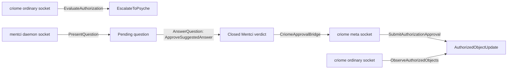

# 440 — Mentci hooked to criome meta approval

## What changed

This slice makes the missing criome meta socket real and gives Mentci a real bridge into it.



The important boundary is preserved: Mentci records and submits the psyche-facing closed verdict; criome owns authorization and publishes the authorized object pulse.

## Repos landed

| Repo | Main commit | Change |
|---|---:|---|
| `signal-criome` | `caa02a98` | Adds optional `meta_socket_path` to `CriomeDaemonConfiguration`; regenerated on the current schema stack. |
| `meta-signal-criome` | `f14c0324` | Adds `SubmitAuthorizationApproval(AuthorizationApproval)` and `AuthorizationApprovalRecorded`. |
| `criome` | `6ce7decd` | Binds a private `0600` meta socket, handles approval frames, records approved authorizations as authorized-object pulses. |
| `signal-mentci` | `c187a611` | Refreshes generated artifacts on the current schema stack. |
| `meta-signal-mentci` | `74283470` | Refreshes generated artifacts on the current schema stack. |
| `mentci` | `5931abdd` | Adds `CriomeApprovalBridge`, bound-daemon test API, and the cross-component demo test. |

## What the demo proves

Run:

```sh
cd /git/github.com/LiGoldragon/mentci
cargo test --test criome_bridge -- --nocapture
```

Expected proof lines:

```text
PROOF (a) criome ordinary socket escalated the head to psyche
PROOF (b) mentci daemon presented question QuestionIdentifier("question-1")
PROOF (c) mentci daemon accepted closed approve verdict
PROOF (d) mentci bridge submitted approval to criome meta socket
PROOF (e) criome ordinary socket exposes the authorized head pulse
```

That test starts both daemons as bound Unix sockets in one process, admits an `EscalateToPsyche` contract into criome, evaluates a Spirit head reference, presents/answers the question through Mentci, submits the closed verdict to criome's meta socket, then observes the resulting authorized head update through criome's ordinary socket.

## Verification

- `signal-criome`: `cargo test --all-features`
- `meta-signal-criome`: `cargo fmt && cargo test --all-features && cargo clippy --all-targets --all-features -- -D warnings`
- `criome`: `cargo test`; `cargo clippy --all-targets --all-features -- -D warnings`
- `signal-mentci`: `cargo test --all-features`; `cargo clippy --all-targets --all-features -- -D warnings`
- `meta-signal-mentci`: `cargo test --all-features`; `cargo clippy --all-targets --all-features -- -D warnings`
- `mentci`: `cargo test`; `cargo clippy --all-targets --all-features -- -D warnings`

## Still deferred

- Mentci is not yet a TUI; this is the daemon/socket/control proof.
- Criome `Configure` on the meta socket still returns `RequestUnimplemented`; startup configuration remains the binary daemon argument.
- The approval is a local meta authority path, not the multi-node 2-of-3 criome peer protocol.
- The bridge currently takes an `AuthorizationEvaluation` from its caller; the next UX slice is the long-running Mentci client that subscribes to criome escalation prompts and owns the pending-question lifecycle.
