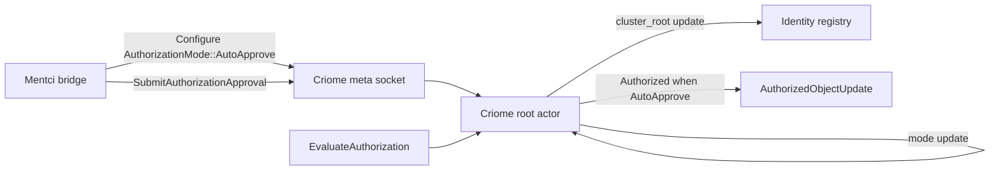

# 441 - Mentci adapted to criome meta Configure

## Frame

The previous operator slice made Mentci submit closed approval verdicts to criome over criome's meta socket. Designer's next slice added the missing configuration dimension: `signal-criome` now carries `AuthorizationMode [Quorum AutoApprove]`, and criome should apply that mode through the same meta socket.

This work adapts the Mentci bridge to that direction instead of creating a parallel control surface.

## Result

The meta socket now has two real jobs:

1. `Configure(CriomeDaemonConfiguration)` changes criome runtime configuration, including authorization mode.
2. `SubmitAuthorizationApproval(AuthorizationApproval)` records a Mentci/Psyche approval for an escalated authorization.

Mentci now uses the same meta socket for both.



## Code Landed

`signal-criome` main:

- Commit `aa5498ab` - `signal-criome: add daemon authorization mode`
- Adds `AuthorizationMode [Quorum AutoApprove]`.
- Adds `authorization_mode` to `CriomeDaemonConfiguration`.
- Defaults the mode to `Quorum`.

`meta-signal-criome` main:

- Commit `2a2f7d95` - `meta-signal-criome: refresh for authorization mode config`
- Refreshes artifacts and canonical examples for the new configuration field.

`criome` main:

- Commit `9b364cd0` - `criome: implement meta configure authorization mode`
- `CriomeDaemon::from_configuration` and `bind` thread `authorization_mode` into the root actor.
- `Input::Configure` is no longer `RequestUnimplemented`; it applies `authorization_mode` and cluster-root configuration.
- `EvaluateAuthorization` short-circuits to `Authorized` in `AutoApprove` mode, still publishing the same authorized-object update pulse.
- Adds the proof test `meta_socket_configure_auto_approve_authorizes_without_quorum_evidence`.

`mentci` main:

- Commit `617656b7` - `mentci: configure criome authorization mode over meta bridge`
- Adds `CriomeApprovalBridge::configure`.
- Keeps the existing closed-verdict approval bridge intact.
- Adds the proof test `mentci_bridge_configures_criome_auto_approve_over_meta_socket`.

## Verification

`signal-criome`:

```text
SIGNAL_CRIOME_UPDATE_SCHEMA_ARTIFACTS=1 cargo test --all-features
cargo clippy --all-targets --all-features -- -D warnings
```

`meta-signal-criome`:

```text
META_SIGNAL_CRIOME_UPDATE_SCHEMA_ARTIFACTS=1 cargo test --all-features
cargo clippy --all-targets --all-features -- -D warnings
```

`criome`:

```text
cargo test
cargo clippy --all-targets --all-features -- -D warnings
```

Observed criome test count: 54 tests green.

`mentci`:

```text
cargo test
cargo clippy --all-targets --all-features -- -D warnings
```

Observed Mentci test count: 12 tests green.

## Remaining Boundary

This closes the immediate designer alignment: Mentci can configure criome authorization mode and can submit closed approvals through the same meta socket.

The next real Mentci/criome edge is not another schema shape. It is key custody and live verdict signing: Mentci still needs the real encrypted-key / criome-owned signing path before a human approval is a production-grade cryptographic event rather than a local integration proof.
