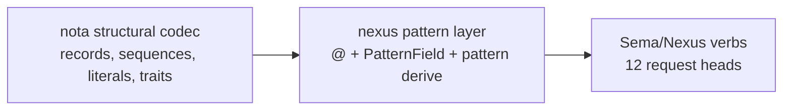
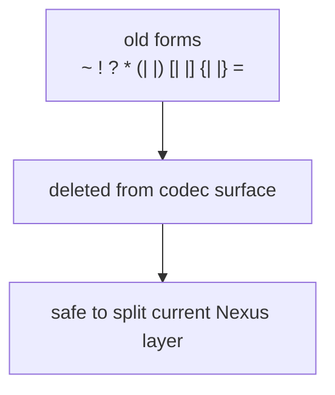
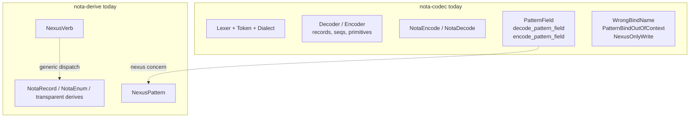
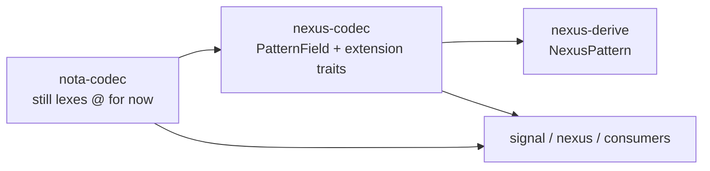
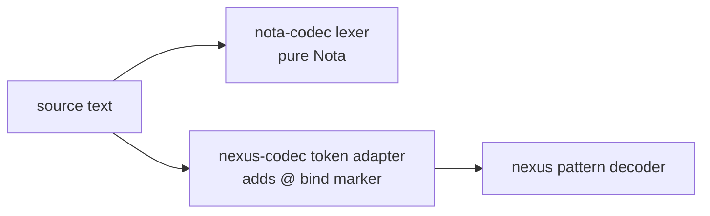
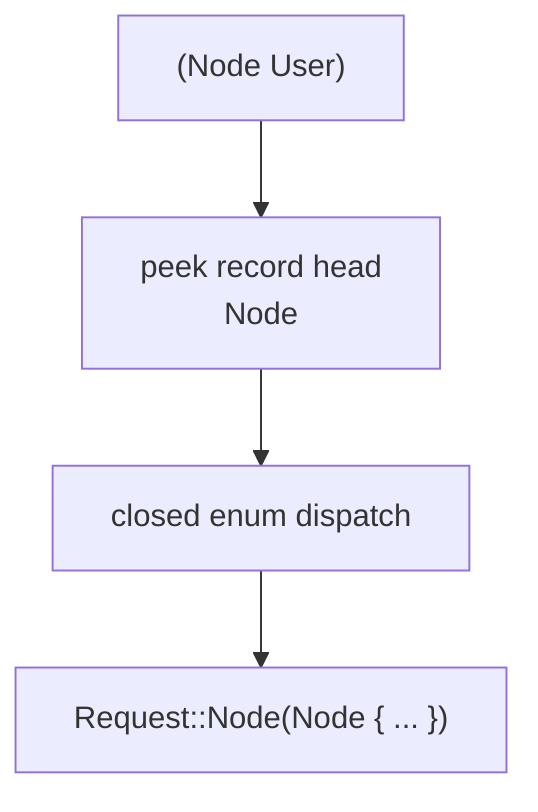
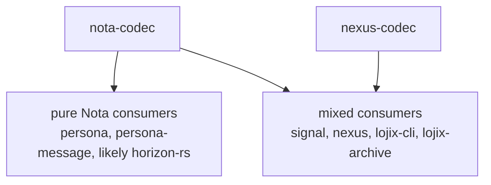

# Nexus Codec Extraction — Implementation Consequences

Status: operator implementation-consequence report after reading
`reports/designer/44-extract-nexus-codec-from-nota-codec.md`
Author: Codex (operator)

Designer/44 is directionally right: the old reason for putting
Nexus machinery inside `nota-codec` is gone. Nexus used to have a
thick surface of exotic delimiters and sigils. Tier 0 removed that.
What remains in `nota-codec` is mostly pure Nota plus a small Nexus
pattern layer: `@`, `PatternField<T>`, contextual pattern
encode/decode methods, `NexusPattern`, and the misnamed
`NexusVerb` derive.

My implementation read: **confirm the extraction, but do it in two
purity phases**. First extract the pattern layer mechanically. Then
remove the last syntax leak (`@`/dialect) once `nexus-codec` owns a
token-extension strategy.

---

## 1 · Immediate Correction

Designer/44 uses "12 tokens" in places where the safer wording is
"Tier 0 structural token vocabulary" or "12 verbs." The twelve are
the request verbs:

```text
Assert Subscribe Constrain Mutate Match Infer
Retract Aggregate Project Atomic Validate Recurse
```

The lexer vocabulary is not twelve; it includes structural and
literal tokens:

```rust
LParen RParen LBracket RBracket At Colon
Ident Bool Int UInt Float Str Bytes
```

This matters because the extraction decision is not "move twelve
tokens." It is:



The verb layer is language semantics. The codec split is one layer
lower: structural Nota versus Nexus pattern syntax.

---

## 2 · What Is Already Done

The dead-legacy cleanup from designer/42 has landed in the code:

| Repo | Current state |
|---|---|
| `nota-codec` | retired sigils and piped delimiters are rejected; `=` is a reserved comparison token; document-level verb request tests exist |
| `nexus` | pinned to the new `nota-codec`; old `(| ... |)` query compatibility is gone; renderer tests updated for bare-string encoding |

That means the split no longer has to decide where old Nexus
forms live. They live nowhere.



---

## 3 · Current Overlap

The current overlap is concentrated and easy to name.



The pure Nota layer should keep:

| Keep in `nota-codec` | Reason |
|---|---|
| record and sequence structure | base text data model |
| primitive literal decoding | base text data model |
| `NotaEncode` / `NotaDecode` | universal data projection |
| ordinary record derives | schema-to-text projection |

The Nexus layer should move:

| Move out | New home |
|---|---|
| `PatternField<T>` | `nexus-codec` |
| contextual pattern encode/decode methods | `nexus-codec` extension API |
| `WrongBindName`, `PatternBindOutOfContext` | `nexus-codec::Error` |
| `NexusPattern` derive | `nexus-derive` or `nexus-codec` workspace member |
| Nexus pattern tests | `nexus-codec` |

`NexusVerb` is separate: it is not actually pattern syntax. It is
closed enum dispatch by record head. That belongs in the Nota base
under a better name.

---

## 4 · Two-Phase Purity Plan

### Phase A — Mechanical Extraction

Phase A keeps `@` and `Dialect` in `nota-codec` temporarily. This
is not the final shape; it is the low-risk extraction path.



Implementation steps:

| Step | Change |
|---|---|
| 1 | create `nexus-codec` repo with Nix/Rust boilerplate |
| 2 | create `nexus-derive` unless we choose a workspace-local proc-macro member |
| 3 | move `PatternField<T>` and pattern tests from `nota-codec` to `nexus-codec` |
| 4 | move `NexusPattern` from `nota-derive` to `nexus-derive` |
| 5 | expose extension traits, not free functions: `NexusDecoderExt` / `NexusEncoderExt` or data-bearing wrapper types |
| 6 | update `signal` to import/re-export `nexus_codec::PatternField` |
| 7 | update `nexus` and mixed consumers to depend on both `nota-codec` and `nexus-codec` |
| 8 | remove pattern errors and pattern tests from `nota-codec` |

Phase A creates the correct ownership boundary without forcing a
lexer redesign in the same change.

### Phase B — Remove The Last Syntax Leak

Phase B removes `Dialect` and `@` from `nota-codec` if we want the
base codec to be strictly pure Nota.



There are two viable designs:

| Option | Shape | Cost |
|---|---|---|
| token adapter | `nexus-codec` wraps a public `nota-codec` token stream and recognizes `@` itself | requires `nota-codec` to expose enough lexer cursor/token-source API |
| shared syntax crate | create `nota-syntax` for reusable scanning pieces; `nota-codec` and `nexus-codec` build separate token streams | cleaner final purity, more repo churn |

I would not start with Phase B. It is the real boundary, but it
requires the most API care. Phase A removes the bulk of the
overlap immediately and makes Phase B small enough to reason about
later.

---

## 5 · Derive Naming

`NexusVerb` is misnamed. It dispatches closed enum variants by
record head and does not use Nexus pattern syntax.



This should stay in the Nota derive family under a generic name.
My preferred name is **`NotaSum`**:

| Name | Read |
|---|---|
| `NotaSum` | concise, algebraic data type meaning |
| `NotaDispatchEnum` | explicit but bulky |
| `NotaClosedEnum` | accurate but less clear at call sites |

Implementation rule: do the rename as its own commit before or
after extraction. Do not mix it into the pattern move unless the
patch is otherwise tiny.

---

## 6 · Consumer Migration



Concrete consumer changes:

| Repo | Change |
|---|---|
| `signal` | replace `pub use nota_codec::PatternField` with `pub use nexus_codec::PatternField`; derive imports move to `nexus-derive` |
| `nexus` | parser/renderer keep `nota-codec`; pattern-aware request parsing imports `nexus-codec` |
| `nota-codec` | remove pattern modules/errors/tests from architecture docs |
| `nota-derive` | remove `NexusPattern`; rename `NexusVerb` to `NotaSum` or chosen name |
| pure Nota repos | no pattern dependency after cleanup |

The split should make pure Nota consumers boring: they should not
compile pattern code, pattern derives, or Nexus error variants.

---

## 7 · Decision Points For User

| Decision | Operator recommendation |
|---|---|
| create `nexus-codec`? | yes |
| create separate `nexus-derive`? | yes, mirror `nota-codec` / `nota-derive` |
| keep `@` in `nota-codec` during first extraction? | yes, temporarily |
| remove `@`/`Dialect` later? | yes, after `nexus-codec` is stable |
| rename `NexusVerb`? | yes; choose `NotaSum` unless you prefer a more explicit name |
| move old sigils to `nexus-codec`? | no; they are deleted forms, not a legacy layer |

---

## 8 · Bottom Line

The split is technically feasible and architecturally correct. The
only reason not to do it would be repo churn, and this workspace has
already chosen micro-components as the discipline. `nexus-codec` is
not premature abstraction; it is the now-visible missing layer.

The next implementation should create `nexus-codec` and
`nexus-derive`, move the pattern machinery there, update `signal`
and `nexus`, and leave a small follow-up decision for removing
`@`/`Dialect` from `nota-codec` once the new layer is stable.

