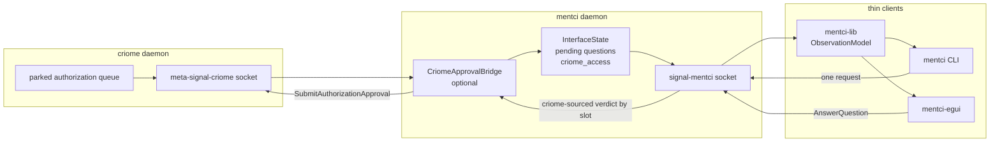
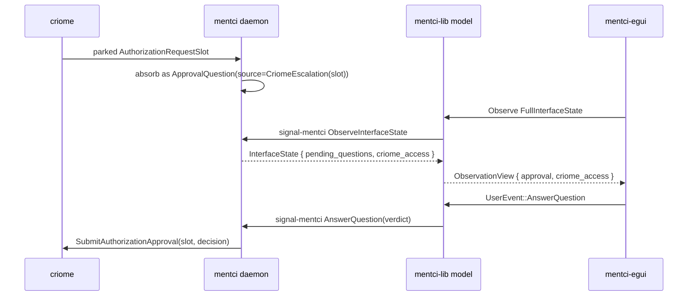
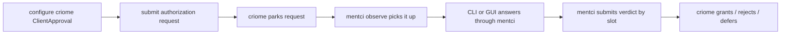

# Mentci/Criome GUI and CLI Overview

This is the operator snapshot after lockstep integration of the designer phase-2
criome-access mode and the operator daemon-routing work.

## Mainline State

| Repo | Main commit | What landed |
|---|---:|---|
| `signal-mentci` | `951c9c2a` | `CriomeAccess::{ReadOnly, ReadWrite}` and `InterfaceState.criome_access` |
| `mentci-lib` | `a53bce0e` | `ObservationView.criome_access` mirrors full daemon projections |
| `mentci` | `317bad57` | daemon projects `CriomeAccess` from its `MetaCriome` bridge presence |
| `mentci-egui` | `befd358e` | approval card renders pending questions and gates answer controls on `CriomeAccess` |

All four working copies were clean after commit. Verification run:

```text
signal-mentci: cargo test --all-targets; cargo clippy --all-targets -- -D warnings
mentci-lib:    cargo test --all-targets; cargo clippy --all-targets -- -D warnings
mentci:        cargo test --all-targets; cargo clippy --all-targets -- -D warnings
mentci-egui:   cargo test --all-targets; cargo clippy --all-targets -- -D warnings
```

## Runtime Shape



The rule is now simple:

- Clients never open criome.
- Clients send `signal-mentci::AnswerQuestion` to the mentci daemon.
- The daemon routes criome-sourced answers to criome by the carried
  `AuthorizationRequestSlot`.
- The daemon projects its access mode:
  - `MetaCriome` configured/present in daemon configuration means `ReadWrite`.
  - no `MetaCriome` means `ReadOnly`.
- GUI answer controls appear only for `ReadWrite`; read-only clients observe.

## Data Flow



## CLI Modes

The CLI is not MCP and does not use MCP as a dumb pipe. Current shape:

- One process invocation takes exactly one argument.
- If the argument is an observation atom, the CLI builds a typed
  `ObserveInterfaceState` request through `mentci-lib`.
- If the argument is a path, the CLI reads either `.nota` text or a binary
  length-prefixed frame.
- Otherwise the argument is parsed as inline NOTA for one `signal-mentci`
  request.
- The normal generic request path writes the binary reply frame to stdout.
- The observation atoms render a human-readable summary plus NOTA fallback.

Observation atoms:

```text
observe
observe:full
observe:pending
observe:status
observe:notifications
```

Generic inline NOTA request example:

```text
(PushUpdate (update-1 (SetStatus waiting)))
```

That path returns a length-prefixed binary `MentciFrame` reply; it is meant for
machine callers. The observation atoms are the current human-readable CLI mode.

## Sandbox IO Run

The sandbox daemon was started with a private socket and a throwaway startup
frame:

```sh
cargo run --quiet --bin mentci-write-configuration -- \
  /tmp/mentci-io-29aY6D/mentci.socket \
  /tmp/mentci-io-29aY6D/criome-meta.socket \
  /tmp/mentci-io-29aY6D/start.rkyv

cargo run --quiet --bin mentci-daemon -- /tmp/mentci-io-29aY6D/start.rkyv
```

Input:

```sh
MENTCI_SOCKET=/tmp/mentci-io-29aY6D/mentci.socket \
  cargo run --quiet --bin mentci -- observe:full
```

Output:

```text
socket Mentci Connected rev 0
approval pending 0 answered 0 subscriptions 0
reply (InterfaceObservationOpened (subscription-1 (0 (FullProjection (0 ready None [] [] ReadWrite)))))
```

Then an inline NOTA request changed daemon state:

```sh
MENTCI_SOCKET=/tmp/mentci-io-29aY6D/mentci.socket \
  cargo run --quiet --bin mentci -- '(PushUpdate (update-1 (SetStatus waiting)))'
```

That returned a binary frame. Rendered as hex, the first bytes were:

```text
00 00 00 6d 00 00 00 00 00 00 00 00 03 00 00 00
00 00 00 00 00 00 00 00 00 00 00 00 00 00 00 00
00 00 00 00 00 00 01 75 70 64 61 74 65 2d 31 01
```

A second observe showed the state change:

```sh
MENTCI_SOCKET=/tmp/mentci-io-29aY6D/mentci.socket \
  cargo run --quiet --bin mentci -- observe:full
```

Output:

```text
socket Mentci Connected rev 1
approval pending 0 answered 0 subscriptions 0
reply (InterfaceObservationOpened (subscription-2 (1 (FullProjection (1 waiting None [] [] ReadWrite)))))
```

## GUI Test

With the same daemon running:

```sh
cd /git/github.com/LiGoldragon/mentci-egui
MENTCI_SOCKET=/tmp/mentci-io-29aY6D/mentci.socket cargo run --bin mentci-egui
```

Expected first behavior:

- header shows the mentci socket as connected after `observe`;
- approval card shows pending count and criome access mode;
- with the write-mode startup above, the mode label is read-write;
- if a pending question exists, Approve / Reject / Defer controls are enabled;
- in a read-only daemon configuration, the same card shows observation-only and
  no answer controls.

The live GUI test that currently runs in CI-style cargo tests is:

```text
tests/daemon_client.rs:
daemon_client_observes_live_mentci_daemon_as_nota
```

It proves the egui-side daemon client can talk to a live mentci daemon and fold
the reply through the shared model/rendering path. It does not yet prove a
full clickable GUI approval flow; that is what the planned criome+mentci
NixOS test should cover end to end.

## Remaining Milestone

The next proof is the criome+mentci NixOS test:



That test is valuable because it proves the integrated stack, not just the
crate-local model: criome runtime, mentci daemon, signal contracts, and client
surface all in one VM.
