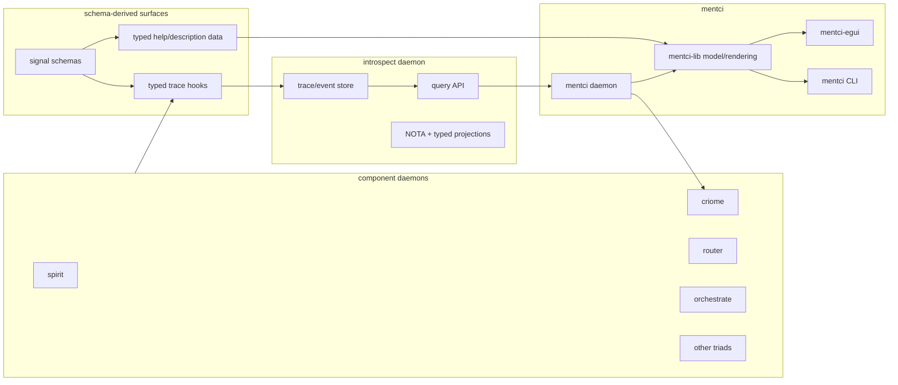
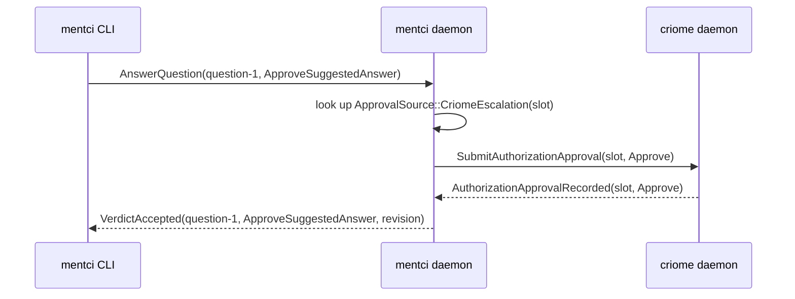

# Mentci Observability Bootstrap Brief

This is the operator brief for the next Mentci wave after the sandbox GUI and
CLI tests. It translates the psyche prompt into captured intent, current code
facts, lane work, and concrete next slices.

## Captured Intent

Spirit updates from this prompt:

- `xlrk` clarified: mentci-egui has ordinary observation/light-operation mode
  plus root-like meta/write mode, renders typed replies and unknown inner
  objects through NOTA fallback, and is shaped for long-lived subscriptions
  rather than CLI-style one-shot calls.
- `80bl` recorded: Mentci becomes the interactive observation and debugging
  surface for component behavior by querying `introspect`; schema-defined trace
  events flow into introspect; Mentci filters by component type, message type,
  and schema-derived signal input/output shape.
- `mu0o` recorded: the current Mentci stack moves from sandbox proof toward an
  available deployed test surface and marks the beginning of working with
  Mentci as the component observation, debugging, approval, and integration
  console.
- `cok7` recorded: Mentci GUI theming follows the system light/dark theme when
  the toolkit can read it; otherwise the app provides matching light and dark
  themes based on system themes.
- `jwm9` recorded by the maintainer lane: Mentci-lib is the asynchronous engine
  layer below the GUI, with room for actor-system, Nexus, and SEMA planes and
  portable embedding by multiple clients.

The operator consequence of `jwm9`: do not treat the current client-only
`ObservationModel` as the final ceiling for Mentci-lib. It remains the live
client library today, but designer now has durable intent to shape it into the
embeddable engine layer rather than only a renderer/model helper.

## Current Verified State

The sandbox stack is still running locally:

```text
criome-daemon  /tmp/mentci-egui-live-gv9TOl/criome-start.rkyv
mentci-daemon  /tmp/mentci-egui-live-gv9TOl/mentci-start.rkyv
mentci-egui    connected to the sandbox mentci socket
```

Mainline checked today:

| Repo | Main commit | Relevant state |
|---|---:|---|
| `mentci` | `b7837b0` | CLI has observe atoms and answer atoms. |
| `mentci-egui` | `befd358` | Thin egui shell, approval card, no criome socket. |
| `mentci-lib` | `a53bce0` | Client model and NOTA rendering shared by CLI/GUI. |
| `introspect` | `7a6ecae` | Prototype witness daemon; tests green locally. |
| `signal-introspect` | `47a4f76` | Query wrapper contract; tests green locally. |
| `meta-signal-introspect` | `889f1bd` | Meta contract present; hot configure still unimplemented. |
| `schema-rust-next` | `90d853c` | Typed trace hooks documented; schema-help output not yet an importable emitted API on main. |

Verification run:

```text
introspect:        cargo test --all-targets --quiet  # green
signal-introspect: cargo test --all-targets --quiet  # green
```

`introspect` is not dead, but it is narrower than the new Mentci direction. It
is currently a prototype inspection witness: router first, store-backed query
audit, delivery trace cache, and component observation wrappers. It is not yet
the general schema-trace intake service that Mentci can query for all component
behavior.

## Terminology

For Mentci, use these as the same UI idea:

```text
write mode = meta mode = privileged/root-like mode
observation mode = ordinary read/light-operation mode
```

At the contract layer this still maps to the component-triad split:

```text
ordinary socket: signal-<component>
meta socket:     meta-signal-<component>
```

Mentci clients should label sockets by component and authority channel:
`Mentci`, `MetaMentci`, `Criome`, `MetaCriome`, later `Introspect`,
`MetaIntrospect`, and so on. Avoid generic `ordinary` / `meta` labels in the
visible UI where the component identity matters.

## Target Shape



The new spine is:

1. Component schemas generate typed trace event names and help/description
   data.
2. Component runtimes emit optional typed trace events through no-op-by-default
   hooks.
3. `introspect` receives and stores those trace events.
4. Mentci queries `introspect` and renders the result with dedicated panes when
   known, and NOTA fallback when unknown.
5. Mentci still routes approvals through its daemon; clients stay thin.

## Query Model

The first useful `introspect` query family should cover:

| Axis | Example |
|---|---|
| Component kind | `Spirit`, `Criome`, `Mentci`, `Router`, `Orchestrate` |
| Component instance | socket path, daemon identity, or configured component name |
| Message type | signal request/reply head such as `AnswerQuestion` or `AuthorizeSignalCall` |
| Direction | input, output, trace event, subscription delta |
| Authority | ordinary vs meta/write channel |
| Schema symbol | fully qualified schema path for the input/output object |
| Time/revision | daemon timestamp, SEMA revision, or trace sequence |
| Payload view | typed summary plus NOTA fallback body |

Sketch of the kind of CLI edge Mentci should eventually expose:

```text
mentci observe:introspect:component:Criome
mentci observe:introspect:message:AuthorizeSignalCall
mentci help:signal:mentci:AnswerQuestion
```

Those atoms should compile to typed `signal-mentci` requests. Mentci then asks
`introspect`, rather than clients talking directly to every component.

## Inputs And Outputs

Current Mentci CLI mainline supports both observe and answer atoms:

```text
mentci observe:pending
mentci answer:approve:question-1
mentci answer:reject:question-1
mentci answer:defer:question-1
```

The answer atoms are daemon-routed:



The same principle should apply to introspection:

```text
client -> mentci daemon -> introspect daemon -> trace/query store
```

The GUI should not become a direct multi-daemon driver. The daemon owns
component connections and projects a single client model.

## Introspect Reality Check

What exists:

- `introspect` has a daemon, working CLI, meta CLI, Kameo root, store, and
  socket tests.
- Its store is `introspect.sema` through `sema-engine`; it does not read peer
  databases directly.
- `signal-introspect` carries closed query/reply variants:
  `EngineSnapshot`, `ComponentSnapshot`, `DeliveryTrace`, and
  `PrototypeWitness`.
- Router is the first real peer observation path. Manager and terminal clients
  remain scaffolds until their peer contracts and ingress paths land.

What is missing for the new Mentci direction:

- A trace-ingress contract from schema-generated trace events into
  `introspect`.
- A general component/message/schema-symbol query surface.
- A subscription surface for pushed trace/query deltas; today the contract is
  one-shot query-shaped.
- Mentci-side requests and model panes for introspect observations.
- A deploy path that runs `introspect` beside `criome`, `spirit`, and
  `mentci`.

## Tracing Reality Check

`schema-rust-next` architecture already names the intended generated trace
shape: engine traits own testing trace hooks, wrappers call default no-op trace
hooks around inner behavior, and generated event nouns stay typed until the
client display boundary.

The next implementation should not invent string logs. It should revive the
typed shape already described:

```text
generated TraceEvent
-> component trace client/log/socket
-> introspect trace ingress
-> introspect query store
-> mentci projection
```

The missing adapter layer is still mechanical but real: generated frame aliases
or trace archives, display/NOTA rendering, and a component-level emitter path
that can be enabled without linking a second instrumentation API into every
component.

## Schema Help Reality Check

Spirit record `6th4` says schema help should be generated from schema into a
typed Rust help data tree, and text clients should resolve help locally before
daemon transport.

Current source scan plus a read-only schema-help reconnaissance found the help
work off main: `schema-rust-next` main only has the architecture note, while
the working prototype lives on `schema-help` branches. The prototype pattern is
contract-local: `signal-spirit` has a `src/help.rs` defining `HelpRequest`,
`HelpResponse`, and `HelpModel`, and `spirit` intercepts help in the client
before opening a daemon socket.

That means schema help is not yet consumable by Mentci from main. The first
integration shape should follow the Spirit prototype, then migrate to generated
emission once schema-rust-next owns it:

1. Embed schema source constants in `signal-mentci`.
2. Add a `nota-text`-gated help module that builds a typed help tree from
   `schema_next::SchemaSource`.
3. Have the `mentci` CLI intercept `help` / `help:<symbol>` before daemon
   transport.
4. Add a `mentci-lib` render/model surface for help entries.
5. Add a GUI command/search pane for help, rather than treating help as another
   daemon reply transcript entry.

Mentci should consume it once it exists:

```text
signal schema description data
-> generated help tree keyed by schema symbol
-> mentci-lib help renderer
-> CLI help atoms and GUI type inspector
```

## Deployment And Theme

The GUI currently launches from a dev build and needed runtime library handling
in the sandbox. That is acceptable for proof, not for the available test
surface.

Current run fact: `mentci-egui` already has a flake package and can be launched
with:

```text
nix run /git/github.com/LiGoldragon/mentci-egui
```

It still expects a live Mentci daemon at `MENTCI_SOCKET`, defaulting to
`$XDG_RUNTIME_DIR/mentci.socket` or `/tmp/mentci.socket`; the GUI does not start
the daemon.

Smallest deployable next surface:

1. Add `mentci-egui` as a `CriomOS-home` flake input and install its default
   package into the local profile, so the GUI launches without manual
   `LD_LIBRARY_PATH`.
2. Run `mentci-daemon` as a test user service with a stable socket path.
3. Keep `criome` sandbox/test mode available beside it.
4. Add `introspect` only after the trace/query contract exists, or run it as a
   separate prototype witness service until then.

Theme work:

- The dark appearance is explained by `eframe 0.27` on Linux: default native
  options do not follow the system theme and default to dark.
- CriomOS-home currently also has dark defaults in the local theme stack, so
  system propagation needs a maintainer pass either way.
- The smallest app-level fix is to force `eframe::Theme::Light` or set
  `egui::Visuals::light()` during app creation, then later add a proper
  follow-system/app-override mode once the system theme source is stable.
- System-level work should go through the existing Chroma/theme path rather than
  a Mentci-only desktop hack, but Mentci-egui still needs app-level handling
  because this egui version does not reliably follow Linux theme portals.

## Spirit And Criome Bootstrap

Existing intent already supports the near-term local gate:

- `xhwa`: the near-term production target for Spirit-criome gating is the
  simplest 1-of-1 local authorization, without waiting for multi-machine
  quorum.
- `p43g`: criome owns key custody and is the authorization decider; the modes
  are auto-approve, client approval, and quorum.

The new prompt blends three compatible but distinct starting policies:

- AutoApprove Spirit requests on localhost.
- 1-of-1 local authorization.
- 1-of-any simple contract mirroring current SSH-key-style access.

Designer should reconcile the exact first production policy. Operator can
implement any of them once named, but the logs and Mentci/introspect views
should show which policy was active and which nodes/keys approved.

## Lane Split

Designer:

- Start a prototype branch for the Mentci-introspect/tracing UX and contract
  shape.
- Decide how `introspect` evolves from prototype witness into trace store/query
  component without becoming a shared row bucket.
- Shape Mentci-lib's transition from current client model library to the
  durable async engine layer recorded in `jwm9`, without smuggling daemon
  ownership or component state into the GUI shell.
- Reconcile local production Spirit-criome policy: AutoApprove, 1-of-1, or
  1-of-any.

Operator:

- Integrate designer branches to code-repo main.
- Keep Mentci CLI/GUI/daemon tests green.
- Implement the first settled trace-ingress and Mentci query paths.
- Keep the current sandbox/test GUI running until replaced by a packaged launch
  path.

Schema operator / schema designer:

- Confirm whether schema-derived help is actually emitted on main.
- If not, expose the typed help tree promised by `6th4`.
- Backfill round-trip tests for help/trace emitted objects before Mentci imports
  them.

System maintainer / system operator:

- Deploy Mentci as an available local test surface.
- Diagnose desktop/system theme propagation into egui apps.
- Audit production Spirit and criome state before enabling the first local gate.
- Own release/tag mechanics for the deployed test surface.

Maintainer:

- Track what is on production, what is only on code-repo main, and what is only
  on designer branches.
- Audit merges and report drift at the end of this epic boundary.

## Next Implementation Order

1. Fix Mentci availability: package/launch `mentci-daemon` and `mentci-egui`
   from current main without manual sandbox commands.
2. Fix GUI theme following: system detection first, app fallback second.
3. Build the criome+mentci end-to-end proof:
   park -> observe through Mentci -> answer through CLI and GUI path -> criome
   grant/deny/defer.
4. Audit and revive `introspect` as a trace/query component:
   keep the current witness pieces, add trace ingress and query selectors.
5. Confirm schema-help emission and plug it into Mentci CLI/GUI.
6. Wire Spirit through criome with the chosen local policy and make Mentci show
   the authorization events.
7. Tag the deployed test surface as the start of the Mentci observability
   bootstrap once the package launches, theme follows, and the end-to-end
   approval proof is reproducible.

## Open Questions For Psyche Or Designer

- Is `write mode == meta mode` only visible UI terminology, or should every
  Mentci-side component connector expose a formal authority enum with those
  exact words?
- For the first production Spirit-criome gate, which policy should be the named
  one: AutoApprove, 1-of-1, or 1-of-any?
- What is the first bounded Mentci-lib engine slice under `jwm9`: actors only,
  Nexus plane, SEMA-backed model state, or a narrower transport supervisor?
- What is the first deployment target for available Mentci: user desktop
  profile, systemd user service, CriomOS test VM, or all in stages?
