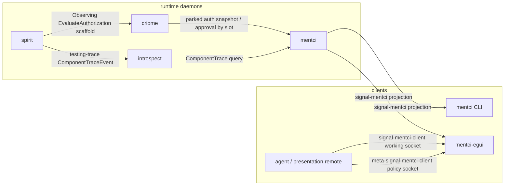
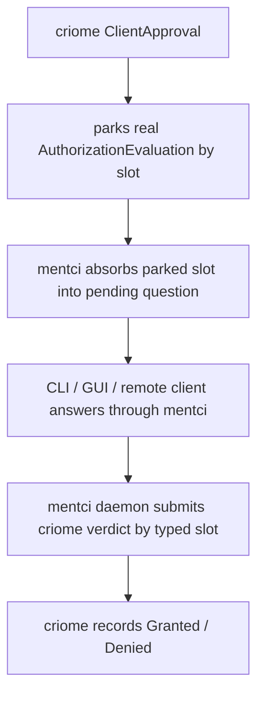
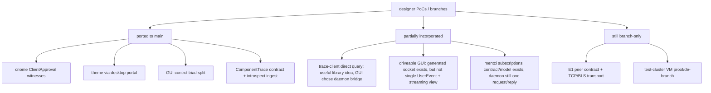
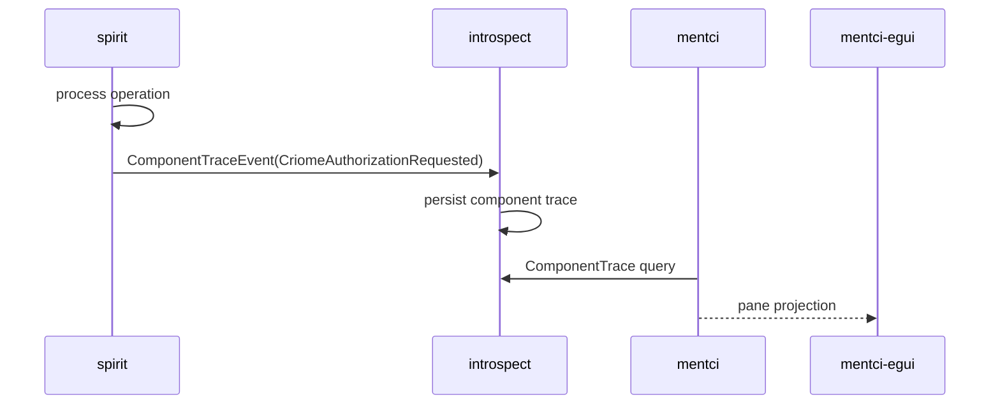

# 454 — Recent Mentci / Criome / Spirit Audit

## Scope

This audit covers the recent operator + designer arc around:

- criome ClientApproval parking and witness binaries;
- mentci daemon-routing, CLI atoms, `mentci-lib`, and `mentci-egui`;
- `signal-mentci-client` / `meta-signal-mentci-client` as the driveable GUI triad;
- `spirit` Observing mode and trace emission;
- `introspect` component trace ingestion and mentci's trace pane;
- designer branches/worktrees that may still carry useful proof-of-concept code.

Spirit gate result for the psyche prompt: no capture. The prompt asked for an
audit/report, not a durable new direction.

## Current map



The strong part: this is no longer a mockup. Every box above has real mainline
code. The weak part: several arrows are still one-shot request/reply or test
scaffold rather than the long-lived pushed runtime surface the intent points
toward.

## What is solid



- `criome` main has the ClientApproval runtime and witness binaries:
  `criome-client-approval-witness-test` and `criome-auto-approve-witness-test`.
  They compile with `cargo test --features cluster-witness --bin ... --no-run`.
- `mentci` main now inspects criome's verdict submission output instead of
  blindly accepting every bridge call. The old high-severity `let _ = ...?`
  finding from designer report 714 is closed in current code:
  `mentci/src/daemon.rs` checks `submission.is_recorded()`.
- `mentci-lib` is the shared client model for CLI and GUI. The client-direct
  `Cmd::SubmitCriomeVerdict` path is gone; clients send `AnswerQuestion` to the
  daemon and the daemon owns criome side effects.
- `mentci-egui` is now a thin client with an approval card, portal-following
  theme, and no criome socket.
- The GUI itself has a real generated control triad:
  `signal-mentci-client` for working drive operations and
  `meta-signal-mentci-client` for remote-control policy.
- `signal-introspect` + `introspect` + `spirit` now share
  `ComponentTraceEvent` for the trace socket. `introspect` persists and queries
  component traces; `mentci` has a daemon-bridge pane for those traces.

## Verification run in this audit

Green:

- `signal-mentci-client`: `cargo test --all-targets --features nota-text --quiet`
  — 2 round-trip tests green.
- `meta-signal-mentci-client`: `cargo test --all-targets --features nota-text --quiet`
  — 5 round-trip/tests green.
- `mentci-lib`: `cargo test --all-targets --quiet` — 11 model tests green.
- `mentci`: `cargo test --all-targets --quiet` — client/state/bridge tests green.
- `mentci-egui`: `cargo test --all-targets --quiet` — daemon-client/control/theme
  tests green.
- `introspect`: `cargo test --test component_trace --quiet` — trace ingest/query
  proof green.
- `spirit`: `cargo test --features nota-text,mirror-shipper --test
  criome_gate_1of1 --quiet` — the criome gate / Observing path test green.
- `criome`: both witness binaries compile with `--features cluster-witness --no-run`.

Red:

- `spirit`: `cargo test --features nota-text,testing-trace --test
  process_boundary cli_receives_testing_trace_events_from_daemon_trace_socket
  --quiet` fails to compile. `tests/process_boundary.rs:570` references
  `NotaSource` without importing it. This is a small code fix, but it matters:
  it is the exact process-boundary witness for the trace path.

## Designer proof-of-concept comparison



### Ported well

The designer's strongest recent client/control work is on main in substance:
the GUI remote-control socket became a generated contract, the policy controls
moved to a meta contract, and the GUI is drivable through the same model path
used by local controls. Operator integrated the line; designer's net-new
artifact, `meta-signal-mentci-client`, was the useful piece.

The trace-to-introspect slice also landed in substance. The direct
`mentci-lib` query branch did not become the GUI's canonical path, but the
lower layers did: `signal-introspect` has `ComponentTraceEvent`, `spirit`
emits it under `testing-trace`, and `introspect` ingests/queries it.

### Partially ported

The driveable GUI is correct at the component-triad level, but the working
contract is a concrete roster:

```text
ObserveState
ObserveComponent
RetractObservation
SelectQuestion
AnswerQuestion
ProposeEditedAnswer
PushQuestion
```

That is better than the old hand-rolled NOTA slice, but it is not the ideal
from designer report 720 where `UserEvent` itself is schema-emitted and the
working verb is essentially `Drive(UserEvent)`. The current shape still maps
from `GuiControlInput` to `mentci_lib::UserEvent` inside `mentci-egui`.

The view side is also not a long-lived subscription yet. `GuiControlServer`
accepts a socket, reads one frame, sends one reply, and closes. It is remote
drivable for tests and presentations, but not yet an agent-subscribable live
view stream.

### Still branch-only

E1 peer transport is the clearest unported designer implementation:

- `signal-criome-peers` carries `PeerNode`, `PeerAddress`, `Peers`, and
  `PeerEnvelope`. That worktree is currently dirty with an uncommitted
  `PeerEnvelope` addition on top of the branch.
- `criome-peer-transport` carries the TCP peer codec/client and BLS/DST
  envelope hardening.

This is not stale duplicate work. It remains the bridge from local criome proof
to networked quorum proof.

By contrast, `criome-client-approval-witness` is stale duplicate work: its
witness files are already on criome main. The worktree still appears dirty
because it is an old branch relative to its parent, not because the idea is
missing from main.

## Findings

### High — the trace witness is currently broken

The component-trace runtime path has a green introspect integration test, but
the spirit process-boundary test for CLI trace output does not compile under
`nota-text,testing-trace`:

```text
tests/process_boundary.rs:570:29 cannot find type `NotaSource` in this scope
```

This is likely a one-line import fix. It should be fixed before we treat the
trace demo as a reliable production-watch scaffold.

### High — Observing-mode criome authorization is not yet the corrected trace event

The psyche corrected the framing: spirit-to-criome authorization requests are
tracing scaffold for future mentci-mediated acceptance gating. Current `spirit`
has two nearby mechanisms:

- `testing-trace` emits `ComponentTraceEvent` into introspect.
- `AuthorizationMode::Observing` calls `CriomeGate::emit_authorization`, sends
  a real `EvaluateAuthorization` to criome fire-and-forget, and ships
  immediately.

Those are adjacent but not the same. The corrected shape needs a trace event
for the criome authorization request itself, flowing through
`ComponentTraceEvent` into introspect and mentci. The current Observing emit is
still useful as gate scaffold, but it is not yet the watch surface.

### Medium — mentci still lands state before liveness

`mentci` has typed observation state and answers by slot, but the daemon still
handles one client frame and replies. The `signal-frame`/subscription vocabulary
exists, and `mentci-lib` is shaped for long-lived clients, but daemon-side
fanout of `InterfaceStateChanged` to retained client writers is not the lived
path yet.

This matters because the original GUI motivation was "the daemon can call back
the full client; the CLI is one-shot." Today the GUI is long-lived as a process,
but the daemon interaction is still mostly user-triggered observe/request.

### Medium — GUI remote drive is generated, but not yet complete enough for agents

Agents can drive the GUI through the control socket, but the current state
snapshot is small: mode, pending/answered counts, selected question,
in-flight flag, and transcript count. It does not expose the full
`ObservationView`, pane bodies, scroll/focus state, or a streaming view
subscription.

The current surface is good enough for scripted smoke tests and presentation
control. It is not yet enough for an agent to fully assert what the human sees.

### Medium — CLI is usable, but not complete and not uniformly human-readable

`mentci` has observe atoms and answer atoms:

```text
observe
observe:full
observe:pending
observe:status
observe:notifications
answer:approve:<question>
answer:reject:<question>
answer:defer:<question>
```

Generic inline NOTA still writes the binary reply frame to stdout. That is a
valid machine edge, but it does not satisfy "all paths should be usable through
the CLI" for human/agent inspection unless the caller has a frame decoder. The
missing CLI work is not just more atoms; it is a consistent rendered-reply mode
for any request, plus atoms for retraction, edited-answer proposals, GUI remote
drive, and introspect queries.

### Medium — `mentci` INTENT overstates durable SEMA state

`mentci/INTENT.md` says SEMA state is the canonical UI state. Current code is
still an in-memory actor/state path for questions, subscriptions, and
projections. That may be the right first milestone, but future agents reading
the repo will overestimate restart safety. Either the daemon should get its
SEMA persistence slice soon, or the INTENT/ARCHITECTURE status sections should
separate target from current runtime.

### Medium — direct introspect client vs daemon bridge should be explicit

Designer's direct `mentci-lib` introspect query branch is archived. Operator
main uses the daemon bridge: `mentci` queries introspect and projects the pane
to clients. Both shapes can coexist if their roles are named:

- GUI shared component data: daemon bridge.
- Agent/library direct introspection: direct `IntrospectClient` helper.

The codebase should not keep treating that as an accidental fork.

### Low — stale worktrees still create false signal

Several worktrees still exist after cleanup:

- old mentci re-found branches whose substance is mostly on main;
- `mentci-egui/trace-introspect-slice` and `mentci-lib/trace-introspect-slice`
  with direct-client trace query remnants;
- `criome-client-approval-witness`, already mainlined;
- `signal-criome-peers`, which is actually live unported work and dirty.

The false-positive branch noise is now smaller, but still enough to mislead a
fresh operator.

## Greatest insights

1. The recent work is stronger than the screenshots imply. Mentci is no longer
   a view-only GUI; it is a daemon-routed approval path with a generated
   remotely-drivable GUI surface.
2. The repeated failure pattern is not "we did not build it." It is "we built
   the vocabulary and first proof, then stopped before push/subscription and
   deploy proof." That pattern appears in mentci subscriptions, GUI control
   view streams, trace production, test-cluster proofs, and E1 integration.
3. The designer/operator parallel model is working when the artifacts are
   complementary. The meta control contract is the best example: designer made
   the missing contract; operator integrated it. It becomes wasteful when both
   lanes edit the same active repo surface at the same time.
4. The trace correction changes priority. The next "production watch" slice is
   not "poll criome parked requests harder"; it is "emit the criome
   authorization request as a typed trace event, ingest it through introspect,
   render it in mentci."
5. E1 is the largest still-unported implementation, not mentci. Mentci's gaps
   are liveness and polish; E1's peer transport is real code still off main.

## Questions for the psyche

1. Should the next operator fix be the small `spirit` trace witness compile
   failure, then the criome-authorization trace event? That would close the
   corrected "watch is tracing" path before deeper GUI work.
2. Should I port E1 peer transport to main now, or hold it until the mentci
   trace/watch path is visibly useful? E1 is the biggest unported designer code,
   but it will pull criome/signal-criome back into focus.
3. For GUI remote control, should we accept the concrete generated verb roster
   as v1, or tighten it to the designer ideal where `UserEvent` itself is
   schema-emitted and `Drive(UserEvent)` is the wire? The current code is usable;
   the ideal removes one remaining mirror layer.
4. Should direct introspect querying live in `mentci-lib` for agents while the
   GUI uses the daemon bridge? That resolves the current fork without deleting
   either useful shape.
5. Should `mentci` SEMA persistence be pulled forward before more panes, or is
   in-memory acceptable until the trace/watch demo is valuable?

## Recommended next slice

Do the trace-watch corrective slice first:



Concrete order:

1. Fix the `spirit` `NotaSource` import so the trace process-boundary witness
   compiles.
2. Add a typed component-trace event for "criome authorization requested" in
   spirit's trace vocabulary, gated by `testing-trace`.
3. Prove it with `spirit --features nota-text,testing-trace` emitting into
   introspect and `mentci` projecting the event pane.
4. Only then decide whether the GUI control v1 is sufficient or whether to
   collapse to `Drive(UserEvent)` before investing in streaming view state.
