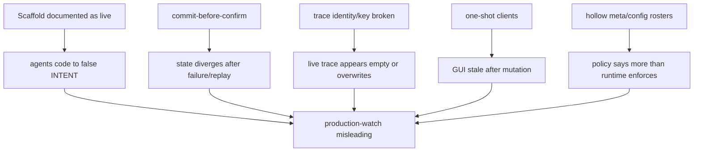
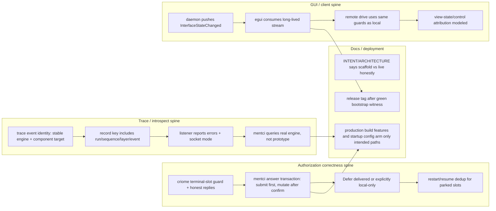

# 455 — Mentci / Criome / Spirit Parallel Fix Plan

## Scope

This is the operator sweep after designer report
`reports/designer/722-Audit-recent-criome-mentci-work.md`, cross-checked
against the previous operator audit
`reports/operator/454-recent-mentci-criome-spirit-audit.md` and current main
heads for:

- `spirit`
- `criome`
- `signal-criome`
- `meta-signal-criome`
- `mentci`
- `signal-mentci`
- `meta-signal-mentci`
- `mentci-lib`
- `mentci-egui`
- `signal-mentci-client`
- `meta-signal-mentci-client`
- `introspect`
- `signal-introspect`

Spirit gate result for the psyche prompt: no capture. This was a task request
for an implementation sweep and summary, not a new durable intent statement.

## Operator reading

Designer report 722 is mostly right in shape: the problem is not 114 unrelated
defects. The defects collapse into a small number of load-bearing failures:

The strongest recent work is still real: the slot type is shared, criome parks
ClientApproval evaluations, mentci can absorb parked authorizations, the GUI is
driveable through generated signal contracts, and introspect can ingest
ComponentTrace events in a test. The audit's point is that those pieces are not
yet a live production loop.

## Dependency picture

The three spines can be worked in parallel by different lanes, but each spine
has serial order inside it. The mistake would be scattering across all 114
findings; the right move is to land root-cause increments that collapse many
findings at once.

## Parallel fix model

### Lane 1 — authorization correctness

Owner shape: operator, with designer review only where a reply contract changes.

Start with `criome` because mentci cannot be correct while criome allows a
settled slot to be re-decided. The first increment is:

- add a terminal-state guard to `SubmitAuthorizationApproval`;
- remove or clear `parked_evaluation` when a slot settles, or make the settle
  path ignore it unless status is `Parked`;
- store before publishing the authorized-object pulse;
- return honest typed outcomes for already-decided, slot-not-found, and
  store-failure.

Then `mentci` can become transactional:

- do not remove a pending question or record a decision until criome confirms;
- map criome already-decided / slot-not-found to visible mentci replies without
  mutating local state incorrectly;
- deliver Defer to criome if Defer is a real authorization decision, or narrow
  Defer to a mentci-local postponement explicitly and rename the UI.

My recommendation: Defer should reach criome, because criome and
`meta-signal-criome` already carry it and the psyche previously chose
"Defer re-parks".

### Lane 2 — trace identity and ingestion

Owner shape: operator or system-designer plus operator integration, because it
touches `signal-introspect`, `spirit`, `introspect`, and `mentci`.

This should start with identity, not UI. The current trace plane can be green in
tests and still useless because `spirit` stamps engine as a socket path while
`mentci` queries `"prototype"`.

The first increment should decide and implement:

- stable `EngineIdentifier` source;
- component target for spirit events, instead of overloading
  `IntrospectionTarget::Signal`;
- trace record key that cannot overwrite after restart or after two event names
  share the same sequence;
- query fields for layer/event/source that match the stored key;
- listener error reporting and trace socket permission mode.

My recommendation: engine identity comes from daemon startup configuration as a
stable component-instance name, not from socket path and not from a hardcoded
`prototype` string. The trace source for the criome authorization watch should
be spirit's emit-side event, not criome becoming a trace emitter, unless the
psyche explicitly wants criome in the trace plane too.

### Lane 3 — mentci push/subscription runtime

Owner shape: operator.

The GUI currently looks like a long-lived app but speaks mostly one-shot
request/reply. That keeps showing up as stale queue, mutating replies discarded,
remote control hard to assert, and manual "observe" after every change.

The root fix is daemon-held subscriptions:

- `mentci` retains subscribed writers for `InterfaceStateChanged`;
- `mentci-lib` folds pushed state into `ObservationModel`;
- `mentci-egui` runs a persistent read loop and treats one-shot replies as
  command acknowledgements, not state delivery;
- CLI remains one-shot but can open a streaming observe mode later if needed.

This lane can run in parallel with trace identity, but it should not try to make
the trace pane beautiful until the trace keys and queries are correct.

### Lane 4 — driveable GUI hardening

Owner shape: operator, possibly after designer names the v2 contract if
`Drive(UserEvent)` replaces the concrete roster.

Small fixes can land now:

- remote `AnswerQuestion` checks the same `CriomeAccess::ReadWrite` guard as
  local buttons;
- emit `Busy` for overlapping remote commands;
- `ResetRemoteControl(ViewSubscriptions)` either retracts subscriptions or
  returns `RequestUnimplemented`;
- `Configure` applies all fields or rejects what it cannot apply;
- control exchange identifiers become real per-session/per-request values.

The bigger fork is whether the current concrete generated roster is accepted as
v1 or replaced by a schema-emitted `UserEvent` / `Drive(UserEvent)` contract.
The current roster is usable, but it still duplicates the GUI event vocabulary
instead of making the model event itself the wire noun.

### Lane 5 — documentation truth pass

Owner shape: designer for intent wording, operator for code-near
ARCHITECTURE/status corrections.

This can run in parallel with everything else and should be done early because
repo `INTENT.md` is first-read material. The pass should mark:

- `spirit` criome gate and Observing mode as scaffold unless the production
  build and startup config really arm it;
- `mentci` daemon state as currently in-memory and one-shot, with SEMA/push as
  target state;
- `introspect` / `signal-introspect` as having landed ComponentTrace ingestion;
- `signal-criome` parked observation as currently on the working contract, or
  move it if the meta-only boundary wins;
- stale singular socket and theme comments as stale.

This is not cosmetic. It prevents the next agent from implementing against a
fictional runtime.

### Lane 6 — E1 peer transport

Owner shape: operator, but separate from the mentci production-watch wave.

Designer's unported E1 work is still real:

- `signal-criome-peers` has peer config/envelope work and is dirty with an
  uncommitted `PeerEnvelope` addition.
- `criome-peer-transport` has the TCP/BLS/DST peer transport primitive.

I would preserve and port it after the local mentci/spirit watch becomes
honest. Networked quorum is the next scale step, but it should not compete with
basic local correctness of the approval and trace planes.

## What I would start immediately

If you want parallel fixing, I would split the next wave like this:

```mermaid
gantt
  title Parallel wave, ordered by dependency
  dateFormat  X
  axisFormat %s

  section Operator A: approval
  criome idempotent settle + honest replies       :a1, 0, 3
  mentci submit-before-local-mutate               :a2, after a1, 3
  defer + restart duplicate witness               :a3, after a2, 2

  section Operator B: trace
  trace identity decision implementation           :b1, 0, 2
  introspect key/query/socket hardening            :b2, after b1, 3
  mentci real-engine trace pane                    :b3, after b2, 2

  section Operator C: client runtime
  mentci subscription fanout                       :c1, 0, 3
  egui persistent reader + stale-queue fix         :c2, after c1, 2
  remote guard/busy/config hardening               :c3, after c2, 2

  section Designer/docs
  INTENT scaffold-vs-live truth pass               :d1, 0, 2
  decide GUI v1 roster vs Drive(UserEvent)         :d2, 0, 1
  review reply-contract changes                    :d3, after a1, 1
```

Concrete first commits I would make in my own lane:

1. Fix the small `spirit` trace test compile failure from report 454
   (`NotaSource` import) so the trace witness runs again.
2. Patch `mentci-egui` remote `AnswerQuestion` to respect read-only criome
   access; this is a contained bug and does not need a schema decision.
3. Patch `mentci-lib` Defer-on-unknown-question so it does not emit a daemon
   command for a non-pending question.
4. Begin the `criome` approval idempotency fix on a branch, because it gates
   all honest mentci answer behavior.

## Biggest clarity needed from the psyche

### 1. What is the next demo: trace-only watch, or actual gate?

You corrected the model: spirit's criome authorization requests are tracing
scaffold for future mentci-mediated acceptance gating. That leaves two valid
next milestones:

- **Trace-only watch first**: spirit emits typed trace events that mentci shows;
  spirit still accepts locally and does not wait for authorization.
- **Actual gate first**: spirit pauses acceptance until criome/mentci approval
  returns, even if the first policy is auto-approve / one-of-one.

My recommendation: trace-only watch first. It gives you live visibility quickly
and forces the trace/introspect/mentci path to become honest before it becomes
authority-bearing. Then graduate to actual gating after criome and mentci
approval are idempotent.

### 2. Should the current GUI control roster be accepted as v1?

Current main has generated contracts, but they are concrete verbs like
`ObserveState`, `AnswerQuestion`, and `SelectQuestion`. Designer's cleaner ideal
is a schema-emitted `UserEvent` with a single `Drive(UserEvent)` style command.

My recommendation: accept the concrete roster as v1 for the production-watch
wave, fix its guards and streaming view, then migrate to `Drive(UserEvent)` when
the model event vocabulary stabilizes. Reworking the contract now would compete
with the liveness bugs.

### 3. Is `DualWrite` supposed to be a real presentation mode now?

Today `DualWrite` behaves like `RemoteEnabled`; the contract promises origin
attribution but no origin is modeled.

My recommendation: implement origin attribution if we keep the name. If origin
does not matter yet, collapse the visible mode to `RemoteEnabled` until it does.

### 4. Do you want trace identity configured or derived?

The audit shows socket path and `"prototype"` are both wrong as durable
identity. The choice is:

- config-derived instance name in startup config;
- component constant plus process/run identifier;
- socket path with validation and escaping.

My recommendation: config-derived instance name. Socket paths are transport
addresses, not component identities.

### 5. Should the "no swallowed fallible result" rule become workspace intent?

The same bug pattern repeats across `spirit`, `criome`, `mentci`,
`introspect`, and `mentci-egui`: state changes or pulses happen before a
fallible operation confirms, then the `Result` is dropped.

My recommendation: yes. Record it as a concise principle and manifest it into
Rust discipline: no `let _ =` on fallible actor/socket/store asks at authority
boundaries; durable write precedes externally visible pulse.

## Suggestions

My preferred execution order is:

1. Land tiny contained fixes immediately (`spirit` trace test import,
   `mentci-egui` remote read-only guard, `mentci-lib` Defer unknown-question).
2. Start the authorization correctness branch family (`criome` first, then
   `mentci`).
3. In parallel, start trace identity/key hardening (`signal-introspect` /
   `introspect` / `spirit` / `mentci`).
4. In parallel, let designer do the INTENT truth pass and contract review.
5. After trace and approval are honest, land mentci subscription fanout and the
   GUI persistent read loop.
6. Then port E1 peer transport.

That sequence gets you to a trustworthy local production-watch surface before
networked quorum work expands the failure domain.
