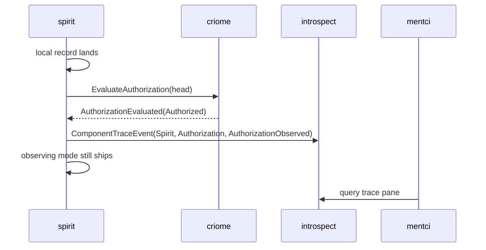
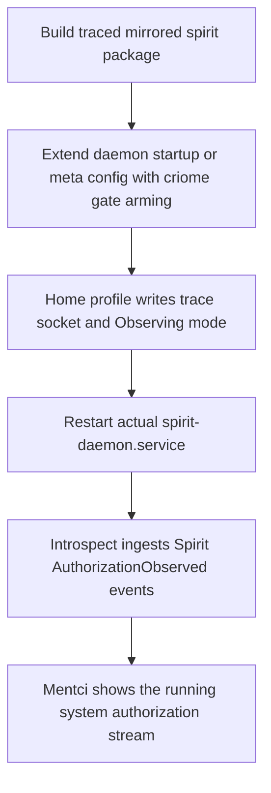

# Spirit Real Authorization Trace Status

## Summary

The source-side milestone is implemented and tested: `spirit` observing mode now asks criome for a real authorization verdict, waits long enough to see the answer, emits a structured trace event for that authorization-return point, and still does not block fan-out in observing mode. Gating mode remains fail-closed.

The live `spirit-daemon.service` is not yet using this path. It is still the already-running Nix package from June 21, built without the new commits and without production configuration that arms the criome gate.

## What Landed

- `signal-introspect` `74b020a80d9d` — adds `IntrospectionTarget::Spirit` and `TraceLayer::Authorization`, with a round-trip witness for `Spirit / Authorization / AuthorizationObserved`.
- `signal-introspect` `ba6fba733df2` — manifests the new trace target in `INTENT.md`.
- `spirit` `c5ba07f95d5d` — changes observing mode from fire-and-forget to real criome round-trip; adds `GateDecision::Observed(ObservedAuthorization)` and emits `AuthorizationObserved` trace events.
- `spirit` `122c93694d44` — manifests the observing-mode intent update in `INTENT.md`.
- `mentci-egui` `4c16bd33` from the earlier slice — compact header and resizable approval panel.

## Current Flow



## Verified

- `signal-introspect`: `cargo test --all-targets --quiet`
- `spirit`: `cargo test --features mirror-shipper --test criome_gate_1of1 --quiet`
- `spirit`: `cargo test --features testing-trace --test instrumentation_logging --quiet`
- `spirit`: `cargo test --features nota-text,testing-trace --test process_boundary cli_receives_testing_trace_events_from_daemon_trace_socket --quiet`
- `spirit`: `cargo check --features testing-trace,mirror-shipper --bin spirit-daemon --quiet`

## Live Service Reality

`systemctl --user status spirit-daemon.service` currently shows the production service still running:

```text
/nix/store/5i1233d5i7j2sqdyvq4870xbdjmgji57-spirit/bin/spirit-daemon
/nix/store/yrj3592irzixijzdjiflp1qcdklvl0mp-spirit-daemon-configuration/spirit.config.rkyv
```

That means the source commits above are not deployed yet. Also, the deploy config still needs a real criome gate arming path: the current `SpiritDaemonConfiguration` carries `TraceSocketPath` and `AuthorizationMode`, but not the local criome socket plus attestor material needed to call `Engine::arm_criome_gate` outside tests.

## Next Cut



The next implementation should be the deploy/config cut:

1. Add a production configuration path for the criome gate: local criome socket plus the 1-of-1 attestor material.
2. Add or select a `spirit` package output that builds `spirit-daemon` with both `testing-trace` and `mirror-shipper`.
3. Update the home profile to pass a trace socket, `AuthorizationMode::Observing`, and the criome gate configuration into the actual user service.
4. Start or wire `introspect` so it listens on that trace socket.
5. Point Mentci’s trace pane at the live introspect data for `IntrospectionTarget::Spirit`, `TraceLayer::Authorization`.

## Open Question

The only clarity I still need before the deploy/config cut: should criome gate arming be a startup-only binary config field on `SpiritDaemonConfiguration`, or an owner-only meta-signal `Configure` operation that can arm/re-arm the gate while the daemon is running? My recommendation is startup config first, because the current daemon argument model already treats `AuthorizationMode` as startup policy and it keeps the first production proof small.
