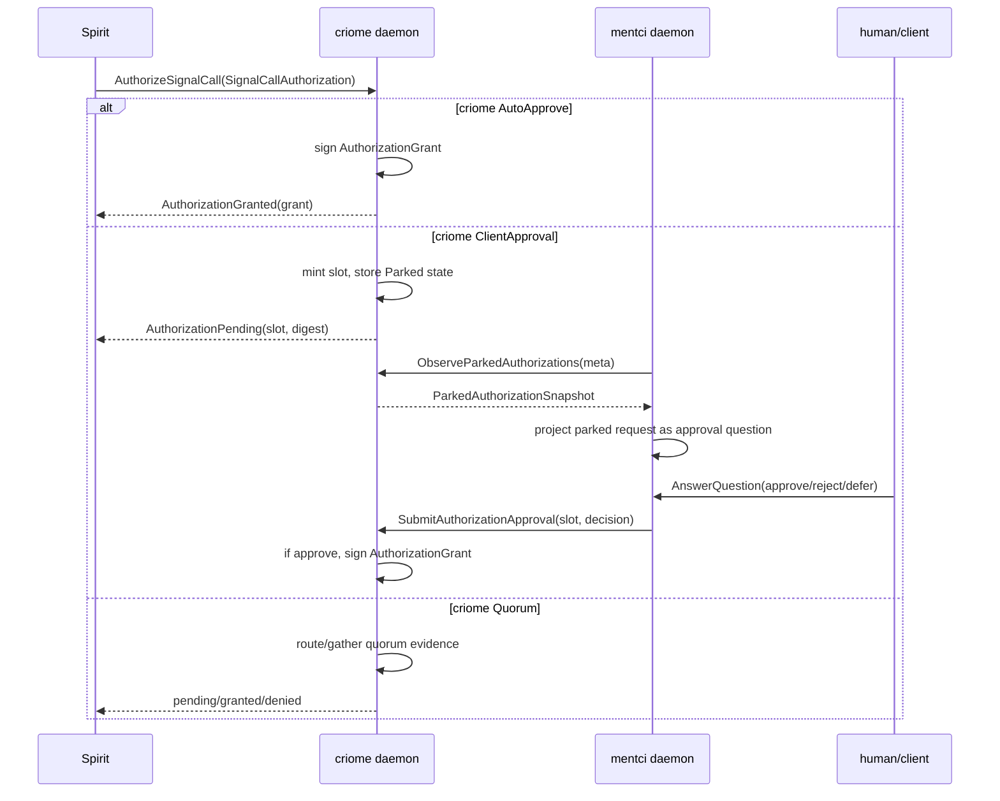
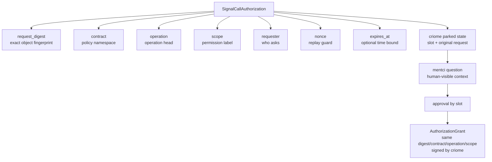

# AuthorizeSignalCall Explained

## Summary

`AuthorizeSignalCall` is the `signal-criome` working-signal operation for asking
criome to authorize one exact signal operation. It carries a
`SignalCallAuthorization`: the fingerprint of the exact object/request, the
contract and operation being requested, the scope of permission, the requester,
replay protection, and optional expiry.

The important boundary: the requester does not sign the approval. The requester
submits the typed request. criome owns the authorization state, parks it in
`ClientApproval`, and on approval signs a real `AuthorizationGrant` with
criome's key.

## Shape

The wire root is in `signal-criome`:

```rust
pub enum Input {
    ...
    AuthorizeSignalCall(SignalCallAuthorization),
    ObserveAuthorization(AuthorizationObservation),
    ...
}
```

Source: `/git/github.com/LiGoldragon/signal-criome/src/schema/lib.rs:1717`.

The payload is:

```rust
pub struct SignalCallAuthorization {
    pub request_digest: ObjectDigest,
    pub contract: ContractName,
    pub operation: ContractOperationHead,
    pub scope: AuthorizationScope,
    pub requester: Identity,
    pub nonce: ReplayNonce,
    pub(crate) signal_call_expires_at: SignalCallExpiresAt,
}
```

Source: `/git/github.com/LiGoldragon/signal-criome/src/schema/lib.rs:1135`.

The constructor makes the optional expiry explicit:

```rust
impl SignalCallAuthorization {
    pub fn new(
        request_digest: ObjectDigest,
        contract: ContractName,
        operation: ContractOperationHead,
        scope: AuthorizationScope,
        requester: Identity,
        nonce: ReplayNonce,
        expires_at: Option<TimestampNanos>,
    ) -> Self { ... }
}
```

Source: `/git/github.com/LiGoldragon/signal-criome/src/lib.rs:311`.

## Field Breakdown

| Field | Type | Purpose | Example from spirit-shaped path |
|---|---|---|---|
| `request_digest` | `ObjectDigest` | Fingerprint of the exact object/request being authorized. This is what prevents "authorize a kind of thing" from becoming permission for a changed object. | `ObjectDigest::from_bytes(capture.head_digest.bytes())` |
| `contract` | `ContractName` | Names the contract or policy namespace criome is authorizing under. | `spirit-local-head` |
| `operation` | `ContractOperationHead` | Names the operation inside that contract. | `AuthorizeHead` |
| `scope` | `AuthorizationScope` | Names the permission being requested. It is a permission label, not the object itself. | `spirit-head-fanout` |
| `requester` | `Identity` | Names who is asking. It is also paired with the nonce for replay detection. | `Identity::host("spirit")` |
| `nonce` | `ReplayNonce` | Makes repeated submissions detectable. The current criome store records replay identity as requester plus nonce. | digest string or a test nonce |
| `expires_at` | `Option<TimestampNanos>` | Optional time bound. If expired, criome records an expired authorization rather than signing. | `None` in the current bootstrap path |

## Digest

A digest here is a stable fingerprint of the exact thing being authorized. In
the Spirit bootstrap path, Spirit takes the versioned-log head digest and turns
it into the `ObjectDigest` that criome will bind the grant to.

That makes the grant object-specific:

```text
authorize digest X
  -> criome grant names digest X
  -> consumer compares grant.digest == object-about-to-use.digest
```

If the underlying object changes, the digest changes, and the old grant no
longer matches.

## Flow



## How Spirit Builds It

Spirit's bootstrap attestor constructs a `SignalCallAuthorization` when it has
a local criome socket but no policy evidence material:

```rust
fn signal_call_authorization(&self, capture: &LocalHeadCapture) -> SignalCallAuthorization {
    let digest = ObjectDigest::from_bytes(capture.head_digest.bytes());
    SignalCallAuthorization::new(
        digest.clone(),
        ContractName::new("spirit-local-head"),
        ContractOperationHead::new("AuthorizeHead"),
        AuthorizationScope::new("spirit-head-fanout"),
        Identity::host("spirit".to_owned()),
        ReplayNonce::new(digest.as_str().to_owned()),
        None,
    )
}
```

Source: `/git/github.com/LiGoldragon/spirit/src/criome_gate.rs:140`.

`CriomeGate::evaluate_authorization` chooses this path when the attestor lacks
policy evidence:

```rust
if !armed.attestor.has_policy_evidence() {
    let authorization = armed.attestor.signal_call_authorization(capture);
    return self
        .authorize_signal_call(socket, authorization, reference)
        .await;
}
```

Source: `/git/github.com/LiGoldragon/spirit/src/criome_gate.rs:363`.

That method sends the public criome working signal:

```rust
CriomeClient::new(socket).send(CriomeRequest::AuthorizeSignalCall(authorization))
```

Source: `/git/github.com/LiGoldragon/spirit/src/criome_gate.rs:398`.

Current caveat: this Spirit method expects `AuthorizationGranted`. In criome
`ClientApproval`, the immediate reply is `AuthorizationPending`, so the current
test bypasses Spirit's guardian/daemon path and submits the same
Spirit-shaped authorization directly to criome. That proves the criome/mentci
approval path, not the complete production Spirit emission loop.

## How Criome Uses It

criome root dispatches `AuthorizeSignalCall` by authorization mode:

```rust
CriomeRequest::AuthorizeSignalCall(request) => {
    if self.authorization_mode == AuthorizationMode::AutoApprove {
        self.auto_approve_signal_call(request).await
    } else if self.authorization_mode == AuthorizationMode::ClientApproval {
        self.park_signal_authorization(request).await
    } else {
        self.ask_authorization(authorization::AuthorizeSignalCall::new(request)).await
    }
}
```

Source: `/git/github.com/LiGoldragon/criome/src/actors/root.rs:217`.

In `ClientApproval`, criome stores the original authorization, not just a
string label:

```rust
async fn park_signal_authorization(
    &self,
    authorization: SignalCallAuthorization,
) -> CriomeReply {
    match self
        .create_authorization_state(
            store::CreateAuthorizationState::parked_signal_authorization(authorization),
        )
        .await
    {
        Ok(stored) => {
            let state = stored.state();
            CriomeReply::AuthorizationPending(AuthorizationPending::new(
                state.request_slot.clone(),
                state.request_digest.clone(),
                Vec::new(),
                AuthorizationObservationToken::new(state.request_slot.clone()),
            ))
        }
        ...
    }
}
```

Source: `/git/github.com/LiGoldragon/criome/src/actors/root.rs:383`.

The store request records:

```rust
pub fn parked_signal_authorization(
    authorization: signal_criome::SignalCallAuthorization,
) -> Self {
    Self {
        request_digest: authorization.request_digest.clone(),
        status: AuthorizationStatus::Parked,
        grant: None,
        signal_authorization: Some(authorization.clone()),
        replay_identity: Some(AuthorizationReplayIdentity::new(
            authorization.requester,
            authorization.nonce,
        )),
        ...
    }
}
```

Source: `/git/github.com/LiGoldragon/criome/src/actors/store.rs:220`.

When a meta approver answers, criome detects that the parked state contains a
signal-call authorization:

```rust
if let Some(authorization) = state.signal_authorization().cloned() {
    self.apply_signal_authorization_approval(state, decision, authorization)
        .await;
    return;
}
```

Source: `/git/github.com/LiGoldragon/criome/src/actors/root.rs:477`.

Approve asks the signer to create a grant:

```rust
let reply = self
    .ask_signer(signer::SignAuthorizationGrant::new(
        request_slot.clone(),
        authorization.clone(),
    ))
    .await;
```

Source: `/git/github.com/LiGoldragon/criome/src/actors/root.rs:549`.

The signer copies the authorization fields into the grant and signs the grant
statement with criome's master key:

```rust
let mut grant = AuthorizationGrant::new(
    request.request_slot,
    request.authorization.request_digest,
    request.authorization.contract,
    request.authorization.operation,
    request.authorization.scope,
    AuthorizationPolicySatisfaction::new(...),
    SignatureAuthorizationResult::SingleSignature,
    Vec::new(),
    self.criome_identity.clone(),
    issued_at,
    expires_at,
);
let signing_bytes = AuthorizationGrantStatement::new(&grant, expires_at).to_signing_bytes();
let signature = StampedSignatureEnvelope {
    stamp,
    envelope: SignatureEnvelope {
        scheme: SignatureScheme::Bls12_381MinPk,
        public_key: self.master_key.public_key(),
        signature: self.master_key.sign(&signing_bytes),
    },
};
```

Source: `/git/github.com/LiGoldragon/criome/src/actors/signer.rs:265`.

## How Mentci Sees It

Mentci does not receive a push yet. On `ObserveInterfaceState`, it asks criome
for parked authorizations over criome's meta socket:

```rust
let parked_authorizations = self.parked_authorizations_for_request(&request);
...
StateOwner::ask(ApplyRequest {
    request,
    parked_authorizations,
    ...
})
```

Source: `/git/github.com/LiGoldragon/mentci/src/daemon.rs:120`.

The bridge request is:

```rust
CriomeMetaClient::new(&self.meta_socket).send(
    meta_signal_criome::Input::ObserveParkedAuthorizations(
        ParkedAuthorizationObservation::new(),
    ),
)?;
```

Source: `/git/github.com/LiGoldragon/mentci/src/criome_bridge.rs:69`.

Mentci converts a parked signal-call authorization into a question with visible
context:

```rust
if let Some(authorization) = self.parked.signal_authorization() {
    context.extend([
        QuestionContext { label: ContextLabel::new("criome-kind"),
            body: ContextBody::new("signal-call-authorization") },
        QuestionContext { label: ContextLabel::new("request-digest"),
            body: ContextBody::new(authorization.request_digest.as_str()) },
        QuestionContext { label: ContextLabel::new("contract"),
            body: ContextBody::new(authorization.contract.as_str()) },
        QuestionContext { label: ContextLabel::new("operation"),
            body: ContextBody::new(authorization.operation.as_str()) },
        QuestionContext { label: ContextLabel::new("scope"),
            body: ContextBody::new(authorization.scope.as_str()) },
        ...
    ]);
}
```

Source: `/git/github.com/LiGoldragon/mentci/src/state.rs:473`.

When a user/client answers the question, mentci routes only the decision and
slot back to criome:

```rust
CriomeMetaClient::new(&self.meta_socket)
    .send(meta_signal_criome::Input::SubmitAuthorizationApproval(
        AuthorizationApproval {
            request_slot,
            decision,
        },
    ))
```

Source: `/git/github.com/LiGoldragon/mentci/src/criome_bridge.rs:54`.

## Scenario Test Added

The current witness is in
`/git/github.com/LiGoldragon/mentci/tests/criome_bridge.rs:458`:

```rust
fn mentci_observes_spirit_signal_authorization_bypassing_guardian() {
    ...
    let authorization =
        spirit_signal_authorization(b"spirit-record-head-through-criome", "spirit-nonce-1");
    ...
    CriomeClient::new(&criome_socket)
        .send(CriomeRequest::AuthorizeSignalCall(authorization.clone()))
        .expect("submit spirit signal authorization");
    ...
}
```

It proves four concrete points:

1. A Spirit-shaped `AuthorizeSignalCall` can be submitted directly to criome,
   bypassing the Spirit guardian path for the test stimulus.
2. criome in `ClientApproval` parks the request and returns
   `AuthorizationPending`.
3. mentci observes the parked request and renders it as a pending question with
   `signal-call-authorization` and `AuthorizeHead` context.
4. answering through mentci makes criome record approval by slot and sign a
   real `AuthorizationGrant`.

Test output:

```text
PROOF (a) a spirit-shaped AuthorizeSignalCall bypasses the guardian and parks in criome
PROOF (b) mentci observes the parked spirit request as question QuestionIdentifier("question-1") carrying slot AuthorizationRequestSlot("0")
PROOF (c) mentci answers through the daemon, and criome records approval by slot
PROOF (d) criome signs a real AuthorizationGrant after mentci approval
```

## Mental Model



The shortest useful sentence:

`AuthorizeSignalCall` asks criome to turn "this exact signal call may proceed"
into signed authorization state, either immediately (`AutoApprove`), after
mentci approval (`ClientApproval`), or through quorum policy (`Quorum`).

## Important Open Edge

The criome/mentci path is proven. The remaining integration edge is Spirit's
runtime behavior when criome replies `AuthorizationPending` in
`ClientApproval`: current `CriomeGate::authorize_signal_call` expects
`AuthorizationGranted` immediately. For the user-visible mentci scenario, the
next Spirit-side step is to make Observing mode treat `AuthorizationPending` as
"emitted and visible in mentci" rather than an unexpected reply, while Gating
mode should block until a grant is observed.
