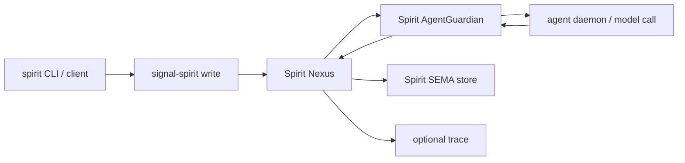
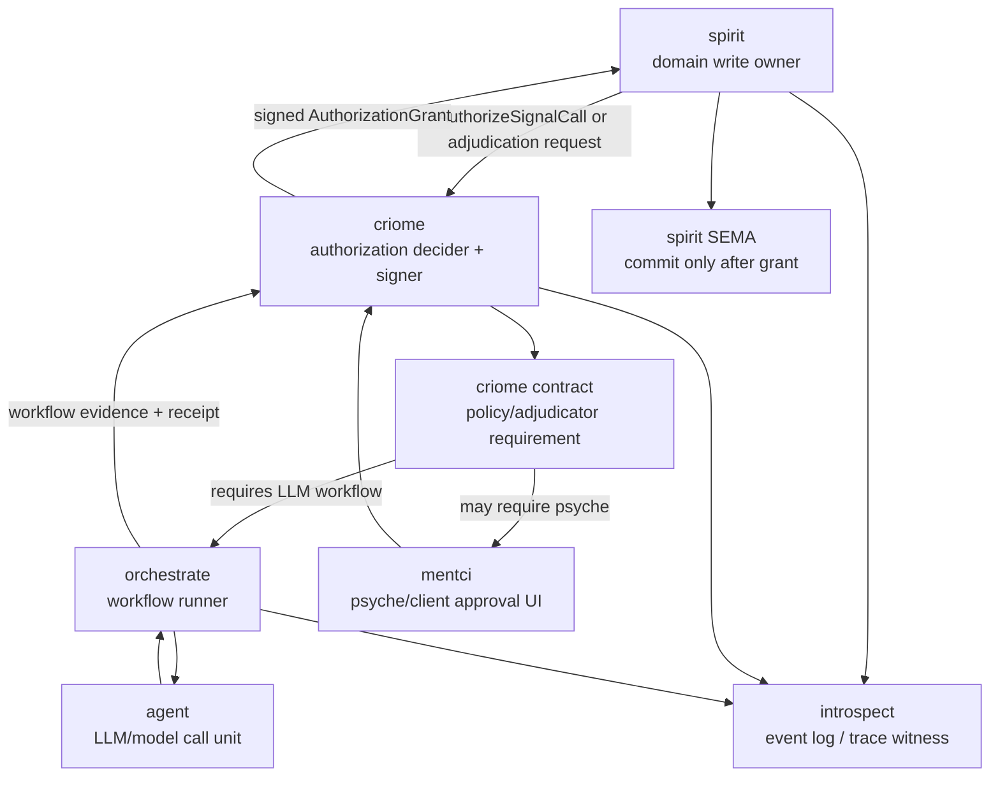
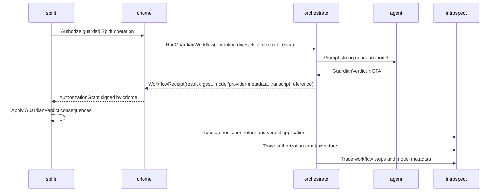

# 458 - Guardian, criome, and workflow-contract research

## Frame

The psyche's new direction is strong, but several nouns still need settling before implementation:

- "crayon" / "Creol" appears to mean the current `criome` authorization stack or its near-future contract language, but that needs explicit confirmation.
- Spirit's guardian is currently a Spirit-local admission actor that calls `agent` directly.
- criome already owns authorization, key custody, pending authorization slots, ClientApproval, AutoApprove, and grant signing.
- orchestrate is already intended to own agent-run lifecycle, spawn plans, executor capacity, scheduling, and escalation, but those workflow verbs are not yet implemented in its contract.
- introspect is a witness/logging plane, not an authority path.
- mentci is the human/agent client surface for observing and answering parked authorization questions.

I am treating this pass as a research-and-question pass, not a code pass. Spirit capture is intentionally held until the ambiguous nouns and first milestone are clarified. The existing Spirit record `pviw` already covers a large part of this: criome contracts may escalate to named adjudicators including an LLM panel, smarter agent, or psyche, and criome verifies signed content-addressed verdicts rather than carrying new content.

## Current Shape



Spirit owns the semantic guardian today. The relevant runtime path is:

```rust
// /git/github.com/LiGoldragon/spirit/src/guardian.rs
pub(crate) fn guard(
    &self,
    operation: &GuardianOperation,
    records: RecordSet,
    database_marker: DatabaseMarker,
) -> AgentGuardianDecision {
    if operation.testimony_is_empty() {
        let verdict = GuardianVerdict::reject(Reject {
            guardian_rejection_reason: GuardianRejectionReason::MissingTestimony,
            explanation: Explanation::new("the justification carries no verbatim testimony"),
        });
        return AgentGuardianDecision::new(verdict, records, database_marker);
    }
    let verdict = self
        .call_guardian(operation, &records)
        .unwrap_or_else(|error| {
            GuardianVerdict::from_harness_rejection(
                error.guardian_rejection_reason(),
                Explanation::new(error.to_string()),
            )
        });
    AgentGuardianDecision::new(verdict, records, database_marker)
}
```

The guarded operations are already a closed typed set:

```rust
// /git/github.com/LiGoldragon/spirit/src/guardian_journal.rs
pub(crate) enum GuardianOperation {
    Record(RecordRequest),
    Propose(Proposal),
    Clarify(Clarification),
    ResolveClarification(ClarificationResolution),
    Supersede(Supersession),
    Retire(Retirement),
    Remove(Removal),
    ChangeRecord(RecordChange),
    CollectRemovalCandidates(RemovalCandidateCollection),
}
```

criome already has the right authorization choke point, but the request is currently generic signal-call authorization, not a workflow-adjudication contract:

```nota
SignalCallAuthorization {
  request_digest.ObjectDigest
  contract.ContractName
  operation.ContractOperationHead
  scope.AuthorizationScope
  requester.Identity
  nonce.ReplayNonce
  SignalCallExpiresAt.(Optional TimestampNanos)
}
```

In `ClientApproval`, criome parks the request; in `AutoApprove`, it signs; in `Quorum`, it gathers policy evidence:

```rust
// /git/github.com/LiGoldragon/criome/src/actors/root.rs
CriomeRequest::AuthorizeSignalCall(request) => {
    if self.authorization_mode == AuthorizationMode::AutoApprove {
        self.auto_approve_signal_call(request).await
    } else if self.authorization_mode == AuthorizationMode::ClientApproval {
        self.park_signal_authorization(request).await
    } else {
        self.ask_authorization(authorization::AuthorizeSignalCall::new(request))
            .await
    }
}
```

Approval is not the requester signing. criome signs the grant:

```rust
// /git/github.com/LiGoldragon/criome/src/actors/signer.rs
let signature = StampedSignatureEnvelope {
    stamp,
    envelope: SignatureEnvelope {
        scheme: SignatureScheme::Bls12_381MinPk,
        public_key: self.master_key.public_key(),
        signature: self.master_key.sign(&signing_bytes),
    },
};
```

orchestrate's docs already name the right mechanical ownership:

```text
orchestrate owns machinery: role claims, activity log, agent-run lifecycle,
spawn plans, scope-acquisition workflow, executor capacity, scheduling,
escalation, and lane registry.
```

But the current working/meta contracts still only expose claim/release/handoff/observe/activity/worktree/role mechanics. Agent-run workflow execution is an architectural destination, not a landed wire surface.

## Proposed Shape



The clean boundary is:

- **Spirit** owns intent records, referents, Spirit-specific validation, and applying `GuardianVerdict` consequences to its SEMA store.
- **criome** owns authorization policy, key custody, pending authorization state, and signed grants.
- **orchestrate** owns executing workflow plans: series/parallel agent steps, retry, escalation ordering, timeout, and run state.
- **agent** owns individual model calls.
- **mentci** owns psyche-facing approval and observation surfaces.
- **introspect** owns the durable observation/log projection and queryable status board.

In this model, the old Spirit guardian becomes one adjudicator workflow used by a criome contract. The first workflow can still call the same prompt and parse the same `GuardianVerdict`; the authority boundary changes first, then the workflow language grows.

## First Slice I Would Build



This slice avoids trying to design the whole contract language at once. It proves:

1. A Spirit write can ask criome for real authorization before commit.
2. criome can delegate the non-mechanical adjudication requirement to an orchestrate workflow.
3. orchestrate can run the existing guardian LLM call as a typed workflow.
4. criome signs the resulting grant.
5. Spirit sees the grant and applies the existing guardian verdict semantics.
6. mentci/introspect can show the whole chain.

The near-term bridge can be deliberately small:

- `signal-criome`: add a typed evidence/verdict wrapper for workflow-backed authorization, or a new `AuthorizationScope` variant that names `SpiritGuardian`.
- `orchestrate`: add `RunWorkflow` / `ObserveWorkflow` roots only for a first `SpiritGuardianWorkflow` case.
- `spirit`: extract today's `GuardianOperation` + prompt/result parsing into a workflow payload/result boundary; replace direct `AgentGuardian` call with criome-mediated authorization in Gating mode.
- `introspect`: ingest typed events from Spirit/criome/orchestrate for the run.
- `mentci`: render the pending authorization and workflow status; psyche approval remains an escalation arm, not mandatory in the first LLM-only proof.

## Why criome should not execute the LLM workflow itself

criome's authority is verification and signing. Its own `INTENT.md` says today's criome is "today, not eventually" and keeps runtime scope narrow. `pviw` says criome verifies signed content-addressed verdicts from named adjudicators. That points away from putting an LLM workflow engine inside criome.

The durable shape is:

- criome contract says **what kind of adjudication evidence satisfies the authorization**.
- orchestrate runs **how that evidence is produced**.
- criome verifies **the evidence identity, digest, signer/receipt, and contract satisfaction**.

That preserves criome as the agreement/authorization organ without making it a general workflow VM.

## Production Safety

Spirit is production. Before replacing its local guardian path, I would tag the deployed baseline and pin CriomOS/CriomOS-home to release tags or exact revisions for the current production Spirit surface. Then main can move without putting the live intent store on an ambiguous branch.

The production-safe order:

1. Tag current deployed Spirit and the signal/meta contracts it runs against.
2. Confirm CriomOS-home uses immutable tags or exact revisions for production Spirit.
3. Keep current Spirit guardian working under the production tag.
4. Build the criome-mediated guardian path behind an explicit `AuthorizationMode::Gating` integration branch.
5. Run the traced production candidate only after a scenario test proves accept and reject paths.

## Biggest Insights

- The psyche's new realization is mostly a convergence, not a reversal. `pviw` already says criome contracts can escalate to LLM panels, smarter agents, or psyche; the new pressure is to make Spirit's guardian the first real implementation of that general shape.
- The current Spirit guardian is already the executable seed of an LLM workflow. It has typed operations, typed verdicts, model-call configuration, parse-and-retry, and a journal. The first orchestrate workflow should lift this, not redesign the guardian prompt.
- `AuthorizeSignalCall` is the right outer envelope for now, but it is too thin to describe "workflow evidence satisfied this contract." We need one more typed layer that binds workflow receipt/evidence to the authorization grant.
- The status board belongs to introspect for query/logging and mentci for user display. orchestrate should own run state, but not become the UI or the global event archive.
- The eventual contract language should compose adjudicators as typed policy nodes: signatures, quorum, LLM workflow, psyche approval, threshold/AND/OR, timeout, defer/escalate. The first slice should implement one named workflow and leave generic composition to the next pass.

## Questions For The Psyche

1. When you said "crayon" / "Creol", do you mean the current `criome` component and its authorization contract language, or the broader Crayon OS / eventual Criome language? My implementation recommendation assumes "current criome first, eventual language later."

2. Is the first real migration target specifically Spirit's intent guardian, or should the first contract be generic enough for any component guard? My recommendation is Spirit first, generic nouns where cheap, because the current guardian gives us a real typed verdict and test oracle.

3. Should criome receive the full guardian operation content, or only a content-addressed reference plus digest? My recommendation is digest/reference at criome, full content in Spirit/orchestrate/introspect, because `pviw` says verdicts are over already-submitted objects and criome verifies content-addressed verdicts.

4. What should count as a signed LLM workflow verdict before full agent identities are mature? My recommendation is a local orchestrate workflow receipt signed or accepted by the local criome/service identity for the first pass, then later per-agent BLS identities and model-provider attestations.

5. Should a pending LLM workflow block a Spirit write in the first implementation, or should the first traced candidate still ship while proving the return path? Your latest direction says "make authorization real first" and trace the "un-needed authorization" return; I read that as: first production candidate sends real criome authorization and sees the grant, but Spirit still does not block until we deliberately flip to Gating.

6. Where should the workflow execution log live? My recommendation: orchestrate owns canonical run state and artifact references; introspect owns queryable event history and cross-component views; mentci renders the status board from the daemon/introspect projection.

7. For psyche plus LLM combined approval, is the first composition `AllOf(LLMWorkflow, PsycheApproval)`, or should it be configurable from day one? My recommendation is implement `AllOf` as the first explicit composition once the single LLM workflow works.

8. Should operator tag the currently deployed Spirit surface now before touching Spirit guardian code? My recommendation is yes: tag deployed Spirit + `signal-spirit` + `meta-signal-spirit` + any pinned criome/signal-criome dependencies, then update CriomOS-home to that immutable surface before moving Spirit main through this refactor.

## Suggested Lane Split

- **Operator**: production baseline tag/pin audit; implement first code path after decisions; keep Spirit main safe; write scenario tests.
- **Designer**: specify the first contract nouns: workflow adjudicator evidence, workflow receipt, and composition vocabulary; compare with `pviw`, `z9d6`, `p43g`, and current Spirit guardian.
- **Schema operator/designer**: schema-emitted contract changes and round-trip tests for `signal-criome`, `signal-orchestrate`, and any new workflow evidence contract.
- **System operator/maintainer**: CriomOS-home production pinning and traced candidate deployment.

## My Recommended Next Action

Answer questions 1, 3, 4, 5, and 8. With those settled, I would start with the production tag/pin audit and a scenario test that proves:

1. a Spirit operation creates a guardian workflow authorization request,
2. criome signs the grant,
3. Spirit observes the grant return,
4. the result is visible through introspect/mentci,
5. the current production write path remains preserved until the explicit Gating flip.
