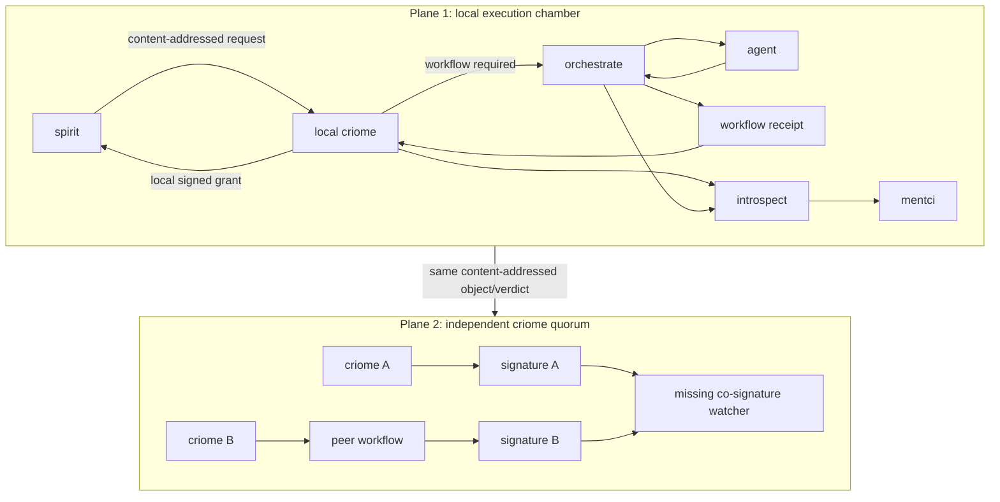
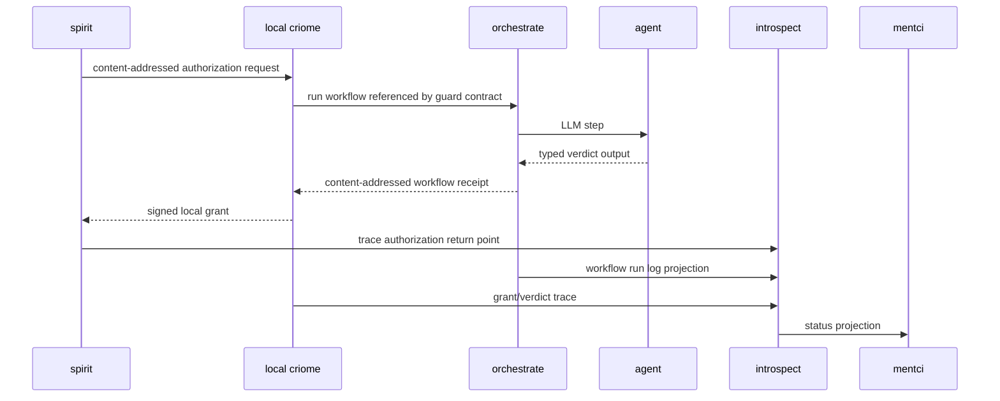

# 459 - Criome guardian trust planes follow-up

## What changed

The open workflow-verdict signing question is now settled by Spirit `ic4o` (Decision High): [criome guard workflow trust has two planes: a local execution chamber treats co-resident trusted components such as criome orchestrate agent introspect and mentci as one collaborating local system for first-substrate workflow receipts; the independent authority layer is the criome quorum layer, where peer nodes can run their own LLM workflows and produce their own signatures over the content-addressed object or verdict, with the system observing expected peer co-signatures and surfacing missing ones.]

The blocking-semantics question is also settled by confirmation and existing Spirit `ef6i` (Decision Medium): [Near-term mentci spirit criome milestone builds real authorization before trace-only watch: the actual spirit service is the traced daemon target, criome authorizes and answers a real request, spirit observes the authorization return, and for the first traced production posture spirit still does not block on that return; it emits trace evidence showing where blocking authorization would apply before the later switch to blocking gating.]

## Trust Planes

Plane 1 is the first substrate: trusted local components collaborate. The useful implementation consequence is that the first workflow receipt does not need a mature independent agent-identity proof. It needs to be content-addressed, typed, logged, and accepted by the local criome/orchestrate trust boundary.

Plane 2 is where independent authority arrives: peer criome nodes run their own checks or workflows and sign. The same contract shape must be designed so this is not a rewrite later; it grows from one local workflow receipt to several peer receipts/signatures over the same object or verdict.

## Implementation Consequences

1. **Evidence is content-addressed.** criome sees references and digests, not full guardian operation bodies as the canonical authority artifact.
2. **Local workflow receipts are acceptable first evidence.** The first substrate can trust orchestrate as the local workflow runner.
3. **The contract shape must admit peer workflow receipts.** The first schema should not bake in "one local runner only"; it should model a verdict/evidence object that can later have multiple producers.
4. **Trace and status split remains correct.** criome holds contract/verdict/signature facts; orchestrate holds workflow logs; introspect holds execution trace; mentci renders the status board.
5. **Spirit migration remains staged.** Build the general substrate, prove real grants and traced returns, then migrate Spirit to blocking Gating after explicit flip.

## Updated First Build

The next code milestone should be substrate-first:

- contract nouns for content-addressed workflow receipts and guard evidence;
- orchestrate workflow run object and logs for one named guardian workflow;
- criome evaluation path that verifies the local workflow receipt and signs a grant;
- introspect events for request, workflow run, grant return, and missing expected peer signatures;
- mentci status pane fed from introspect/daemon projections;
- scenario test showing Spirit-shaped request, local workflow receipt, criome grant, trace return, and non-blocking Spirit posture.

## Remaining Questions

The main open implementation question is the exact first contract shape:

- one generic `WorkflowReceipt` evidence object now, parameterized by workflow kind;
- or one `GuardianWorkflowReceipt` first, then generalize after the Spirit pilot.

My operator recommendation is a generic evidence envelope with a narrow first payload. That lets the schema carry the future peer receipts without over-designing the workflow language.
