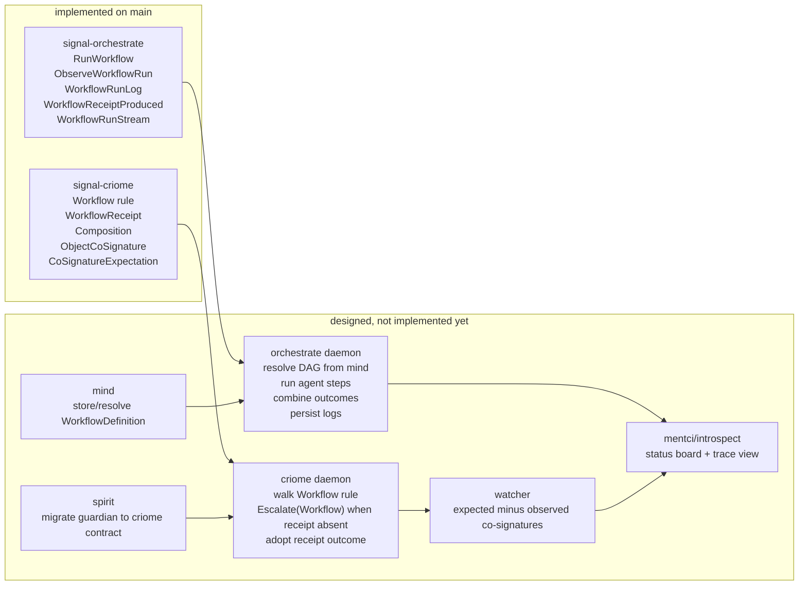

# 460 — Guard Substrate: Implementation vs Designer 724

Operator comparison of the landed mainline implementation against
`reports/designer/724-Design-guard-substrate-contracts.md`, especially §8
after the psyche's two-plane trust correction.

## Verdict

The contract slice designer intended for the next step is now mostly landed on
main:

- `signal-criome` main `7b3d5b2f` carries the workflow guard rule, local
  workflow receipt, richer verdict set, generic composition surface, and
  co-signature observation nouns.
- `signal-orchestrate` main `4f1e3ffb` carries the workflow execution request,
  run handle/log/receipt replies, workflow run stream, and DAG/log records.

The implementation matches the corrected §8 model more than the earlier §2
"signed WorkflowVerdict" sketch. That is important: the landed local artifact is
`WorkflowReceipt`, not a cross-verified signed verdict. The multi-node signing
plane is represented as `ObjectCoSignature` / `CoSignatureExpectation`, not as
local inter-component signing.

## Visual Map



## Match Table

| Designer 724 item | Landed implementation | Status |
|---|---|---|
| `Rule::Workflow(WorkflowGuard)` | `signal-criome/schema/lib.schema` has `(Workflow WorkflowGuard)` and `WorkflowGuard { workflow.WorkflowDigest executor.Identity }`; round-trip test covers `Rule::workflow`. | Match |
| Full verdict outcome set | `EvaluationDecision` now has `Authorized`, `Rejected`, `Deferred`, `NonJudgement`, `(Escalate EscalationTarget)`; round-trip test covers all new variants. | Match |
| Local-plane receipt, not local signed verdict | `WorkflowReceipt { workflow operation outcome provenance }` in `signal-criome`; `Evidence.workflow_receipts` carries it; no local signature/stamp field. | Match to §8 |
| Content-addressed object only | `WorkflowRunRequest` uses `AuthorizedObjectReference` + `ContractDigest` + `WorkflowDigest`; no full content payload. | Match |
| Orchestrate workflow run surface | `RunWorkflow`, `ObserveWorkflowRun opens WorkflowRunStream`, `WorkflowRunObservationRetraction`, run accepted/log/receipt replies. | Match |
| LLM provenance log | `WorkflowRunLog`, `StepLog`, `ModelAttestation { provider model host call }`. | Match |
| Workflow DAG shape | `WorkflowDefinition { steps, combination, escalation }`, `WorkflowStep { name prompt provider dependencies }`, `CombinationRule`. | Mostly match |
| Multi-node double-sign nouns | `ObjectCoSignature` and `CoSignatureExpectation` in `signal-criome`; tests cover expected/observed signer lists. | Contract match |
| Production tag scope | Not done in this implementation slice. | Gap |

## Intentional Shape Changes

### 1. Composition uses digest children, not inline recursion

Designer §8.2 sketched:

```nota
Composition [
  (AllOf (Vector Composition))
  (AnyOf (Vector Composition))
  ...
]
```

The landed schema is:

```nota
Composition [
  (AllOf (Vector CompositionDigest))
  (AnyOf (Vector CompositionDigest))
  (Threshold CompositionThreshold)
  (Escalate EscalationTarget)
  (WorkflowStep WorkflowStepName)
  (Signature Identity)
]
```

Reason: inline recursive vectors overflowed the generated rkyv derives. The
content-addressed shape is also more consistent with the psyche's
"content-addressed" correction: a composition graph is a set of addressed nodes,
not a recursively embedded object.

Effect: "psyche AND LLM" is no longer one inline object
`(AllOf [(WorkflowStep guardian) (Escalate Psyche)])`; it is:

```nota
guardian_node = (WorkflowStep guardian)
psyche_node   = (Escalate Psyche)
root          = (AllOf [digest(guardian_node) digest(psyche_node)])
```

Question for designer/psyche: is content-addressed composition the intended
canonical form, or should schema-rust-next learn recursive archived enums later?

### 2. `EscalationTarget` is narrower than the first sketch

Designer §2 had:

```nota
EscalationTarget [
  Psyche
  (Workflow WorkflowDigest)
  (SmarterAgent Identity)
  (All (Vector EscalationTarget))
  (Any (Vector EscalationTarget))
]
```

The landed form is:

```nota
EscalationTarget [
  Psyche
  (Workflow WorkflowDigest)
  (SmarterAgent Identity)
]
```

Composition handles `AllOf` / `AnyOf` / `Threshold`; escalation target is now a
leaf target. This avoids two overlapping composition languages.

Question: do we want a single composition language, or nested `All`/`Any` inside
`EscalationTarget` as well?

## Non-Accidental Implementation Differences

### Workflow definition exists in `signal-orchestrate`

Designer says workflow definitions live in `mind`; orchestrate resolves the DAG
from mind. The implementation added `WorkflowDefinition` and related DAG types
to `signal-orchestrate` so the execution contract can name the shape it runs and
tests can prove it.

This is acceptable as a contract-proving step, but it is not the final ownership
answer. The storage/resolve surface still belongs in `signal-mind` / `mind`; once
that exists, orchestrate should either import the canonical type or keep only the
run request/log surface and leave DAG definition storage outside this crate.

Question: should `WorkflowDefinition` be extracted to `signal-mind` immediately,
or stay duplicated in `signal-orchestrate` until the mind storage slice begins?

### Reply name is `WorkflowReceiptProduced`

Designer's early sketch said `WorkflowVerdictProduced WorkflowVerdict`; §8
corrected the local artifact to `WorkflowReceipt`. The landed orchestrate reply
is therefore:

```rust
WorkflowReceiptProduced { handle, receipt }
```

This is the right local-plane name.

## Remaining Designed Work

These are designed in 724 but not implemented by the contract commits:

1. `criome` daemon behavior:
   - evaluate `Rule::Workflow`;
   - return `Escalate(Workflow <digest>)` when evidence lacks a matching receipt;
   - adopt `WorkflowReceipt.outcome` when evidence carries the matching receipt;
   - preserve non-blocking first posture until an explicit Gating flip.

2. `orchestrate` daemon engine:
   - resolve `WorkflowDigest` from mind;
   - topologically run step DAGs;
   - dispatch each step to agent;
   - combine `StepOutcome`s;
   - emit/persist `WorkflowRunLog`;
   - return `WorkflowReceipt`.

3. `mind` / `signal-mind`:
   - canonical `WorkflowDefinition` storage and lookup by `WorkflowDigest`.

4. Multi-node watcher:
   - deploy second criome on Prometheus;
   - define the runtime source of `CoSignatureExpectation`;
   - surface expected-minus-observed co-signature gaps through introspect/mentci.

5. `introspect` / `mentci`:
   - show workflow runs, logs, model provenance, and missing co-signatures.

6. `spirit` migration:
   - spirit guardian becomes a criome workflow contract after the substrate is
     proven.

7. Production tagging:
   - tag the deployed spirit/criome/mentci/introspect surface before moving
     production pins.

## Tests Actually Run

`signal-criome`:

```text
cargo test --features nota-text
cargo clippy --features nota-text --all-targets -- -D warnings
```

`signal-orchestrate`:

```text
cargo test
cargo clippy --all-targets -- -D warnings
```

The tests are contract-level round trips and schema freshness checks. They are
not daemon integration tests and do not prove runtime workflow execution.

## Biggest Insight

The implementation pressure improved the design: recursive inline composition is
the wrong shape for this stack. The contract language should use
content-addressed composition nodes. That gives us:

- stable digests for subclauses;
- reusable subgraphs;
- smaller authorization evidence;
- easier observation of which clause failed;
- no rkyv recursive-derive problems.

This should probably be fed back to designer as a design correction: the
composition language is a graph of addressed nodes, not an inline recursive
tree.

## Questions To Carry Forward

1. Is `CompositionDigest`-based composition now canonical?
2. Should `EscalationTarget` stay leaf-only, with all/any/threshold composition
   owned by `Composition`?
3. Should `WorkflowDefinition` move to `signal-mind` now, or is it acceptable
   for `signal-orchestrate` to carry a runner-side copy until mind storage
   starts?
4. What is the first daemon integration proof: criome workflow-clause evaluation
   with a hand-built receipt, or orchestrate `RunWorkflow` producing a receipt
   from a minimal one-step fake agent?
5. Who owns the watcher contract for `CoSignatureExpectation`: criome ordinary
   signal, introspect trace, mentci projection, or a small dedicated observer
   surface?
