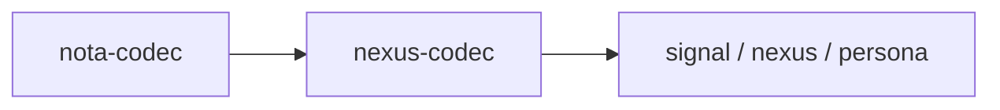
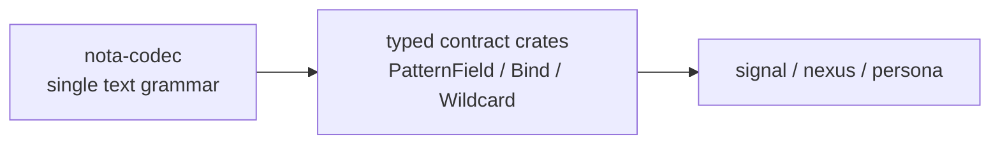
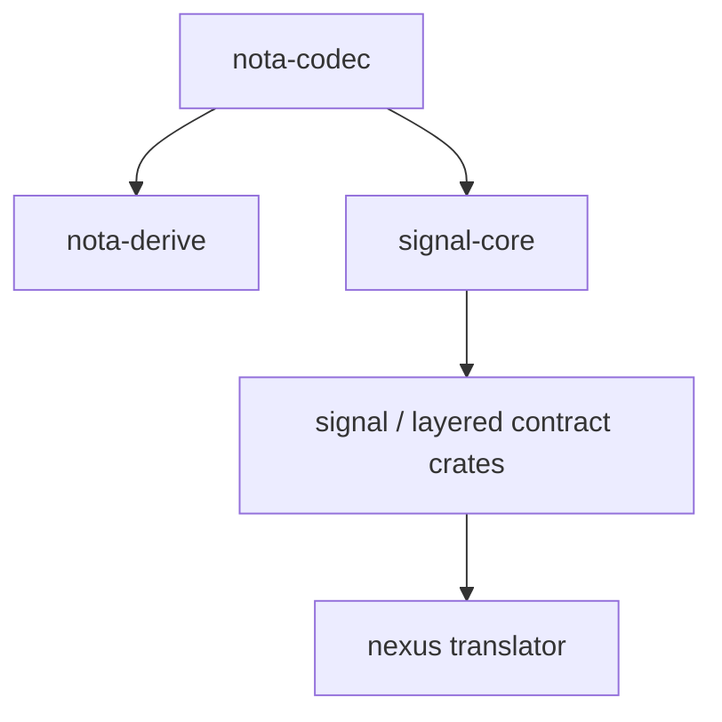
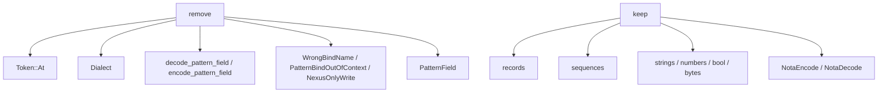
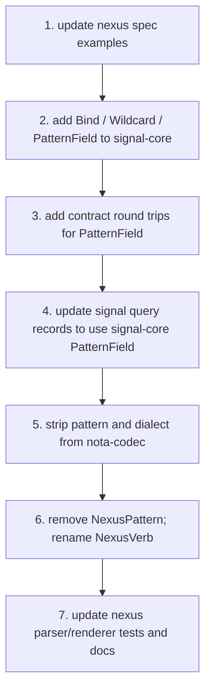

# Bind/Wildcard Typed Records — Implementation Plan

Status: operator implementation plan from designer reports
`45-nexus-needs-no-grammar-of-its-own.md` and
`46-bind-and-wildcard-as-typed-records.md`
Author: Codex (operator)

Designer/46 changes the implementation direction. My prior
`nexus-codec` extraction report is now superseded: if `@` is
dropped and `Bind` / `Wildcard` are ordinary typed records, Nexus
needs no grammar and no codec of its own. There is only Nota
syntax, plus typed record semantics in the contract crates.

---

## 1 · Decision Consequence

The old layering question was:



Reports 45 and 46 remove that layer:



Implementation consequence: do **not** create `nexus-codec`.
There is no Nexus parser. There is no Nexus lexer. There is no
Nexus dialect. `nexus` remains a language/spec/translator repo,
but the text grammar it speaks is Nota.

---

## 2 · New Wire Shape

`PatternField<T>` stays conceptually the same:

```rust
pub enum PatternField<T> {
    Wildcard,
    Bind,
    Match(T),
}
```

The text projection changes:

| Variant | Old wire | New wire |
|---|---|---|
| `Bind` | `@name` | `(Bind)` |
| `Wildcard` | `_` | `(Wildcard)` |
| `Match(value)` | `value` | `value` |

Examples:

```nexus
(NodeQuery (Bind))
(NodeQuery (Wildcard))
(NodeQuery "User")
(EdgeQuery 100 (Bind) Flow)
(Match (EdgeQuery (Bind) (Bind) (Bind)) Any)
```

No field name is carried by `Bind`. The binding name is still the
schema position's field name, but it is not repeated in the
pattern marker. `Unify [to]` and similar records refer to the
schema field names when they need named relationships.

---

## 3 · Ownership

`PatternField`, `Bind`, and `Wildcard` are not codec concepts.
They are typed-record concepts.



Recommended ownership:

| Concept | Owner | Reason |
|---|---|---|
| `Bind` | `signal-core` | universal typed marker for pattern capture |
| `Wildcard` | `signal-core` | universal typed marker for pattern don't-care |
| `PatternField<T>` | `signal-core` | reusable across all Sema / signal layered crates |
| `NotaRecord` / `NotaEnum` derives | `nota-derive` | pure structural data projection |
| renamed `NexusVerb` derive | `nota-derive` | generic closed-record-head dispatch, not Nexus |
| Nexus grammar spec | `nexus` | human-facing language documentation over Nota syntax |

This also fixes the current awkwardness where `signal` claims pattern
ownership but re-exports `nota_codec::PatternField`.

---

## 4 · Codec Simplification

`nota-codec` should become strictly structural:



Concrete edits:

| File | Change |
|---|---|
| `src/lexer.rs` | remove `Dialect`; remove `Token::At`; `@` becomes `UnexpectedChar` |
| `src/decoder.rs` | remove bind-marker helpers; add a non-consuming record-head peek if needed for `PatternField<T>` |
| `src/encoder.rs` | remove dialect mode, `write_bind`, `write_wildcard`, and pattern-specific methods |
| `src/error.rs` | remove pattern-only errors |
| `src/pattern_field.rs` | delete after moving type to `signal-core` |
| tests | move pattern tests to the contract crate that owns `PatternField<T>`; keep pure Nota tests in `nota-codec` |

The key helper to preserve in `nota-codec` is a structural peek:
given a decoder, can it see `(<head>)` without consuming? That is
not Nexus-specific; any typed sum decoder can use it.

---

## 5 · Derives

Two derive changes fall out:

| Current derive | New status |
|---|---|
| `NexusPattern` | delete or rename into a contract-local helper only if `PatternField<T>` needs custom derive support |
| `NexusVerb` | rename to a generic Nota derive, likely `NotaSum` |

With `(Bind)` and `(Wildcard)`, `PatternField<T>` can implement
`NotaEncode` / `NotaDecode` directly. It no longer needs the
surrounding derive to pass the schema field name. That means
`NexusPattern` may become unnecessary: a query struct whose fields
are `PatternField<T>` can derive ordinary `NotaRecord`.

That is the cleanest outcome:

```rust
#[derive(NotaRecord)]
pub struct NodeQuery {
    pub name: PatternField<String>,
}
```

If a derive remains, it should be justified by code generation that
ordinary `NotaRecord` cannot do. The old bind-name validation no
longer qualifies because there is no bind name in the wire marker.

---

## 6 · Migration Order



I would start with `signal-core` because it gives the new typed
records a home before deleting them from `nota-codec`. Then update
`signal` and downstream tests, and only then strip `nota-codec`.

The extraction is mostly code deletion if done in this order.

---

## 7 · Tests To Land First

Pattern semantics should be proven in the owning contract crate,
not in `nota-codec`.

| Test | Expected text |
|---|---|
| `PatternField::<String>::Bind` | `(Bind)` |
| `PatternField::<String>::Wildcard` | `(Wildcard)` |
| `PatternField::<String>::Match("User")` | `User` or `"User"` depending current string encoder rule |
| `NodeQuery { name: Bind }` | `(NodeQuery (Bind))` |
| `NodeQuery { name: Wildcard }` | `(NodeQuery (Wildcard))` |
| `EdgeQuery { from: Match(100), to: Bind, kind: Match(Flow) }` | `(EdgeQuery 100 (Bind) Flow)` |

Add a negative test in `nota-codec`: `@name` is rejected as
`UnexpectedChar`. That prevents the sigil from creeping back in.

---

## 8 · Open Choices

| Question | Recommendation |
|---|---|
| `Wildcard` wire form | use `(Wildcard)`, not `_`, for uniform typed structure |
| `PatternField<T>` home | `signal-core`, not `signal`, because it is universal across Sema fabrics |
| `NexusPattern` | remove if ordinary `NotaRecord` works |
| `NexusVerb` rename | `NotaSum` unless the user prefers a more explicit name |
| `nexus-codec` repo | do not create it |

---

## 9 · Bottom Line

Reports 45 and 46 collapse the design to a better shape: Nexus is
not a second grammar layered over Nota. Nexus is a named language
discipline over Nota records and the Sema verb vocabulary.

The next implementation should move pattern concepts into
`signal-core`, delete Nexus-specific paths from `nota-codec`, update
`nexus/spec/grammar.md` to show `(Bind)` / `(Wildcard)`, and rename
generic closed-record-head dispatch away from `NexusVerb`.

