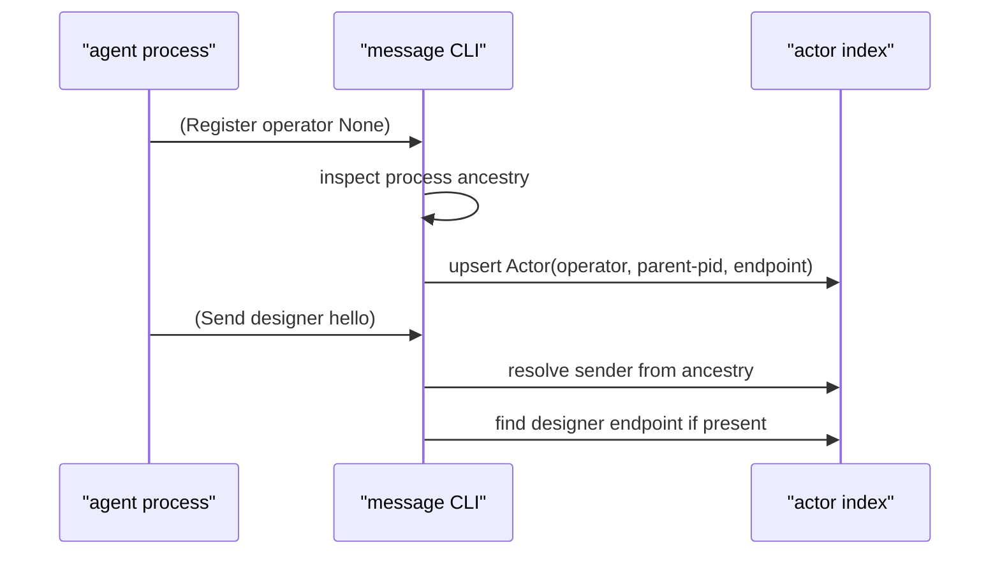

# 52 · Naive Persona Messaging Implementation

## Purpose

This report records the first implementation step for Persona messaging under
the parallel development workflow. The target is intentionally narrower than
full Persona orchestration: agents need a typed CLI path to register themselves,
send messages, inspect known actors, and read inboxes before the router, store,
and system gate are assembled.

Relevant prior work:

- `reports/designer/19-persona-parallel-development.md` defines component
  repos as independently buildable slices.
- `reports/designer/4-persona-messaging-design.md` defines the eventual
  messaging fabric.
- `reports/designer/12-no-polling-delivery-design.md` marks polling tails as
  transitional and not acceptable for the final router.
- `reports/designer/40-twelve-verbs-in-persona.md` maps user-facing message
  commands onto the verb layer.

## What Landed

The first slice landed in `/git/github.com/LiGoldragon/persona-message`.

`persona-message` now has a typed registration surface:

```nota
(Register operator None)
(Agents)
(Send designer "Need a layout pass.")
(Inbox designer)
```

`Register` records the local process identity in the actor index. A later
`Send` resolves the sender from process ancestry, not from model-authored text.
That preserves the rule that the model chooses recipient and body, while
infrastructure mints identity and message metadata.

The same registration path works through `message-daemon`: the daemon records
the calling client process ancestry, and sender resolution happens only for
commands that need a sender (`Send` and `Tail`). `Register`, `Agents`, and
`Inbox` do not require a pre-existing sender.

```mermaid
flowchart LR
    "harness shell" -->|"message '(Register operator None)'"| "message CLI"
    "message CLI" -->|"process ancestry"| "Actor"
    "Actor" -->|"upsert"| "actors.nota"
    "harness shell" -->|"message '(Send designer hello)'"| "message CLI"
    "actors.nota" -->|"resolve sender"| "message CLI"
    "message CLI" -->|"append typed Message"| "messages.nota.log"
```

## Minimal Discovery Model

There is no ambient harness discovery yet. That is the right constraint for
this slice because there is no central orchestrator in the test setup.

The current discovery rule is explicit self-registration:



This keeps the naive implementation debuggable. A harness can register itself
after startup; test setup can still seed actors manually when testing the
resolver itself; and the future orchestrator can replace this with declarative
harness registration without changing the CLI contract.

## CLI Shape

The CLI is a small dialect over typed NOTA records. It should remain convenient
for agents:

| Command | Meaning |
|---|---|
| `(Register name endpoint)` | claim this process ancestry as `name` |
| `(Agents)` | print known registered actors |
| `(Send recipient body)` | send from resolved local actor |
| `(Inbox recipient)` | read stored messages addressed to recipient |
| `(Tail)` | transitional live read for current actor |

The future Nexus / Signal shape is not a separate parser here. The CLI surface
should lower into typed records owned by `signal-persona`, with user-friendly
records kept as the harness boundary.

```mermaid
flowchart TB
    "agent command" --> "persona-message"
    "persona-message" -->|"today"| "local typed Message"
    "persona-message" -->|"next"| "signal-persona Assert(Message)"
    "signal-persona Assert(Message)" --> "persona-router"
    "persona-router" --> "persona-store"
```

## Router Consequences

This slice does not make `persona-message` the router. It gives the router a
small, working front door.

The next router implementation should not rediscover actors by scraping files.
It should accept registration events and own live endpoint state. Durable state
can then be committed through the store once `persona-store` is ready.

```mermaid
flowchart LR
    "Register" --> "router actor table"
    "Send" --> "router mailbox"
    "router actor table" --> "endpoint actor"
    "endpoint actor" --> "system gate"
    "system gate" --> "harness input adapter"
```

Open router design point: an endpoint should probably be owned by a harness
actor, not by a raw file row. The file row is only the current persistence
hack for a no-orchestrator test.

## No-Polling Boundary

The current `Tail` command still uses an old 200 ms file-read loop in
`persona-message`. This work did not expand that path. It is a transitional
debug surface and should be replaced by daemon push delivery before being used
as architecture.

The final shape should be:

```mermaid
flowchart LR
    "store commit" -->|"push event"| "router"
    "router" -->|"direct wake"| "recipient actor"
    "recipient actor" -->|"checked delivery"| "harness"
```

No component should poll to discover work.

## Verification

Commands run in `/git/github.com/LiGoldragon/persona-message`:

```sh
cargo test
nix develop --command cargo fmt --check
nix flake check
```

`cargo fmt` was not installed in the ambient shell, so formatting was checked
inside the Nix dev shell.

The added daemon regression is:

```text
daemon_registers_actor_for_calling_shell
```

It caught and fixed a real bug where the daemon resolved sender identity before
matching the request kind, which made first-time `Register` impossible through
the daemon.

## Next Work

1. Move `Message`, `Actor`, endpoint, and command/event records toward
   `signal-persona` so `persona-message` becomes only the CLI projection.
2. Replace `Tail` with daemon push semantics. Do not build new polling code.
3. Create the first `persona-router` actor table: registration events in,
   resolved delivery intents out.
4. Keep `Register` as the naive bootstrap mechanism until the orchestrator owns
   harness spawn and registration.
