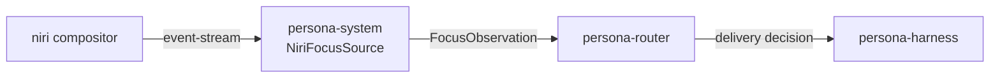
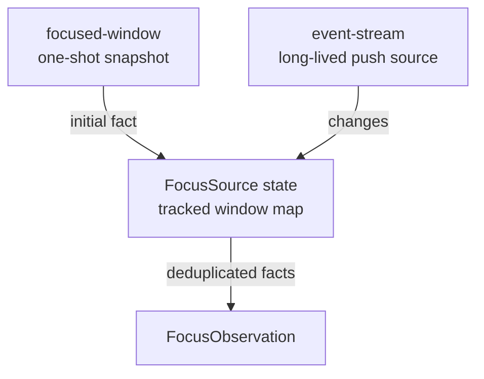
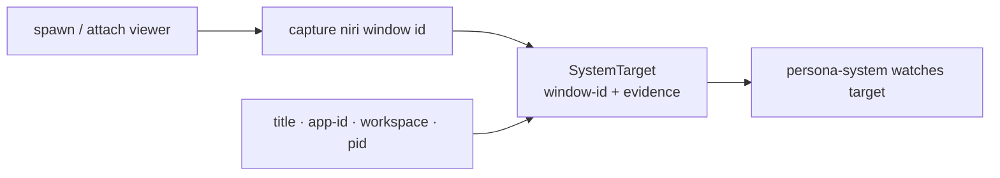
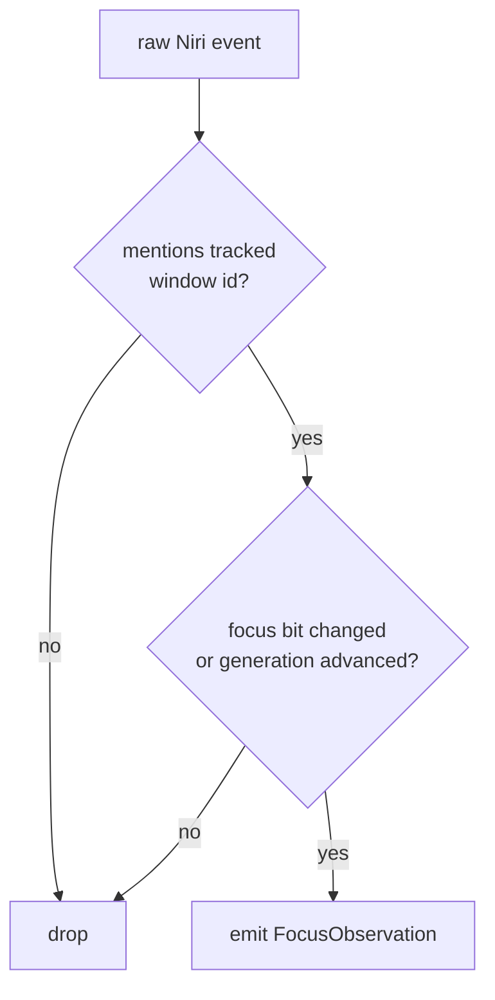
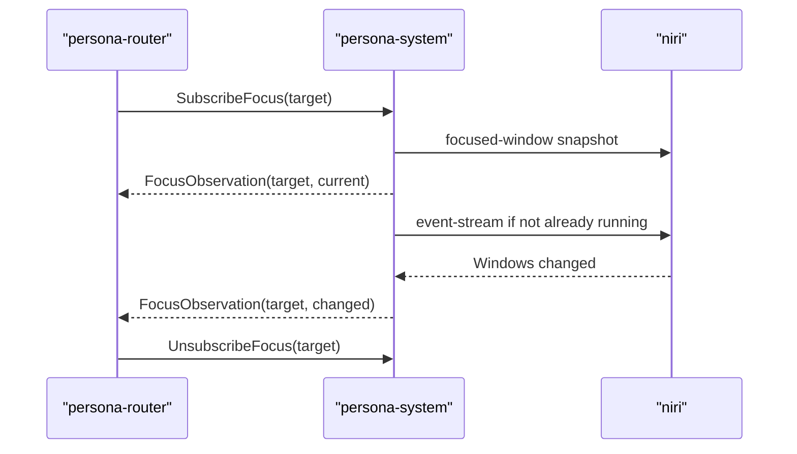
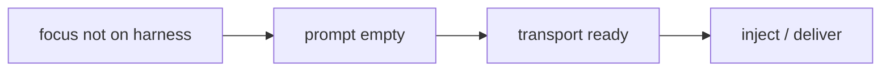
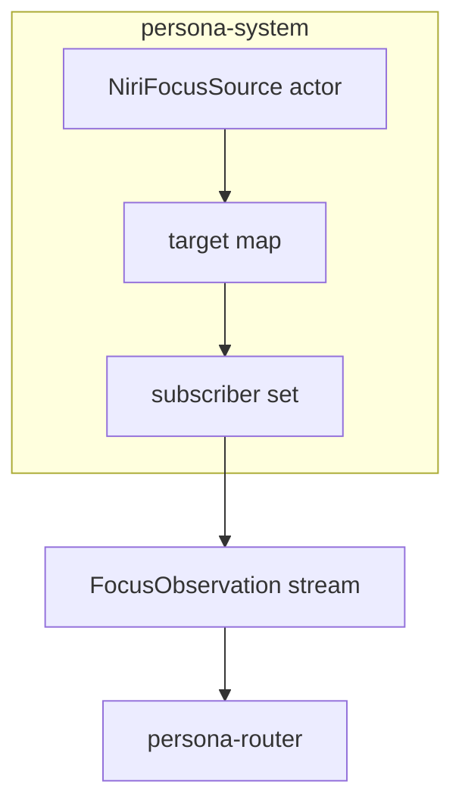

# 54 · Niri Focus Source Vision

## Purpose

This report shows the operator vision for turning Niri focus information into a
Persona system component. The immediate goal is not full safe terminal delivery.
The immediate goal is a reliable, no-polling source of focus facts that the
router can subscribe to when a pending delivery is blocked on human focus.

The current state is good enough for a first implementation:

- `niri msg focused-window` gives the current focused window.
- `niri msg --json focused-window` gives a machine-readable snapshot.
- `niri msg event-stream` pushes compositor events.
- `event-stream` includes `Windows changed` and `Workspaces changed` records
  carrying window id, title, app id, pid, workspace id, `is_focused`,
  `focus_timestamp`, and layout data.

## The Boundary

Focus is system information, not router logic and not harness logic.
`persona-system` should own the Niri adapter.



The adapter translates raw Niri events into Persona facts. The router never
parses Niri output.

## Current Niri Shape

Niri provides two complementary surfaces.



The initial probe solves the "subscribe after state already exists" problem.
The stream solves the no-polling requirement. A subscriber gets an initial
state and then only push changes.

## Minimal Record Shape

The first system-side record can stay small:

```nota
(FocusObservation target true generation)
(FocusObservation target false generation)
```

Implementation-side shape:

```rust
pub struct FocusObservation {
    pub target: SystemTarget,
    pub focused: bool,
    pub generation: FocusGeneration,
}
```

`generation` should come from Niri's `focus_timestamp` when available. If the
event lacks it, the adapter can mint a monotonic generation counter. The router
only needs ordering, not wall-clock time.

## Target Identity

The hard part is not observing focus. The hard part is mapping a Persona
harness to the right Niri window.

Do not use process id alone. WezTerm can have several windows sharing the same
process. The best first key is the Niri window id captured when the harness
viewer is created or attached.



The extra evidence is not the identity. It is audit data and recovery help.
If a window id disappears, the adapter can report `TargetLost`; it should not
silently guess a replacement window unless the orchestrator asks for that.

## Event Filtering

Raw Niri events are noisy. WezTerm title animations alone can produce many
`Window opened or changed` events for the same focused window. The adapter must
filter before emitting Persona facts.



The router should never see title-change chatter.

## Router Use

The router subscribes only when focus matters.



If the current focused window is the target harness, the router treats the
human as owning that prompt surface and defers injection. When the target loses
focus, the router may continue the rest of the gate: prompt-empty, delivery
transport readiness, and any authorization checks.

## What Focus Does Not Solve

Niri focus is only one gate.



It does not prove the prompt is empty. It does not prove the agent is idle. It
does not protect against a user typing through another mechanism. It simply
answers: "is this window currently focused by the compositor?"

The next safety layer is still a harness-side screen/input recognizer in
`persona-harness` or `persona-wezterm`.

## Component Plan

The first implementation should be deliberately small:

1. `persona-system` adds a `NiriFocusSource` object.
2. It exposes a CLI such as:

   ```sh
   system '(ObserveFocus (NiriWindow 198))'
   system '(SubscribeFocus (NiriWindow 198))'
   ```

3. `ObserveFocus` uses `niri msg --json focused-window`.
4. `SubscribeFocus` runs `niri msg --json event-stream`, filters by target
   window id, and emits deduplicated NOTA records.
5. Tests use captured fixture events first, then a local ignored/live test for
   an actual Niri session.

## Open Decisions

The implementation can start without these, but they should be decided before
router delivery depends on it:

| Decision | Lean |
|---|---|
| Is `SystemTarget` keyed by Niri window id only, or by a tagged enum over backends? | Tagged enum: `(NiriWindow id)` now, later `(MacWindow id)`, `(HyprlandWindow address)`, etc. |
| Does `persona-system` keep one shared Niri stream or one stream per subscriber? | One shared actor stream, many subscribers. Niri events are global and noisy. |
| What happens when the target disappears? | Emit `TargetLost`; router leaves delivery pending or fails by policy. |
| Should title/app-id/pid evidence be part of the target key? | No. Keep it as observation evidence. |
| Does router subscribe continuously? | No. Subscribe only while a pending delivery is blocked on focus. |

## Implementation Consequence

This makes focus a first-class push fact:



That is the right slice to build before testing real message injection again.
The message engine can queue and route today, but safe delivery needs the gate
facts. Niri can provide the focus fact now, without polling.

