# 59 · Safe Harness Delivery Implementation Vision

## Purpose

The current implementation proves that Persona can observe Niri focus for
visible Pi harness windows. It does not yet prevent prompt corruption.

This report describes the next implementation shape: a push-driven delivery
gate where routed messages are queued until Persona can prove the human does
not own the target prompt surface.

## Current State

What exists:

- `persona-system` has a `system` CLI with:
  - `(ObserveFocus (NiriWindow id))`
  - `(SubscribeFocus (NiriWindow id))`
- `persona-message` has a visible Pi/Niri focus test using
  `prometheus/qwen3.6-27b`.
- `persona-wezterm` can attach visible viewers to durable PTY harnesses.
- The message store and actor registration exist in `persona-message`.

What is missing:

- no router-side delivery gate
- no prompt-buffer inspection
- no safe queue/defer state
- no integration between `persona-message` delivery and `persona-system`
  focus observations
- no test proving a queued message does not corrupt a human prompt

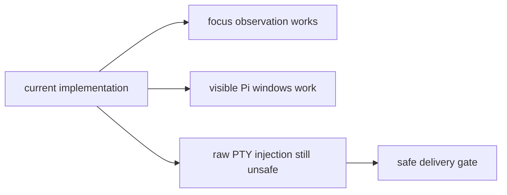

## The Invariant

Persona must never inject into the same input channel that the human is
currently editing.

The minimum safe rule:

> A message may be delivered through terminal input only when the target
> harness window is not focused and the target prompt buffer is known empty.

Unknown is not safe. Unknown means queued.

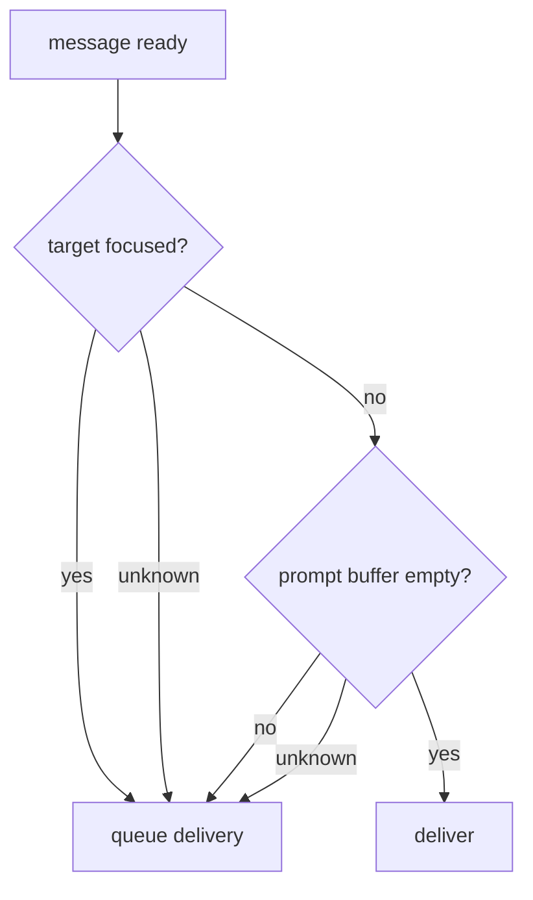

This does not care whether the agent is idle. Agent-idle was the wrong
question. The safety question is whether Persona would collide with human
input.

## Component Ownership

The work should be split by concern.

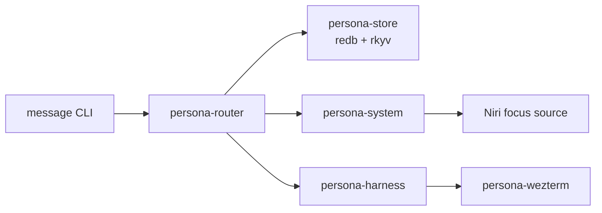

| Component | Owns | Does not own |
|---|---|---|
| `persona-message` | typed message records and user-facing CLI grammar | delivery safety |
| `persona-router` | queue, routing, delivery state machine, actor supervision | Niri parsing, terminal rendering |
| `persona-system` | OS/window-manager facts such as focus | message routing |
| `persona-harness` | harness actor model and prompt-state facts | global routing |
| `persona-wezterm` | PTY transport, viewer attach, terminal capture primitives | policy |
| `persona-store` | typed durable state substrate | routing decisions |

The router is the only component that decides whether a delivery attempt may
proceed.

## Actor Shape

Every harness should be represented by an actor. The actor owns its endpoint
and its current delivery-relevant facts.

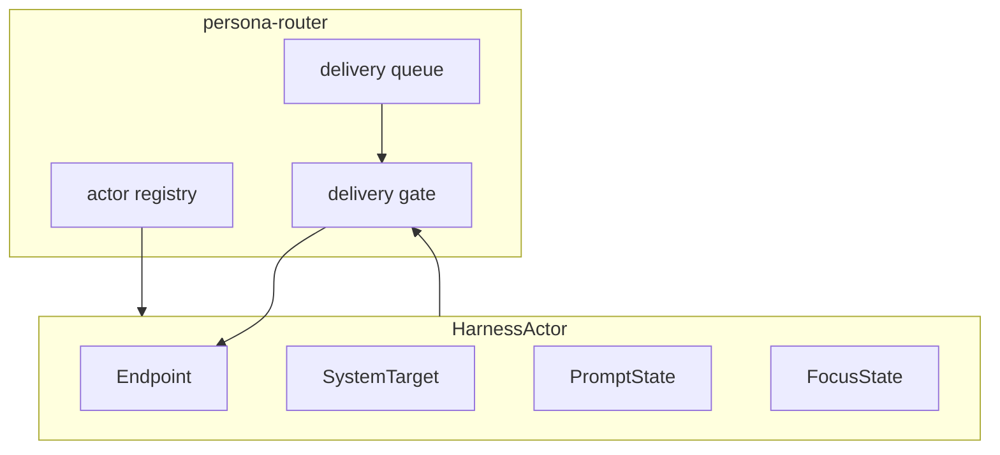

The actor should carry:

| Field | Example | Source |
|---|---|---|
| actor name | `initiator` | registration |
| endpoint | PTY socket path | `persona-wezterm` |
| system target | `(NiriWindow 223)` | visible attach/discovery |
| focus state | focused / unfocused / unknown | `persona-system` subscription |
| prompt state | empty / occupied / unknown | harness screen recognizer |
| pending deliveries | message ids | router queue |

The endpoint is runtime state, but it still needs durable representation
because the router may restart. The actor owns the endpoint record; the store
persists it.

## Delivery State Machine

The router needs explicit state, not scattered shell scripts.

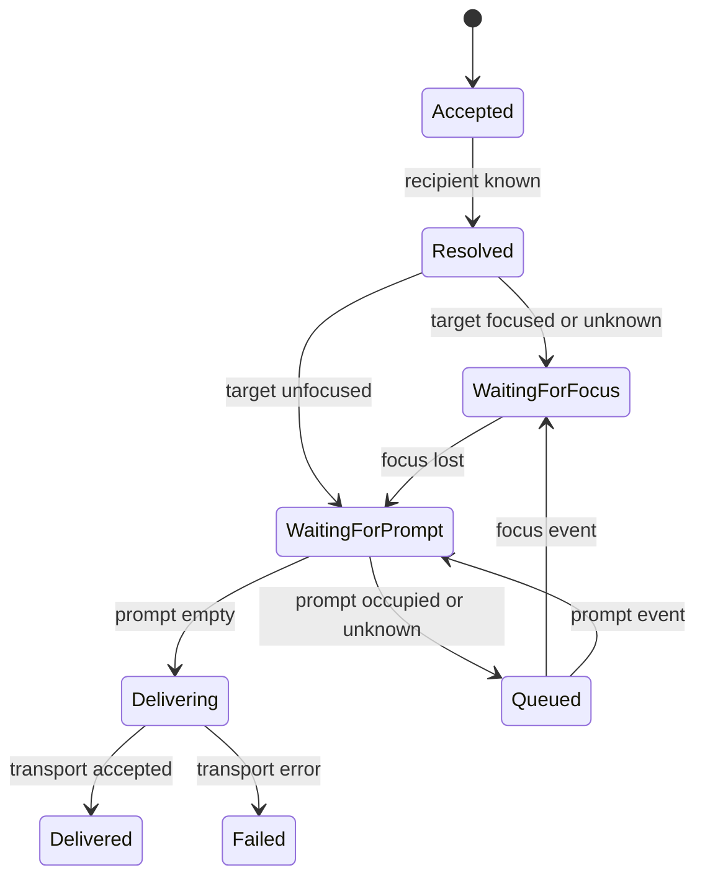

The important property is that the router reacts to facts. It does not poll
for facts.

## Push Sources

Two facts are needed before terminal injection is allowed.

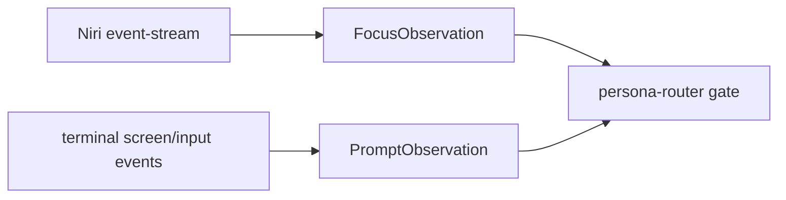

`FocusObservation` already has a first implementation.

`PromptObservation` is the next missing substrate. It should not be a timer
loop scraping the screen. The likely first version is a terminal-capture actor
inside `persona-wezterm` or `persona-harness` that emits an event when the
recognized prompt input region changes.

Minimal records:

```nota
(FocusObservation (NiriWindow 223) false generation)
(PromptObservation initiator Empty generation)
(PromptObservation initiator Occupied generation)
(PromptObservation initiator Unknown generation)
```

The exact record names can move into contract repos, but the shape is enough
to build the gate.

## Safe Injection Window

The unsafe moment is between checking facts and writing to the PTY. The router
must treat delivery as a short critical section.

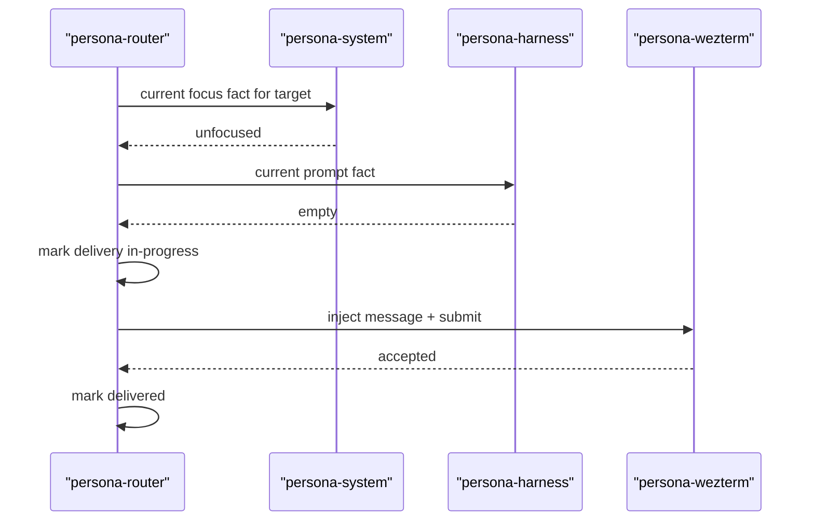

This first version cannot make the focus/input transition physically atomic.
The acceptable mitigation is conservative gating:

- if target is focused, queue
- if prompt is occupied, queue
- if either source is stale or unknown, queue
- while a user-focused target is queued, subscribe to focus changes
- after focus changes away, re-check prompt state before delivery

Future OS-level support can add a focus guard or compositor-mediated
injection transaction. The router state machine should already have a place
for that as a stronger implementation of the same gate.

## Niri Integration

Niri is not the generic abstraction. It is the first `persona-system`
backend.

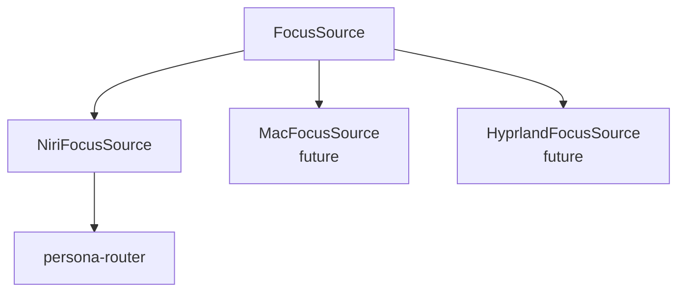

For Niri, the router should not subscribe globally forever. It should
subscribe when a pending delivery is blocked on focus and unsubscribe when the
blocked delivery clears.

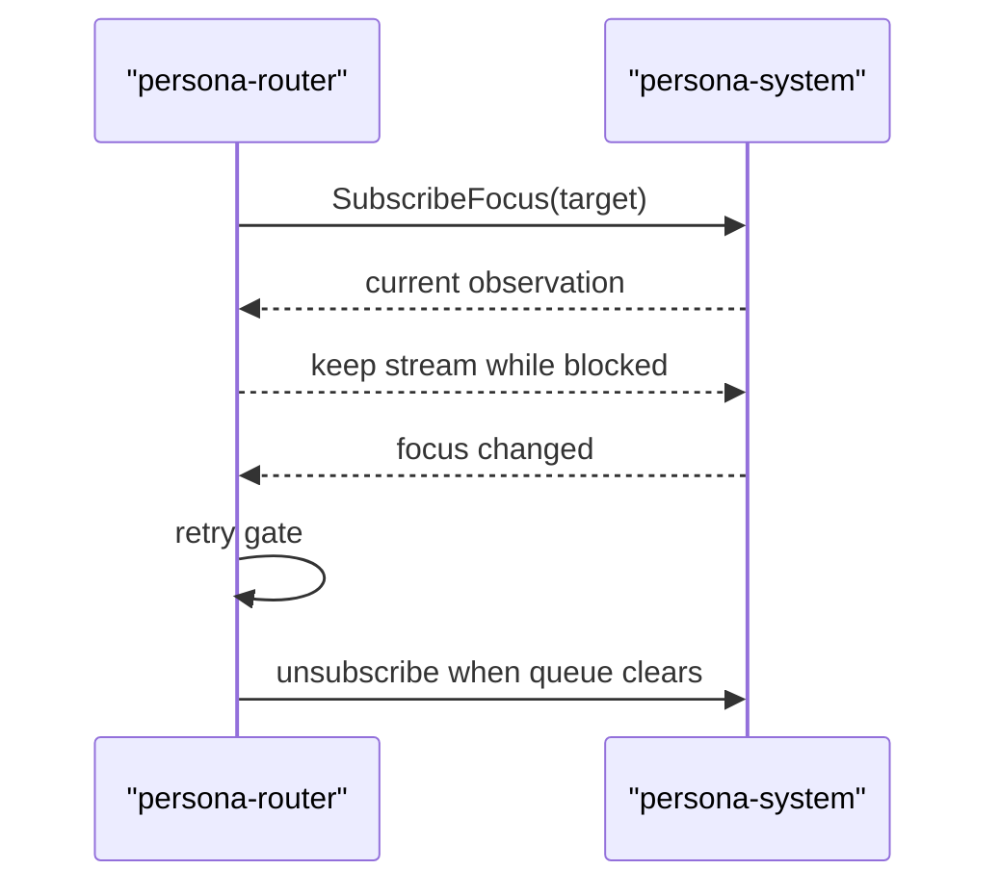

The source is still push-based. The subscription lifetime is demand-shaped.

## Prompt Inspection

Prompt inspection is separate from focus. It should live with the harness
adapter because prompt geometry and screen grammar are harness-specific.

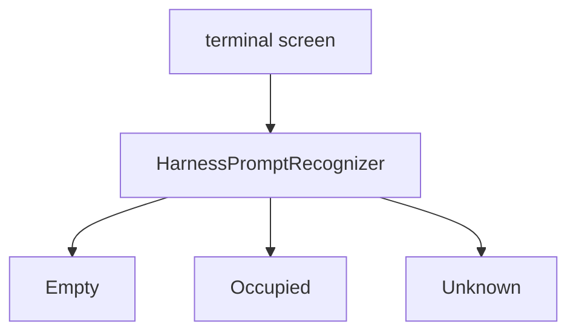

The first recognizer can be narrow:

| Harness | First signal |
|---|---|
| Pi | input-line region empty or non-empty |
| Codex | prompt line after `>` empty or non-empty |
| Claude | prompt/input box empty or non-empty |

When recognition fails, emit `Unknown`. The router queues.

## Test Control Surface

The safe-delivery tests need their own control surface. New windows commonly
auto-focus, so a test that spawns harnesses and immediately sends a prompt can
accidentally test the compositor's startup behavior instead of the router's
gate.

The test harness needs three explicit capabilities:

| Capability | Why |
|---|---|
| locate existing harness windows | reuse live harnesses without respawning paid or stateful agents |
| bind window ids to actor names | route focus facts to the right actor |
| move focus to a neutral target | make the target harness unfocused before delivery tests |

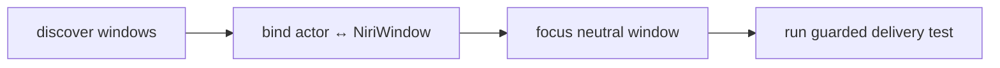

The neutral focus target can be a small disposable window owned by the test
setup. It must not be a harness. In Niri terms, the test should be able to
focus either:

- an existing non-harness window selected by app id/title evidence, or
- a tiny test-owned terminal/window created only to absorb focus.

That lets the test prove both sides:

- when the target harness is focused, delivery queues
- when focus moves to neutral and the prompt is empty, delivery proceeds

Harness discovery should use evidence, not guessing:

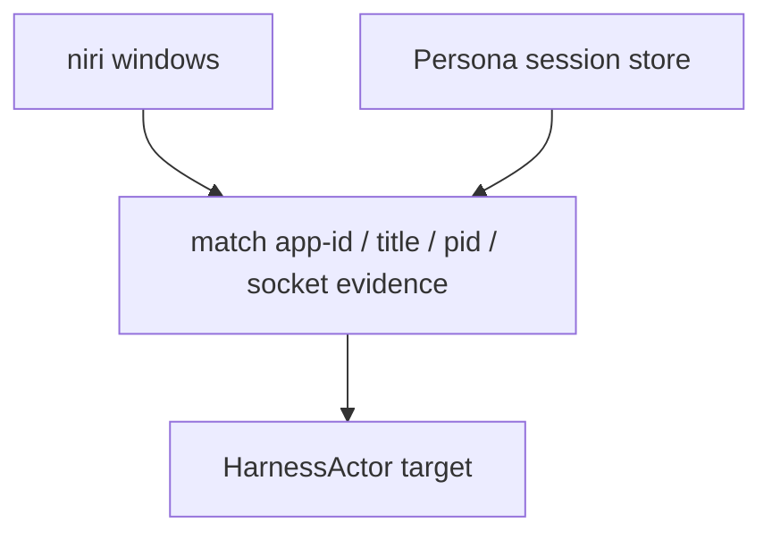

The runtime should prefer stored actor endpoint data when it exists, then
verify it against current Niri windows. If the window exists but the router
does not yet know it, a test-only registration command can bind the visible
window to an actor name. This is essential for debugging already-running
harnesses.

## Actual Harness Test Vision

The next visible test should prove the safety property, not merely focus
observation.

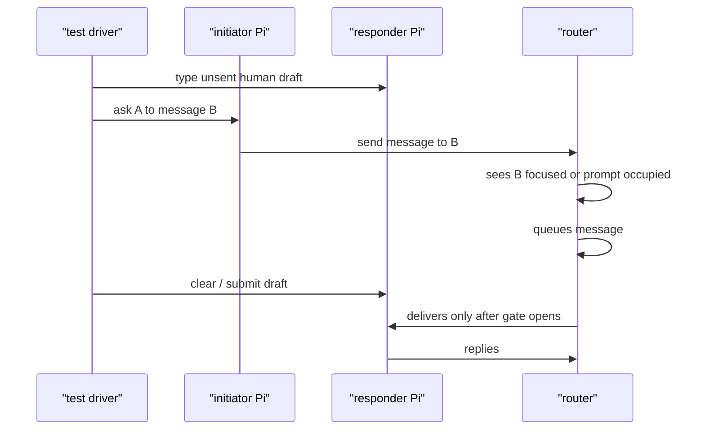

Pass conditions:

- the human draft is not altered by Persona delivery
- the incoming message is not concatenated with the draft
- router logs show `Queued` before `Delivered`
- delivery happens only after focus/prompt facts permit it
- both Pi windows remain visible and attachable
- the test can either reuse already-running Pi windows or create new ones
- the test can deliberately focus a neutral window before an allowed delivery

This test must submit prompts intentionally. No more "text inserted but not
sent" ambiguity.

## Implementation Order

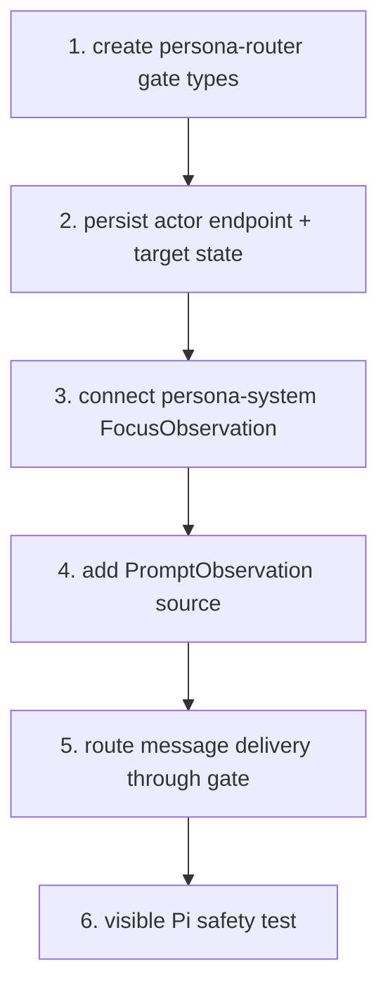

Practical first slice:

1. Add router delivery states and typed records.
2. Move the current direct PTY injection behind a `HarnessEndpoint` method.
3. Add a `FocusGate` object that can say allow/defer from current facts.
4. Wire `persona-system` observations into router actor state.
5. Add a conservative `PromptObservation::Unknown` default so delivery blocks
   until prompt inspection exists.
6. Implement the first Pi prompt recognizer.
7. Add harness-window discovery and neutral-focus test control.
8. Run the visible Pi test where a typed human draft is preserved.

## Decisions Needed

| Decision | Recommendation |
|---|---|
| Should router deliver if prompt state is unknown? | No. Unknown queues. |
| Should focus alone ever authorize injection? | No. Focus is only one gate. |
| Should agent-idle be part of the gate? | No. Agent-idle is not the safety question. |
| Should scripts keep direct PTY injection access? | Only as low-level tooling; router delivery must use the gate. |
| Should failed recognition block all delivery? | Yes for terminal injection. Other future transports may have their own gates. |

## Summary

The next implementation is not "send more messages through PTYs." It is a
router-owned safety gate with push-fed facts.

`persona-system` now provides the first fact: focus. The missing fact is prompt
state. Once both feed the router actor, the message path can queue instead of
corrupting user input. The next actual-harness test should demonstrate exactly
that: a message waits while the human owns the prompt, then delivers cleanly
when the gate opens.
