# Router Trained Relay Test Implementation

## Goal

Build a visible, repeatable test where trained Pi harnesses use the `message`
command themselves:

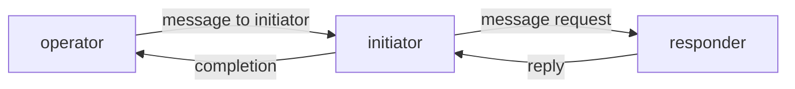

The important distinction from the earlier router delivery test is that only
the first instruction is injected by the test. After that, the harnesses must
use the `message` command according to their skill.

## Current Gap

The existing relay script proves agent-to-agent behavior through the old
`message-daemon` store path:

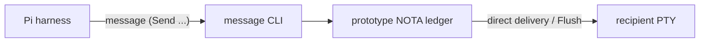

The existing router test proves guarded delivery, but the test script sends
`RouteMessage` records directly:

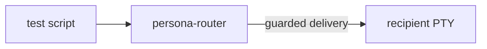

The next shape combines both:

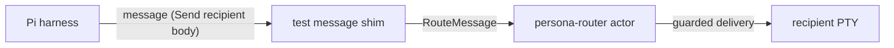

## Implementation Plan

1. Add a router-backed visible Pi relay script in `persona-message`.
2. Generate a temporary `message` shim in the test root so trained agents use
   the same command shape as the real CLI: `message '(Send recipient body)'`.
3. The shim resolves sender identity from `PERSONA_ACTOR`, mints the short
   infrastructure message id, writes an audit log, and submits
   `(RouteMessage (Message ...))` to `persona-router`.
4. Register `operator`, `initiator`, and `responder` in the router. Operator is
   a human endpoint so messages back to operator are recorded in the audit log
   without terminal injection.
5. Train initiator and responder through `skills/persona-message-harness.md`.
6. Prove the relay:
   - responder reports ready to operator;
   - initiator reports ready to operator;
   - operator sends one instruction to initiator;
   - initiator messages responder;
   - responder replies to initiator;
   - initiator reports completion to operator.
7. Prove guards in the same script:
   - focus responder, route a message, assert it remains pending;
   - unfocus via neutral window, push `FocusObservation`, assert delivery;
   - type a draft into responder, route a message, assert it remains pending;
   - clear draft, push `PromptObservation Empty`, assert delivery.

## Test Harness Shape

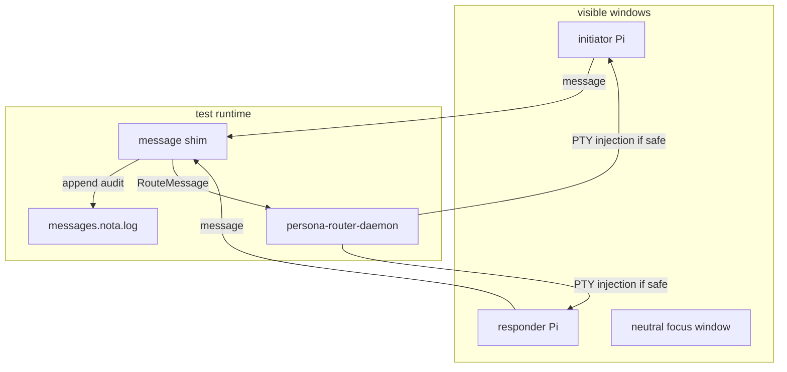

## State While Working

- Report created before implementation.
- Added router-aware `message` execution: when `PERSONA_ROUTER_SOCKET` is set,
  `Send` resolves the sender, builds the canonical `Message`, submits
  `(RouteMessage <Message>)` to the router socket, then appends the message to
  the local audit log.
- Added `persona-message/scripts/test-pty-pi-router-relay`.
- Added `persona-message/scripts/teardown-pty-pi-router-relay`.
- Added Nix app names for the relay setup/teardown.
- Added a named diagnostic script,
  `persona-message/scripts/debug-pty-pi-router-relay-state`, after the user
  pointed out that relay inspection also needs to go through Nix-created
  scripts rather than ad-hoc shell commands.
- First live run exposed a lower transport issue: `persona-wezterm-send`
  typed prompt text into Pi but did not reliably submit it when text and
  carriage return were sent through the same socket connection. A separate raw
  carriage return submitted correctly, so the fix belongs in `persona-wezterm`,
  not only in the relay script.
- A later run proved the relay semantics reached `initiator -> responder ->
  initiator`; the remaining failure was the initiator not reliably receiving or
  acting on the original operator router delivery. Debugging stayed inside
  `nix run .#debug-pty-pi-router-relay-state`.
- The next failure was narrower: `initiator` sent the correct message through
  `message`, but `responder` never saw the router delivery. Delivery now
  verifies that the prompt appears in PTY capture before reporting delivered;
  otherwise the router keeps the message pending for the next pushed prompt or
  focus observation.

## First Implementation Cut

The CLI path is now:

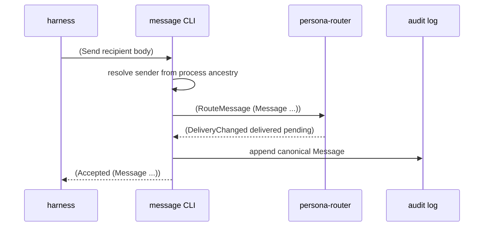

The relay script keeps the earlier guard tests but moves the route origin to
`message`, not hand-written router records.

## Transport Fix

`PtySocket::send_prompt` now sends prompt text and the submit carriage return as
two transport writes, with an explicit flush before socket teardown:

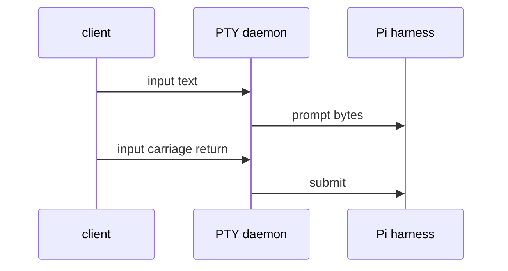

This is the same behavior that worked manually during diagnosis and it is the
path used by router delivery.

## Delivery Verification

The router path now treats "write returned Ok" as insufficient:

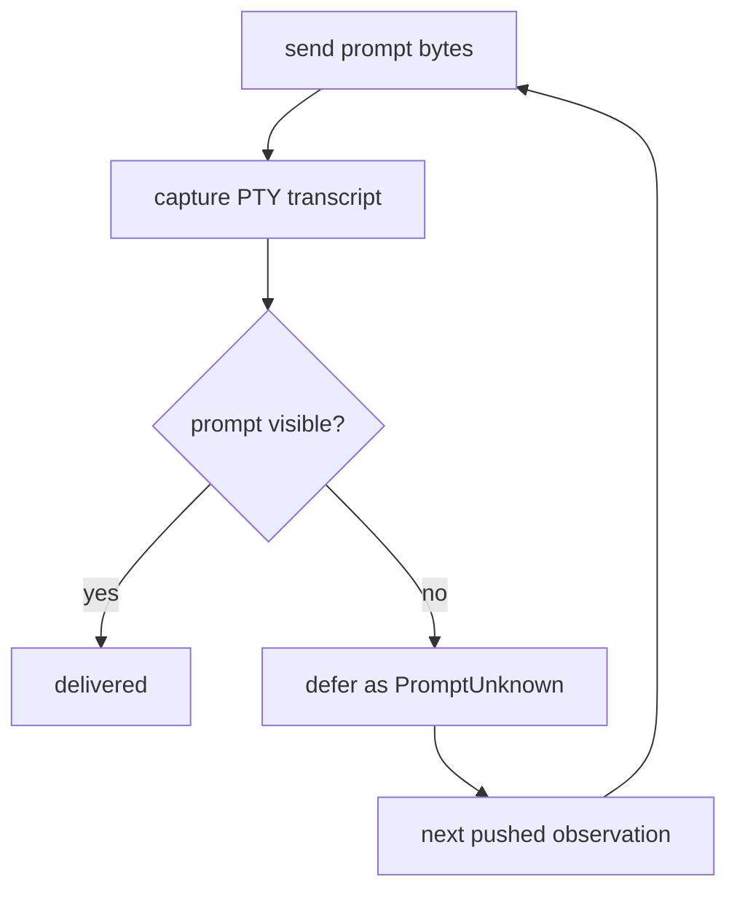

The relay script emits explicit prompt observations after each expected
handoff. They stand in for the future harness/system event stream and let the
router retry only when a producer has pushed a new fact.

## Operator-Origin Message

The original relay instruction is sent by the operator side through the
`message` CLI, not by a direct router record:

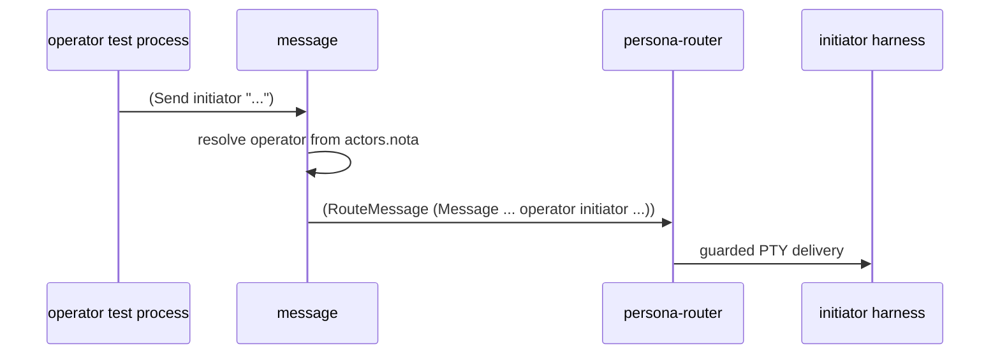

Direct router calls in the script are limited to actor registration and pushed
system facts such as `PromptObservation` and `FocusObservation`.

## Guard State Fix

The router now treats prompt state as a consumable fact:

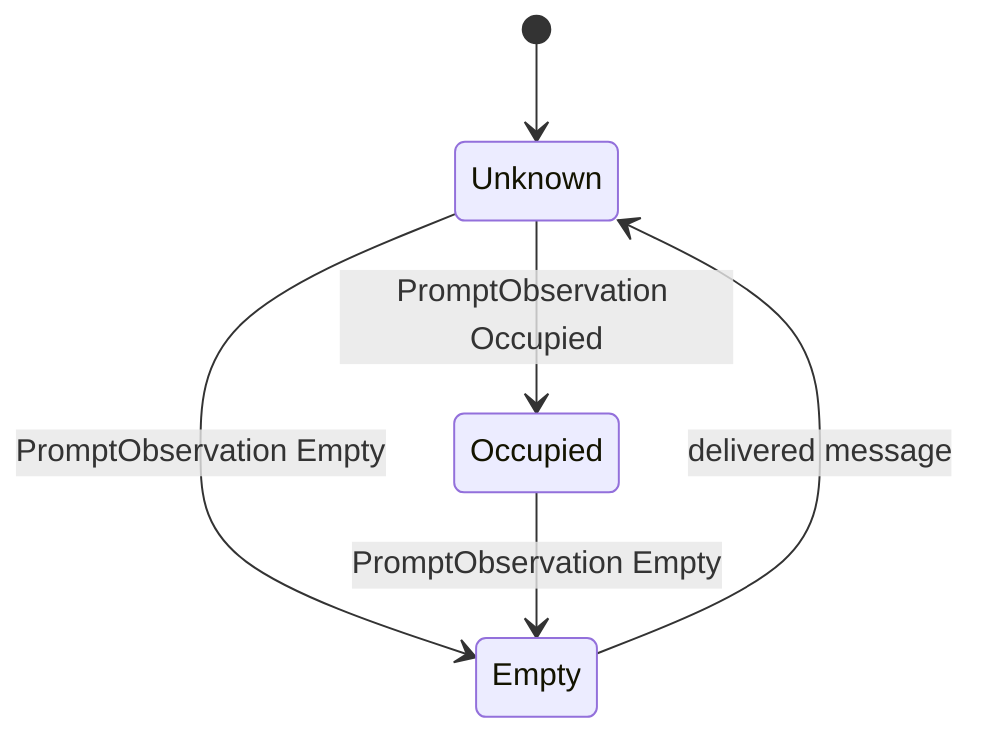

This avoids reusing stale "empty prompt" knowledge. A second message to the
same harness waits until the system pushes a fresh prompt observation.

## Transport Fix Found During Test

The PTY daemon had a protocol bug: raw input clients that did not send the
viewer handshake were classified as scrollback-replay clients. The daemon could
try to replay scrollback into an input-only socket and skip the input frame if
that replay failed.

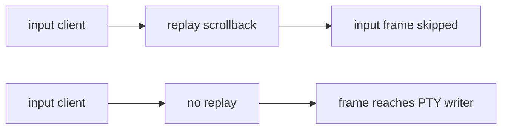

The fix is in `persona-wezterm`: a client whose first byte is already an input
frame tag is marked `replay = false`.

## Passing Result

The Nix-scripted visible relay test now passes:

```text
nix run .#test-pty-pi-router-relay
pi_router_relay_test=passed
```

The passed path used two visible Pi harnesses with `prometheus/qwen3.6-27b`
and medium thinking:

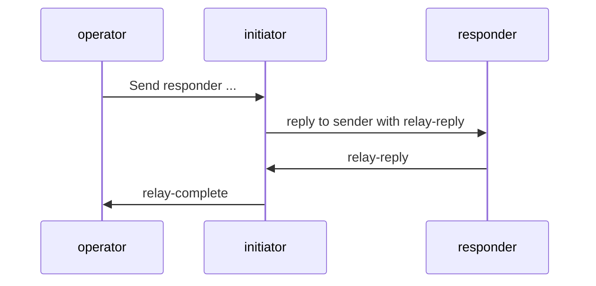

The same script then verifies both guards:

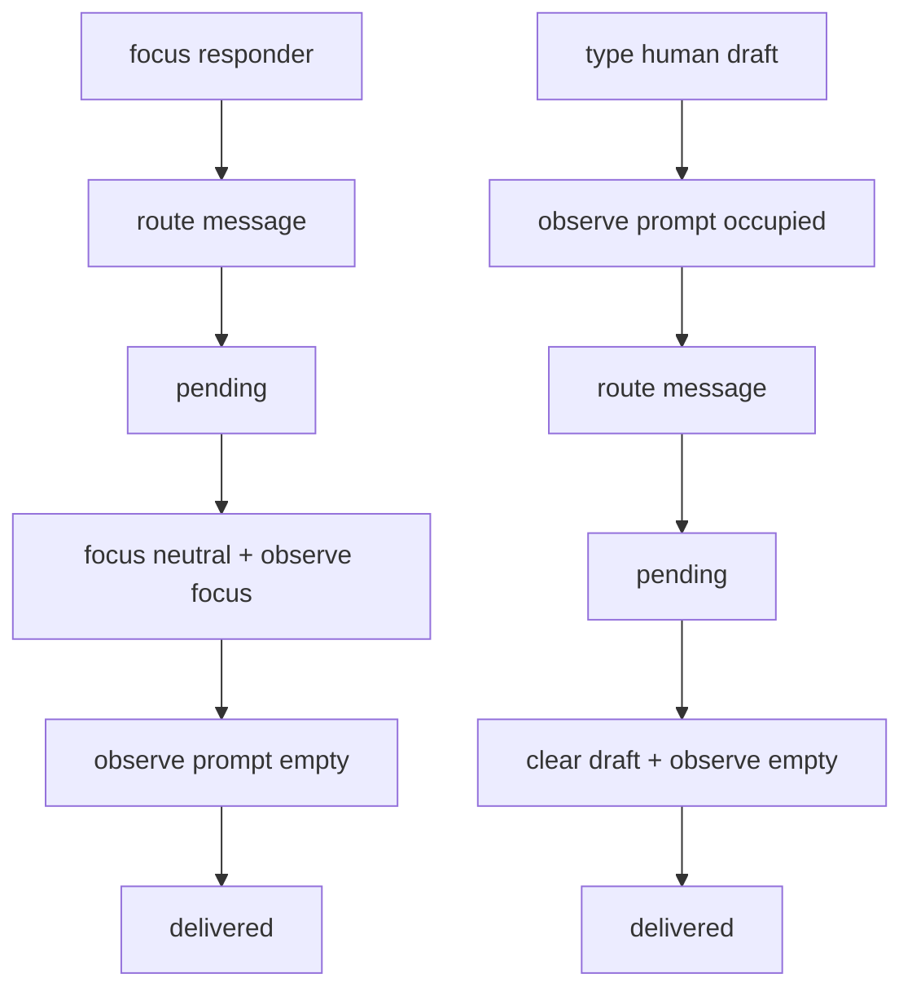
