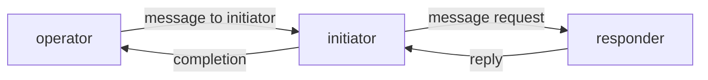
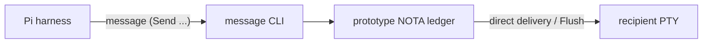
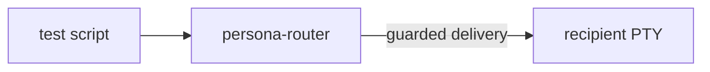
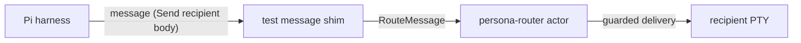
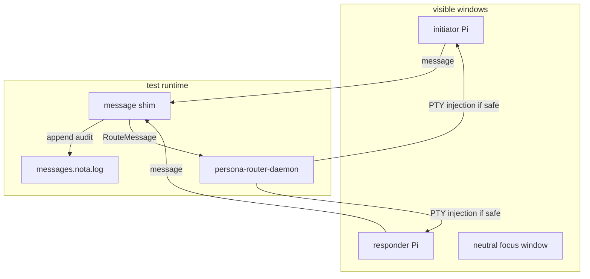
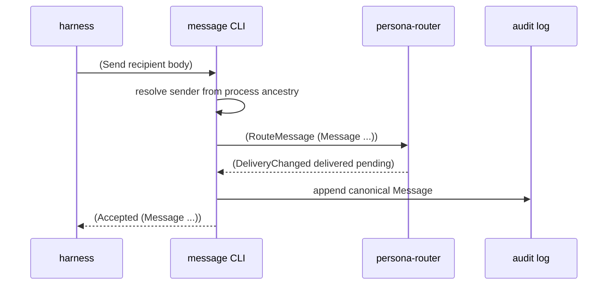

# Router Trained Relay Test Implementation

## Goal

Build a visible, repeatable test where trained Pi harnesses use the `message`
command themselves:

The important distinction from the earlier router delivery test is that only
the first instruction is injected by the test. After that, the harnesses must
use the `message` command according to their skill.

## Current Gap

The existing relay script proves agent-to-agent behavior through the old
`message-daemon` store path:

The existing router test proves guarded delivery, but the test script sends
`RouteMessage` records directly:

The next shape combines both:

## Implementation Plan

1. Add a router-backed visible Pi relay script in `persona-message`.
2. Generate a temporary `message` shim in the test root so trained agents use
   the same command shape as the real CLI: `message '(Send recipient body)'`.
3. The shim resolves sender identity from `PERSONA_ACTOR`, mints the short
   infrastructure message id, writes an audit log, and submits
   `(RouteMessage (Message ...))` to `persona-router`.
4. Register `operator`, `initiator`, and `responder` in the router. Operator is
   a human endpoint so messages back to operator are recorded in the audit log
   without terminal injection.
5. Train initiator and responder through `skills/persona-message-harness.md`.
6. Prove the relay:
   - responder reports ready to operator;
   - initiator reports ready to operator;
   - operator sends one instruction to initiator;
   - initiator messages responder;
   - responder replies to initiator;
   - initiator reports completion to operator.
7. Prove guards in the same script:
   - focus responder, route a message, assert it remains pending;
   - unfocus via neutral window, push `FocusObservation`, assert delivery;
   - type a draft into responder, route a message, assert it remains pending;
   - clear draft, push `PromptObservation Empty`, assert delivery.

## Test Harness Shape

## State While Working

- Report created before implementation.
- Added router-aware `message` execution: when `PERSONA_ROUTER_SOCKET` is set,
  `Send` resolves the sender, builds the canonical `Message`, submits
  `(RouteMessage <Message>)` to the router socket, then appends the message to
  the local audit log.
- Added `persona-message/scripts/test-pty-pi-router-relay`.
- Added `persona-message/scripts/teardown-pty-pi-router-relay`.
- Added Nix app names for the relay setup/teardown.

## First Implementation Cut

The CLI path is now:

The relay script keeps the earlier guard tests but moves the route origin to
`message`, not hand-written router records.
