# Signal Actor Messaging Gap Audit

*Operator audit of the gap between the current Persona messaging
prototype and Li's stated communication intent.*

---

## 0. Scope

This report audits the current messaging work against the intent
restated on 2026-05-09:

- Every component-to-component message is typed.
- Components communicate through Signal: length-prefixed rkyv frames with
  portable rkyv encoding.
- Each communication channel has a contract repository that owns the
  Signal types crossing that channel.
- Components use the Actor model for asynchronous communication.
- Behavior lives on data-bearing types.
- Zero-sized types are allowed only for actor behavior markers.
- Configuration, scenario data, prompt text, and test messages live in
  configuration records or messages, not embedded in implementation code.

The audit focuses on current work in:

- `repos/signal-core`
- `repos/signal-persona`
- `repos/persona-message`
- `repos/persona-router`
- `repos/persona-system`
- `repos/persona-wezterm`
- `repos/persona-harness`
- `repos/persona-sema`

It builds on the earlier code audit in chat, but reframes every issue
against the stronger Signal + actor contract.

This revision also integrates the Sema design and audit sequence:

- `reports/designer/63-sema-as-workspace-database-library.md`:
  Sema is the workspace database kernel, mirroring the Signal-family
  kernel/layer split.
- `reports/designer/64-sema-architecture.md`: the live storage
  architecture is `sema` kernel plus per-consumer typed layers such as
  `persona-sema`.
- `reports/designer/66-skeptical-audit-of-sema-work.md`: the
  load-bearing corrections are version-only schemas, typed table
  constants, hard failure on legacy/mismatched files, and no
  hand-maintained table lists.

---

## 1. Destination Shape

Persona's runtime should have three visible planes, each with a narrow
format:

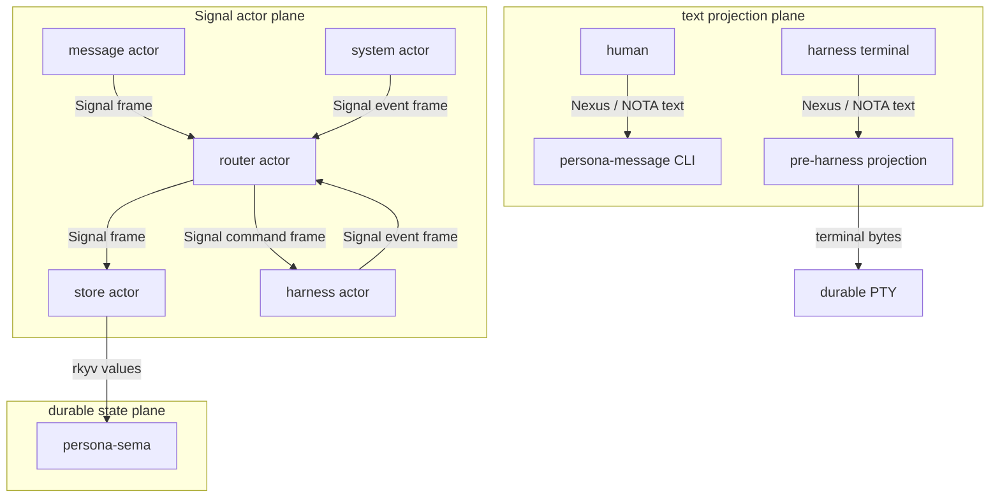

The only text boundary is human/agent-facing. The rest of the system
speaks typed Signal records.

The current prototype instead looks closer to this:

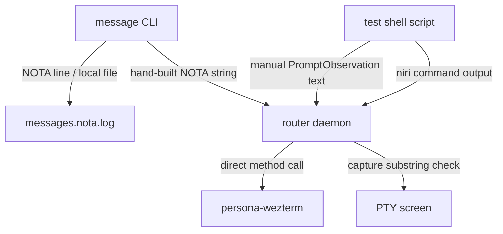

The prototype proved the user-visible behavior, but it has the wrong
logic-plane shape for the durable system.

---

## 2. Load-bearing Gaps

| Gap | Current shape | Intended shape | Consequence |
|---|---|---|---|
| Router protocol | `persona-message` formats `(RouteMessage ...)` by string | shared Signal request/reply type | no typed request or reply validation |
| Durable message source | local NOTA log plus in-memory router queue | store actor commits typed records through `persona-sema` tables | delivered messages can be missing from durable state |
| Delivery side effect | router injects terminal input directly | router asks harness actor through typed channel | routing policy and terminal mechanics are coupled |
| Guard facts | shell script manually pushes prompt/focus text | system/harness actors publish typed pushed events | tests prove choreography, not runtime machinery |
| Wire format | mixed NOTA, ad hoc rkyv, raw socket tags | Signal everywhere between components | incompatible protocols multiply |
| State format | files and private in-memory queues | Sema-family: `sema` kernel plus `persona-sema` typed layer | no transactional source of truth |
| Actor model | mostly synchronous loops and direct calls | one actor per stateful component | blocked delivery can stall unrelated traffic |
| Configuration | hard-coded actor names, prompts, timings, UI detectors | typed configuration records and scenario messages | tests train code paths instead of exercising configured behavior |
| Rust discipline | local helper functions, string dispatch, ZST commands | data-bearing types and actor-only ZSTs | model remains under-typed |

---

## 3. Signal Contract Gap

`signal-core` and `signal-persona` already contain the start of the
right architecture:

- `signal-core` owns `Frame`, `FrameBody`, `Request`, `Reply`,
  `SemaVerb`, `ProtocolVersion`, `AuthProof`, `Slot<T>`,
  `Revision`, `Bind`, `Wildcard`, and `PatternField<T>`.
- `signal-persona` owns Persona domain records: `Message`,
  `Delivery`, `Binding`, `Harness`, `Observation`, `Lock`,
  `StreamFrame`, `Transition`, and typed query records.

The live implementation mostly bypasses those crates:

- `persona-router` depends on `persona-message`, `persona-system`,
  and `persona-wezterm`; it does not depend on `signal-persona`.
- `persona-message` defines its own `Message`, `Actor`,
  `EndpointTransport`, `RouterInput`, daemon envelope, and local
  command protocol instead of submitting Signal frames.
- `persona-system` defines local `FocusObservation` records and
  renders them with hand-written NOTA strings.
- `persona-wezterm` defines an internal byte-tag protocol for PTY
  clients; that may be acceptable inside the terminal adapter, but
  it is not yet wrapped behind a typed Signal command/event channel
  when called by Persona components.

### Current Contract Duplication

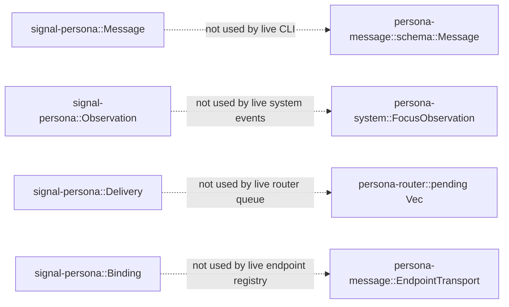

The duplication is not just cosmetic. The duplicate types disagree:

- `signal-persona::Message` contains `recipient` and `body`.
  Infrastructure mints identity and sender.
- `persona-message::schema::Message` contains `id`, `thread`,
  `from`, `to`, `body`, and attachments.

That means the prototype still lets the sending surface own values
that the intended system says infrastructure must own.

### Channel-repo Consequence

The likely repo split is:

| Channel | Contract owner | Runtime owner |
|---|---|---|
| shared Persona domain records | `signal-persona` | none; contract only |
| CLI/text ingress to router | `signal-persona-message` or a module in `signal-persona` | `persona-message` + `persona-router` |
| router to store | `signal-persona-store` or a module in `signal-persona` | `persona-router` + `persona-sema` |
| system events to router | `signal-persona-system` or a module in `signal-persona` | `persona-system` + `persona-router` |
| router to harness actor | `signal-persona-harness` or a module in `signal-persona` | `persona-router` + `persona-harness` |
| harness actor to terminal adapter | `signal-persona-terminal` or `signal-persona-wezterm` | `persona-harness` + `persona-wezterm` |

Decision needed: whether "one repository per channel" means a physical
repo per row above, or whether `signal-persona` can hold submodules for
closely related channels until a channel grows enough to split. The
important invariant is single ownership of each wire type. The current
state violates that invariant either way.

---

## 4. Actor-model Gap

The current code has some actor-shaped naming, but the live messaging
path is not an actor system.

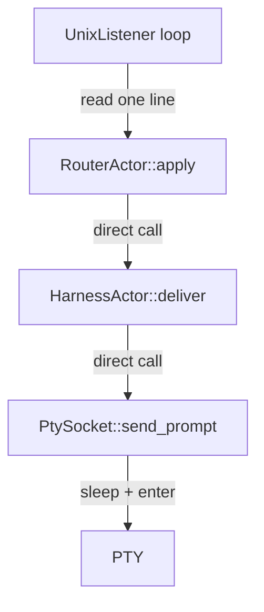

The intended shape is:

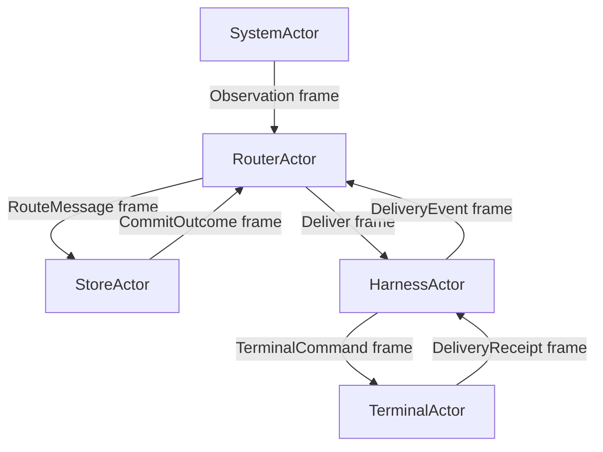

Current gaps:

1. `persona-router` has `RouterActor` and `HarnessActor` as ordinary
   structs, not ractor actors. They do not own async mailboxes,
   supervision, or concurrent delivery state.
2. `RouterDaemon::run` handles connections sequentially. A slow terminal
   capture or injected sleep blocks all other router traffic.
3. The harness endpoint is an in-memory field inside the router, but the
   delivery action is still a direct method call into terminal transport.
4. `persona-wezterm` has a `TerminalDeliveryActor`, but router delivery
   does not use it in the PTY path. The PTY daemon path is thread-based
   and frame-based, not actor-supervised.
5. The system focus source is a synchronous object that can subscribe to
   Niri events, but there is no long-lived system actor publishing typed
   Signal observation frames to the router.

The durable design needs actors at the components whose state persists
across time:

- `MessageIngressActor`
- `RouterActor`
- `StoreActor`
- `SystemObservationActor`
- `HarnessActor`
- `TerminalAdapterActor`
- `TranscriptActor`

Each actor's message enum belongs in the matching Signal contract repo.
Each actor's runtime state belongs in the component repo.

---

## 5. Wire-format Gap

`signal-core` uses the right rkyv discipline:

- rkyv 0.8
- `default-features = false`
- `std`, `bytecheck`, `little_endian`, `pointer_width_32`,
  `unaligned`
- 4-byte big-endian length prefix
- bytechecked decode

Several live paths deviate.

### `persona-message`

`persona-message` depends on `rkyv = "0.8"` without the canonical
portable feature set. Its daemon uses an ad hoc `DaemonEnvelope` and
`DaemonFrame`, not `signal_core::Frame`.

`DaemonFrame` also uses a little-endian length prefix:

- read: `u32::from_le_bytes`
- write: `to_le_bytes`

That conflicts with `signal-core`'s big-endian frame prefix and makes
the daemon protocol a different wire.

### `persona-router`

`persona-router` currently reads one NOTA line from a Unix socket and
decodes local `RouterInput` records. This is useful for manual testing,
but it is not Signal.

### `persona-wezterm`

`persona-wezterm` PTY control uses byte tags:

- `H` for handshake
- `I` for input
- `R` for resize

That may remain an internal terminal-adapter protocol, but Persona
components should not call it as their communication channel. The
router should speak Signal to a harness or terminal actor; the terminal
actor can translate to the PTY daemon's private byte protocol.

---

## 6. Sema State-plane Gap

The designer reports establish the storage mirror of Signal:

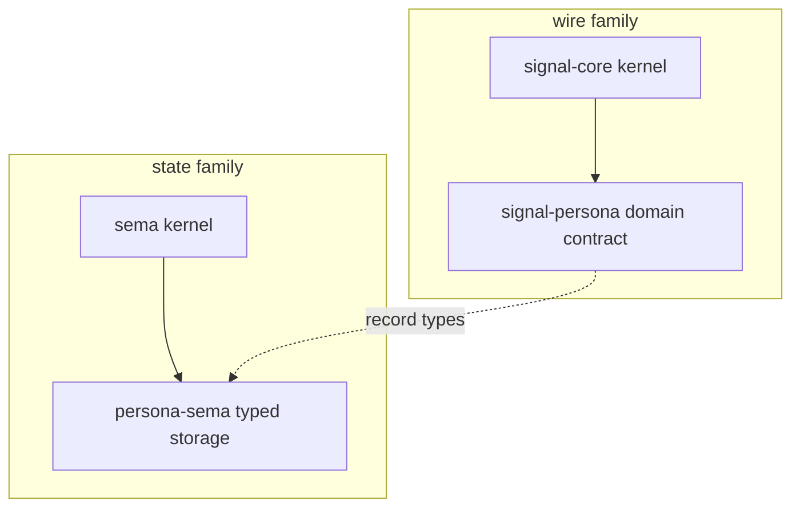

That means `persona-sema` is not a generic "store service" and not a
router-owned queue. It is Persona's typed table layer over the Sema
kernel. Its values are the record types from `signal-persona`.

The current messaging prototype has not crossed into that shape:

- message state is still a text ledger in `persona-message`;
- router pending state is an in-memory `Vec`;
- durable writes are not typed Sema transactions;
- delivery attempts are not stored as typed `Delivery` or
  `Transition` records;
- the working test inspects `messages.nota.log` rather than querying
  typed tables.

### 6.1 What Sema Adds To The Messaging Design

The Sema reports add these constraints to the messaging plan:

| Constraint | Consequence for messaging |
|---|---|
| `sema` is the database kernel | no component writes its own durable ad hoc database |
| `persona-sema` is the Persona typed layer | message, delivery, harness, binding, observation, and transition tables live there |
| values come from `signal-persona` | storage records and wire records share one Rust type source |
| `Schema` declares version only | table names live beside typed `Table<K, V>` constants, not in a string list |
| schema guard hard-fails | legacy files and mismatched schema versions do not silently become Persona state |
| transactions are closure-scoped | commit message + delivery records atomically, not append then route |

This changes the earlier audit's "store actor" statement. The store
actor is the runtime owner of commits; `persona-sema` is the typed
storage layer it uses; `sema` is the kernel.

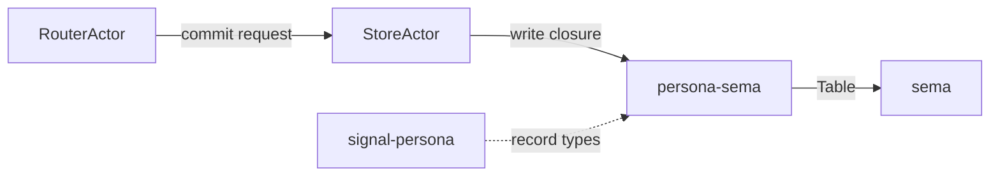

### 6.2 `persona-sema` Must Export The Real Tables

`reports/designer/66-skeptical-audit-of-sema-work.md` flags that a
mere open wrapper is not a typed storage layer. The missing piece is
typed table ownership in `persona-sema`.

The table surface should look conceptually like:

```text
MESSAGES: Table<MessageSlot, signal_persona::Message>
DELIVERIES: Table<DeliverySlot, signal_persona::Delivery>
BINDINGS: Table<BindingSlot, signal_persona::Binding>
HARNESSES: Table<HarnessSlot, signal_persona::Harness>
OBSERVATIONS: Table<ObservationSlot, signal_persona::Observation>
TRANSITIONS: Table<TransitionSlot, signal_persona::Transition>
```

The exact keys are a design decision, but the ownership is not:
`persona-sema` owns the typed table constants and open conventions.
Consumers do not redeclare those tables locally.

### 6.3 The Schema Correction Matters Here

The Sema audit corrected an important false start: a
`Schema { tables: &[&str], version }` shape does not compose with
redb. Redb tables are typed by `(name, key_type, value_type)`.

For messaging, this means:

- do not add a hard-coded list of message table names to a schema;
- do not pre-create tables with placeholder key/value types;
- do not hand-maintain a table-name list that mirrors
  `signal-persona::Record`;
- define typed `Table<K, V>` constants and let redb create each table
  on first use with its real key/value types.

Any examples in older reports that still show `tables: &[...]` should be
read through the correction in
`reports/designer/66-skeptical-audit-of-sema-work.md` and the version-only schema wording in
`reports/designer/64-sema-architecture.md`.

### 6.4 Store Transition Shape

The message path should become a typed transaction, not a text append:

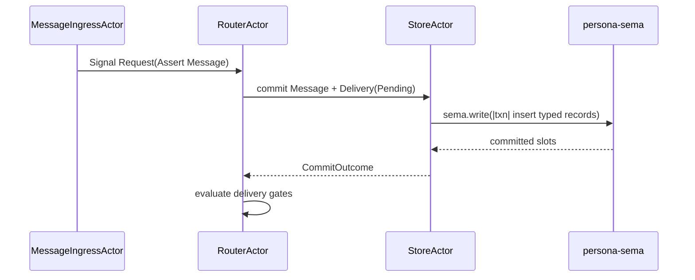

The store commit returns slots or typed commit outcomes. The agent or CLI
does not mint durable IDs, sender identity, commit time, or delivery
state.

---

## 7. Correctness Gaps

### 7.1 Delivery can duplicate after side effect

`persona-router` injects the prompt, then sleeps, captures output, and
returns `false` if capture evidence is missing. `retry_pending` keeps
that message pending and can later inject it again.

The type system should model delivery as a state transition:

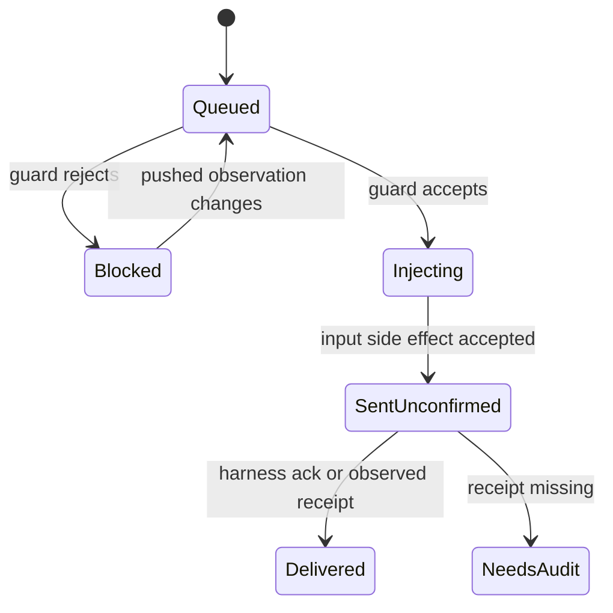

Capture failure after input side effect is not "not delivered." It is
`SentUnconfirmed` or `NeedsAudit`.

### 7.2 Router accepts stale facts

The router stores `focus: Option<bool>` and `prompt: PromptFact`.
Prompt facts have no source, generation, observed-at value, or target
revision. Focus has a generation in the system record, but the router
does not enforce a freshness relation between guard check and injection.

The intended guard should be a typed fact record committed by the
system/harness actor, then consumed atomically by delivery logic:

```text
Observation { target, kind, generation, observed_by, value }
DeliveryAttempt { delivery, guard_generation, effect_state }
```

### 7.3 Human messages are not durable router state

The router treats `human` endpoints as delivered and returns `true`.
That is acceptable only if another layer has already persisted the
message and the human inbox projection. In the current code, router
state is in-memory and the CLI append order can lose audit state after
route success.

### 7.4 Unknown actors remain pending without a typed reason

Messages to unknown actors stay in `pending`, but the pending item does
not carry `Blocked(BindingLost)` or equivalent Signal state. The router
cannot distinguish "wait for later registration" from "bad recipient"
or "lost binding."

### 7.5 PTY write failure can be invisible

The PTY daemon ignores write and resize errors in the input thread.
That lets upper layers believe a write completed when the terminal
transport failed. The terminal actor must return a typed receipt or
typed failure.

---

### 7.6 Store safety depends on Sema guard correctness

Messaging correctness depends on `persona-sema` rejecting wrong files.
If a legacy Sema file or another consumer's redb file can be opened as
Persona state, the router can commit valid Signal records into the wrong
database. The Sema audit names the required behavior:

- fresh file: write schema version;
- matching file: open;
- mismatched version: hard fail;
- existing file without schema version: hard fail as legacy or unknown.

This is not storage hygiene. It is part of message safety.

---

## 8. Logic-plane Separation Gaps

The intended ownership boundary is:

| Plane | Owner | What crosses |
|---|---|---|
| domain vocabulary | `signal-persona` | rkyv record types |
| CLI text projection | `persona-message` | Nexus/NOTA text at human/harness boundary |
| routing policy | `persona-router` | typed route/delivery decisions |
| durable commit actor | store actor | typed commit requests/replies |
| typed storage layer | `persona-sema` | table layouts over `signal-persona` records |
| database kernel | `sema` | redb/rkyv table mechanics and schema guard |
| OS/window facts | `persona-system` | typed pushed observation frames |
| harness lifecycle | `persona-harness` | typed harness events and commands |
| terminal bytes | `persona-wezterm` | raw PTY/WezTerm mechanics only |

Current violations:

1. `persona-message` owns message schema, local store, sender
   resolution, router client, daemon protocol, delivery gate, and
   terminal delivery. That is multiple planes in one repo.
2. `persona-router` imports `persona-wezterm` and directly injects
   terminal prompts. Routing policy and terminal mechanics are coupled.
3. `persona-system` renders facts as NOTA strings and is called from a
   shell test. It should publish typed system facts through a Signal
   subscription.
4. `persona-wezterm` exports semantic `TerminalPrompt` and
   `DeliveryReceipt` types. That is tolerable as adapter vocabulary, but
   Persona message semantics should live above it.
5. `persona-message` and `persona-router` both carry delivery behavior.
   There should be one delivery policy owner.
6. The current prototype has no store actor and no `persona-sema`
   transaction boundary. Durable state is therefore not separated from
   CLI/testing mechanics.

The corrective rule: every cross-component call should be replaced by a
typed actor message over a Signal channel. Direct Rust calls remain only
inside one component's internal implementation.

---

## 9. Data Embedded In Code

The current prototype has too much scenario data and policy data in code
or shell scripts.

### Test scenario data

`scripts/test-pty-pi-router-relay` embeds:

- actor names: `initiator`, `responder`, `operator`
- model default: `prometheus/qwen3.6-27b`
- thinking default: `medium`
- skill file path
- readiness bodies: `responder-ready`, `initiator-ready`
- request/reply bodies: `relay-reply`, `relay-complete`
- guard bodies: `relay-focus-guard`, `relay-prompt-guard`
- UI readiness detector: model label plus `0.0%/131k`
- terminal dimensions: 32 rows, 120 columns
- wait loop counts and sleep intervals
- Niri app-id strings

Those should become a typed scenario/configuration record:

```text
HarnessRelayScenario {
  participants,
  model_profile,
  skill_projection,
  messages,
  guard_cases,
  observation_sources,
  terminal_geometry
}
```

The script should load the scenario and drive actors. The data should not
be the script.

### Runtime policy data

Embedded runtime policy includes:

- router evidence length: first 24 characters of a message
- router delivery wait: 1000 ms
- PTY send waits: 3000 ms before enter, 1000 ms after enter
- WezTerm pane delivery wait: 500 ms
- PTY capture read timeout: 80 ms
- PTY capture deadline: 800 ms
- resize polling interval: 250 ms
- scrollback limit: 8 MiB
- default socket paths under `/tmp`
- default PTY size 32 x 120
- string endpoint kinds: `human`, `pty-socket`, `wezterm-pane`
- hand-maintained storage table-name lists that mirror
  `signal-persona` record variants

Some of these are adapter defaults, but they still need to be named data
on configuration types. Timing heuristics should not be hidden inside
delivery methods.

For storage, the fix is stricter than "move the list to config": table
identity belongs to typed `Table<K, V>` constants in `persona-sema`.
Those constants should be generated from, or otherwise kept mechanically
coupled to, the `signal-persona` record taxonomy rather than maintained
as a free string list.

### Prompt and training text

Agent instructions are currently injected as literal text in the shell
test. The desired shape is:

- skill/training text is a configured projection artifact;
- the message body carries the task;
- the harness actor receives typed delivery work;
- the terminal adapter only renders the projection.

---

## 10. Rust-style Gaps

### 10.1 ZST rule conflict

The new "ZST only for actors" rule conflicts with several current
types:

- `signal_core::Bind`
- `signal_core::Wildcard`
- `persona-message::Tail`
- `persona-message::Agents`
- `persona-message::Flush`
- `persona-router::Status`

This needs a design decision. `Bind` and `Wildcard` were deliberately
made typed marker records after the Nexus grammar rewrite. If the new
rule is absolute, they need a different representation. If typed marker
records are still allowed, the rule should say "actor behavior markers
and schema marker records" rather than "only actors."

### 10.2 Free helper functions remain

Examples:

- `persona-message::schema::expect_end`
- `persona-message::resolver::parent_process`

They are small, but they still indicate missing owner types:

- `NotaInput` or `InputDecoder` should own end-of-input validation.
- `ProcessAncestry` should own parent lookup through a `ProcessTable`
  or `ProcessSource` object.

### 10.3 Stringly dispatch remains

Examples:

- endpoint kind dispatch in `persona-router`
- endpoint kind dispatch in `persona-message`
- `PromptFact` encoded as strings
- `RouterInput` decoded by record-head string
- system observations rendered manually into NOTA text

Closed enums in Signal contracts should replace string branches at
component boundaries.

### 10.4 Rkyv portable feature set is not universal

`signal-core`, `signal-persona`, and `persona-sema` use the canonical
rkyv feature set. `persona-message` uses plain `rkyv = "0.8"` for its
daemon envelope. That creates a second archive dialect.

Sema adds the same requirement on disk: values stored by
`persona-sema` must be rkyv archives of the same `signal-persona`
types, with bytecheck-compatible bounds. A local daemon envelope with a
different feature set is not a compatible state or wire contract.

### 10.5 Data-bearing actor split is incomplete

The actor ZST pattern should look like:

```text
RouterActor       ZST behavior marker
RouterState       data owned across time
RouterArguments   boot configuration
RouterMessage     typed mailbox protocol
```

The current `RouterActor` is a data-bearing struct, not an actor
behavior marker. The current `HarnessActor` is also a data-bearing
struct nested inside the router, not a separately supervised actor.

---

## 11. Repository Gap

The repo set is close, but the dependency direction is still wrong.

### Current problematic dependencies

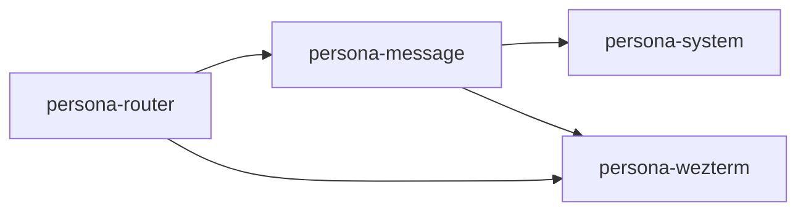

These dependencies make text/terminal components visible inside routing
and message construction.

### Intended dependency direction

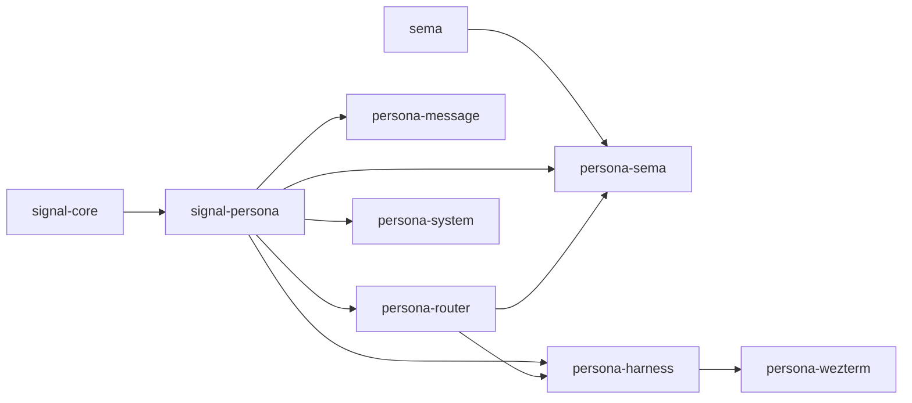

The router may depend on harness abstractions, not terminal bytes. The
message CLI may depend on Signal contracts, not delivery mechanics.
`persona-sema` depends on `sema` and `signal-persona`; runtime actors
depend on `persona-sema` for storage, not on raw redb plumbing.

If channel-specific repos are introduced, they sit between
`signal-persona` and the paired runtime components:

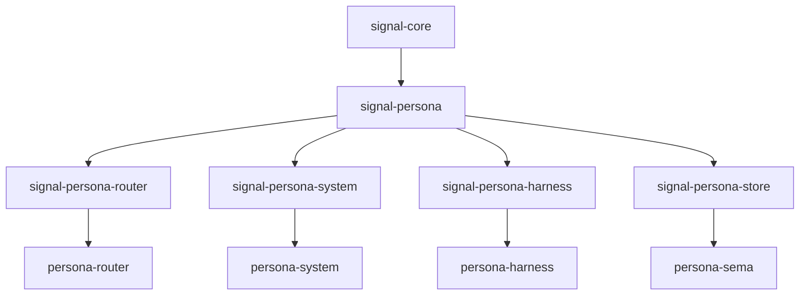

---

## 12. Migration Consequence

The current prototype should be treated as a test harness that proved:

1. visible Pi harness windows can be spawned;
2. harnesses can learn a message CLI skill;
3. the first agent can message a second agent;
4. the second can reply;
5. the first can report completion to the operator;
6. focus/prompt guards can block injection when manually fed facts.

It should not be treated as the implementation architecture.

The next implementation pass should invert the dependency shape:

1. Define the Signal contract for message ingress, delivery state,
   observations, and harness commands.
2. Finish the `persona-sema` typed table surface using
   `signal-persona` record types.
3. Ensure `persona-sema` opens only through the Sema schema-version
   guard and never through ad hoc file logic.
4. Make `message` submit a typed Signal frame to a router actor.
5. Make the router actor commit message/delivery records through the
   store actor and `persona-sema` before delivery effects.
6. Make system and harness actors push observation frames into the
   router.
7. Make router delivery create typed `DeliveryAttempt` records.
8. Make harness actors translate delivery attempts into terminal adapter
   commands.
9. Keep terminal adapter byte protocols internal to `persona-wezterm`.
10. Rebuild the live Pi relay test as a configuration-driven actor test,
   with its scenario data in typed records.

---

## 13. Decisions To Bring Forward

1. **ZST rule.** Confirm whether `Bind` and `Wildcard` must stop being
   zero-sized marker records, or whether schema marker records are a
   named exception beside actor behavior markers.
2. **Channel repo granularity.** Confirm whether each channel gets a
   physical `signal-persona-*` repo immediately, or whether
   `signal-persona` can own channel modules until the second concrete
   consumer forces a split.
3. **Store actor naming and repo.** Confirm whether the store actor
   lives in `persona-sema` or a separate runtime repo that depends on
   `persona-sema`. The storage layer itself remains `persona-sema`.
4. **Table derivation.** Decide how `persona-sema` table constants stay
   coupled to `signal-persona::Record`: generated tables, macro output,
   or a deliberately hand-written surface with tests that fail on drift.
5. **Table keys.** Decide the key shape for Persona tables: typed
   slots, per-record slot newtypes, or domain-specific keys.
6. **Text language at harness boundary.** Confirm whether harness-visible
   prompts are rendered as Nexus text, NOTA records, or a named Persona
   projection language while models are still text-trained.
7. **Store ownership.** Confirm that the assembled runtime has one store
   actor and that neither router nor CLI owns a private durable queue.
8. **Terminal adapter protocol.** Confirm whether `persona-wezterm`'s
   private PTY byte protocol can stay internal, with Signal only at the
   harness actor boundary.

---

## 14. Bottom Line

The current prototype is useful evidence, not the architecture. It proved
that real harnesses can exchange messages under scripted guard conditions.
It did not yet implement the core Persona rule:

> every component boundary is a typed Signal channel between actors.

The largest gap is not one bug. It is a layering inversion: the current
message path lets text, files, terminal bytes, and routing state touch
each other directly. The intended system inserts typed Signal contracts
and actors between every one of those concerns.

The Sema reports add the corresponding state correction: typed Signal
records need a typed Sema home. `persona-sema` must become the table
layout over `signal-persona` records, guarded by Sema's schema-version
contract. Until that exists, router "durability" is only a prototype
log, not Persona state.

The next code pass should therefore start with contracts and actor
mailboxes, not by patching more behavior into the current line-oriented
router.
