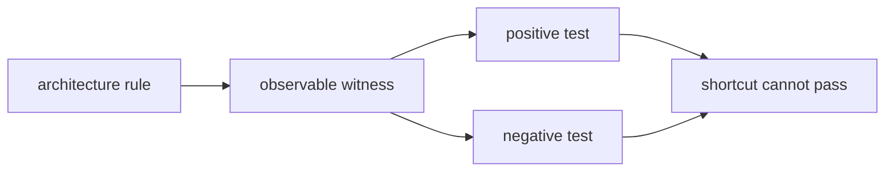

# Architectural Truth Tests

*Terse operator note on skill wording for tests that prevent
agent-written code from satisfying behavior while violating architecture.*

---

## Skill Wording

Add a skill section shaped like this:

> Write tests that prove the architecture, not only the behavior.
> If a rule says "component A uses component B to do C", the tests must
> make bypassing B fail even when C's visible output still succeeds.

> Treat architecture as a contract with observable witnesses:
> dependency graph, type identity, actor messages, storage table identity,
> wire format, state transitions, and negative compile/runtime cases.

> Prefer weird tests over trusting implementation prose. Agents can write
> code that looks aligned while secretly reimplementing the component next
> door. A correct test forces the intended path to be the only passing path.

> Every architectural invariant gets at least one witness test:
> one positive test proving the intended component is used, and one negative
> test proving the tempting shortcut fails.

---

## Test Shape



---

## Examples From The Messaging Audit

| Constraint | Weird test |
|---|---|
| `persona-sema` stores Signal types | Insert and read a `signal_persona::Message` through `persona_sema::MESSAGES`; no local message type can satisfy the table value type. |
| Router commits before delivery | Use a fake store actor and fake harness actor; assert the router emits `CommitMessage` before any `DeliverToHarness`. |
| Router does not own terminal bytes | Cargo/dependency test fails if `persona-router` depends on `persona-wezterm`. |
| Signal is the component wire | Integration test sends a length-prefixed `signal_core::Frame`; NOTA strings on the component socket are rejected. |
| No private durable queue | Restart router after queued message; message survives only if committed through `persona-sema`, not if held in memory. |
| Sema schema guard is real | Existing redb file with no schema version hard-fails; fresh file writes the version; mismatched version hard-fails. |
| Guard facts are pushed | Fake system actor sends focus/prompt facts; router retries only on pushed observation, never on a timer. |
| Prompt guard blocks injection | Nonempty prompt fact produces `DeliveryBlocked(PromptOccupied)` and zero terminal input frames. |
| Focus guard blocks injection | Focused target produces `DeliveryBlocked(HumanOwnsFocus)` and zero terminal input frames. |
| Actor model is real | Router test communicates through actor handles/mailboxes; direct method calls are not exposed by the public API. |

---

## Useful Witnesses

| Witness | Catches |
|---|---|
| `cargo metadata` dependency assertions | wrong repo reached across a boundary |
| compile-fail tests | local duplicate types, string shortcuts, missing trait contracts |
| fake actor handles | direct calls disguised as actor code |
| typed event traces | wrong ordering of store/route/deliver effects |
| redb fixture files | schema/version lies |
| rkyv byte fixtures | incompatible wire or disk encoding |
| Nix test scripts | undocumented manual command choreography |

---

## Rule Of Thumb

If the user says "X must go through Y", write a test named:

```text
x_cannot_happen_without_y
```

Then make `Y` leave a typed witness that a bypass cannot counterfeit.

