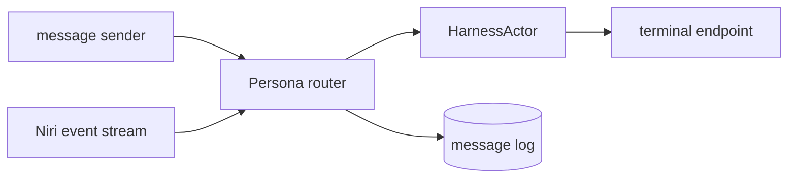
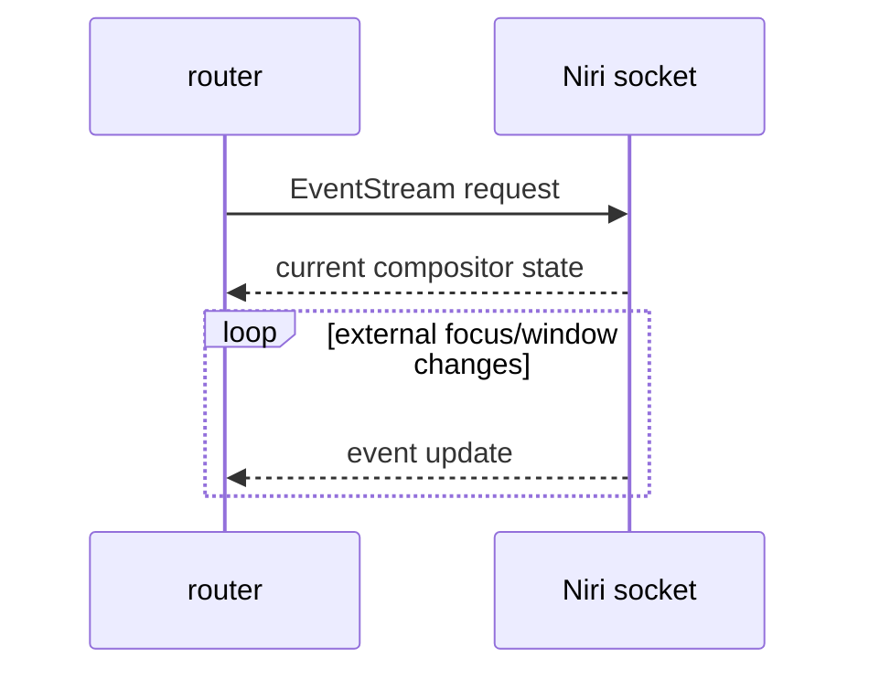
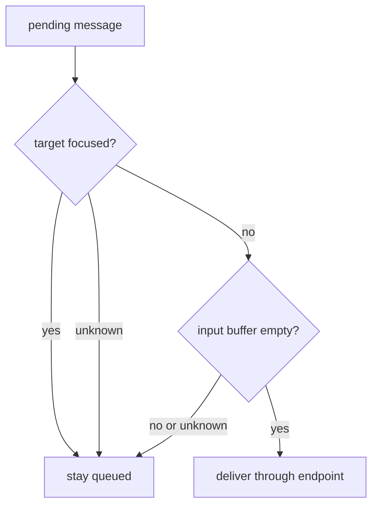
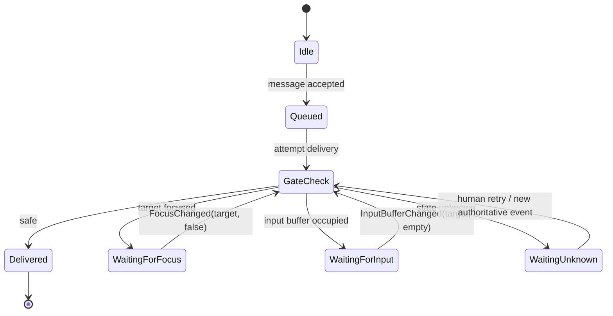
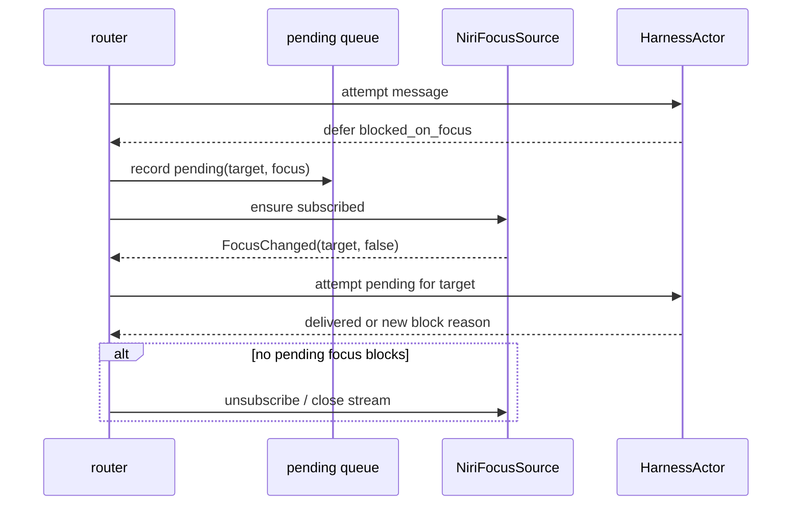
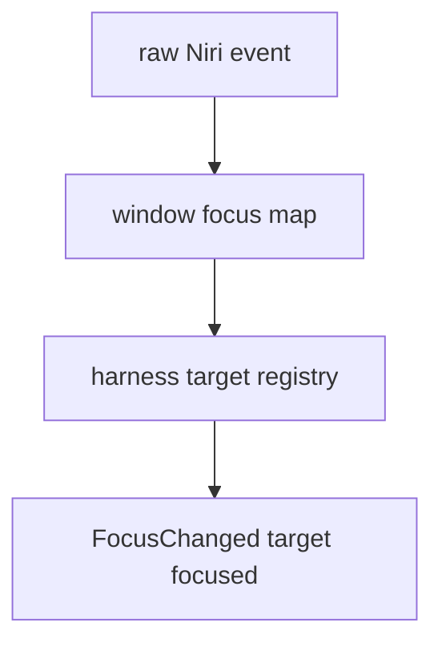
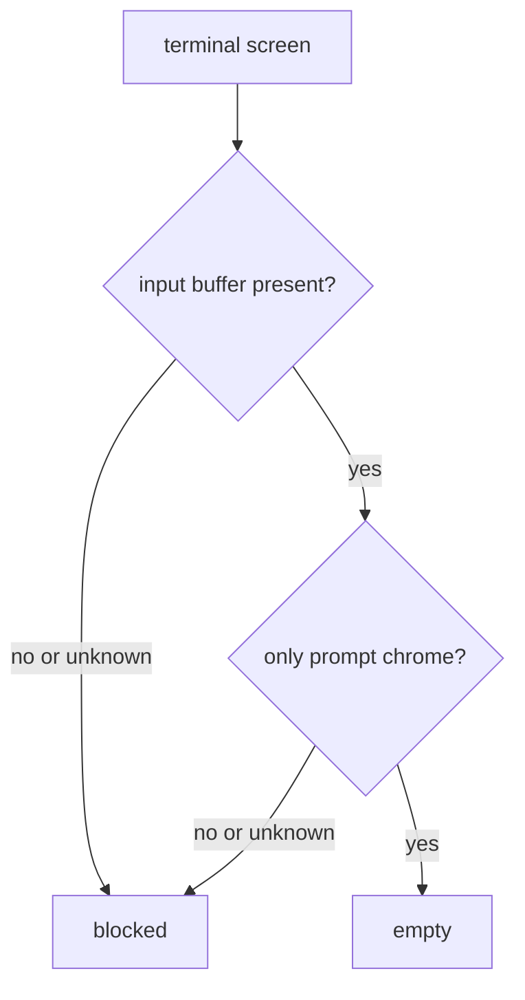
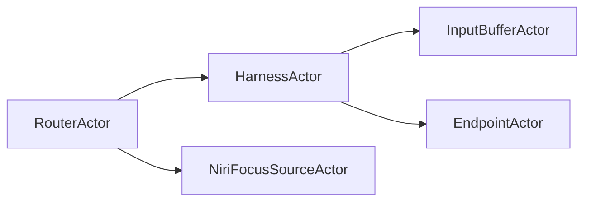
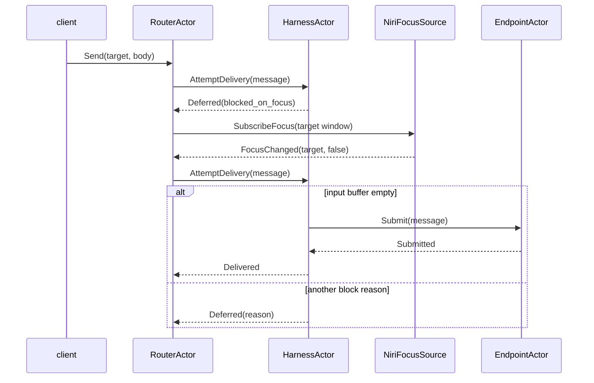
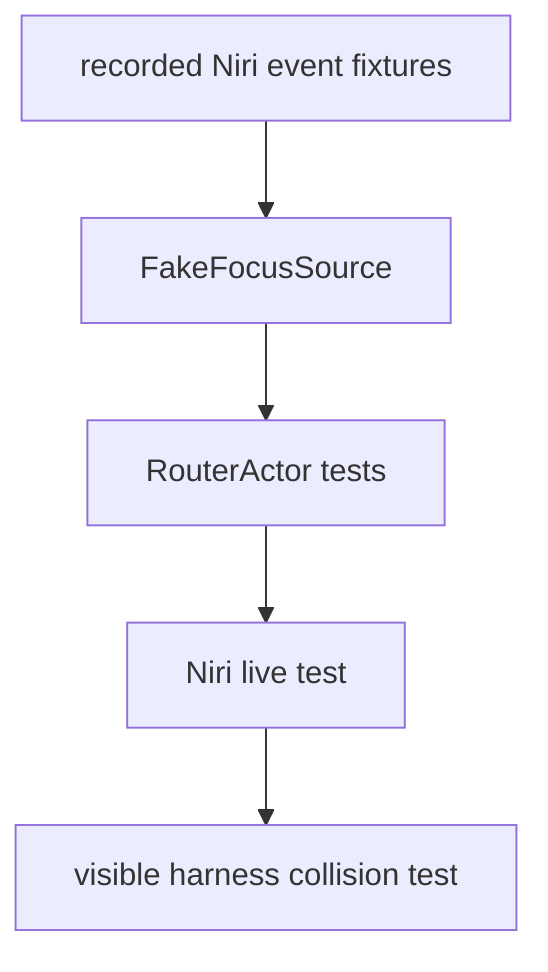

# Minimal Niri input gate

Status: draft for audit
Author: Codex (operator)

This report narrows the input-management design to the smallest useful local
implementation: a Persona router that uses Niri's IPC event stream for focus
wakeups, a harness actor for each running harness, and a delivery gate that
queues messages until the target harness window is unfocused and the target
input buffer is empty.

The design stays inside the push-not-pull rule. The router subscribes only when
there is blocked work, and it wakes only on producer events.

This is the Niri-only first slice of the broader push-primitive surface in
`reports/designer/12-no-polling-delivery-design.md`. Other compositors land as
parallel `DesktopEventSource` implementations; the input-buffer observer is the
harness-side equivalent.

Niri is not a portability problem for the current project. Persona is being
built with its own operating-system substrate, so the first correct target is
the stack we control. Portability belongs behind a system abstraction: the
current implementation is Niri/CriomOS-flavored; other operating systems can
port the same interface with their own event and input backends.

## Minimal scope



The first version owns only:

| Piece | Responsibility |
|---|---|
| Router | ordered message queue, pending delivery state, subscriptions |
| HarnessActor | target identity, endpoint, input-buffer state, delivery method |
| NiriFocusSource | `$NIRI_SOCKET` event stream, focused window map |
| Endpoint | terminal/PTY injection only after the gate says safe |
| Message log | audit of accepted, queued, delivered, deferred |

It does not own the future desktop composer, compositor lease, native prompt
drafts, or full Persona state reducer yet.

On systems without `$NIRI_SOCKET`, this Niri gate is unavailable. There is no
fallback focus polling. Messages blocked on focus stay queued until a different
`DesktopEventSource` implementation exists, the user discharges them, or their
TTL expires.

That deferral is a porting rule, not a product flaw. Persona's default system
package can require Niri. A macOS, X11, Sway, Hyprland, or future Persona
compositor port implements the same system interface with different support
levels.

## Why Niri works for the focus half

Niri exposes an IPC socket through `$NIRI_SOCKET`. Its event stream request
returns current state up front and then streams updates. Niri documents this as
the way to update without continuous polling.



The focus source is a producer. The router is a subscriber. The router does not
ask Niri "who is focused?" on a timer.

## Delivery gate

A terminal fallback delivery is safe only when both gate inputs are green:



Every queued result records a typed block reason:

| Block reason | Producer that can wake it | First implementation |
|---|---|---|
| `blocked_on_focus` | Niri focus/window event stream | yes |
| `blocked_on_non_empty_input` | harness input-buffer observer | fixture first, live later |
| `blocked_on_unknown` | none | stays queued |

Every pending message has a TTL. Expiry is a deadline-driven OS event
(`timerfd` or equivalent), not a retry loop. On expiry, the message moves to
`Expired` in the durable log and leaves the live queue. The default TTL is a
policy decision, not settled in this report.

## Router state machine



The router stores pending messages by target. The target actor stores the last
authoritative focus and input-buffer observations. A delivery attempt consumes
that state; it does not perform a polling loop to make it fresh.

`WaitingUnknown` is resolved only by a new authoritative event, explicit human
discharge, or TTL expiry. It does not retry on a clock.

## Conditional Niri subscription

The router does not need to subscribe to Niri forever. It subscribes when a
pending delivery is blocked on focus and unsubscribes when no pending delivery
needs focus wakeups.



This is intentionally event-gated. The router can keep the stream open while
there are any focus-blocked targets. It closes the stream when focus events no
longer matter to pending work.

Subscription multiplicity is one-per-source, not one-per-message. Five messages
blocked on focus for the same target create one focus-blocked target entry. The
Niri stream opens when the first focus-blocked target appears and closes when
the focus-blocked set becomes empty.

## Niri focus map

Niri's event stream gives a current-state prelude, then updates. The focus
source converts that into a map the router can use:



The harness registry binds a Persona harness to a Niri window id:

| Persona target | Niri field |
|---|---|
| `HarnessTarget` | durable Persona identity |
| `window_id` | Niri toplevel window id |
| `app_id` / title | discovery hints only |
| endpoint | terminal/PTY delivery object |

`app_id` and title are not stable identity. They help discovery. Once a harness
is registered, the target-window binding is explicit.

Niri window IDs are stable for a window's lifetime. When the window closes, the
`HarnessActor` emits `BindingLost(target)`. Pending deliveries for that target
remain queued until the harness is explicitly rebound or until TTL expiry. A
new window with matching `app_id` or title is only a rebind candidate; automatic
matching is not identity.

## Input-buffer recognizer

"Input buffer empty" is two predicates:



Both predicates must be true:

| Predicate | Meaning |
|---|---|
| input buffer present | the harness is showing the editable input surface |
| only prompt chrome | the input surface contains no user characters |

When the harness is generating output, there is no input buffer to be empty, so
the result is blocked. The per-harness recognizer is a closed enum with
per-variant methods:

| Harness | Input-buffer shape |
|---|---|
| Pi | prompt box; input is the line(s) inside it |
| Claude | bottom `> ` input line |
| Codex | `>` marker and editable input row |

## Actor ownership



The verb belongs to the noun:

| Actor | Owns | Methods / messages |
|---|---|---|
| `RouterActor` | queue, subscriptions, routing state | accept, attempt, subscribe, expire |
| `HarnessActor` | target state, endpoint, gate inputs | attempt delivery |
| `NiriFocusSourceActor` | Niri socket stream, focus map | subscribe, unsubscribe, emit focus |
| `InputBufferActor` | parsed terminal input-buffer state | emit input-buffer changes |
| `EndpointActor` | delivery channel | submit terminal message |

No free function owns delivery. Delivery is a method/message on the target
harness actor because the actor owns the endpoint and the current gate state.
The single entry point is:

```text
AttemptDelivery(message) -> Delivered | Deferred(BlockReason)
```

## Minimal data flow



## Race policy

The minimal Niri gate reduces the known race but does not eliminate it.

```text
safe observation
  -> human can still type before terminal bytes are submitted
```

So the policy remains:

| Situation | Action |
|---|---|
| target focused | queue |
| target unfocused, input occupied | queue |
| target unfocused, input empty | submit |
| any unknown | queue |

The future focus lease removes more of the race. The minimal Niri design is the
first step because focus events are already available and cheap.

## Tests before implementation



Required tests:

| Test | Expected result |
|---|---|
| current-state prelude says target focused | message stays queued |
| `FocusChanged(target,false)` arrives | router attempts delivery once |
| focus changes for unrelated window | target queue is untouched |
| input occupied after focus clears | message moves to input block |
| no Niri socket | focus-gated delivery unavailable, message queued |
| visible human typing collision | no splice; target focused or input occupied blocks |
| window closes with pending delivery | `BindingLost(target)`, message remains queued until explicit rebind or TTL |
| TTL expires | message becomes `Expired`, no retry attempt |

The tests use fake event sources first. The live Niri test comes after the
router state machine passes with recorded JSON lines.

## Audit questions

| Question | Why it matters |
|---|---|
| Is conditional subscription worth the complexity, or should the focus stream stay open while the router runs? | The user asked for subscribe-on-block; the event stream is still push either way |
| Is Niri window id stable enough for a running harness binding? | The harness registry needs an explicit rebinding story after window close/reopen |
| Should input-buffer events block implementation until live screen parsing exists? | Without them, the focus half works but delivery remains too permissive |
| Should `WaitingUnknown` be manually dischargeable only? | Push-not-pull forbids a retry timer |
| Does this belong in `persona-router` as a separate repo before coding? | The router state machine is already its own component shape |

## Decisions needed

Two decisions remain outside this report's authority:

| Decision | Options | Why it needs the user |
|---|---|---|
| Default pending-message TTL | 24h, shorter per harness, or no default until configured | TTL is user-visible policy: it decides how long undeliverable messages remain alive |
| `persona-router` repository split | create `persona-router` before coding, or keep the first prototype in `persona-message`/`persona` | The split changes repository shape and ownership boundaries |

## Sources

- Niri IPC and event stream: <https://yalter.github.io/niri/IPC.html>
- Niri IPC crate docs: <https://yalter.github.io/niri/niri_ipc/>
- Niri request docs for `EventStream`: <https://yalter.github.io/niri/niri_ipc/enum.Request.html>
