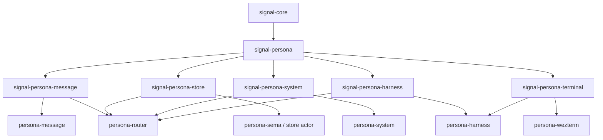
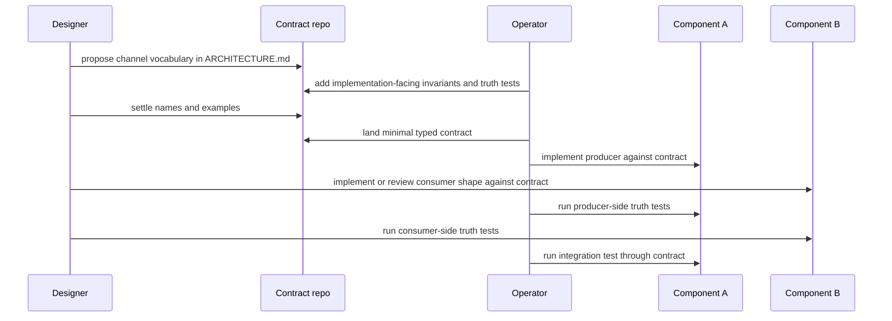
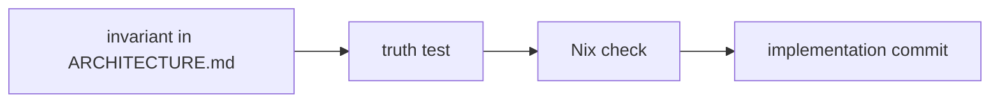

# Parallel Signal-contract Architecture Plan

*Operator plan for revamping Persona architecture docs first, then
implementing the first messaging stack through contract repos that let
designer and operator work in parallel without drifting.*

---

## 0. Operator Lean

Use **contract repos as the choreography surface**.

The first stack should be documented and then implemented as a set of
typed Signal channels:



This is slightly more aggressive than the "wait for a second concrete
consumer" lean in `reports/designer/70-code-stack-amalgamation-and-messaging-vision.md`.
The reason is not theoretical purity. It is parallel work: the contract
repo gives two agents a narrow shared file surface and lets each runtime
repo move independently once the shared messages compile.

---

## 1. First Rule: No Code First

Before implementation, land architecture documents in this order:

1. `repos/persona/ARCHITECTURE.md` as the apex runtime map.
2. `repos/signal-persona/ARCHITECTURE.md` as the domain vocabulary map.
3. One `ARCHITECTURE.md` per channel contract repo.
4. One `ARCHITECTURE.md` per runtime repo.
5. Per-repo `skills.md` updates only where the repo-specific editing
   rules differ from workspace skills.

The docs are not a roadmap. They describe the destination shape that code
must obey. Reports keep the "why" and implementation order.

---

## 2. Architecture Document Skeleton

Every Persona component architecture should answer the same questions:

| Section | Required answer |
|---|---|
| Role | what this repo owns and does not own |
| Inbound Signal | which contract repo messages it receives |
| Outbound Signal | which contract repo messages it emits |
| State | whether it owns state, and if so through which actor/table |
| Actor boundary | which data-bearing actor owns long-lived behavior |
| Text boundary | whether NOTA/Nexus is allowed here |
| Forbidden shortcuts | what future agents are likely to bypass |
| Truth tests | which tests prove the architecture is obeyed |

For contract repos, the skeleton changes:

| Section | Required answer |
|---|---|
| Channel | which two components this contract connects |
| Record source | which domain records are imported from `signal-persona` |
| Messages | closed request/event/reply enums |
| Versioning | Signal frame/version expectations |
| Examples | canonical Nexus/NOTA text projection for each record |
| Round trips | text round-trip and rkyv frame round-trip |
| Non-ownership | no actors, daemons, routing, storage, or terminal logic |

---

## 3. Parallel Choreography



The contract repo is claimed by one role at a time. The two runtime repos
can be claimed separately because they only meet through the contract.

When a component needs a new message:

1. Add or edit the contract repo first.
2. Commit and push the contract.
3. Each runtime component updates independently.
4. Integration test lands only after both sides compile against the same
   contract.

No runtime repo invents local duplicate message types while waiting.

---

## 4. First Stack Contract Matrix

| Contract repo | Channel | Owns | Runtime owners |
|---|---|---|---|
| `signal-persona-message` | CLI/text ingress to router | `SubmitMessage`, submit reply, sender derivation receipt | `persona-message`, `persona-router` |
| `signal-persona-store` | router to store actor | commit request, commit outcome, table slot receipt | `persona-router`, store actor using `persona-sema` |
| `signal-persona-system` | OS facts to router | focus fact, prompt-buffer fact, target generation | `persona-system`, `persona-router` |
| `signal-persona-harness` | router to harness actor | deliver request, delivery event, blocked reason | `persona-router`, `persona-harness` |
| `signal-persona-terminal` | harness actor to terminal adapter | terminal projection command, terminal receipt | `persona-harness`, `persona-wezterm` |

`signal-persona` remains the shared domain vocabulary:

- `Message`
- `Delivery`
- `Binding`
- `Harness`
- `Observation`
- `Authorization`
- `Lock`
- `StreamFrame`
- `Transition`

Channel contracts import these records and define how two components
exchange them. They do not redefine them.

---

## 5. Research Needed Before Docs

| Topic | Why it matters | Owner lean |
|---|---|---|
| `signal-core::Frame` exact API | all channel contracts must use one frame shape | operator |
| `signal-persona` current record surface | docs must not invent records already present | operator |
| `sema::Table<K,V>` bounds | `persona-sema` docs must name real storable values | operator |
| ractor pattern in workspace | actor docs must match real implementation style | operator |
| Contract repo naming | avoid churn between `signal-persona-*` and modules | designer + operator |
| Harness text projection | decide Nexus/NOTA/persona projection at terminal boundary | designer |
| Niri/system fact shape | focus/prompt contracts need real OS witness boundaries | operator |
| Truth-test skill adoption | ensure every Persona repo points at `skills/architectural-truth-tests.md` | designer + operator |

---

## 6. Skill Reinforcement

Before editing any Persona runtime repo, agents should be forced by
repo-local `skills.md` to reread:

- `skills/rust-discipline.md`
- `skills/contract-repo.md`
- `skills/architecture-editor.md`
- `skills/nix-discipline.md`
- `skills/push-not-pull.md`
- `skills/architectural-truth-tests.md`
- that repo's `ARCHITECTURE.md`
- the relevant channel contract repo's `ARCHITECTURE.md`

This should be phrased as a checkpoint, not a background suggestion:

> Before changing code in this repo, read this repo's
> `ARCHITECTURE.md` and every Signal contract listed in its
> "Inbound Signal" and "Outbound Signal" sections. If your change adds a
> cross-component message, edit the contract repo first.

---

## 7. Architecture Truth Tests

Each architecture invariant should name its witness test before code
lands.



Examples for this stack:

| Invariant | Witness |
|---|---|
| `persona-router` never depends on `persona-wezterm` | `cargo metadata` dependency-boundary check |
| `persona-router` commits before delivery | typed event trace in router actor test |
| `message` emits Signal frames | golden byte equality with equivalent `nexus` command |
| `persona-sema` stores `signal-persona` records | compile test using `Table<Key, signal_persona::Message>` |
| delivery is push-based | paused-clock test proves no retry work occurs with no pushed observation |
| prompt/focus guards prevent injection | fake terminal actor receives zero commands while guard is blocked |

The test names should be blunt:

```text
router_cannot_deliver_without_store_commit
message_cli_cannot_write_private_message_log
router_cannot_import_terminal_adapter
persona_sema_cannot_store_local_message_type
```

---

## 8. Work Split For Designer + Operator

| Lane | Designer | Operator |
|---|---|---|
| Apex Persona architecture | terminology, diagrams, layer names | runtime dependency graph, concrete repo boundaries |
| Contract repos | message names, examples, user-facing clarity | Rust type feasibility, rkyv/sema bounds, tests |
| Runtime repo docs | review for coherence and beauty | write implementation-facing invariants |
| Skills | make discipline tidy and readable | add enforcement points and examples from code |
| Beads | file design/documentation follow-ups | file implementation/test follow-ups |
| Code phase | audit contract changes and docs | implement against contracts |

The key handoff is always the contract repo. Designer can improve names
and examples there; operator can add typed surfaces and tests there; the
runtime components follow.

---

## 9. Implementation Phases After Docs

1. Create or reorient the channel contract repos.
2. Add minimal `ARCHITECTURE.md` and `skills.md` to each.
3. Add typed contract surfaces with examples-first tests.
4. Implement `persona-sema` typed tables over `signal-persona`.
5. Convert `persona-router` into a ractor actor using channel contracts.
6. Convert `persona-message` into a Signal-frame CLI.
7. Wire router to store actor before delivery.
8. Wire system observations as pushed Signal events.
9. Wire harness delivery through harness actor, then terminal adapter.
10. Run Nix-named integration tests proving the full message path.

Stop after each phase if the architecture docs no longer describe the
implementation. Update docs first, then continue.

---

## 10. Immediate Decisions

1. **Physical channel repos now?** Operator lean: yes, for the first
   messaging stack, because they are coordination tools, not just code
   artifacts.
2. **Truth-test adoption.** `skills/architectural-truth-tests.md` now exists;
   decide how hard each Persona repo's `skills.md` should require it before
   code edits and test additions.
3. **Store actor home.** Decide whether the store actor lives in
   `persona-router`, `persona-sema`, or a separate `persona-store-actor`
   repo. Operator lean: separate runtime owner if it has a mailbox;
   `persona-sema` remains storage library only.
4. **Harness terminal boundary.** Decide whether
   `signal-persona-terminal` is needed now or whether `persona-wezterm`
   remains purely internal behind `persona-harness`.
