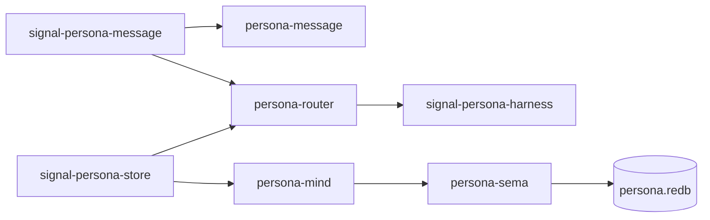
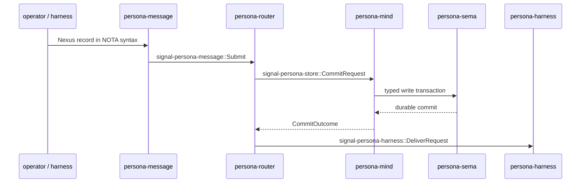
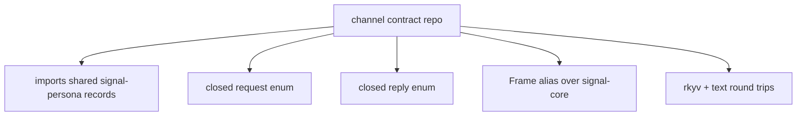
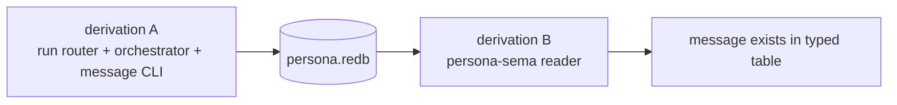

# 74 · Signal / Sema / Persona forward implementation

Status: operator synthesis after reading
`reports/designer/72-harmonized-implementation-plan.md` and
`reports/designer/73-signal-derive-research.md`.

This report explains the implementation consequence of the new
architecture and names the decisions that still need Li.

---

## 0 · TL;DR

The right next stack is not "implement messaging" directly. The
right next stack is:

1. land the signal contract repositories that let components agree
   on typed messages;
2. land the orchestrator state actor as the only database mailbox;
3. make `persona-message` speak the message contract to
   `persona-router`;
4. make `persona-router` commit through the store contract before
   delivery;
5. prove the whole path with architectural-truth tests.

The macro answer is: do not start with `signal-derive`. The first
two or three channels should be hand-written. If real repetition
appears, `signal-core` gets a `FrameEnvelopable` marker trait and a
future function-style `signal_channel!` macro. A derive on one enum
is the wrong shape for a channel.

## 1 · What changed in architecture docs

| Repo | Change |
|---|---|
| `signal/ARCHITECTURE.md` | Clarifies that this repo is the sema/criome contract inside the wider signal family; Persona channel payloads live in `signal-persona-*`; `signal-derive` stays deferred. |
| `sema/ARCHITECTURE.md` | Clarifies sema as the state kernel; `<consumer>-sema` owns table layouts; runtime actors own write ordering and commit events. |
| `persona/ARCHITECTURE.md` | Reorients the apex around five channel contracts, `persona-mind` as the owner of the state actor, commit-before-deliver, and architectural-truth witnesses. |

## 2 · Implementation shape

The minimal real messaging implementation is three channels deep:

The key point: `persona-router` must not "helpfully" write a
message file or a redb table itself. It reduces state, asks the
orchestrator state actor for a commit, and only then emits delivery.

## 3 · Contract repos as the parallel boundary

Each channel contract is a small repo that owns closed Rust types:

This lets designer and operator move without stepping on each other:
the contract repo is the typed agreement. Runtime repos import it and
implement behavior. If a runtime repo needs a new message, the change
starts in the contract repo, then fans out.

The first five contracts are:

| Contract | Runtime boundary |
|---|---|
| `signal-persona-message` | `persona-message` → `persona-router` |
| `signal-persona-store` | `persona-router` → `persona-mind` state actor |
| `signal-persona-system` | `persona-system` → `persona-router` |
| `signal-persona-harness` | `persona-router` ↔ `persona-harness` |
| `signal-persona-terminal` | `persona-harness` → `persona-wezterm` |

## 4 · What not to build yet

Do not build a `#[derive(Signal)]` now. The boilerplate is not on
one enum; it is on the channel pair. A derive sees one type. A
channel has at least request type, reply type, frame alias, and
transport context.

Do not build transport into a contract repo. Contract repos define
bytes and types. Actors, sockets, retry strategy, authorization
checks, focus gates, and store ownership live in runtime components.

Do not let the message CLI keep private durable logs. The CLI's
durable act is sending a signal frame to the router. The database
witness comes from `persona-mind` and `persona-sema`.

## 5 · Truth-test witnesses

The first implementation should include tests that most teams would
not write, because they prove the architecture rather than only the
output.

| Rule | Witness test |
|---|---|
| Message CLI uses typed channel | `message_cli_emits_signal_persona_message_frame` |
| CLI has no private durable queue | `message_cli_cannot_write_private_message_log` |
| Router commits before delivery | `router_cannot_deliver_without_store_commit` |
| Router does not own terminal transport | `router_cannot_import_persona_wezterm` |
| Orchestrator actor owns database writes | `orchestrator_actor_commits_through_persona_sema` |
| Persistence is real | Nix writer derivation emits `persona.redb`; separate reader derivation opens it |
| Delivery is push-based | paused-clock test proves no retry without pushed observation |

The Nix-chained database test is the strongest early witness:

## 6 · My proposed immediate order

1. Create `signal-persona-message` and `signal-persona-store`
   first. They are the minimum pair that lets a submitted message
   become durable.
2. Implement the `persona-mind` state actor immediately
   after `signal-persona-store`; it is the runtime owner of
   database writes.
3. Replace `persona-message` text-file state with a socket client
   that emits `signal-persona-message` frames.
4. Replace router private delivery state with actor-handled receipt,
   commit request, commit outcome, and then delivery event.
5. Add the Nix writer/reader witness before returning to live harness
   injection.

## 7 · Questions for Li

1. Do you want the five `signal-persona-*` repos created now even if
   only `message` and `store` get code first, or should we create only
   the first two and leave the other three as architecture references
   until their implementation turn?

2. Should `FrameEnvelopable` land in `signal-core` before the first
   Persona channel, or should we force the first channel to feel the
   raw rkyv bounds and only abstract after the second or third channel?

3. Should `persona-router` be forbidden from depending on
   `persona-sema` directly in production code, or is a read-only
   dependency acceptable for inspection paths while writes still go
   through `persona-mind`?

4. Is commit-before-deliver enough for the first stack, or should
   authorization also be mandatory before store commit in the first
   message path?

## 8 · Operator recommendation

My recommendation:

- Create only `signal-persona-message` and `signal-persona-store`
  first, then implement the corresponding state actor inside
  `persona-mind`.
- Treat request/message text as Nexus records in NOTA syntax.
  Convenience CLIs such as `message` may hide common wrappers, but
  they stay within NOTA syntax.
- Keep `signal-persona-system`, `signal-persona-harness`, and
  `signal-persona-terminal` in architecture until the first durable
  message path is real.
- Keep `FrameEnvelopable` deferred for one channel, but add it before
  channel two if the bound noise appears in real code.
- Forbid production `persona-router` writes to `persona-sema`.
  Permit read-only test/helper binaries to use `persona-sema` so the
  Nix witness can inspect the database independently.
- Make authorization visible in the type surface now, but allow the
  first commit path to carry an explicit "operator-local authorized"
  proof rather than full policy.
