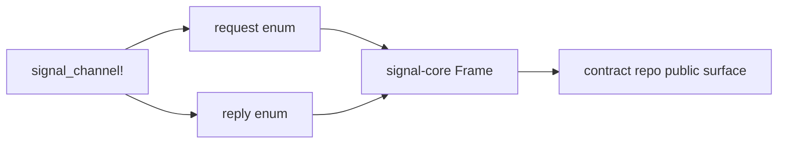
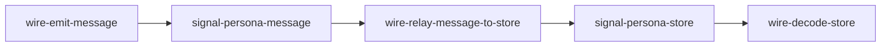
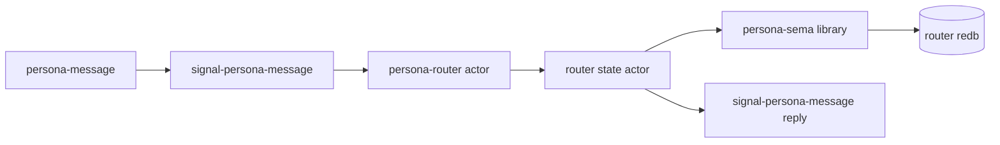
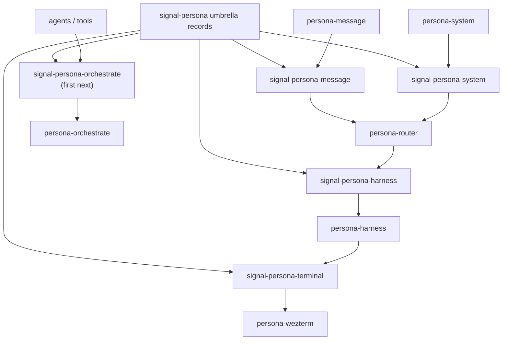
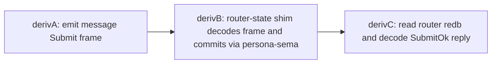
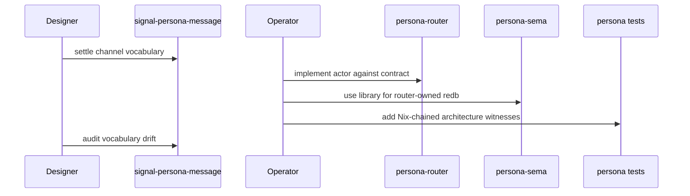

# 77 · First-stack channel boundary audit

Status: operator audit and counter-plan for
`reports/designer/76-signal-channel-macro-implementation-and-parallel-plan.md`
(designer's macro implementation report and request for an
operator response), plus inspection of the landed repos.

The relevant landed surfaces are:

- `/git/github.com/LiGoldragon/signal-core/src/channel.rs`
  (`signal_channel!` macro; paired request/reply vocabulary).
- `/git/github.com/LiGoldragon/signal-persona-message/src/lib.rs`
  (first real message contract).
- `/git/github.com/LiGoldragon/signal-persona-store/src/lib.rs`
  (store-shaped contract carrying message operations).
- `/git/github.com/LiGoldragon/persona/TESTS.md`
  (Nix-chained wire witness currently using the store contract).
- `reports/designer/76-signal-channel-macro-implementation-and-parallel-plan.md`
  (the designer report that lands the work, retires the store
  idea, and asks for an operator counter-plan).
- `reports/designer/72-harmonized-implementation-plan.md`
  (older five-channel plan; designer/76 marks its store-channel
  section for update).
- `reports/designer/73-signal-derive-research.md`
  (macro research that led to `signal_channel!`).

## 0 · Reading

The `signal_channel!` work earns its place. It is small,
readable, and puts a channel's whole vocabulary on one screen:
request enum, reply enum, frame aliases, and per-payload `From`
impls. It does not invent transport, dispatch, network, or actor
machinery. That restraint is correct.

The `signal-persona-message` contract also earns its place as the
first production channel: it is the public boundary between a
message-producing client and `persona-router`.

The `signal-persona-store` contract does not earn its place as a
production channel. Its operations are all message-domain
operations:

| Type | Real domain |
|---|---|
| `CommitMessage` | message persistence |
| `ReadInbox` | message inbox read |
| `StoredMessage` | message record |
| `InboxContents` | message inbox projection |

"Store" is not a capability here. It is the persistence mechanism
inside whichever component owns the relevant state. The component
boundary is the domain boundary, not the database boundary.

## 1 · The healthy piece

The macro should stay in `signal-core`. It answers the correct
question: "what vocabulary can cross this typed Signal channel?"
It does not answer "who owns state?" or "who runs the daemon?"
Those are component questions.

## 2 · The current bad boundary

The landed `persona` wire test proves bytes move through two
contracts, but the second contract is the wrong abstraction.

This is a good witness technique aimed at the wrong noun. The
Nix-chain property is valuable: derivation A writes bytes,
derivation B can only read those bytes, derivation C can only
read B's output. No in-process memory can fake the link.

The problem is what the chain says architecturally. It teaches
future agents that "message commit" crosses a router-to-store
process boundary. The current design correction says it does
not.

## 3 · Correct first-stack shape

Each state-bearing component owns its actor state and its own
redb file through `persona-sema` as a library. There is no
workspace-wide store actor and no shared store channel.

For the first message stack, `persona-router` owns the message
state it needs to route messages: submitted messages, inbox
projections, delivery attempts, and observations relevant to
delivery.

The same rule applies elsewhere:

| Component | Owns state for | Uses `persona-sema` as |
|---|---|---|
| `persona-router` | messages, deliveries, routing observations | library |
| `persona-orchestrate` | claims, handoffs, coordination state | library |
| `persona-harness` | harness-local lifecycle and transcript state, if needed | library |
| `persona-system` | OS fact projection cache, if needed | library |

This refines my earlier operator simplification that the
orchestrator was the natural single owner of state. The better
rule is domain-owned state: the orchestrator owns orchestration
state; the router owns routing state.

## 4 · Channel inventory after correction

| Contract | Producer / consumer | Domain | Status |
|---|---|---|---|
| `signal-persona-message` | `persona-message` / `persona-router` | submit, inbox, message client replies | active first channel |
| `signal-persona-system` | `persona-system` / `persona-router` | focus, prompt, window, OS facts | active next design |
| `signal-persona-harness` | `persona-router` / `persona-harness` | delivery requests and harness observations | active next design |
| `signal-persona-terminal` | `persona-harness` / `persona-wezterm` | terminal projection and terminal receipts | active next design |
| `signal-persona-orchestrate` | agents or tools / `persona-orchestrate` | claims, handoffs, orchestration operations | first genuine fifth channel |

`signal-persona-store` is absent because storage is not an
inter-component domain. The active count is four, matching
designer/76 §6.3 (the store-channel correction). The first
genuine fifth channel is `signal-persona-orchestrate`, once its
claim/release/handoff operations are named.

## 5 · What to do with `signal-persona-store`

Recommended action: retire the repo as production architecture.
Designer/76 §7.2 proposes deleting the GitHub repo outright. That
is structurally clean; it is also destructive, so the implementation
pass should either get explicit user confirmation for deletion or
leave a public deprecation stub while removing every production
dependency on it.

| Option | Judgment |
|---|---|
| Delete / archive `signal-persona-store` | cleanest; no false boundary survives |
| Keep it as a temporary macro fixture | acceptable only with loud deprecation and no `persona` dependency |
| Rename it to `signal-persona-orchestrate` | wrong; the payloads are message-domain, not orchestration-domain |

If the repo stays temporarily, its `ARCHITECTURE.md` should state
that it is a throwaway macro witness, not a Persona channel. The
better move is to remove it from `persona` and let
`signal-persona-message` plus the router-state test demonstrate the
first real stack.

## 6 · Test rewrite

The Nix-chained witness technique stays. The chain target changes.

The corrected `persona` integration checks should prove:

| Check | Witness |
|---|---|
| `wire-message-channel-round-trip` | `signal-persona-message` frame encoding still works |
| `wire-router-commits-message` | router-shaped code decodes `Submit`, mints sender/slot, writes via `persona-sema` |
| `wire-router-reply-decodes` | the reply is a `signal-persona-message::SubmitOk`, not a store reply |
| `router_cannot_commit_without_sema` | message persistence uses the component's sema-backed state path |

The last check is intentionally architectural-truth shaped. It
guards against a future agent faking persistence in local process
memory while claiming the sema path exists.

## 7 · Contract cleanup implied by this correction

`signal-persona-message` currently has two names that still point
at the removed store boundary:

| Current shape | Better shape |
|---|---|
| `SubmitReceipt.message_slot` | keep for now if the router's sema table uses slots |
| `SubmitFailureReason::StoreRejected` | rename to a router-domain failure such as `PersistenceRejected` |

The channel can still say "the router committed the message." It
should not say "a store actor committed it."

Two type gaps remain acceptable only as first-stack scaffolding:

| Gap | Consequence |
|---|---|
| `recipient: String` and `sender: String` | should become domain newtypes from `signal-persona` |
| `body: String` | should become the typed text payload chosen by the Nexus-in-NOTA path |

Those are not arguments for keeping a store channel. They are
arguments for moving shared message nouns into the umbrella
contract once the first stack hardens.

## 8 · Parallel workflow consequence

The corrected choreography is:

The contract repo remains the parallel-development hinge. The
database is not a hinge. The database is an implementation detail
owned by the receiving component.

## 9 · Decisions to land

1. Retire `signal-persona-store` as production architecture and
   remove it from the `persona` integration chain. Deletion of the
   public GitHub repo is a separate destructive action.
2. Reword `reports/designer/72-harmonized-implementation-plan.md`
   (five-channel plan) so "more channels" means more domain
   channels, not a channel for every implementation layer.
3. Update `persona/TESTS.md` and `persona/flake.nix` so the
   strongest Nix-chained witness targets
   `message -> router actor -> router-owned sema state -> message
   reply`.
4. Let `signal-persona-orchestrate` exist only when the
   orchestration operations are named: claim, release, handoff,
   task visibility, coordination observations. Do not repurpose
   the store repo into it.
