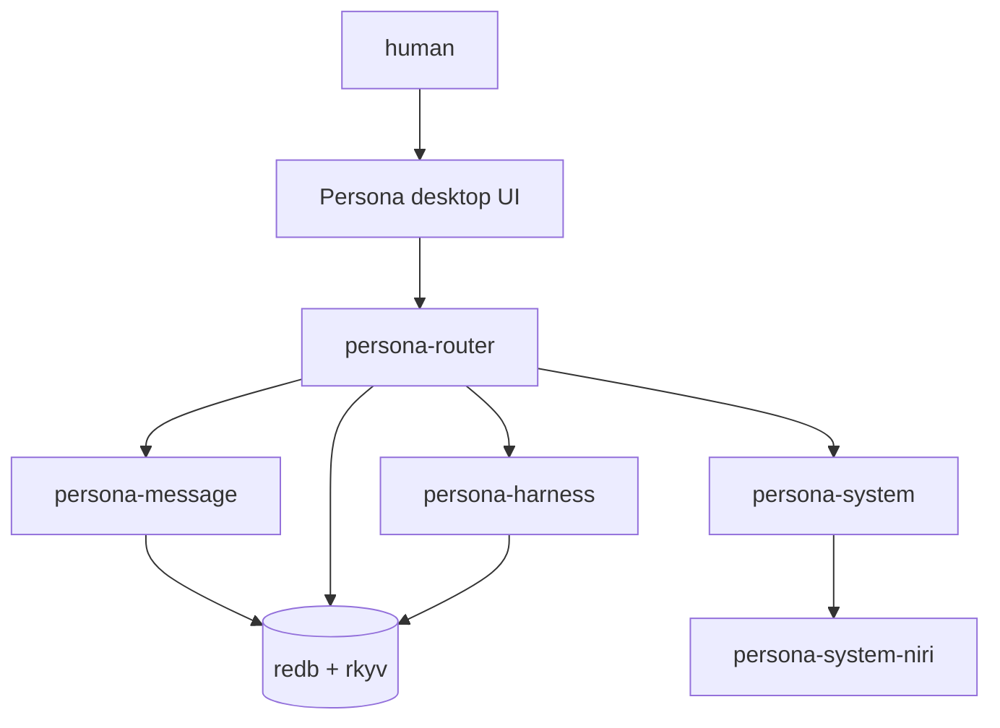
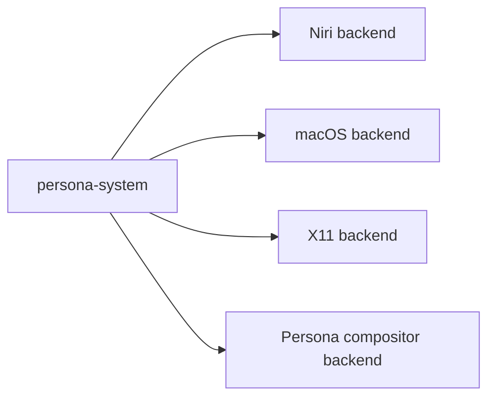
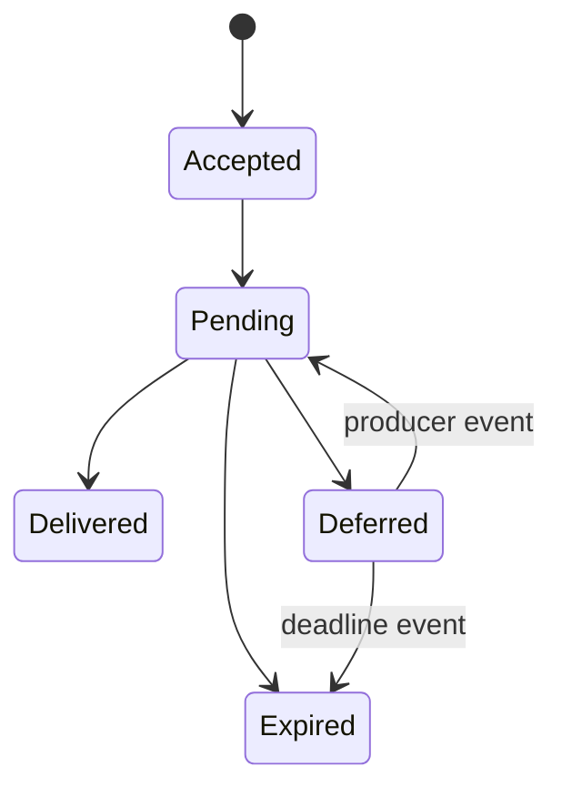
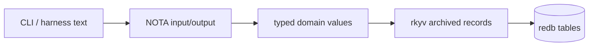
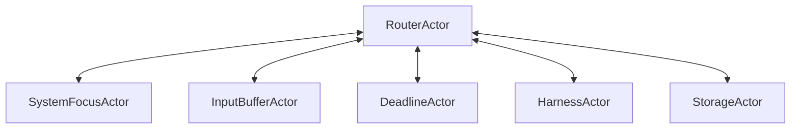
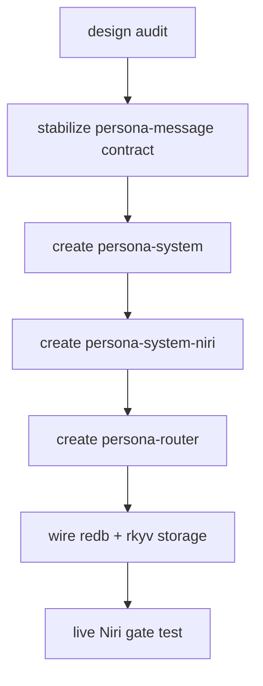

# Persona system repo plan

Status: draft
Author: Codex (operator)

Persona is not just an application that happens to run inside a random
desktop. The project is moving toward a controlled operating-system substrate:
Persona comes with enough of its own system stack to make harness routing,
input management, durable state, and human/agent coordination reliable.

This report sketches the next separation of concerns. Each level of abstraction
becomes a repository. That is how the system keeps components small enough for
agents to reason about and strict enough that the wrong behavior has nowhere to
hide.

## Stack view

The current Niri work is the first concrete `persona-system` backend, not a
general portability experiment.

## Repository split

| Repository | Owns | Does not own |
|---|---|---|
| `persona-message` | message contract, CLI surface, serialized message types | routing state, desktop focus, harness lifecycle |
| `persona-router` | pending queues, delivery state machine, subscriptions, actors | message schema ownership, OS-specific focus APIs |
| `persona-system` | generic OS/window/input traits and typed events | Niri-specific socket parsing |
| `persona-system-niri` | Niri `$NIRI_SOCKET` event source, window binding backend | router policy |
| `persona-harness` | harness identity, lifecycle, transcript/input observers | router queue policy |
| `persona-desktop` | human composer, overview, audit UI | terminal injection policy |
| `persona` | high-level integration and project-wide architecture | low-level component internals |

This follows the workspace rule: when there is a real abstraction boundary,
create a component for it.

## System abstraction

`persona-system` is the generic interface people port:

The interface is event-shaped:

| Event | Meaning |
|---|---|
| `FocusChanged(target, focused)` | compositor focus changed |
| `WindowClosed(target)` | bound window disappeared |
| `InputBufferChanged(target, empty)` | harness input buffer changed |
| `DeadlineExpired(id)` | OS deadline fired |

Backends differ in support. The router does not compensate by polling. Missing
support means the relevant delivery stays queued or the port exposes a weaker
capability.

## Router state ownership

`persona-router` owns this state machine. It receives typed messages from
`persona-message`, system events from `persona-system`, and harness events from
`persona-harness`. It writes durable transitions to redb.

## redb + rkyv everywhere

The durable state direction is **redb tables with rkyv-archived records**.

NOTA remains a human-facing and harness-facing text format where useful. It is
not the durable state store for router queues, harness bindings, transcripts,
or delivery transitions.

The rule should become part of Rust discipline: persistent component state is
typed, archived with rkyv, and stored in redb. Flat NOTA record files are
prototypes or interchange artifacts, not the steady state.

## Actor library

Stateful daemons use actors:

The actor owns the data behind its verbs:

| Actor | Owns |
|---|---|
| `RouterActor` | pending delivery state, subscriptions, decisions |
| `SystemFocusActor` | OS event subscription and focus map |
| `InputBufferActor` | parsed input-buffer observations |
| `DeadlineActor` | OS-pushed TTL deadlines |
| `HarnessActor` | endpoint and harness binding |
| `StorageActor` | redb transactions |

## Implementation order

Recommended next move:

1. Create `persona-system` with generic event/domain traits.
2. Create `persona-system-niri` as the first backend.
3. Create `persona-router` for the delivery state machine.
4. Move pending delivery storage away from NOTA-line files into redb + rkyv.
5. Keep `persona-message` focused on the message contract and CLI.

## Decisions for the user

| Decision | Recommended answer |
|---|---|
| Is Niri a blocker? | No. Niri is the current OS substrate. Ports come later. |
| Should `persona-router` be separate before coding? | Yes. Routing is a real abstraction level. |
| Should `persona-system` exist before backend work? | Yes. It gives ports a target and keeps Niri-specific code isolated. |
| Should durable queues use NOTA record files? | No. Use redb + rkyv. |
| Should Rust discipline document redb + rkyv as the storage default? | Yes. Create a designer task to add it. |

## Audit request

This report should be audited before code starts. The audit should check:

- whether the repo split is too fine or exactly right;
- whether `persona-system` is the right name for the OS abstraction;
- whether redb + rkyv belongs directly in `persona-router` or behind a smaller
  storage crate;
- whether the actor boundaries match the data each actor owns.
