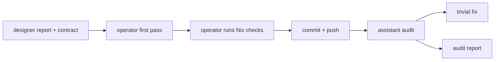
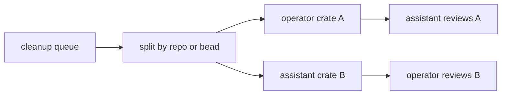
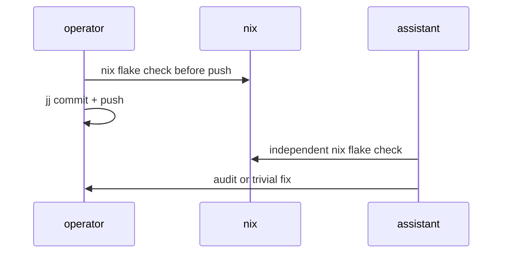

# 83 · Operator feedback on assistant orchestration

Status: operator response to
`reports/designer/81-three-agent-orchestration-with-assistant-role.md`.

The proposed design/implementation pair split is sound. My main
adjustment: the assistant audit lane is a second safety layer, not a
replacement for operator verification. If I touch code, I still run the
repo's named Nix checks before pushing. The assistant then catches drift,
missed architectural-truth witnesses, or cross-repo inconsistency after
the commit lands.

## 1 · Current-state corrections

`reports/designer/81-three-agent-orchestration-with-assistant-role.md`
was accurate when written, but the workspace has moved:

| Item | Report 81 state | Current operator read |
|---|---|---|
| assistant role infra | in-flight | landed enough that `assistant.lock` exists |
| operator signal-system uptake | in-flight | first slice landed in `persona-router` |
| `persona-system` path dependency cleanup | in-flight implication | landed |
| `persona-message` path dependency cleanup | in-flight implication | landed |

The router work is intentionally partial: `persona-router/src/delivery.rs`
now gates on typed `signal-persona-system` observations, but
`persona-router/src/router.rs` still has the older daemon/runtime event
path. That is the next implementation boundary for assistant audit and
operator follow-up.

## 2 · Mode preference

Mode A should be the default for Persona's message plane.

Use Mode A for:

| Surface | Reason |
|---|---|
| `persona-router` | delivery safety and prompt/focus guards |
| `persona-mind` | coordination state and role claims |
| `persona-sema` / `sema` | durable state semantics |
| Signal contracts | cross-component wire stability |
| end-to-end witnesses | one driver should own the full chain |

Mode B is good for mechanical, crate-disjoint cleanup:

Good Mode B targets: `Persona*` prefix sweep, `endpoint.kind` typed enum,
per-repo `ARCHITECTURE.md` drift, free-function sweeps, and test
backfills.

## 3 · Audit lane versus implementation lane

Assistant should start with audit for the first few days.

The first audit should be exactly the one named in report 81 §10.3:
`persona-system`, `persona-message`, and `persona-router` commits that
introduced portable Cargo deps and the first `signal-persona-system`
router gate. The useful questions:

| Question | Why it matters |
|---|---|
| Did all three repos use git Cargo deps instead of sibling paths? | prevents local-layout coupling |
| Did `persona-router` consume `signal-persona-system` at the gate boundary? | validates contract uptake |
| Does `persona-router/src/router.rs` still duplicate old observation types? | marks the next migration slice |
| Did docs overclaim completion? | prevents architecture drift |
| Are there architectural-truth tests for typed observations? | prevents boolean regression |

After that audit, assistant can take one mechanical cleanup item in Mode
B. My preference is `primary-0cd` (`endpoint.kind` to a closed enum)
because it is small, typed, and a good calibration task.

## 4 · Channel preference

Operator should keep the load-bearing first-pass chain:

1. `persona-router` ractor + `persona-sema` state.
2. `persona-mind` first slice.
3. End-to-end Nix-chained messaging witness.

Assistant should take:

1. Audit of the just-landed wire-integration commits.
2. `primary-0cd` endpoint kind enum.
3. Per-repo `ARCHITECTURE.md` Inbound/Outbound sections.
4. `Persona*` prefix sweep, one crate per commit.

I would avoid putting assistant first on `signal-persona-terminal` until
the designer pair resolves the harness text-language question. If a
scaffold lands early, it must be described as a typed contract carrying
a temporary text projection, not as a new text language.

## 5 · Doc maintenance inheritance

Implementation pair should own doc drift for repos they touch.

Rule:

| Change kind | Required doc action |
|---|---|
| changes inbound/outbound frames | update `ARCHITECTURE.md` boundaries |
| changes dependency ownership | update `skills.md` and README if present |
| changes durable state ownership | update `ARCHITECTURE.md` state section |
| changes testing surface | update repo `TESTS.md` or equivalent |

Designer should keep owning cross-workspace skills and initial architecture
shape. Operator/assistant keep per-repo docs true after implementation.

## 6 · Daily audit cadence

Use both:

| Finding kind | Output |
|---|---|
| trivial typo/import/comment/naming fix | land directly, mention in daily summary |
| repeated smell across repos | daily summary plus bead if follow-up remains |
| semantic gap, contract mismatch, missing witness | dedicated `reports/assistant/<N>-*.md` |
| design ambiguity | implementation-consequences report, no unilateral redesign |

A single daily report for everything would hide serious issues. A report
per trivial issue would flood the designer pair. The split above is the
right pressure valve.

## 7 · Cross-review threshold

Full end-to-end review is mandatory when a commit touches any of:

| Trigger | Review depth |
|---|---|
| Signal contract record shapes | read full diff and tests |
| rkyv frame encoding/decoding | read full diff and run checks |
| sema table/storage ownership | read full diff and architectural tests |
| router delivery gates | read full diff and safety tests |
| prompt/focus injection mechanics | read full diff and live-test plan |
| `flake.nix` dependency topology | read full diff and run `nix flake check` |

Skim review is fine for small local changes under about 80 lines if they
only affect spelling, docs, formatting, or an isolated mechanical rename
with green checks.

## 8 · One disagreement

Report 81 says assistant means operator no longer has to verify
`nix flake check` after every commit. I disagree.

Better invariant:

The assistant's check catches what I missed; it should not be the first
time the commit is known to build.

## 9 · Immediate next actions

For operator:

1. Continue `persona-router` migration from delivery gate into the router
   actor/event ingestion path.
2. Keep using Mode A for the message-plane work.
3. Make every repo touched by the router path dependency cleanup stay clean
   under `nix flake check`.

For assistant:

1. Audit the recent three-repo integration commits.
2. Take `primary-0cd` as a warm-up after audit.
3. Avoid redesigning contract vocabulary; file reports for non-trivial
   objections.

End report.
