# Persona message router architecture

Status: current operator synthesis
Author: Codex (operator)

This report supersedes the operator-side Persona reports that led here:

- `reports/operator/1-persona-core-state-pass.md`
- `reports/operator/2-terminal-harness-control-research.md`
- `reports/operator/3-persona-wezterm-harness-plan.md`
- `reports/operator/4-persona-message-plane-design.md`
- `reports/operator/5-persona-message-real-harness-test-plan.md`
- `reports/operator/7-minimal-niri-input-gate.md`
- `reports/operator/8-persona-system-repo-plan.md`

It also folds in the designer audits that are still load-bearing:

- `reports/designer/4-persona-messaging-design.md`
- `reports/designer/12-no-polling-delivery-design.md`
- `reports/designer/13-niri-input-gate-audit.md`
- `reports/designer/15-persona-system-plan-audit.md`

The old operator reports are removed with this report. The filesystem should
now point future operator work at this single current plan.

---

## Current shape

Persona is a typed message fabric around interactive harnesses. The immediate
implementation target is not the final whole Persona daemon; it is the routing
loop that lets agents send messages without corrupting a human's terminal
input.

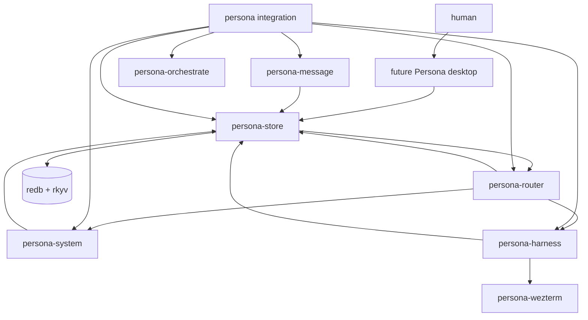

Current components and repository surfaces:

| Component | Role |
|---|---|
| `persona-message` | message contract, `message` CLI, typed NOTA boundary |
| `persona-router` | delivery reducer, subscriptions, actor routing, typed transition proposals |
| `persona-system` | OS/window/input event contracts; first Niri backend lives here |
| `persona-harness` | harness identity, lifecycle, transcript and input observers |
| `persona-wezterm` | current PTY/window adapter used by the live harness tests |
| `persona-store` | planned Persona daemon database owner and transaction boundary; not yet a repo |
| `persona-orchestrate` | workspace coordination: roles, scopes, claims, handoff tasks |
| `persona` | integration surface and high-level architecture |

`persona-system-niri` is intentionally not created yet. Niri stays inside
`persona-system` until a second backend makes the split real.

`persona-desktop` is intentionally deferred. The desktop composer becomes
useful after the router can deliver safely and expose status.

---

## Layering

The critical next step is a working delivery path:

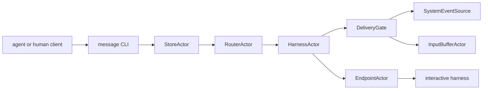

The boundary between text and durable state is explicit:

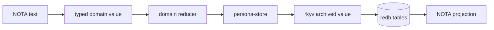

NOTA remains the human-facing and harness-facing text format. It is not the
production queue store. Persistent component state is redb tables with
rkyv-archived values owned through persona-store.

---

## Database ownership

If Persona has one database, it should have one database owner. The natural
owner is `persona-store`: storage ownership is the layer that knows which
Persona daemon planes exist, sequences their transitions, and keeps the durable
state coherent.

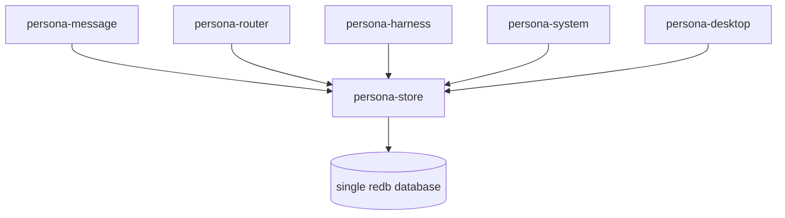

This changes the earlier actor/storage idea:

| Rule | Meaning |
|---|---|
| one database owner | only `persona-store` opens and commits the shared redb database |
| domain reducers stay local | router/harness/system still own their own domain rules |
| persistence is proposed | domain actors submit typed transition proposals to persona-store |
| transaction boundary is central | cross-plane writes are serialized and committed by persona-store |

The risk is turning `persona-store` into a god object. The guardrail is strict:
`persona-store` owns ordering, authorization, transactionality, schema-version
checks, and durable projection. It does not decide whether a router delivery is
safe, parse harness input buffers, or interpret Niri events. Those verbs stay on
the actors that own the data.

This resolves the naming collision with `persona-orchestrate`.
`persona-orchestrate` keeps the workspace-coordination meaning from
`reports/designer/14-persona-orchestrate-design.md`: roles, scopes, claims, and
handoff tasks. `persona-store` is the Persona daemon's durable store owner.

Persona ships as one daemon process owning one redb database. CLI clients such
as `message` and future composers are separate processes that connect over a
Unix socket; they never open the daemon's redb database directly.

Transition proposals default to synchronous-with-result. A domain actor awaits
`persona-store` and receives `Committed(transition_id)` or `Rejected(reason)`.
The first implementation should use typed ractor calls for these commits, not
fire-and-forget casts.

---

## The router's job

`persona-router` owns the harness delivery rules. It accepts typed messages
from persona-store, computes delivery decisions, asks the target harness
actor to attempt delivery, subscribes to exactly the event sources that can
unblock deferred work, and submits typed transition proposals back to
`persona-store` for durable commit.

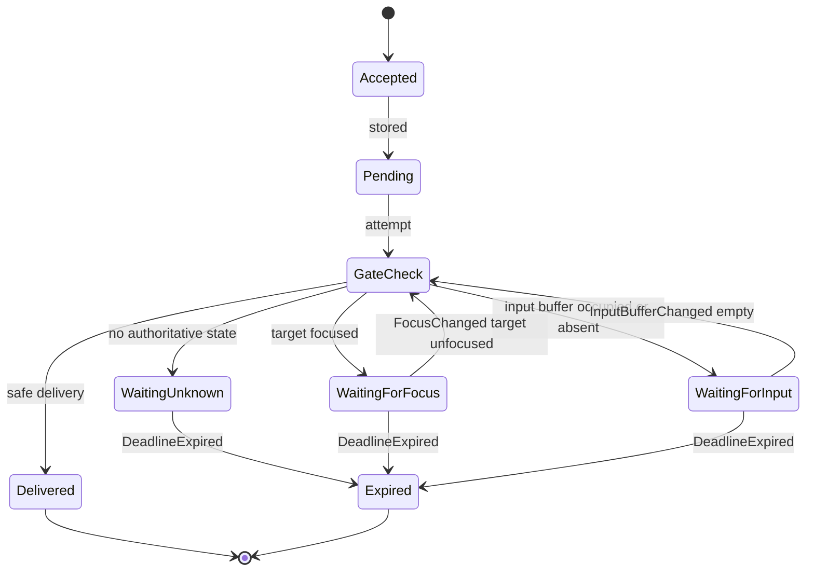

The router never polls. It wakes because:

| Wake source | Producer | Why it wakes |
|---|---|---|
| message accepted | `message` CLI or future client | new delivery work exists |
| focus changed | `persona-system` Niri event stream | a focus block may have cleared |
| input buffer changed | `persona-harness` recognizer | an input block may have cleared |
| deadline expired | OS timer primitive | a pending message TTL ended |
| manual discharge | human command | user explicitly resolves a block |

There is no retry timer for `WaitingUnknown`. Unknown stays queued until an
authoritative event, manual discharge, or TTL expiry.

---

## Safe delivery gate

The gate is about protecting input state, not about whether the model is
currently generating tokens. The agent's "idle" state is not a delivery
condition.

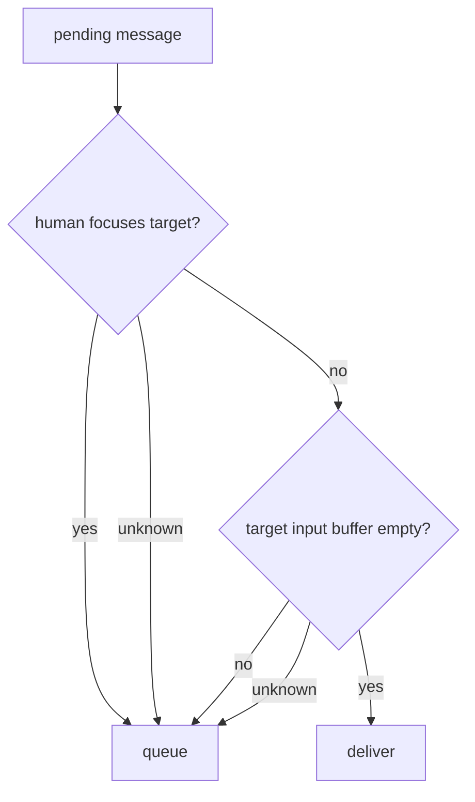

The first gate has two green requirements:

| Requirement | Meaning |
|---|---|
| target not focused | the human is not typing into that harness window |
| input buffer empty | the harness has a visible editable input region, and it contains only prompt chrome |

If the harness is generating output, there may be no editable input region. That
counts as not empty or unknown, so the message stays queued. This protects the
same user-visible state without naming token-generation idle as a separate
condition.

---

## Input-buffer definition

"Empty input buffer" is a two-predicate observation owned by the harness side:

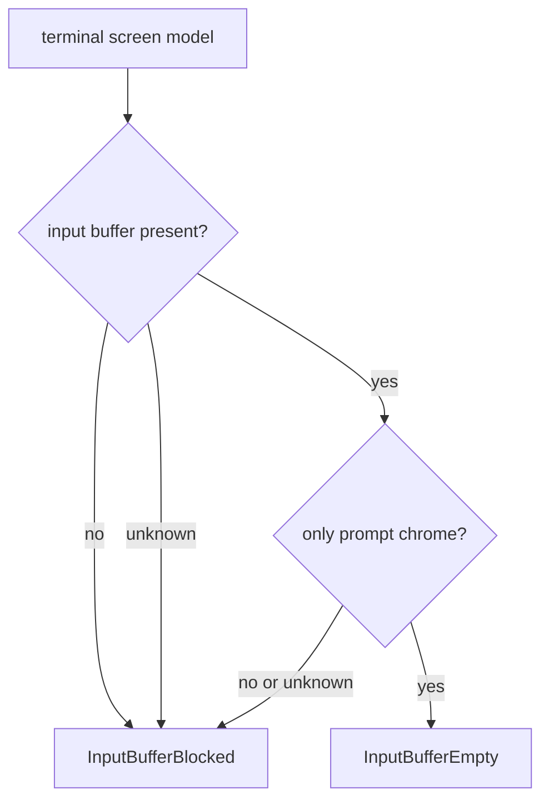

Per-harness recognizers are closed over the supported harness variants:

| Harness | First recognizer target |
|---|---|
| Pi | prompt box and editable line region |
| Claude | bottom `>` input line |
| Codex | `>` marker and editable row |

The recognizer emits `InputBufferChanged(target, state)` only when it has a new
authoritative observation. The router does not sample the screen on a clock.

---

## System abstraction

`persona-system` owns the portable system event surface. The current system is
Niri/CriomOS; that is not a blocker because Persona is being built with its own
operating-system substrate. Ports implement the same surface with whatever
support their system can offer.

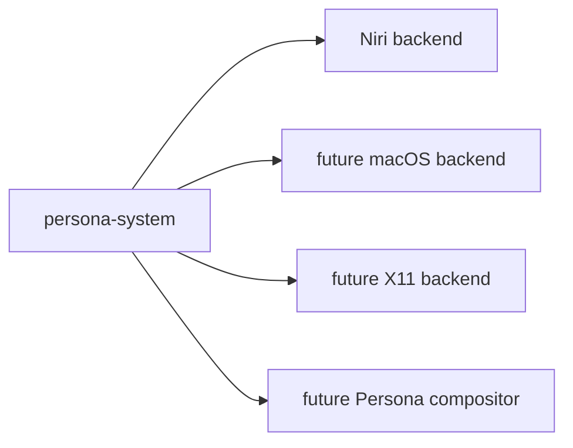

The event surface stays small:

| Event | Meaning |
|---|---|
| `FocusChanged(target, focused)` | target window focus changed |
| `WindowClosed(target)` | bound target window disappeared |
| `InputBufferChanged(target, state)` | harness input-buffer state changed |
| `DeadlineExpired(id)` | OS deadline fired |

Niri gives a real push source through its IPC event stream. The router opens the
stream only when pending focus-blocked work exists and closes it when no pending
focus block remains.

Every system subscription follows the workspace push contract: the producer
emits current state on connect, then emits deltas. The router must not subscribe
and then issue a separate "what is focused now?" query.

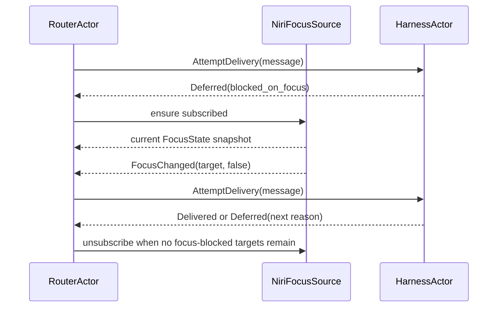

On systems without a push-capable focus source, focus-gated delivery is
unavailable. The correct behavior is deferral, not a fallback poll.

---

## Window binding and races

Harness identity is not a title string. The harness actor owns the explicit
binding between a Persona harness and a system window or terminal endpoint.

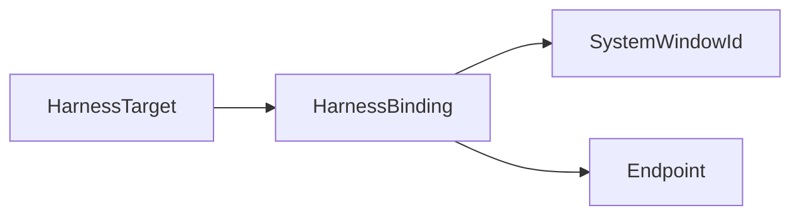

Niri window IDs are stable only for the lifetime of a window. When the window
closes, the harness actor emits `BindingLost(target)`. Pending messages stay
queued until explicit rebind, manual discharge, or TTL expiry. App id and title
are discovery hints, not identity.

The minimal gate narrows the human-input race but does not eliminate it:

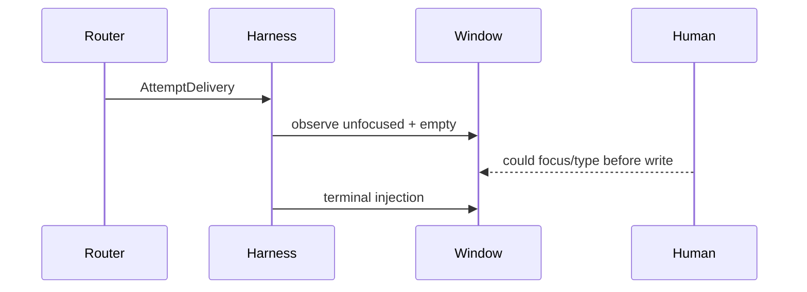

The destination design reduces this further through a system-level delivery
primitive: focus leasing, compositor support, a Persona-owned prompt composer,
or a harness-side extension/API. Until then, the router must treat focus and
input-buffer uncertainty as a queueing reason.

---

## Human prompt composer

The long-term answer is not to make the human type directly into a harness
prompt when routed messages may arrive. Persona needs a human-facing message
composer.

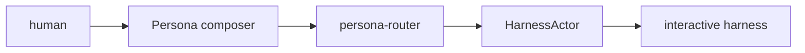

The composer gives the human a stable editor and turns the draft into a Persona
message. That keeps all deliveries serialized by the router and avoids splicing
router text into a half-typed human prompt. This belongs to the deferred
`persona-desktop` work, not the first router implementation.

---

## Actor ownership

Actors own data; methods live on the object with the data.

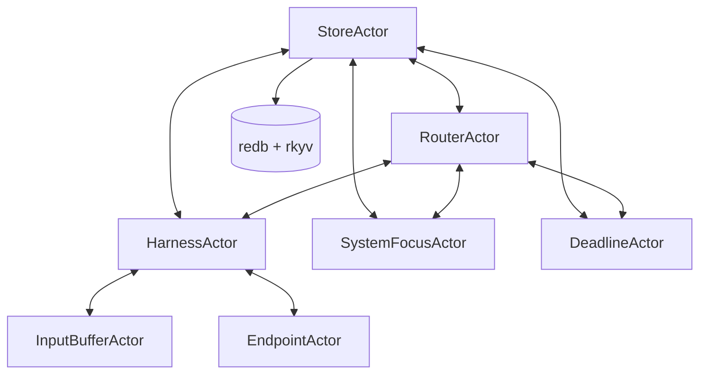

| Actor | Owns |
|---|---|
| `StoreActor` | single database handle, transaction ordering, cross-plane transition log |
| `RouterActor` | delivery decisions, block reasons, subscriptions, typed delivery transition proposals |
| `HarnessActor` | target identity, window/endpoint binding, current gate observations |
| `SystemFocusActor` | OS event subscription and focus map |
| `InputBufferActor` | parsed screen/input-region observations |
| `DeadlineActor` | OS-pushed TTL deadlines |
| `EndpointActor` | adapter-specific delivery channel |

There is still no `StorageActor`. `StoreActor` is not a storage wrapper; it is
the domain object that owns the Persona daemon's durable state. Database writes
are a method on that object because it owns the durable state. Domain actors do
not open the shared database directly.

Each actor ships with a paired `*Handle` per
`skills/rust-discipline.md` §"Actors". The root daemon handle is the only place
bare actor spawn happens; child actors are spawned through parent-owned linked
startup.

---

## Message flow

The immediate live test should look like this, without telling the receiving
agent what to do in its startup prompt:

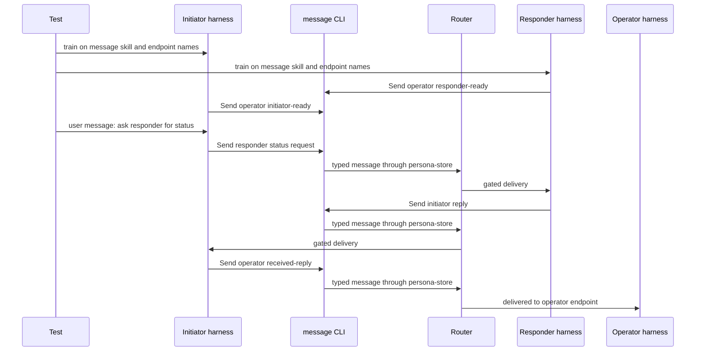

Two points are non-negotiable:

- agents do not create message IDs; the daemon/router does;
- the operator endpoint must be a real route, not a shell-call return value.

The old NOTA-line prototype helped prove syntax and live harness behavior, but
the next test should route through the daemon/router and inject through the same
delivery gate used for all harnesses.

---

## Implementation order

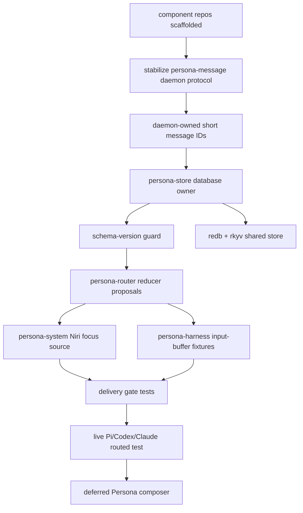

First concrete tasks:

1. Move `persona-message` from the NOTA-line prototype toward a
   store-backed route: the CLI submits to a Unix socket; the
   store stamps the ID and returns an accepted/delivered/queued result.
2. Define the store command/result envelope. Use length-prefixed rkyv frames
   for local binary traffic: a 4-byte big-endian length followed by one rkyv
   archive of the channel's `Frame` type. Keep NOTA for harness text and audit
   projections.
3. Implement `persona-store` as the single database owner and transition
   sequencer for the first message-routing plane.
4. Add the version-skew guard before any durable table work: a known-slot schema
   record checked at startup, with hard failure on mismatch.
5. Implement `persona-router`'s delivery reducer as typed transition proposals
   with fake system and harness event sources first.
6. Add redb + rkyv storage in `persona-store` for pending deliveries and
   delivery transitions.
7. Implement the first `persona-system` Niri focus source behind the generic
   event interface.
8. Implement fixture-driven input-buffer recognizers in `persona-harness`.
9. Re-run live harness tests only after the gate has fake-source coverage.

---

## Tests to land before live harness runs

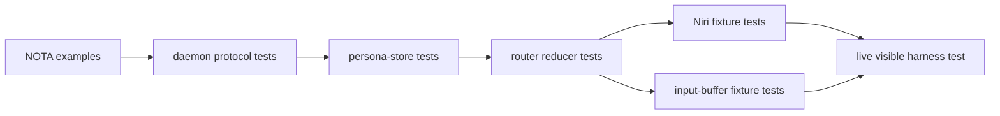

| Test | Expected result |
|---|---|
| CLI sends without ID | daemon assigns short ID |
| CLI names unknown recipient | typed rejection |
| target focused | message queued with `blocked_on_focus` |
| unrelated focus change | target queue untouched |
| target unfocused but input occupied | queued with `blocked_on_non_empty_input` |
| target unfocused and input empty | delivered once |
| missing focus source | queued; no fallback poll |
| window closes | `BindingLost`; pending messages remain queued or expire |
| window closes mid-delivery | endpoint write fails or noops; message becomes deferred or a typed delivery error; no orphan bytes go to a stale endpoint |
| TTL deadline fires | message becomes `Expired` without retry |
| operator endpoint receives | message appears in the operator harness, not only in test logs |

The live harness test should start with Pi because it is local and unpaid, then
repeat on Codex and Claude only after the path is stable.

---

## Decisions still needing the human

| Decision | Default recommendation |
|---|---|
| Pending-message TTL | 24 hours, configurable per harness; no infinite memory growth |
| Manual discharge command name | `message discharge <id>` or equivalent in the CLI |
| Human composer priority | defer until routed harness delivery is stable |
| Focus lease / compositor-level lock | future Persona-system work; not a blocker for the first safe gate |
| macOS/X11/Hyprland support | port later behind `persona-system`; no fallback polling |

---

## What is retired

The old operator reports captured useful discovery but are no longer the best
entry point:

| Old report | Live substance now here |
|---|---|
| `1-persona-core-state-pass.md` | reducer/state discipline, redb + rkyv direction |
| `2-terminal-harness-control-research.md` | harness node and remote-first adapter model |
| `3-persona-wezterm-harness-plan.md` | WezTerm remains an adapter, not the core truth |
| `4-persona-message-plane-design.md` | message/delivery/output/state split |
| `5-persona-message-real-harness-test-plan.md` | live harness test strategy |
| `7-minimal-niri-input-gate.md` | focus/input gate and Niri first slice |
| `8-persona-system-repo-plan.md` | repository split and implementation order |

The surviving designer reports remain useful as audit history and independent
design review. Future operator work should start here, then read the designer
reports only when it needs audit lineage.
