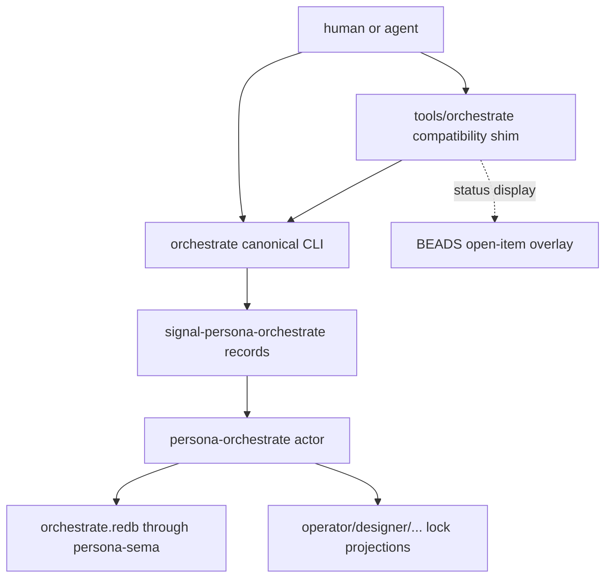
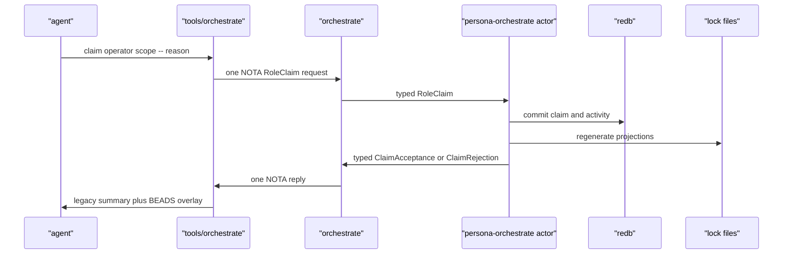
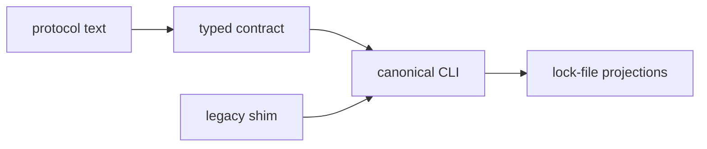
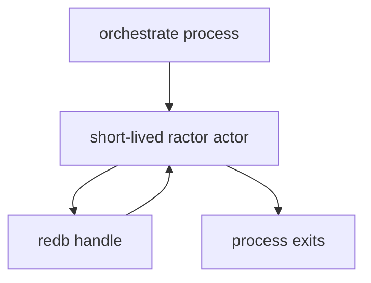
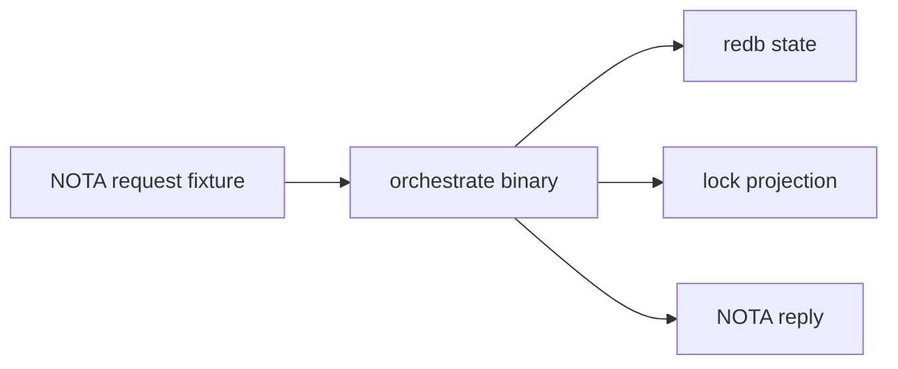

# Orchestrate CLI And Protocol Fit

## Read Set

- `protocols/orchestration.md`: current workspace coordination protocol.
- `tools/orchestrate`: current bash helper and lock-file writer.
- `reports/designer/93-persona-orchestrate-rust-rewrite-and-activity-log.md`: designer's current architecture for the Rust rewrite.
- `repos/signal-persona-orchestrate/ARCHITECTURE.md`: contract boundary for typed coordination records.
- `repos/signal-persona-orchestrate/src/lib.rs`: current request/reply record vocabulary.
- `repos/persona-orchestrate/ARCHITECTURE.md`: component target shape.
- `skills/contract-repo.md`, `skills/rust-discipline.md`, `skills/system-specialist.md`, `skills/architectural-truth-tests.md`: relevant discipline.

## Position

`orchestrate` should become a typed CLI facade over the same records used by the `signal-persona-orchestrate` contract. The existing `tools/orchestrate` script should survive only as a compatibility shim until all agents use the canonical one-record CLI.

The new protocol should not be "bash commands, then typed state behind them." The protocol should be "typed request in, typed reply out," with lock files as a projection for human and legacy agent visibility.



## Current Fit

The designer report establishes a good migration path:

| Surface | Current | Target |
|---|---|---|
| Agent command | `tools/orchestrate claim operator path -- reason` | `orchestrate '<one NOTA request>'` |
| State | role lock files | `orchestrate.redb` |
| Legacy visibility | lock files are authoritative | lock files are regenerated projections |
| Activity | mostly chat/report memory | durable `Activity` rows |
| BEADS | shown beside lock status | still external and transitional |

The important alignment is that `persona-orchestrate` owns coordination state. BEADS is not an ownership system, and it should not become part of this contract.

## CLI Shape

The real binary should accept exactly one NOTA record and print exactly one NOTA record:

```text
orchestrate '<OrchestrateRequest record>'
```

No flags, no subcommands, no environment-selected behavior.

The compatibility shim can keep old ergonomics:

```text
tools/orchestrate claim operator repos/persona-orchestrate -- implement typed CLI
tools/orchestrate release operator
tools/orchestrate status
```

But that shim should only translate old syntax into the canonical request, then call `orchestrate`.



## Contract Gap

`signal-persona-orchestrate` currently derives `rkyv` traits, but it does not derive NOTA projection traits. That leaves two implementation choices:

| Option | Result |
|---|---|
| Add NOTA derives to the contract records | CLI can parse and print the same typed records it sends internally. |
| Create separate CLI projection records in `persona-orchestrate` | Avoids text traits in the contract repo, but creates duplicate vocabulary. |

I recommend adding NOTA derives to the contract records as projection capability, not policy. The contract repo still should not own CLI behavior. The `persona-orchestrate` binary owns parse/render policy, validation, and error presentation.

This should be decided before implementation starts, because duplicate CLI records would create drift pressure immediately.

## Protocol Changes

`protocols/orchestration.md` should become layered:



The updated protocol should state:

1. The protocol truth is `signal-persona-orchestrate`.
2. `orchestrate '<one NOTA request>'` is the canonical command surface.
3. `tools/orchestrate` is a compatibility shim.
4. Lock files are projections regenerated after state commits.
5. Claim, release, and handoff create activity entries automatically.
6. Manual activity uses `ActivitySubmission`.
7. BEADS remains external and never becomes an ownership lock.
8. `status` may display BEADS beside coordination state, but BEADS is not part of `RoleSnapshot`.

## State Rules

The Rust component should make these rules explicit:

| Rule | Reason |
|---|---|
| Claims commit in one transaction | Prevent split state between claim table and activity table. |
| Lock projections regenerate after commit | File visibility follows durable truth. |
| Requests do not supply timestamps | The component timestamps committed facts. |
| `TaskToken` stores the token without brackets | Brackets are a legacy CLI display convention. |
| `WirePath` stores normalized absolute paths | Relative paths should not become durable coordination keys. |
| `RoleRelease` releases all scopes for a role | Matches current protocol. Partial release can be a later typed request. |
| `RoleObservation` has a documented recent-activity limit | The current empty request implies an implementation default. |

## Actor Lifetime

Designer/93 says "no daemon" and also describes a state actor. These can fit if the first version spawns the actor inside each CLI invocation:



That keeps the actor boundary real without introducing a long-lived daemon. A daemon can come later when subscriptions or push notifications require it.

## Compatibility Shim

The shim should preserve current habits while removing protocol authority from shell:

| Old command | Canonical request |
|---|---|
| `claim <role> <scopes> -- <reason>` | `RoleClaim` |
| `release <role>` | `RoleRelease` |
| `status` | `RoleObservation` plus external BEADS display |

The shim may keep shell parsing for human convenience, but it should not write lock files directly after the Rust CLI lands.

## Architectural-Truth Tests

The tests should look unusual on purpose. They must prove that architecture was followed, not just that the happy path returns success.



Required witnesses:

| Test | What it proves |
|---|---|
| canonical claim writes `orchestrate.redb` and lock projection | State truth is durable DB, not direct file mutation. |
| legacy shim claim produces same state as canonical claim | Compatibility surface is only translation. |
| conflicting claim returns typed `ClaimRejection` | Conflict is contract data, not stderr text. |
| claim/release both append activity rows | Activity is automatic and durable. |
| request-supplied timestamp is impossible | Time is owned by the component. |
| relative path request is rejected or normalized before commit | Durable scopes are not cwd-dependent. |
| `status` after DB mutation can regenerate missing lock files | Lock files are projections. |
| `tools/orchestrate status` can display BEADS without storing BEADS | BEADS remains external and transitional. |

## Implementation Slices

1. Update `signal-persona-orchestrate` with NOTA projection derives, or explicitly decide to use separate CLI projection records.
2. Rewrite `persona-orchestrate` around a data-bearing service and short-lived ractor actor.
3. Add `persona-sema` backed tables for claims, activities, and metadata.
4. Implement the one-record `orchestrate` CLI.
5. Convert `tools/orchestrate` into a shim that calls the Rust binary.
6. Update `protocols/orchestration.md` to name typed contract truth and projection semantics.
7. Add Nix-created tests for canonical CLI, compatibility shim, conflict handling, activity, and projection regeneration.

## Decisions To Surface

1. Should `signal-persona-orchestrate` carry NOTA derives directly? I recommend yes.
2. Should v1 spawn a short-lived ractor actor per CLI invocation? I recommend yes, because it preserves the actor boundary without requiring a daemon.
3. Should `RoleObservation` include BEADS? I recommend no. The shim can display BEADS externally until BEADS is retired.
4. Should `WirePath::new` validate absolute normalized paths in the contract crate, or should validation live in `persona-orchestrate`? I recommend validation in `persona-orchestrate` first, with contract constructors tightened later if needed.
5. Should the first protocol update happen before or after the Rust CLI lands? I recommend a two-step update: first document the target layer, then switch authority after tests pass.
