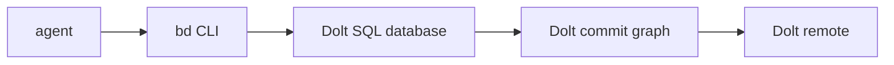
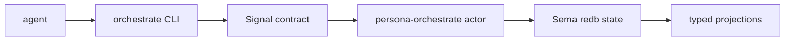
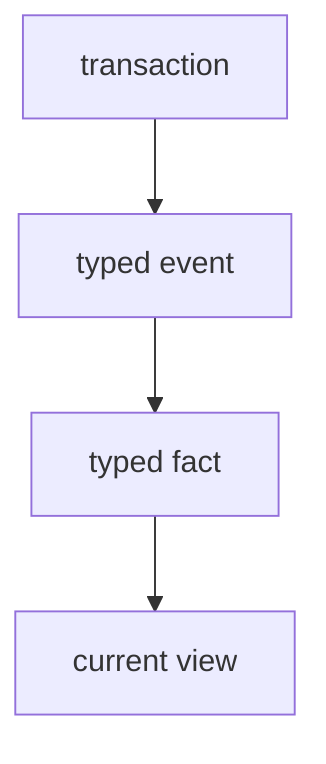
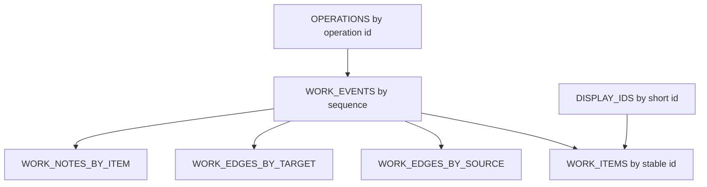
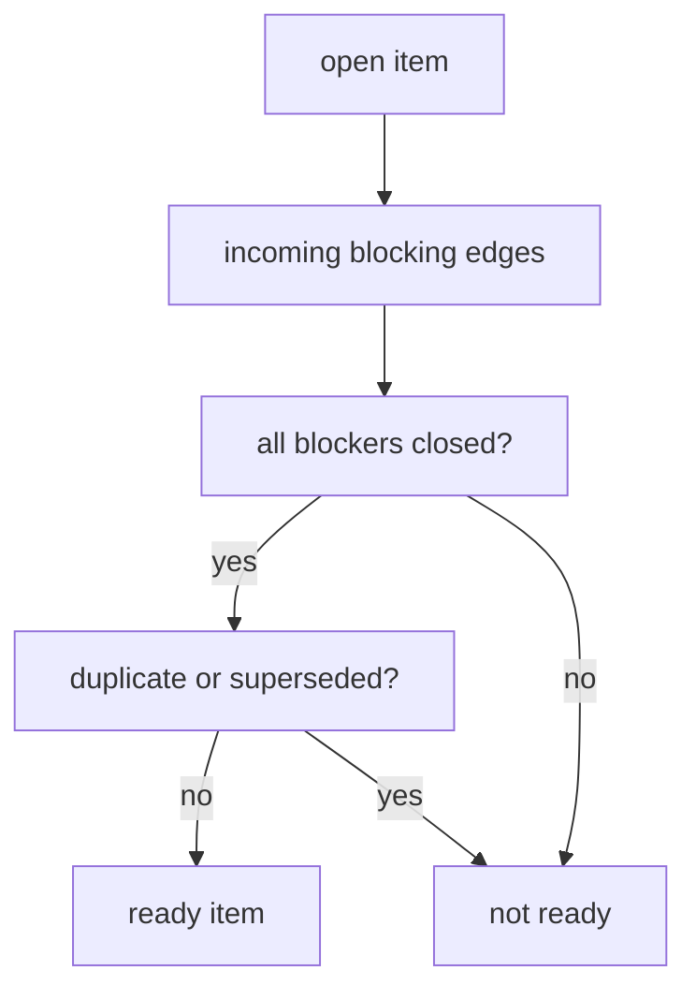
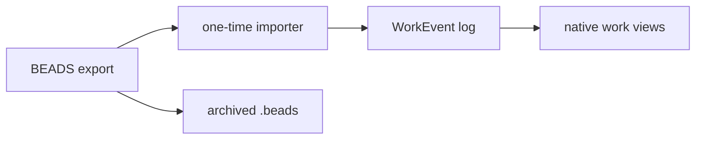

# Native Issue And Notes Tracker Research

## Position

We should retire BEADS as part of the `persona-orchestrate` implementation, not preserve it as a sidecar. BEADS has useful ideas, but its storage and command surface pull against the workspace direction:

- Persona wants typed Signal contracts, ractor actors, and Sema-backed component state.
- BEADS is an external Dolt-backed issue graph with a broad CLI surface and string-heavy schema.
- The current embedded BEADS mode already shows the wrong concurrency shape for multi-agent coordination.

The replacement should be a native typed work graph owned by Persona orchestration.

## Local Findings

Local probes in `/home/li/primary`:

| Probe | Result |
|---|---|
| `bd --version` | `bd version 1.0.0 (dev)` |
| `.beads/metadata.json` | backend is Dolt, mode is embedded |
| `bd --readonly status` | 45 total issues, 26 open, 25 ready |
| `bd --readonly sql 'show tables;'` | unsupported in embedded mode |
| concurrent readonly calls | one command hit the embedded backend exclusive lock |

That exclusive-lock behavior is not a coordination lock, but it is a real storage substrate problem for agents. BEADS documentation says embedded mode is for single-use/single-process scenarios and Dolt server mode is the concurrent-agent path. That confirms the mismatch: making BEADS reliable here means adopting another daemon and another versioned database semantics layer beside Sema.

## What BEADS Got Right

BEADS should be treated as a strong prototype, not as the destination.

| BEADS idea | Keep? | Persona interpretation |
|---|---:|---|
| Short hash IDs | Yes | Keep short display IDs, backed by full stable IDs. |
| Dependency-aware ready queue | Yes | Native graph query: ready = open work with no open blocking ancestors. |
| Notes/comments on issues | Yes | Notes are typed events, not side text. |
| Graph visualization | Yes | Export typed graph views to DOT/Mermaid/GUI. |
| Dolt version history | Conceptually | Use append-only Sema event log plus operation IDs. |
| Branch/merge of tracker state | Later | Model as operation/view heads, inspired by Jujutsu and Dolt. |
| JSON-first CLI | No | Persona uses NOTA for text. |
| Dolt as source of truth | No | Sema is source of truth. |
| Formulas/gates/molecules | Not v1 | Rebuild only when typed workflow needs prove them. |
| Memories | No | Durable knowledge belongs in typed records and reports. |

## Dolt Research

Dolt is a SQL database with Git-like table versioning: commits, branches, diffs, merges, remotes, and history. It is impressive for table-shaped data, especially human SQL inspection and cell-level diff/merge.

The trade-off is that Dolt is a second world:



For Persona this is the wrong center of gravity. We already have the planned center:



Dolt lessons worth stealing:

- Separate durable history from current views.
- Make diffs and history first-class user operations.
- Preserve enough operation metadata to explain who changed what and why.
- Treat branch/merge as domain-level state, not just file history.

Dolt pieces not to adopt in v1:

- SQL as the internal domain model.
- Dolt server as another required daemon.
- JSONL export as routine data flow.
- Cell-level merge as substitute for typed conflict rules.

## Advanced Version-Control Lessons

### Jujutsu

Jujutsu's operation log is the most relevant model. It distinguishes repository operations from commits and can merge divergent operation views. For Persona work tracking, this suggests:

- every CLI request becomes an operation;
- every operation records parent operation, actor, request hash, reply hash, and resulting view head;
- the current work graph is a projection of operation history;
- future concurrent/offline operation heads can be merged explicitly.

### Pijul

Pijul models repository content as a graph of lines and patch identities. Its useful lesson is identity-preserving change:

- a work item is not "a row that mutates";
- a note is not "a string appended to a blob";
- an edge is not "a label in a list";
- each semantic change has identity and can be reasoned about independently.

That points toward an event/fact log plus materialized views.

### Fossil

Fossil integrates version control, tickets, wiki, forum, chat, and technotes into one coherent tool. The lesson is not to copy the implementation, but to avoid splitting coordination memory across many unrelated tools.

Persona should have one work graph that can hold:

- tasks;
- questions;
- decisions;
- notes;
- report references;
- handoffs;
- defects;
- blocked states;
- implementation observations.

### Git And Dolt

Git/Dolt state commits are useful for snapshots and replication. They are weaker for semantic issue workflows unless paired with domain events. Persona should commit semantic events first and derive snapshots second.

## Graph Knowledge Lessons

### Datomic

Datomic is the closest conceptual match: immutable facts, transaction time, and queryable database values. The shape maps well to Sema:



Persona should not clone Datomic, but it should copy the "facts plus transaction time" discipline:

- facts are never silently overwritten;
- current state is a derived value;
- history is queryable without special backups;
- notes and issues share the same event/fact machinery.

### RDF And SPARQL

RDF proves the power of graph-shaped data: triples connect resources, and named graphs add context. SPARQL proves graph pattern queries matter.

Persona should not adopt RDF syntax, IRIs, Turtle, JSON-LD, or SPARQL. The useful abstraction is:

- typed nodes;
- typed edges;
- graph contexts;
- pattern queries;
- validation of graph shape.

In Persona, the concrete form is Signal records stored by Sema and rendered as NOTA only at the text boundary.

### CRDTs

CRDT systems like Automerge show how offline replicas can converge without central coordination. This is not a v1 need, but append-only notes and edge events can be designed so many operations commute naturally:

- adding two notes commutes;
- adding two unrelated edges commutes;
- closing and reopening the same item requires explicit ordering/conflict rules;
- editing a note body is harder than appending a correction note.

This reinforces append-only notes over mutable note blobs.

## Proposed Native Model

Name recommendation: `persona-work` for the domain, with `signal-persona-work` as the contract repo if the vocabulary is split from `signal-persona-orchestrate`.

The component receiver can still be `persona-orchestrate`. The key is that the work-tracker vocabulary is isolated from role claim/release vocabulary.

```mermaid
flowchart TD
    cli["orchestrate CLI"]
    workcli["work convenience shim"]
    contract["signal-persona-work"]
    orch["persona-orchestrate actor"]
    sema["orchestrate.redb"]
    graph["work graph projection"]
    locks["lock projections"]

    workcli --> cli
    cli --> contract
    contract --> orch
    orch --> sema
    sema --> graph
    sema --> locks
```

### Core Records

| Record | Purpose |
|---|---|
| `WorkItem` | Current projected item state. |
| `WorkEvent` | Append-only semantic change. |
| `WorkNote` | A typed note event with body and references. |
| `WorkEdge` | Typed relationship between items. |
| `WorkQuery` | Query request: ready, blocked, by role, by label, closure. |
| `WorkView` | Query reply/projection. |
| `DisplayId` | Short human/LLM-facing ID. |
| `StableItemId` | Full collision-resistant ID stored internally. |

### Item Kinds

Keep the initial set small:

| Kind | Meaning |
|---|---|
| `Task` | Work to be done. |
| `Defect` | Something wrong. |
| `Question` | Decision needed. |
| `Decision` | Durable answer. |
| `Note` | Observation without required action. |
| `ReportRef` | Pointer to a report. |
| `Handoff` | Cross-agent continuity record. |

### Edge Kinds

| Edge | Ready-queue effect |
|---|---|
| `Blocks` | Yes. Target cannot be ready until source closes. |
| `DependsOn` | Yes, inverse wording of `Blocks`; store one normalized form. |
| `ParentOf` | No by itself. |
| `DiscoveredFrom` | No. |
| `RelatesTo` | No. |
| `Duplicates` | Usually hides duplicate from ready queue. |
| `Supersedes` | Usually hides superseded item from ready queue. |
| `Answers` | Closes or resolves a question by policy. |
| `References` | No. |

## Sema Tables

The implementation should use append-only truth plus projections:



| Table | Key | Value |
|---|---|---|
| `WORK_EVENTS` | `EventSeq` | `WorkEvent` |
| `WORK_ITEMS` | `StableItemId` | `WorkItem` projection |
| `DISPLAY_IDS` | `DisplayId` | `StableItemId` |
| `WORK_EDGES_BY_SOURCE` | `(StableItemId, EdgeKind, StableItemId)` | `WorkEdge` |
| `WORK_EDGES_BY_TARGET` | `(StableItemId, EdgeKind, StableItemId)` | `WorkEdge` |
| `WORK_NOTES_BY_ITEM` | `(StableItemId, EventSeq)` | `WorkNote` |
| `OPERATIONS` | `OperationId` | operation metadata |

No table should store JSON. Human text belongs inside typed fields as provisional natural language, not as schema.

## ID Design

Keep two IDs:

| ID | Audience | Shape |
|---|---|---|
| `StableItemId` | Storage/protocol | full hash or generated bytes. |
| `DisplayId` | Humans/LLMs | short prefix like `p-9iv`, with collision repair. |

Short IDs matter because LLMs pay for opaque strings. The short ID should be an alias, not the whole identity.

Collision policy:

1. Generate stable ID from workspace salt + event sequence + request hash.
2. Generate short display prefix.
3. If prefix collides, extend by one character.
4. Store alias in `DISPLAY_IDS`.
5. Never ask agents to invent IDs.

## CLI Shape

Canonical surface stays one NOTA record:

```text
orchestrate '<WorkRequest record>'
```

Convenience shims are acceptable only as translators:

```text
work '<WorkRequest record>'
issue '<WorkRequest record>'
note '<WorkRequest record>'
```

The shims must not own storage, locks, projection, or parsing policy beyond building the canonical record.

Human-friendly examples should be generated from real fixtures after the contract lands. Do not invent syntax in docs before the derive/parser path exists.

## Ready Query

The BEADS `ready` command is the feature we most need to preserve.



The ready query should be a method on a data-bearing query object, not a free function. It should operate on typed edge indexes and item status projections.

## Migration From BEADS

Do a one-time import, not a bridge.



Migration rules:

1. Freeze BEADS writes.
2. Export `bd export --all`.
3. Convert every issue into `WorkItemOpened` plus typed follow-up events.
4. Preserve old BEADS IDs as aliases.
5. Convert descriptions/comments into `WorkNote` events.
6. Convert dependency counts and labels into typed edges/labels where recoverable.
7. Archive `.beads/` read-only.
8. Remove BEADS from required agent startup checks.

No `persona ↔ bd` bridge. No long-term dual-write.

## Architectural Tests

The native tracker needs tests that enforce architecture, not just behavior:

| Test | It catches |
|---|---|
| Creating an item writes `WORK_EVENTS` before `WORK_ITEMS` | Projection-as-truth regression. |
| Missing `WORK_EVENTS` row makes projection regeneration fail | Silent state mutation. |
| `DisplayId` collision extends alias, not stable ID | Agent-visible ID instability. |
| Ready query ignores `ParentOf` but respects `Blocks` | Edge semantics drift. |
| Closing a blocker makes dependent item ready without polling | Push/query semantics. |
| Convenience `work` shim and canonical `orchestrate` request produce same event | CLI side authority creep. |
| BEADS import preserves old IDs only as aliases | BEADS bridge reintroduction. |
| Note correction appends a new event instead of mutating old note | History loss. |

## Recommendation

Build a native `persona-work` vocabulary and store it in `persona-orchestrate`'s Sema database in the same implementation wave that replaces the shell `tools/orchestrate`.

Minimal v1:

1. `signal-persona-work` contract repo.
2. `WorkItem`, `WorkEvent`, `WorkEdge`, `WorkNote`, `WorkQuery`, `WorkView`.
3. `persona-orchestrate` consumes both `signal-persona-orchestrate` and `signal-persona-work`.
4. `orchestrate` remains the canonical one-NOTA CLI.
5. `work` can be a shim for issue/note ergonomics.
6. One-time BEADS importer.
7. No Dolt dependency in the native path.

## Open Decisions

1. Should the contract be split as `signal-persona-work`, or folded into `signal-persona-orchestrate` for v1?
   - I recommend split contract, same receiving actor.
2. Should the convenience command be named `work`, `issue`, or `note`?
   - I recommend `work`; issues and notes are both work-graph items.
3. Should old BEADS IDs keep the `primary-` prefix forever as aliases?
   - I recommend yes for imported items only.
4. Should closed BEADS entries be imported?
   - I recommend yes, because they contain decisions and historical rationale.

## Sources

- Local probes: `bd --version`, `bd --readonly status`, `.beads/metadata.json`, `.beads/config.yaml`.
- [Beads documentation introduction](https://gastownhall.github.io/beads/): Dolt-powered, hash IDs, dependency-aware execution, formulas, multi-agent coordination.
- [Beads architecture](https://gastownhall.github.io/beads/architecture): Dolt as source of truth, embedded vs server mode, multi-writer server mode, trade-offs.
- [Beads core concepts](https://gastownhall.github.io/beads/core-concepts): issue fields, dependency kinds, hash-based IDs, formulas.
- [Dolt version-control features](https://docs.dolthub.com/sql-reference/version-control): commit graph, branches, diff, merge, history.
- [Dolt Git concepts](https://docs.dolthub.com/concepts/dolt/git): Git-style concepts on tables.
- [Dolt version-controlled database guide](https://docs.dolthub.com/introduction/getting-started/database): branches, rollback, diffs, logs, merge, cell lineage.
- [Doltgres merge docs](https://docs.doltgres.com/reference/version-control/merges): SQL-visible conflict tables and resolution.
- [Dolt transactions](https://docs.dolthub.com/concepts/dolt/sql/transaction): SQL transaction layer plus Dolt branches as longer-running transactions.
- [Jujutsu concurrency docs](https://jj-vcs.github.io/jj/latest/technical/concurrency/): operation log, view objects, divergent operation merge.
- [Pijul theory](https://pijul.com/manual/theory.html): graph of lines, identity-preserving changes, append-only edge labeling.
- [Fossil SCM docs](https://fossil-scm.org/home/doc/trunk/www/index.wiki): integrated distributed VCS, bug tracker, wiki, forum, chat, technotes.
- [Datomic transaction model](https://docs.datomic.com/transactions/model.html): immutable facts, transaction time, current value as product of transactions.
- [RDF 1.2 Primer](https://www.w3.org/TR/rdf12-primer/) and [RDF 1.2 Concepts](https://www.w3.org/TR/rdf12-concepts/): triples, graphs, datasets, named graphs.
- [SPARQL 1.2 Query Language](https://w3c.github.io/sparql-query/spec/): basic graph pattern matching and named graph queries.
- [Automerge glossary](https://automerge.org/docs/reference/glossary/): CRDT motivation for independent concurrent edits and synchronization.
