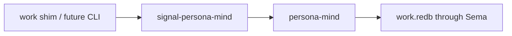

# Designer 98 Integration

## Integrated Decisions

I read `reports/designer/98-critique-of-operator-95-orchestrate-cli-protocol-fit.md`
and applied the parts that affect the current layout work.

| Designer 98 point | Integration |
|---|---|
| `persona-mind` must be separate from `persona-mind` | Created `/git/github.com/LiGoldragon/persona-mind` as its own bounded-context scaffold. |
| `signal-persona-mind` should stay split from `signal-persona-mind` | Created `/git/github.com/LiGoldragon/signal-persona-mind` as a separate contract repo. |
| Work records should not carry crate-name prefixes | Renamed contract payload records to `Item`, `Event`, `Edge`, `Note`, `Query`, `View`, etc. |
| `ReportRef` should not be an item kind | Removed it; report links are `EdgeKind::References` to `ExternalReference::Report(ReportPath)`. |
| Keep one canonical dependency edge | Used `EdgeKind::DependsOn`; dropped `Blocks`. |
| Drop loose duplicate discovery edge | Kept `RelatesTo`; dropped `DiscoveredFrom`. |
| New display IDs should not inherit `primary-` | Documented short lowercase base32 `DisplayId`; imported BEADS IDs survive only as aliases. |
| Mind Rust rewrite and work graph are separate waves | Updated `protocols/orchestration.md` to keep `primary-9iv` focused on role coordination and make BEADS retirement a later `persona-mind` wave. |
| Do not use hashes in `flake.nix` | Both new flakes use `fenix.stable.withComponents`; exact pins live in `flake.lock`. |

## Repos Laid Out

`signal-persona-mind` now owns the typed request/reply vocabulary only.
`persona-mind` owns the runtime boundary and will later own `work.redb`.

## Remaining Follow-Up

Designer/98 also corrects operator/95 on the role-orchestrate side:

- no short-lived ractor for the one-shot `orchestrate` CLI;
- `WirePath` and `TaskToken` validation should move into the
  `signal-persona-mind` contract from day one;
- `signal-persona-mind` should derive NOTA projection traits because it
  has a CLI consumer;
- `RoleObservation` should document the recent-activity default.

I did not touch `signal-persona-mind` in this pass. That belongs in the
`primary-9iv` wave before the Rust `persona-mind` implementation starts.
