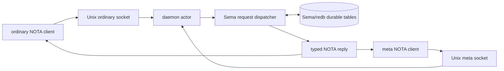
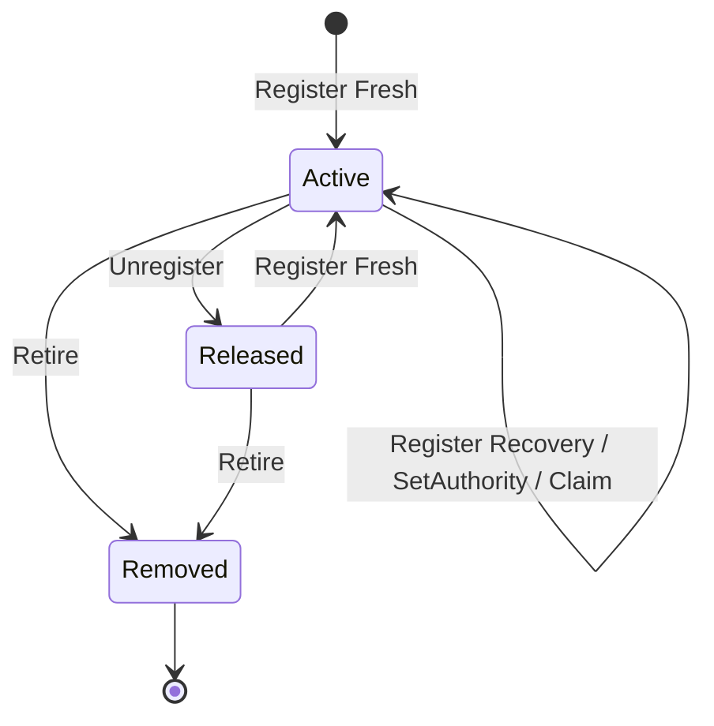
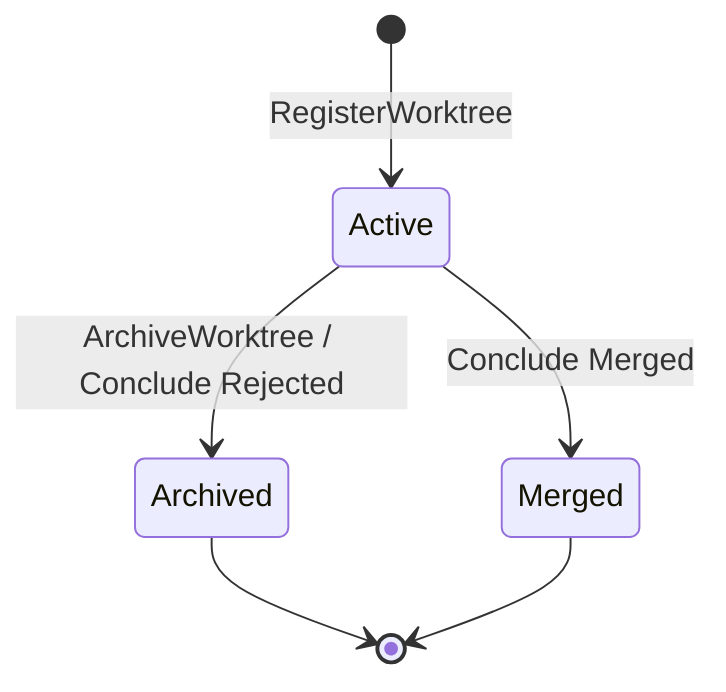

# Orchestrate current functionality visualization

Scope: Orchestrate `main` after the stateful-scenario corrections (0.18.5 worktree), inspected against its pinned `signal-orchestrate` 0.10.1 and `meta-signal-orchestrate` 0.5.0 contracts. This is an implementation map, not a promise of deployment behavior.

## Observations

The daemon's state owner is `OrchestrateTables`; ordinary and meta clients each take one NOTA request and receive one NOTA reply. `Observe` and `Query` are read dispatches. The source contains no `Command::new`, VCS invocation, path canonicalization, `/proc` probe, repository scan, or worktree creation/removal in this boundary.

Registration is global by lane name. A second Fresh request receives `LaneAlreadyRegistered(FreshConflict)`; Recovery receives `LaneAlreadyRegistered(RecoveryInherited)` and updates its observation stamp. Unregister leaves a `Released` row; Retire deletes the row and its claims. This task removes automatic age-based deletion; elapsed time remains presentation metadata, never authority.

| Area | Requests / transition | Durable effect | Refusal or partial semantics |
|---|---|---|---|
| Lanes | meta `Register`, `Unregister`, `ClearSession`, `Retire(Lane)`, `SetAuthority` | lane rows; claims removed on terminal actions; session clear retires its agent records | unregistered lane operations are typed engine rejection; Fresh collision and Recovery inheritance are typed replies |
| Roles | meta `Create`, `Retire(Role)` | role row with declared report paths | duplicate is `RoleCreationRejected(RoleAlreadyExists)` |
| Claims | ordinary `Claim`, `Release`, `Handoff`, `Observe(Roles)` | claim rows keyed by lane and scope | overlap yields `ClaimRejection`; handoff without source ownership yields `HandoffRejection` |
| Activity | ordinary `Submit`, `Query` | latest 256 activity rows | Query filters by role, path prefix, and exact task token; it is a read |
| Observation | ordinary `Observe(Roles/Sessions/SessionLanes/Lanes/Worktrees/Repositories/Topics/Topic/Agents)` | none | an unavailable topic currently travels as a `PartialApplied` output through the schema bridge |
| Watch | ordinary `Watch`, `Unwatch` | process-local observation token only | no background polling or durable stream registry is implemented |
| Agents/topics | ordinary `RegisterAgent`, `MintAgentIdentity`, `LaunchAgent`, `SendOrchestratorMessage` | agent, topic, membership, and triage-audit rows | Automatic topics fail closed as `JudgeUnavailable`; launch without an eligible harness returns typed refusal; absent sender/recipient/coordinator returns typed message rejection |
| Repository | meta `Refresh`, ordinary `Observe(Repositories)` | no request creates repository rows on this contract | Refresh reports the stored row count only; host discovery is absent |
| Worktree | meta `RegisterWorktree`, `RefreshWorktreeIndex`, `ArchiveWorktree`; ordinary `RequestWorktree`, `ConcludeWorktree`, `Observe(Worktrees)` | caller-supplied worktree row; Archive/Rejected/Merged status transitions | `RequestWorktree` is deliberately `WorktreeRequestRejected(RepositoryNotFound)`; missing and ambiguous lane-only conclusions are typed `PartialApplied` refusals and make no transition |
| Workflow / handover | ordinary workflow operations and upgrade socket handover | workflow records / handover state where valid contract inputs reach them | the packaged check runs fixture workflow/observation/retraction, proves absent-harness refusal, and uses an isolated local peer that exchanges real framed meta-harness protocol replies for one resolved and one unavailable model; upgrade structurally exercises every operation |

Durable tables observed in `tables.rs` include roles, lanes, claims, repositories, worktrees, activity, divergences, workflow model resolutions, orchestrator agents, topics, topic membership, and triage audit records. Store migrations preserve legacy repository paths but translate missing identity to `IdentityUnknown`; they do not inspect a checkout remote.

The diagram's final arrows mean an explicit future removal request would be needed; current source has no automatic tombstone reaper after this task.

## Stateful Nix scenario

`checks/stateful-nix-scenario.sh`, exposed as `checks.stateful-nix-scenario`, launches packaged daemon, ordinary client, meta client, structural NOTA assertion helper, and upgrade client with temporary store and Unix sockets. The response helper parses the published ordinary/meta output enums and compares typed routes; it does not use reply substrings.

| Scenario witness | Covered result |
|---|---|
| role create / duplicate / retire | acceptance and `RoleCreationRejected` |
| three named lanes | Fresh, duplicate Fresh, Recovery, authority change, release, retire |
| claims | acceptance, nested contention, handoff, release |
| activity | submit, task-filtered query, restart persistence; unit witness proves the exact 256-record activity window |
| agent/topic/message | explicit seating, topic and directory reads, routed message with local degradation, missing-coordinator rejection |
| agent allocation / launch | mint and typed unknown-agent/harness-free refusal routes |
| watches | open and close token |
| workflow | generated typed fixture runs workflow, opens/closes its observation, observes the resolved-workflow no-meta-harness refusal, then exchanges real framed protocol with an isolated local harness for `WorkflowResolutionAccepted` and `WorkflowResolutionUnavailable` |
| repository / worktree | state-only refresh/read, request refusal, registration, archive, rejected and merged conclusion, restart persistence |
| restart/store shape | after daemon shutdown, a typed direct store reader checks exact activity slot/task, active lane and claim scope, archived and merged worktree identities/statuses, agent/session/status, topic membership, triage evidence, and both workflow-resolution rows; the same reader fails against a fresh empty store |
| purity | declared worktree paths remain absent; no checkout or VCS operation is requested |
| upgrade socket | `NotReady`, divergence acknowledgement, schema mismatch, valid `MirrorAcknowledged` restoration of known lanes and claims, both recovery outcomes, stale-marker `CommitSequenceAdvanced`, `AlreadyInHandover`, and finalization; final state retires ordinary/meta sockets while retaining the upgrade socket |

## Time presentation

`orchestrator_presentation.rs` uses the shared `relative-age-display` crate. Its private `PresentedAge` trait converts `DurationNanos`; `ObservationClock` converts timestamps against one captured clock. Existing unit tests cover typed minutes/days, timestamps ahead of the clock, and the hour ladder. The stateful scenario does not assert a wall-clock-dependent label; durable state is proven by typed response shape and restart observations. No new scattered duration formatter was added.

## Gaps and deferred acceptance case

Observation: `RequestWorktree` always returns `WorktreeRequestRejected(RepositoryNotFound)` and neither it nor `Claim` returns existing related work, a logical work line, or an age. No durable table or request currently represents the relation needed to answer that request.

Proposal, not implemented: after the psyche chooses whether the public identity is a branch/bookmark or a logical work line, add an acceptance case: a repository claim/reservation reply names existing related durable work and presents its age through the shared duration projection. This task deliberately does not guess a schema, compatibility surface, or migration.

Other observed gaps: repository rows are observable but have no current request-supplied registration operation; automatic topic judgment is intentionally unavailable; a missing topic currently appears as schema-level `PartialApplied` rather than a dedicated topic-not-found reply. A successful resolved workflow still depends on an external harness in production. The state-only scenario proves the daemon's accepted and unavailable branches against an isolated local protocol peer; it does not establish a deployment integration with a live harness.

## Retention distinction

The removal in this task is only automatic age- or host-path-based lane/table reclamation. It does not remove the established current-reality limits: activity retains 256 records, divergences retain 128, and triage audit retains 256. Table tests witness each exact bound; these count windows are not abandonment inference and do not act on lanes, claims, paths, or elapsed time.
