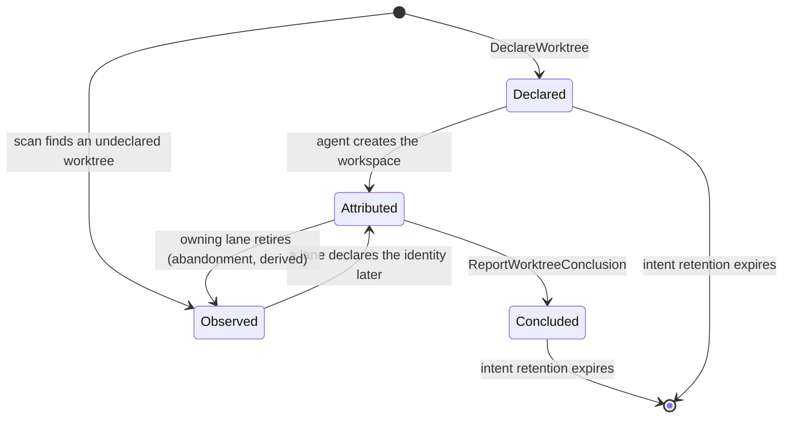

# Orchestrate Worktree Redesign — Knowing Without Doing

**Status:** design specification, ready to build from
**Ruling being implemented (psyche):** Orchestrate stops mutating the filesystem. It keeps being the source of knowledge. Agents do the `jj` work. A doing-component, if ever built, is a separate component with its own contract.
**Second ruling:** a stored record that purports to describe the filesystem is a lie, because the filesystem can change without it. Derived state must be derived at the moment it is needed, not maintained as a parallel ledger.

## 0 · Verified facts

The key discovery: `jj` will tell you the whole truth itself, cheaply.

```
jj --ignore-working-copy -R <source> workspace list -T 'self.name() ++ "\t" ++ self.root() ++ "\n"'
```

Verified on jj 0.40. Returns each workspace's name and absolute root path directly from the source store. `.root()` is a real `WorkspaceRef` method; the `self.` prefix is required. Sweeping all 211 source checkouts under `/git/github.com/LiGoldragon` takes 3.9 seconds wall and returns 1023 entries. This replaces directory-walking as the primary derivation source.

| Fact | Measured |
|---|---|
| Source checkouts under /git/github.com/LiGoldragon | 211 |
| jj workspace entries, total | 1023 |
| named `default` (the source itself) | 208 |
| stale — root path no longer resolves | 186 |
| `<Error: Workspace has no recorded path>` | 3 |
| resolvable non-default workspaces | 629 |
| ~/wt nested dirs with .jj at depth 2 | 259 |
| flat independent clones at depth 1 | 9 |
| ~/wt size | 13G |

Locations Orchestrate has never modeled, all holding live jj workspaces:

- `~/agent-worktrees/<Lane>/<Repo>` — 40 workspaces, 267M
- `/git/github.com/LiGoldragon/<name>` as a workspace of a different repo's store — 126 entries
- `/tmp/...` — 21 workspaces. Ephemeral directories permanently registered in source stores; they become stale the instant /tmp clears. An ongoing garbage generator, not a historical backlog.

Two implementation-critical subtleties:

1. 442 entries resolve to only 242 distinct `~/wt` paths. The same worktree is enumerated through several source-checkout paths because linked Git worktrees share one common `.git`, so colocated `.jj` resolution lands on one store reachable by many paths. The observer must deduplicate by store identity, not by checkout path.
2. 242 registered `~/wt` roots vs 259 on-disk `.jj` directories at depth 2. ~17 on-disk directories are workspaces of no known store — true corpses, invisible to `workspace list`. Neither derivation source alone is complete; you need both, and they answer different questions.

Also confirmed: `WorktreeRegistry::flag_abandoned` (worktree.rs:627) has no caller outside its own test. It is already dead code.

## A · What Orchestrate keeps

Orchestrate remains the registry of coordination intent and the directory of agents. Everything it keeps is either a record of a speech act (true regardless of what the filesystem does) or a computation performed on demand.

Ordinary contract verbs retained unchanged: `Claim`, `Release`, `Handoff`, `Observe`, `Submit`, `Query`, `Watch`, `Unwatch`, `RunWorkflow`, `RunResolvedWorkflow`, `ObserveWorkflowRun`, `WorkflowRunObservationRetraction`, `RegisterAgent`, `MintAgentIdentity`, `LaunchAgent`, `SendOrchestratorMessage`.

Usage evidence supports this shape: Claim 1210, Observe 704, Release 506 versus RequestWorktree 66, ConcludeWorktree 64. The verbs being removed are the least used.

Meta contract verbs retained unchanged: `Create`, `Retire`, `Refresh`, `Register`, `Unregister`, `ClearSession`, `SetAuthority`.

Two new ordinary verbs: `DeclareWorktree`, `ReportWorktreeConclusion`.

Durable state Orchestrate legitimately owns: the claims table, lanes table, roles table, activity log, orchestrator agent/topic tables, repository index, and one new table `worktree_intent`. Every one records something an agent said, not something the filesystem is.

## B · What is removed

### B.1 Complete enumeration of daemon filesystem mutations

Every mutation in `repos/orchestrate/src/worktree.rs`. `S` = source checkout, `D` = worktree destination, `R` = remote.

**Scaffolding**

| Line | Effect | Target | Fate |
|---|---|---|---|
| 116 | `create_dir_all(worktree_index_root)` | ~/wt/... | Delete. An absent root means zero worktrees; a correct answer, not a condition to fix. |
| 495 → 607-616 | `jj git init --colocate <checkout>` | S | Delete. Moves to agent. Mutates the source, not the worktree. |
| 498 | `create_dir_all(destination.parent())` | ~/wt/<repo>/ | Delete. Moves to agent. |
| 505-517 | `jj workspace add --revision main --name <ws> <dest>` | S+D | Delete. Moves to agent. |
| 518 | `jj bookmark create <branch> -r @` | D | Delete. Moves to agent. |

**Teardown — conclude**

| Line | Effect | Target | Fate |
|---|---|---|---|
| 379-389 | `jj describe -r @ -m 'salvaged rejected working copy'` | D | Delete. |
| 393-404 | `jj bookmark set discard/<branch> -r <salvage> --allow-backwards` | D | Delete. |
| 406 | `jj git push --bookmark discard/<branch>` | R | Delete. The leg that fails without ssh. |
| 410 | `jj bookmark delete discard/<branch>` (failed-push rollback) | D | Delete. |
| 414 | `jj workspace forget <workspace>` | S | Delete. The data-loss verb; see §G. |
| 416 | `remove_dir_all(destination)` | D | Delete. |
| 422 | `jj bookmark delete <branch>` | S | Delete. |
| 424-427 | `jj bookmark delete discard/<branch>` | S | Delete. |

**Teardown — AutoLand** (worktree.rs:902-1057, entered at :347)

| Line | Effect | Target | Fate |
|---|---|---|---|
| 920 | `jj describe -r @ -m 'auto-land working copy'` | D | Delete. |
| 925 | `jj git fetch` | R | Delete. |
| 929-935 | `jj rebase -b <salvage> -d main` | D | Delete. |
| 938, 959, 960 | `jj op restore <unwind>` | D | Delete. |
| 946-952 | `jj bookmark set main -r <salvage>` | D | Delete. Moves main. |
| 956 | `jj git push --bookmark main` | R | Delete. Second ssh-dependent leg. |

**Lock / metadata handling**

| Line | Effect | Fate |
|---|---|---|
| 49-69 | `GitCheckoutLock` — opens `<S>/.git`, `flock(LockExclusive)` | Delete. Existed only to serialize the daemon's own scaffolding. §H.3 names the regression. |

**Registry bookkeeping (redb)** — lines 103, 167, 188, 289-290, 431: `insert_worktree` / `replace_worktrees`. All delete; the `worktrees` redb table is dropped, not repurposed.

**Projection** — `worktree_projection.rs:58-80` writes `orchestrate/worktrees.nota`. Retained, reshaped: a stamped scan artifact, regenerated on every full scan, load-bearing for nothing.

**Read-only probes** — `WorktreePathProbe` (739-881), `AutoLand::read` (1036), `claim.rs:157` canonicalize, `table_reclamation.rs:231` `Path::exists()`. Retained — this is the knowing, and it becomes the whole component.

### B.2 Verb-by-verb disposition

**`RequestWorktree` — replaced, not deleted.** Becomes `DeclareWorktree`. Orchestrate keeps the knowing half: it knows the canonical layout, knows the source checkout for a repository (via `RepositoryDirectory`), and can observe whether anything already occupies the identity. It loses the doing half.

```
DeclareWorktree { WorktreeIdentity LaneName PurposeText }
  -> WorktreeDeclared { WorktreeIntent WorktreePlacement WorktreeState }
```

`WorktreePlacement` carries the source checkout path and the destination path the agent should create. Orchestrate tells you where, the agent does the making. `WorktreeState` is the freshly-scanned current state at that identity, so the agent immediately learns whether one is already there and who declared it.

Critically, `DeclareWorktree` does not reject on "already registered." Today's `request` (worktree.rs:264-276) rejects by consulting the table — a ledger check, exactly the defect. The replacement scans the identity and reports what it found. A conflicting live declaration by another active lane is reported as a conflict; the caller decides.

**`ConcludeWorktree` — replaced, and the lane-selection bug is fixed by the replacement.**

```
ReportWorktreeConclusion { WorktreeIdentity WorktreeConclusion }
  -> WorktreeConclusionRecorded { WorktreeIntent WorktreeConclusion WorktreeState }
```

Keyed by exact `WorktreeIdentity`, never by lane. This kills the unsafe lane selection at worktree.rs:310-340 where one lane owning several worktrees produces either a wrong-repository teardown or `Error::WorktreeLaneAmbiguous`.

It records a declaration and then scans. It does not refuse a declaration it disbelieves — recording "lane L declared Merged at T" is a true statement about a speech act. But the reply carries the observation alongside, so if the agent says Merged and the scan finds the directory still present with unmerged unpushed commits, the reply says so plainly and the agent fixes it. That is knowing doing its job.

**`RegisterWorktree` (meta) — DELETE OUTRIGHT.** Its entire purpose was "tell the ledger about a worktree that exists on disk." Under derived existence, the scan already sees it — the 40 `~/agent-worktrees` workspaces and the 21 `/tmp` ones prove the scan sees things registration never captured. The only part worth keeping is attribution (owning lane, purpose), and that is precisely `DeclareWorktree` on the ordinary surface where it belongs.

**`RefreshWorktreeIndex` (meta) — DELETE OUTRIGHT.** "Re-scan and replace the table" is the definition of ledger maintenance. When observation is the scan, there is no table to refresh. No replacement verb; `Observe Worktrees` scans.

**`ArchiveWorktree` (meta) — DELETE OUTRIGHT.** It set `WorktreeStatus::Archived` on a row. `WorktreeStatus` itself is deleted, so there is nothing left for this verb to set.

**`ForceRemoveRegistryRow` — DELETE THE WORKTREE VARIANT OUTRIGHT.** A verb whose only function is to correct a record that drifted from reality. Its existence is a confession: the system built a ledger, knew the ledger would go wrong, and shipped a manual override to fix it. Under derived existence there is no worktree row to force-remove. Deleting this variant is not a feature loss; it is the removal of a scar.

The same critique applies to `RegistryRowIdentity::Repository` — the repository index is also a stored description of the filesystem, refreshed by a Refresh verb, correctable by force-removal. Flagged, not specified: it is the next instance of this defect and should get the same treatment in its own work item. The Claim, Lane, Role, Agent, Topic, and Activity variants describe coordination state with no filesystem counterpart and are not implicated.

**`flag_abandoned` — DELETE.** Already dead code. Abandonment is derivable: an intent row whose owning lane is no longer active, plus an observation showing the worktree still present.

**Reapers `reap_missing_worktrees` and `reap_terminal_worktrees`** (table_reclamation.rs:230-257) — DELETE. A cache is rebuilt, never reaped; there is no cache in the core design anyway. Intent rows get their own retention rule (§F step 5).

### B.3 What the migration does to existing callers

- `execution.rs:526-537` (ordinary dispatch), `:590-607` (meta dispatch), `:3333-3340`, `:3396-3402`, `:4577-4660`, `:4799-4845`, `:5121-5160` — projection impls and dispatch arms for removed verbs are deleted.
- `claim.rs:499-527` `RepositoryContention::answer` calls `feature_worktree_for`, which scaffolds. It becomes a pure computation: name the identity the claimant should create and report its observed state. `FeatureWorktree [(Scaffolded Worktree) (Existing Worktree)]` becomes `FeatureWorktree [(Available WorktreePlacement) (Occupied WorktreeState)]` — no scaffolding, so no Scaffolded variant is honest.
- `orchestrate/AGENTS.md:96-103`, `:230-240`, `:402-414` document the removed verbs. Rewritten in migration step 3.
- Skill sources in `LiGoldragon/skills` that teach RequestWorktree/ConcludeWorktree must be edited in that repository. The generated copies under `.claude/`, `.agents/`, `.codex/`, `.pi/` are outputs.

## C · The observer

Not a reconciler. There is nothing to reconcile, because there are not two records of the same fact.

### C.1 The line between derived and intent

**Derived — computed at use, never stored as truth:**

| Fact | Derivation |
|---|---|
| Existence | `jj workspace list` on the source store + directory presence |
| Absolute path | `self.root()` from workspace list |
| Branch name | The workspace name / final path component |
| Repository | The source store the workspace belongs to |
| Kind (workspace vs independent clone) | Present in a source store's workspace list ⇒ workspace; standalone .jj with its own store ⇒ independent |
| Merge state | `jj log -r '@-::main'` non-empty ⇒ ancestor of main |
| Unmerged commit count | `jj log -r 'main..@' --no-graph -T commit_id` line count |
| Publication state | `jj bookmark list -r @- --all-remotes` — a non-`git` remote ⇒ published |
| Bookmark presence | same command |
| Last activity | `jj log -r @- -T 'committer.timestamp()'` |
| Readability | whether the above commands succeed |
| Abandonment | owning lane no longer active AND worktree still present |
| Staleness of a workspace entry | workspace list names it, root does not resolve |

**Intent — legitimately stored, because it records a speech act:**

| Field | Why it is not a lie |
|---|---|
| WorktreeIdentity (repository, branch) | The identity the lane asked about |
| LaneName | Which lane declared it |
| PurposeText | Why — unrecoverable from disk |
| declared_at | When the declaration was made |
| WorktreeConclusion + concluded_at | What the lane said it did |

The test that separates them: can the filesystem change this without telling Orchestrate? If yes, it is derived and must never be stored as truth. "Lane foo declared branch bar in repo baz at time T because [reason]" remains true forever no matter what happens to ~/wt. "Worktree baz/bar is Active at /home/li/wt/..." is false the moment someone runs `rm -rf`.

An intent row with no matching observation is not stale — it is a true statement ("this was declared") paired with a true observation ("nothing is there"). That composite is a first-class state, not an error condition.

### C.2 Contract types

`WorktreeStatus [Active Merged Archived Recycled Abandoned]` is deleted. Every variant was a stored claim about the world. `PushedState` is deleted and split, because it conflated two independent questions.

```
WorktreeIdentity      { RepositoryName BranchName }
WorktreeIntent        { WorktreeIdentity LaneName PurposeText TimestampNanos }
WorktreeConclusion    [Merged Rejected]
DeclaredConclusion    { WorktreeConclusion TimestampNanos }
WorktreeKind          [Workspace Independent]
MainRelation          [AncestorOfMain Diverged MainAbsent]
RemoteRelation        [Published Unpublished NoRemote]
UnmergedCommitCount   Integer
WorktreeReadability   [Readable Unreadable]
WorktreeObservation   { WorktreeIdentity WirePath WorktreeKind MainRelation RemoteRelation
                        UnmergedCommitCount WorktreeReadability
                        last_activity.TimestampNanos observed_at.TimestampNanos }
WorktreeAttribution   { WorktreeIntent WorktreeObservation }
WorktreeState         [ (Declared WorktreeIntent)
                        (Observed WorktreeObservation)
                        (Attributed WorktreeAttribution)
                        (Concluded WorktreeIntent DeclaredConclusion) ]
WorktreeStates        (Vector WorktreeState)
WorktreePlacement     { source.WirePath destination.WirePath }
```

`WorktreeObservation` carries `observed_at` intrinsically. Any consumer holding one can see how old it is without a separate wrapper. This satisfies the stamping requirement structurally rather than by convention.

The Observed variant is what makes the design honest: the orphans stop being "unregistered rows to be reconciled away" and become a legitimate typed state of the world — this exists, nobody told us about it. Per typed-records-over-flags, the anomaly gets a variant instead of a special case.

### C.3 There is no cache

The core design stores no observations at all. The `worktrees` redb table is deleted outright. `Observe Worktrees` scans. `DeclareWorktree`, `ReportWorktreeConclusion`, and `Claim` scan the affected repository only.

| Operation | Cost | Frequency |
|---|---|---|
| Single-identity probe | ~100ms (3 × 32ms jj) | per Declare/Conclude |
| One repository's worktrees | 1 workspace list + N probes ≈ 0.1–1s | per Claim on a repo |
| Fleet-wide workspace list sweep, all 211 stores | 3.9s serial, measured | per Observe Worktrees |
| Fleet-wide sweep + full probe of 629 workspaces | ~60s serial, ~4s at 16-way | per Observe Worktrees |

`Observe Worktrees` is rare (a human/agent inspection verb). The hot paths are per-identity and per-repository, and those are cheap enough to always be fresh.

A cache may be added later, but only under stated conditions: measured evidence that a hot path is too slow, only for WorktreeObservation rows, and never consulted by DeclareWorktree or ReportWorktreeConclusion for a decision.

Acceptance criterion: deleting all stored worktree state must be a rebuild, not a data loss. Concretely — `rm` the observation store (when one exists) and the next `Observe Worktrees` must reproduce it identically modulo `observed_at`. Trivially satisfied in the core design because there is nothing to delete. Deleting the `worktree_intent` table loses purpose and lane attribution; every state degrades from Attributed to Observed and the system continues to function correctly with less knowledge. That asymmetry is the correct one and is the design's proof that the line in §C.1 is drawn in the right place.

### C.4 Scan procedure and the state machine

**Derivation pass A — the store's own truth (primary).** For each distinct source store, one `jj workspace list -T 'self.name() ++ "\t" ++ self.root() ++ "\n"'`. Deduplicate stores by identity, not by checkout path — 442 entries collapse to 242 distinct paths because linked Git worktrees share a common `.git` and hence one colocated store.

Three outcomes per entry:
- root resolves and the directory exists ⇒ a live workspace, probe it
- root fails to resolve ⇒ StaleWorkspaceEntry — 186 exist today; invisible to any directory walk
- `<Error: Workspace has no recorded path>` ⇒ UnrecordedWorkspaceEntry — 3 today

**Derivation pass B — directories no store knows about (secondary).** Walk `~/wt/github.com/LiGoldragon` at depth 1 (independent clones — 9 today) and depth 2 (nested worktrees — 259 today), plus `~/agent-worktrees` at depth 2. Any directory containing .jj or .git that pass A did not account for is an Observed state with WorktreeKind::Independent or a corpse. ~17 such at ~/wt depth 2.

Neither pass alone is complete. A serves existence-in-the-store; B serves existence-on-disk. Their disagreement is the interesting signal, not noise.

**Derivation pass C — per-worktree facts.** Only for identities in the caller's scope. The existing `WorktreePathProbe` machinery (worktree.rs:739-881) is retained nearly as-is; add the unmerged-commit count and split `pushed_state()` into `main_relation()` and `remote_relation()`.

**State machine.** The states are the WorktreeState variants; there are no transitions to manage, because the state is recomputed each time rather than advanced.



Every arrow is a recomputation, not a stored transition. Attributed → Observed on lane retirement needs no flag_abandoned write: it falls out of joining the intent row against the live lane table at query time.

When the observer finds an unregistered worktree: it reports Observed. It does not create an intent row, does not guess an owning lane (today's `derive_owning_lane`, worktree.rs:730-732, invents a fake `unknown` lane — delete it), and does not touch the filesystem. Attribution that was never declared is not recoverable and must not be fabricated.

When a registered path vanishes: nothing happens. The intent row remains true; the observation is simply absent. The state reads Declared (never created, or created and torn down without a report) or Concluded. No repair, no reaping, no ForceRemoveRegistryRow.

### C.5 Triggers — push versus poll

No trigger is needed for correctness, and that is the point. Compute-at-use means every answer is fresh when it is given. There is no staleness clock to chase, so there is nothing to poll for.

Genuine push paths that exist:
- Agent-reported events. DeclareWorktree and ReportWorktreeConclusion are pushes from the agent — the producer of the fact publishing it. These are the only events that carry intent, which is exactly the information no scan can recover.
- inotify on the two directory levels of `~/wt/github.com/LiGoldragon` and on `~/agent-worktrees` yields real kernel-pushed create/remove events for worktree existence. `rustix` is already a dependency with the `event` feature.

Where no push path exists, stated plainly: jj offers no notification of a commit, a bookmark move, a fetch, or a push inside a worktree. Merge state, publication state, and bookmark presence therefore have no event source. Watching every `.jj/` directory would be both expensive (629 watches into churning directories) and semantically wrong — a `.jj` write is not a semantic change. The honest answer is that these facts are computed on demand and are never presented as cached current fact. That is not a poll; it is a read.

Explicitly forbidden and not specified: any interval timer, any periodic sweep, any background refresh loop. The existing LaneReclaimer is deadline-driven from store state and never scans on an interval; the observer adds nothing that would break that property.

Where a scan is genuinely unavoidable: answering "what worktrees exist across the whole fleet" requires asking all 211 stores, because nothing published that fact. It costs 3.9 seconds. It happens when someone asks. That is a scan on demand, which is the correct shape — the incorrect shape would be running it on a timer to keep a table warm.

The inotify watch is optional and phase-6. Its absence must not change any answer's correctness — it exists only to feed worktree-appeared / worktree-vanished events to ObservationStream subscribers. If it is never built, the design is complete.

### C.6 orchestrate/worktrees.nota

Retained as a human-visibility artifact, reshaped: one positional WorktreeState record per line, regenerated on every full scan. Because each WorktreeObservation carries observed_at intrinsically, the file is self-stamping — no header record. Deleting the file changes nothing and it is load-bearing for nothing. `WorktreeProjection::gc_candidates` (worktree_projection.rs:32-56) is deleted; it read the projection back as if it were state.

## D · Agent-side protocol

### Obtaining an isolated workspace

```sh
orchestrate "(DeclareWorktree ((<repo> <branch>) <lane> [<why this worktree exists>]))"
# -> (WorktreeDeclared (<intent>
#       (/git/github.com/LiGoldragon/<repo> /home/li/wt/github.com/LiGoldragon/<repo>/<branch>)
#       (Declared <intent>)))
#    The third field is the scanned state at that identity. If it reads
#    (Attributed ...) or (Observed ...), something is already there — read it
#    before creating anything.

orchestrate "(Claim (<lane> [(Path /git/github.com/LiGoldragon/<repo>)] [scaffold worktree <branch>]))"

# If the source has no colocated jj metadata yet:
jj git init --colocate /git/github.com/LiGoldragon/<repo>

jj --no-pager -R /git/github.com/LiGoldragon/<repo> \
   workspace add --revision main --name <branch> \
   /home/li/wt/github.com/LiGoldragon/<repo>/<branch>

jj --no-pager -R /home/li/wt/github.com/LiGoldragon/<repo>/<branch> \
   bookmark create <branch> -r @

orchestrate "(Release <lane>)"
```

The workspace name must equal the final path component. This convention is what lets the observer correlate a workspace list entry with a directory, and what lets a later teardown name the workspace deterministically. It is load-bearing.

The claim on the source checkout is advisory only — see §H.3.

### Concluding, Merged

Order is not optional. Push before forget.

```sh
cd /home/li/wt/github.com/LiGoldragon/<repo>/<branch>

UNWIND=$(jj --no-pager op log --no-graph -n 1 -T 'id.short()')   # capture the unwind point first

jj --no-pager describe -r @ -m '<what this change does>'   # only if @ holds real undescribed changes
jj --no-pager git fetch
jj --no-pager rebase -b 'latest(heads(::@ & ~(empty() & description(exact:""))))' -d main

# If the rebase conflicted:  jj op restore "$UNWIND"  — then resolve by hand and retry.
jj --no-pager log -r '::@ & conflicts()' --no-graph -T 'commit_id.short()'   # must be empty

jj --no-pager bookmark set main -r 'latest(heads(::@ & ~(empty() & description(exact:""))))'
jj --no-pager git push --bookmark main

# VERIFY before destroying anything:
jj --no-pager bookmark list -r main --all-remotes -T 'remote ++ "\n"'   # must show a non-`git` remote

cd /git/github.com/LiGoldragon/<repo>
jj --no-pager workspace forget <branch>
rm -rf /home/li/wt/github.com/LiGoldragon/<repo>/<branch>
jj --no-pager bookmark delete <branch>

orchestrate "(ReportWorktreeConclusion ((<repo> <branch>) Merged))"
```

### Concluding, Rejected

```sh
cd /home/li/wt/github.com/LiGoldragon/<repo>/<branch>

jj --no-pager describe -r @ -m 'salvaged rejected working copy'   # only if @ holds real undescribed changes
jj --no-pager bookmark set discard/<branch> \
   -r 'latest(heads(::@ & ~(empty() & description(exact:""))))' --allow-backwards
jj --no-pager git push --bookmark discard/<branch>

# VERIFY:
jj --no-pager bookmark list -r 'discard/<branch>' --all-remotes -T 'remote ++ "\n"'   # non-`git` remote

cd /git/github.com/LiGoldragon/<repo>
jj --no-pager workspace forget <branch>
rm -rf /home/li/wt/github.com/LiGoldragon/<repo>/<branch>
jj --no-pager bookmark delete <branch>
jj --no-pager bookmark delete discard/<branch>

orchestrate "(ReportWorktreeConclusion ((<repo> <branch>) Rejected))"
```

The salvage revset `latest(heads(::@ & ~(empty() & description(exact:""))))` is preserved verbatim from worktree.rs:77-78. It skips the empty description-less placeholder jj parks the working copy on, which `jj git push` refuses. `--allow-backwards` handles a retried teardown finding the previous attempt's bookmark.

### If the agent forgets to report

Nothing breaks, and no repair verb is needed. The observer's next look derives the truth:

- Forgot to report a conclusion, teardown done ⇒ state reads Declared with no observation. True statement: this lane asked for it, never said how it ended, it is not on disk.
- Forgot to tear down ⇒ the workspace is still in workspace list with a resolvable root. The identity surfaces in the outstanding-worktree notice on the next Claim against that repository. That is the catch, and it is the psyche's stated use case.
- Forgot to declare, then created ⇒ state reads Observed. Attribution is lost, existence is not.
- Tore down the directory but skipped `workspace forget` ⇒ StaleWorkspaceEntry. 186 of these exist today.

## E · The notification gap

`ClaimAcceptance { RoleName ScopeReferences }` gives an agent claiming a repository a bare acceptance, even when that repository has outstanding unmerged worktrees. `ReleaseAcknowledgment { RoleName ScopeReferences Worktrees }` already carries exactly this information at the wrong end of the session.

Contract change — in `signal-orchestrate` schema/lib.schema:

```
ClaimAcceptance      { RoleName ScopeReferences WorktreeStates }
ReleaseAcknowledgment { RoleName ScopeReferences WorktreeStates }
```

Field name: `outstanding_worktrees` on both. ClaimAcceptance gains a third field mirroring ReleaseAcknowledgment's third field position-for-position — the same shape at both ends of the session. ReleaseAcknowledgment's existing Worktrees becomes WorktreeStates so both ends speak the derived, self-stamped type rather than the stored one.

Implementation — `claim.rs:173-205` `started_branches` is the reusable core. Three changes:

1. Rename `started_branches` → `outstanding_worktrees`.
2. Parameterize the lane filter. Today it hardcodes `record.owning_lane.as_str() != releasing_lane.as_wire_token()` (claim.rs:201), which is right for release — other lanes' branches started while you held main. It is wrong for claim: a lane starting work wants to see its own leftovers from a previous session too. Add `LaneFilter [All (Excluding LaneIdentifier)]`; release passes Excluding(lane), claim passes All.
3. Replace the `worktree_records()` table read (claim.rs:193) with a scan of the covered repositories. The repository-selection half (`held_repositories`, claim.rs:180-191, via `RepositoryDirectory::scope_covers_repository`) is unchanged and correct. Only the worktree-fetch half changes from table-read to derivation. Cost: one workspace list plus N probes per covered repository — typically well under a second.

Call site: `apply_claim` at claim.rs:105-108 constructs the acceptance; it gains the third field computed from `claim.scopes`.

The Attributed and Observed variants both appear here, which is what makes it useful — the agent learns both "your own lane left feature-x outstanding with 12 unpushed commits" and "there is a worktree at <path> nobody declared, 55 commits unmerged."

## F · Migration order

Each step independently landable and reversible. Note the release-train coupling: `repos/orchestrate/Cargo.toml:54,57` pins the contracts by `branch = "main"`, so a contract change and its daemon consumption land as a pair within one step.

**Step 0 — the ssh fix.** One line, `repos/CriomOS-home/modules/home/profiles/min/orchestrate.nix:75`:

```nix
Environment = "PATH=${lib.makeBinPath [ pkgs.gnupg pkgs.jujutsu pkgs.git pkgs.openssh ]}";
```

Still needed during transition — yes, explicitly. The redesign does not make it unnecessary until step 4 completes. Until then every ConcludeWorktree teardown fails at the `jj git push` leg (worktree.rs:406 and :956), and the existing backlog cannot be drained through the current path at all. Step 0 unblocks §G immediately, independent of the redesign.

After step 4 the daemon runs no jj write and no remote operation, so nothing in it depends on ssh. The entry could then be dropped. Recommendation: leave it. Its absence produced a silent, total, 143-row failure that went undetected because jj ignores GIT_SSH and shells to bare ssh. A hermetic PATH that omits a tool the daemon's dependencies reach for is a trap; the cost of the extra entry is nil.

**Step 1 — observation replaces table-read, no contract change.** Add a `worktree_observation` module implementing derivation passes A/B/C. Rewire `Observe Worktrees` (execution.rs:475-477) to scan instead of reading the table. Keep writing the table for now so nothing else breaks. Immediately visible: Observe Worktrees starts showing the ~17 ~/wt corpses, the 40 ~/agent-worktrees workspaces, the 21 /tmp ones, and the 186 stale entries. Reversible: revert one dispatch arm.

**Step 2 — contract pair, additive.** signal-orchestrate minor bump: add WorktreeIdentity, WorktreeIntent, WorktreeObservation, WorktreeState, WorktreePlacement, MainRelation, RemoteRelation, WorktreeKind, DeclaredConclusion; add DeclareWorktree and ReportWorktreeConclusion; add outstanding_worktrees to ClaimAcceptance and change ReleaseAcknowledgment's third field type. Daemon: worktree_intent table, both new verbs, §E's outstanding_worktrees. Old verbs still present and working. §E lands here — it is small, independently valuable, and it is the psyche's stated use case, so it should not wait for step 4.

**Step 3 — protocol and skills.** Rewrite `orchestrate/AGENTS.md` §"Verbs an ordinary agent needs", §Status, and the worktree lines at :96-103. Edit the corresponding skill sources in LiGoldragon/skills, not the generated copies. No code. This is the step that actually moves callers, and it must precede step 4 or agents lose worktree capability.

**Step 4 — remove the doing.** Delete every mutation in §B.1: scaffold_workspace, bootstrap_colocated_jj_metadata, GitCheckoutLock, AutoLand in full, conclude's teardown legs, request's scaffold branch. Reshape feature_worktree_for to a pure computation and FeatureWorktree to `[(Available WorktreePlacement) (Occupied WorktreeState)]`. Remove RequestWorktree and ConcludeWorktree from the contract — a breaking change, permitted (ARCHITECTURE.md: "Backward compatibility is not a constraint for systems being born"). Roughly 400 lines of worktree.rs deleted. Reversible by revert, but callers must already be on step 3.

**Step 5 — remove the ledger.** Delete WorktreeStatus and PushedState from the contract. From meta-signal-orchestrate: delete RegisterWorktree, RefreshWorktreeIndex, ArchiveWorktree, and the Worktree variant of RegistryRowIdentity. From the daemon: delete the worktrees redb table, flag_abandoned, reap_missing_worktrees, reap_terminal_worktrees, WorktreeProjection::gc_candidates, and derive_owning_lane. Add intent retention: rows carrying a declared conclusion drop 30 days after concluded_at; rows with no declared conclusion are never dropped, since they are the evidence of an unreported teardown.

**Step 6 — optional, may never be built.** inotify existence watch feeding ObservationStream. Nothing depends on it.

## G · Draining the existing backlog

This is a separate work item from the redesign. It should be filed and scheduled on its own, and it can start the moment step 0 lands.

| Category | Count | Risk |
|---|---|---|
| Stale workspace entries (root unresolvable) | 186 | None — the directory is already gone |
| Workspaces with no recorded path | 3 | None |
| /tmp-rooted workspaces | 21 | None — but an ongoing generator, not a backlog |
| ~/agent-worktrees workspaces | 40 | Unassessed |
| ~/wt depth-2 dirs not in any store | ~17 | Unassessed — true corpses |
| Flat independent clones at ~/wt depth 1 | 9 | Unassessed — not workspaces |
| ~/wt live workspaces | 242 distinct | Mixed; unmerged-unpushed subset is the risk |
| jj-unreadable / corrupt | 4 | Do not touch |
| ~/wt size | 13G | — |
| ~/agent-worktrees size | 267M | — |

### The data-loss rule

Read this before running anything.

`rm -rf <worktree>` alone does not lose commits. These are shared-store jj workspaces: the operand store lives in `<source>/.jj`, and the commits remain reachable through the source's operation log.

`jj workspace forget <name>` drops the working-copy commit's reference. The commits are still reachable via the source's op log.

The true point of no return is `jj util gc` on a source checkout after a forget. That is when unreferenced commits actually go away.

Therefore, two hard rules:

1. Never run `jj util gc` on any source checkout for the duration of the drain. This single rule makes almost everything else recoverable.
2. `jj workspace forget` + `rm -rf` is forbidden until a push has been verified, for any worktree carrying unmerged unpushed work. Verification means `jj bookmark list -r <bookmark> --all-remotes` shows a non-`git` remote. A zero exit status from `jj git push` is not sufficient evidence on its own.

### Procedure

Measure first: record `du -sh ~/wt ~/agent-worktrees` and the full sweep output before touching anything.

Work one repository at a time. Claim the source checkout, drain its worktrees, release, move on. Expect several sessions.

**G.1 — Stale workspace entries (186, zero risk).** Root already gone; only the store's bookkeeping remains.
```sh
jj --no-pager -R <source> workspace forget <name>
```
Reclaims no disk but removes 186 pieces of garbage from the sweep, making everything after it legible.

**G.2 — /tmp-rooted workspaces (21, zero risk).** Same treatment. Then fix the generator: whatever creates jj workspaces in scratchpad directories must stop, or must forget them on exit. File this as its own bug — it will regenerate the mess otherwise.

**G.3 — Fully merged worktrees (zero risk).** `jj log -r '@-::main'` non-empty ⇒ the work is on main. workspace forget then `rm -rf`. Expect the largest disk reclaim here.

**G.4 — Pushed but unmerged (zero risk to the work).** The branch survives on the remote. Record the bookmark name in the drain report so the work stays findable, then workspace forget + `rm -rf`.

**G.5 — Unmerged AND unpushed (the only real loss risk).** Largest: lojix/home-attribution-integration 59 commits, CriomOS/prometheus-vm-host 55, CriomOS-home/pi-subagent-home-activation 49. One at a time, human-visible, in this exact order:

```sh
cd <worktree>
jj --no-pager log -r 'main..@' --no-graph -T 'commit_id.short() ++ " " ++ description.first_line() ++ "\n"'
jj --no-pager describe -r @ -m 'salvaged <branch>'                    # only if @ holds real undescribed changes
jj --no-pager bookmark set salvage/<branch> \
   -r 'latest(heads(::@ & ~(empty() & description(exact:""))))' --allow-backwards
jj --no-pager git push --bookmark 'salvage/<branch>'
jj --no-pager bookmark list -r 'salvage/<branch>' --all-remotes -T 'remote ++ "\n"'   # GATE
# Only if the line above shows a non-`git` remote:
jj --no-pager -R <source> workspace forget <branch>
rm -rf <worktree>
```
If the push fails or the gate does not pass, stop and leave the worktree alone. Record it and move to the next.

**G.6 — ~/agent-worktrees (40) and the ~17 ~/wt corpses.** Classify each into G.3/G.4/G.5 and treat accordingly. The corpses are not in any workspace list, so workspace forget does not apply — they are standalone directories; assess for unpushed work, then `rm -rf`.

**G.7 — Flat independent clones (9).** These are not workspaces. `jj workspace forget` is wrong and will either fail or act on the wrong thing. Each has its own store. Handle individually: check for unpushed commits, push what matters, then remove.

**G.8 — jj-unreadable / corrupt (4). Do not delete. Do not forget.** Move to `~/wt-quarantine/<repo>/<branch>` and record. Attempt recovery from the source store's op log (`jj -R <source> op log`) only under human supervision. These are the only entries where the loss is potentially unrecoverable.

Measure after and report the delta.

## H · Risks and what this gives up

**H.1 — Scan cost moves onto the read path. Highest implementation risk.** Observe Worktrees goes from a ~1ms redb read to ~4s (workspace-list sweep) or ~60s serial / ~4s at 16-way (full probe). The hot paths stay cheap, so this is bounded. But if the daemon serializes engine turns, a full sweep blocks every other connection for its duration. The scan must run outside the engine actor's critical section, via the triad-runtime bounded worker model. Confirm this before building step 1; it is the one thing that could make the design unshippable as specified.

**H.2 — Atomicity is lost.** Today scaffold-and-register is one daemon transaction under a flock. Now the agent scaffolds and separately declares; a crash between them leaves a directory with no intent row. Under the new model that is a legitimate Observed state rather than corruption, but the attribution is gone and unrecoverable. Accepted — the alternative is keeping the doing.

**H.3 — Cross-process serialization is lost. A genuine regression, named.** GitCheckoutLock (worktree.rs:44-70) held an exclusive flock on `<source>/.git` across the read-check-create sequence, so two daemon processes could not race `jj git init --colocate` or `jj workspace add` on the same source. Agents doing this themselves have no such interlock. jj's own store locking covers most of it, but concurrent `jj git init --colocate` on the same source is a real race. The mitigation is the documented Claim on the source checkout path — and it must be stated plainly that a claim enforces nothing mechanically: apply_claim (claim.rs:55-109) checks lane registration, compares path prefixes, and writes redb rows. No flock, no permission interlock. It is advisory bookkeeping and always was. We are trading a real lock for an advisory convention.

**H.4 — Auto-land is gone.** AutoLand (worktree.rs:902-1057) did fetch / rebase / bookmark-set / push with a captured operation head and a full `jj op restore` unwind on conflict or rejected push, with one retry. That logic was tested against jj 0.40 semantics. Agents now do it by hand. Upside: a rebase conflict gets agent judgment instead of a typed AutoRebaseConflicted refusal that parked the worktree — and 143 parked worktrees is the evidence that parking was not working. Downside: we replace tested unwind code with a documented convention. §D carries the unwind capture precisely so the convention preserves the safety property, but a convention is not a test.

**H.5 — No mechanical prevention of double-occupancy.** Two lanes can declare the same WorktreeIdentity. Orchestrate sees both the prior intent and the disk state and reports the conflict, but cannot prevent it. Consistent with how claims already work.

**H.6 — Breaking wire change with coordinated callers.** Removing RequestWorktree, ConcludeWorktree, WorktreeStatus, PushedState, and four meta verbs breaks every caller at once: both CLIs, orchestrate/AGENTS.md, and the skill sources in LiGoldragon/skills. Backward compatibility is explicitly not a constraint for systems being born, but the coordination cost across two repos plus generated outputs is real. Step 3 exists specifically to front-load it.

**H.7 — Doing has no home.** Until a doing-component exists, worktree creation and teardown quality rests on agents following a documented sequence, with no enforcement and no tests. Expect drift. The natural seam, sketched only so it is visible and explicitly out of scope: a `worktree` component with `worktree` / `worktree-daemon` binaries and `signal-worktree` / `meta-signal-worktree` contracts, which agents call and Orchestrate never calls. Orchestrate would observe its effects like any other agent's. That preserves the ruling — doing lives in a separate component with its own contract — and conforms to the two-contracts-per-component rule and the micro-repo ruling.

**H.8 — Merge state is computed against a possibly-stale local main.** `parent_is_ancestor_of_main` (worktree.rs:780-796) compares against the worktree's local main bookmark. A worktree that has not fetched reads a merged branch as diverged. Today's code has the same defect and hides it (it tolerates a missing main by returning false, silently conflating "no main" with "not merged"). Compute-at-use makes it more visible, which is an improvement. Resolution: report MainRelation::MainAbsent as a distinct variant rather than folding it into Diverged, and never fetch during observation — a knowing-only component must not mutate remote-tracking refs as a side effect of being asked a question. This means merge state is honestly "relative to what this worktree last saw," and the contract should say so. Flagged as a known limitation, not solved.

**H.9 — Intent rows grow without bound in the unreported case.** Rows with no declared conclusion are never dropped by design (they are the evidence). If agents chronically forget to report, this grows. At 143 rows over the system's life this is not a live concern, but it is a real asymmetry worth watching.

## Flagged — not verified

- The counts of 143 rows, 147 registry rows, 112 orphans, 33 unmerged, and 4 corrupt were taken from a prior audit and not re-derived. The independent sweep in §0 produced a different and larger picture; where the two disagree, §0 is measured but was gathered by a different method (jj store enumeration rather than registry comparison), so they may be counting different things rather than contradicting each other.
- Whether the daemon serializes engine turns such that a fleet-wide scan would block other connections. This is H.1 and the top thing to confirm before building.
- inotify availability via the pinned rustix. rustix is present with the event feature (Cargo.toml:72) but no inotify usage exists in the codebase and the API was not confirmed exposed in the pinned version. Phase-6 only.
- Whether the deployed daemon binary matches repos/orchestrate HEAD. The Cargo.lock pins were confirmed (signal-orchestrate 0.10.1 / d5ecda9, meta-signal-orchestrate 0.5.0 / c3ba5567) and the local contract checkouts are on different lines (repos/signal-orchestrate at 0.5.0, repos/meta-signal-orchestrate at 0.5.3) — so contract edits must go to /git/github.com/LiGoldragon/{signal,meta-signal}-orchestrate or a fresh worktree, not to the stale repos/ checkouts.
- ClaimAcceptance's generated Rust field-for-field. The pinned schema/lib.schema was read (2 fields) but not the generated Rust in the pinned checkout.
- The 442-vs-242 duplication cause is attributed to linked Git worktrees sharing one colocated store, consistent with colocated_jj_checkout existing, but not proven. Either way the dedup-by-store-identity requirement in §C.4 holds.
