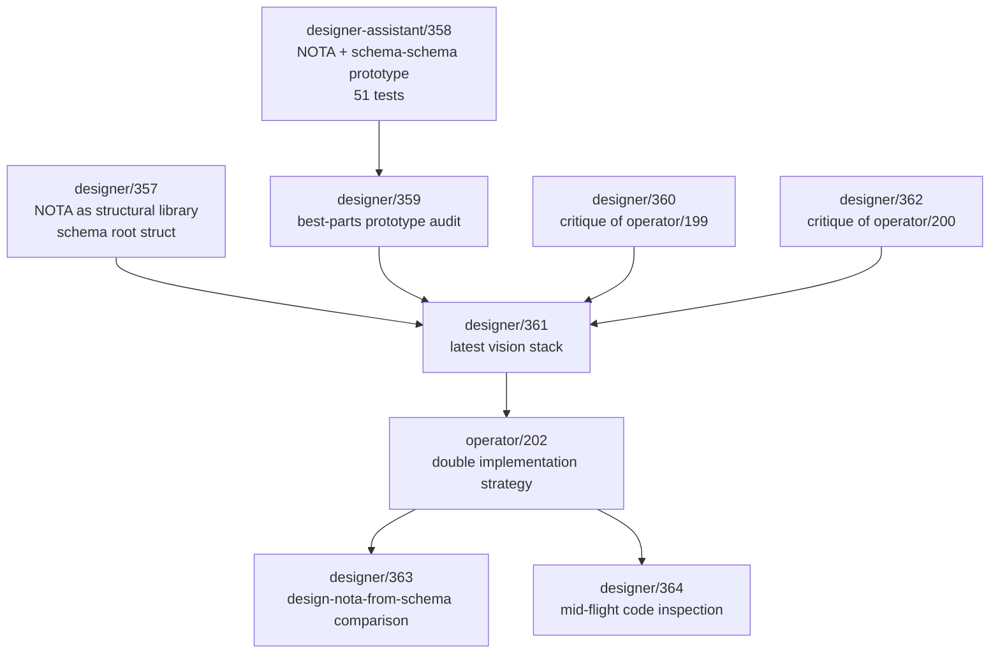
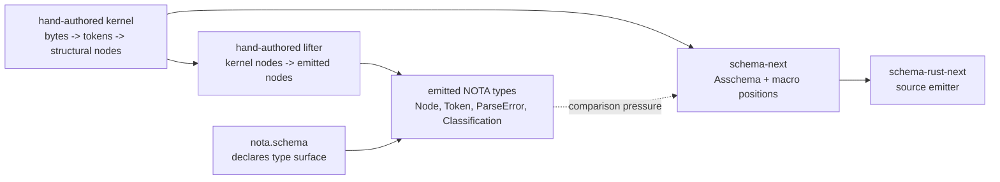

# Designer refresh — schema/NOTA current design state

## Orchestrator note

The assigned designer-refresh scout paused before producing this file. Pi-operator filled this slice directly from the latest reports and read-only branch state.

## Latest designer report order



Current read:

- `designer/361` is still the broad architecture map.
- `operator/202` and Spirit records `819-821` supersede `designer/361`'s older repo-strategy section.
- `designer/363` is the newest substantive design verdict: schema-driven NOTA type emission is partially feasible, but byte recognition remains a hand-authored kernel floor.
- `designer/364` is a useful live code inspection, but some of its in-flight notes aged quickly because `schema-rust-next` and `design-nota-from-schema` both moved afterward.

## Current designer architecture target



The designer track no longer says "everything can be schema-emitted immediately." It says:

- the byte recognizer is the recursion floor;
- the type surface above that floor can be emitted from `nota.schema`;
- the operator track should consider a hybrid cut: hand-authored byte recognition, schema-emitted type declarations.

## Branch and repo state

| Surface | Observed state | Pi-operator read |
|---|---|---|
| `/git/github.com/LiGoldragon/design-nota-from-schema` | clean, `main` at `95dc1137` (`Initial: design-nota-from-schema parallel exploration of narrower recursion-floor cut`) | Good comparison evidence; not permanent infrastructure yet. |
| `/git/github.com/LiGoldragon/schema-next` | clean, `main` at `2558aaf5` | Operator baseline that designers should compare against. |
| `/git/github.com/LiGoldragon/nota-next` | clean, `main` at `0f21138d` | Operator raw NOTA baseline. |
| `/git/github.com/LiGoldragon/schema-rust-next` | `main` at `a290b7c7`, later live working copy `M src/lib.rs` | Ongoing operator-owned emitter work; pi-operator should not edit. |
| old `/git/github.com/LiGoldragon/schema` designer worktrees | multiple clean prototype branches, plus stale/dirty feature branches | Evidence only; new coordination surface is `schema-next`. |

## Code I like

### Explicit recursion-floor marker

From `design-nota-from-schema/crates/kernel/src/lib.rs`:

```rust
//! kernel — the bootstrap **recursion floor** of design-nota-from-schema.
//!
//! Every line in this crate is hand-authored Rust. NOTHING in this
//! crate emits from the schema; that direction would be circular —
//! the schema cannot be READ before code exists that knows how to
//! recognise NOTA delimiters in bytes.
```

Why I like it: it turns a philosophical dispute into a code-level witness. Future agents can read the boundary without reconstructing report context.

### Generated type surface has provenance

From `design-nota-from-schema/crates/nota-emitted/src/nota_types.rs`:

```rust
// AUTOGENERATED by emit-codec — DO NOT HAND-EDIT.
// Regenerate via `cargo run -p emit --bin emit-codec`.
// Source: schemas/nota.schema
// Schema content hash: 146c2cfdc79a5a63

#[derive(Debug, Clone, PartialEq)]
pub enum Classification {
    Block(BlockKind),
    QualifiedSymbol(SymbolKind),
    String(StringForm),
    Literal(LiteralKind),
}
```

Why I like it: the generated file is auditable, hash-stamped, and carries the `Classification` model as first-class data.

## Code/design I dislike

### The root-count mismatch needs a named comparison

Operator `schema-next` accepts a 3-root shape:

```nota
{}
[(Input (Record Entry))]
{ Entry [Topic Kind] }
```

Designer `design-nota-from-schema` uses a 5-block shape:

```nota
{}
[]
[]
{ Document [(Vec Node)] }
[]
```

This might be physical-vs-logical vocabulary, but it cannot stay implicit. The comparison report should name whether the canonical schema root is physically three top-level fields, physically five, or logically three with physical subfields.

### Comment-heavy schema is good teaching, bad production data

`design-nota-from-schema/schemas/nota.schema` is a design document and schema in one file. That is useful while exploring. If the file graduates into production input, the explanatory comments should move to docs and the schema should become comment-light data.

## Practical implications for pi-operator

1. Treat `designer/363` as the current recursion-floor verdict.
2. Treat `designer/364` as useful code-inspection evidence, but check live repo state before quoting its in-flight claims.
3. Do not revive `nota-core-next` or old schema worktree coordination; current operator mains are `nota-next`, `schema-next`, `schema-rust-next`.
4. Push the next operator/designer comparison toward concrete divergence: byte-recognition floor, emitted type declarations, and 3-root vs 5-block schema shape.
