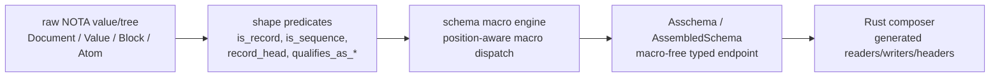
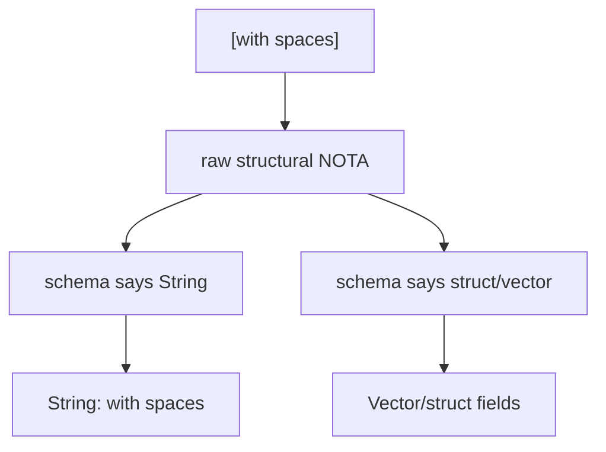

# Nota-designer refresh — NOTA/schema boundary and adjacent repo state

## Orchestrator note

The assigned nota-designer scout paused with the run. Pi-operator filled this slice directly from `reports/nota-designer/9-*`, current NOTA/schema reports, and read-only adjacent repo state.

## Boundary that still matters

Nota-designer report `9` remains the clearest boundary statement:



The boundary:

- Raw NOTA is a shape-inspection substrate.
- Schema macros consume the substrate and decide meaning.
- The schema macro engine is not the same thing as `nota-codec::NotaValue` or `nota-next::Block`.
- Reports must distinguish implemented behavior, tested behavior, design intent, and uncertainty.

## Current adjacent repo state

| Repo | State | Boundary read |
|---|---|---|
| `/git/github.com/LiGoldragon/nota-next` | clean, `main` at `0f21138d` | New operator raw-NOTA implementation. Current structural floor. |
| `/git/github.com/LiGoldragon/nota-codec` | dirty `A INTENT.md` on `nota-codec-intent-synthesis`; parent `main` at `f761421c` | Guidance drift risk: added intent file says legacy quote acceptance; current code rejects quote delimiters. |
| `/git/github.com/LiGoldragon/schema-next` | clean, `main` at `2558aaf5` | Current schema macro / Asschema target. |
| `/git/github.com/LiGoldragon/signal-frame` | previously observed clean on main | Later consumer/adaptor surface, not current schema engine. |
| `/git/github.com/LiGoldragon/design-nota-from-schema` | clean, `main` at `95dc1137` | Designer comparison repo; type-emission proof, not raw parser replacement. |

## Code I like

### Quote rejection is explicit and typed

From `/git/github.com/LiGoldragon/nota-codec/src/lexer.rs`:

```rust
b'"' => Err(Error::QuoteStringDelimiter { offset: self.pos }),
```

From `/git/github.com/LiGoldragon/nota-codec/src/error.rs`:

```rust
/// Quotation marks are not NOTA string delimiters.
#[error("quotation mark at byte offset {offset} is not a NOTA string delimiter — use `[text]` or `[|text|]")]
QuoteStringDelimiter { offset: usize },
```

Why I like it:

- It matches the workspace hard override: NOTA strings come from bracket forms, not quotes.
- The error teaches the correct form.
- The boundary is typed, not a stringly parser failure.

### Bracket strings are tested against quote drift

From `/git/github.com/LiGoldragon/nota-codec/tests/horizon_rs_feedback_fixes.rs`:

```rust
#[test]
fn quote_delimited_string_field_is_rejected() {
    let mut decoder = Decoder::new("(\"with spaces\")");
    let error = Container::decode(&mut decoder).unwrap_err();
    assert!(matches!(error, nota_codec::Error::QuoteStringDelimiter { offset: 1 }));
}

#[test]
fn string_field_accepts_bracket_form() {
    let mut decoder = Decoder::new("([with spaces])");
    let value = Container::decode(&mut decoder).unwrap();
    assert_eq!(value.label, "with spaces");
}
```

Why I like it:

- It tests both sides: reject quotes, accept bracket form.
- It protects the shell/JSON/Nix embedding-safety property.

## Code/guidance I dislike

### Dirty `nota-codec/INTENT.md` conflicts with live code

Current dirty file `/git/github.com/LiGoldragon/nota-codec/INTENT.md` says:

```markdown
## Decoder accepts legacy quoted strings for migration

The lexer has a `read_legacy_quote_string` path explicitly named
"legacy". It accepts `"..."` quoted strings as input...
```

But current lexer code rejects `"` with `QuoteStringDelimiter`, and tests assert quote/triple-quote rejection.

Why I dislike it:

- Repo `INTENT.md` is required reading when editing the repo, so a wrong dirty intent synthesis is high-risk drift.
- It directly contradicts the code and tests.
- It revives the exact quote-acceptance ambiguity the workspace has been trying to kill.

Operator-safe recommendation: do not commit that `INTENT.md` as-is. Rewrite the decoder section to say quote-string input is rejected in current `main`, with any legacy acceptance treated as historical/superseded unless a live deployed slot still requires it.

### Raw structural bracket handling remains ambiguous



The current design can support this only if raw NOTA carries enough structure for both paths. `nota-codec` has schema-aware `read_string_after_opening_bracket`. `nota-next` currently parses `[` as a square-bracket block unless it is `[|...|]` pipe text. That may be correct for the raw layer, but it needs an explicit string-candidate/demotion story so Spirit CLI descriptions do not become special cases.

## What nota-designer report 9 still gets right

1. The reusable NOTA shape layer is not the schema macro engine.
2. Shape predicates are necessary but not sufficient; schema owns fixed-point macro orchestration and typed lowering.
3. Bracket-pipe block strings, square bracket sequences, parenthesis records, and PascalCase atoms are structural facts first.
4. Implementation reports must mark which parts are real, which are tested, which are design-only, and which are uncertain.

## Current pi-operator boundary recommendations

- Treat `nota-next::Block` as the new raw structural floor.
- Mine `nota-codec` for bracket-string and quote-rejection tests, but do not trust its dirty `INTENT.md` without correction.
- Keep `signal-frame` as later adapter/composer consumer, not current schema parser owner.
- Ask for a concrete bracket-string/vector candidate API before letting more schema code depend on ad-hoc bracket interpretation.
