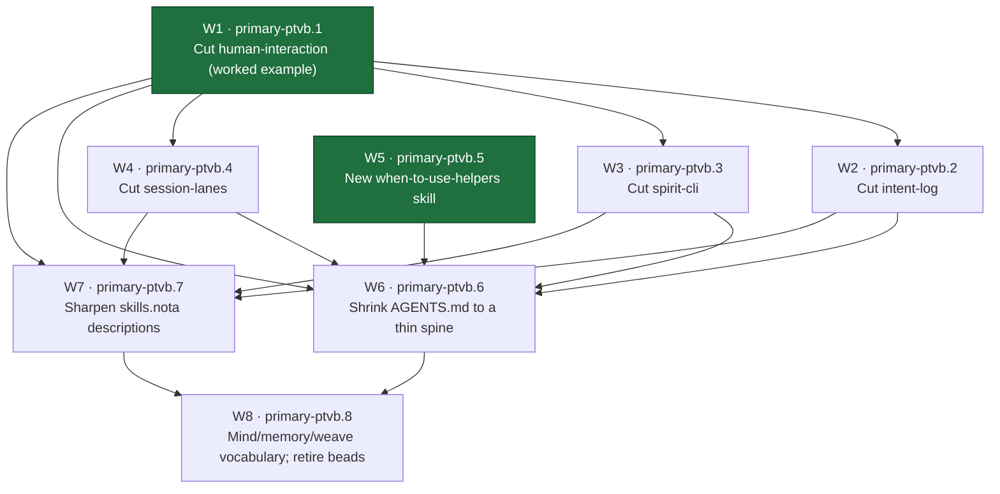

# preciousMainContext weave — the dependency graph of work

This session's work-items, created as beads under root epic
`primary-ptvb` (the precious-main-context standard + skill-ladder dedup),
and wired into a blocker dependency graph. Pick up by querying `bd ready`
and walking the edges below.

## Dependency graph

Edges read blocker → blocked: the arrow's source must be done before its
target can start. W1 and W5 (green) have no blockers and are ready now.

## Bead id map

| Item | Bead id | One-line gloss |
|---|---|---|
| Root | `primary-ptvb` | Epic grouping all 8 items (label `preciousMainContext`). |
| W1 | `primary-ptvb.1` | Cut human-interaction to its core — the worked-example template the other cuts follow (target ~6 sections from 14). |
| W2 | `primary-ptvb.2` | Cut intent-log: one enumeration of the five recordable kinds; CLI mechanics + manifestation/maintenance become pointers. |
| W3 | `primary-ptvb.3` | Cut spirit-cli to the capture-side reference; move ~120 misplaced lines (render, daemon-startup, migration) out. |
| W4 | `primary-ptvb.4` | Cut session-lanes: collapse AGENTS.md-duplicating prose to pointers; keep the mermaid and retire steps. |
| W5 | `primary-ptvb.5` | Write the new when-to-use-helpers skill (precious-main-context dispatch policy). No blockers. |
| W6 | `primary-ptvb.6` | Shrink AGENTS.md to a thin spine: reading order + skills.nota pointer + only universal rules. |
| W7 | `primary-ptvb.7` | Sharpen every skills.nota description so each skill is pickable by name+description alone. |
| W8 | `primary-ptvb.8` | Roll out Mind/memory/weave vocabulary across docs; retire the word "beads". Done last over settled docs. |

## Ready to start now

- **W1 `primary-ptvb.1`** — the template cut. Unblocks W2/W3/W4 and feeds W6/W7.
- **W5 `primary-ptvb.5`** — the new helpers skill, independent; only feeds W6.

No dependency cycles (`bd dep cycles` clean). W6 waits on W1-W5; W7 waits
on W1-W4; W8 waits on W6 and W7 (the vocabulary rename lands last).
