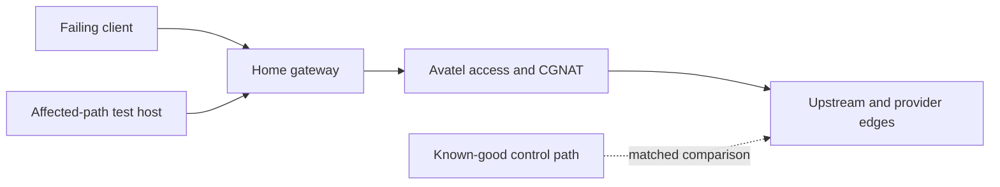
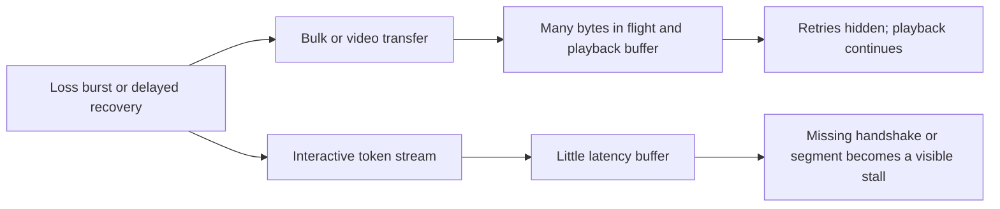
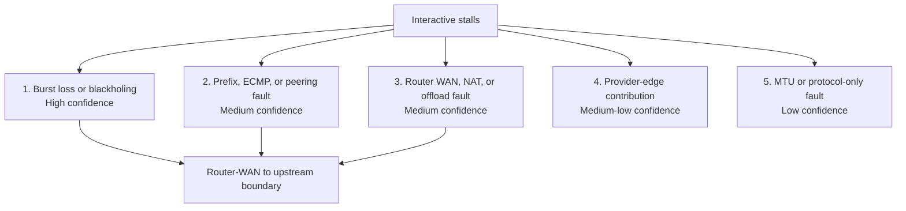

# Home ISP Interactive Streaming Incident Diagnosis

Date: 10 August 2026

Measurement window: 2026-08-10 10:55:56 to 11:09:31 UTC

## Executive conclusion

The highest-confidence cause is intermittent packet loss or short-lived
blackholing on the direct home path, after the affected-path test host's clean
Ethernet edge. The unresolved boundary includes the home router's WAN side,
Avatel's access network and CGNAT, and upstream routing or peering. The evidence
does not yet identify which member of that boundary drops the traffic.

The home router is **not excluded**. Clean Ethernet counters and reliable
gateway replies prove only that one test host can reach the router over its
local link. They say nothing decisive about the router's WAN interface, NAT
table, firewall, flow offload, firmware, hardware, or upstream-facing link.

Generic direct-path impairment was reproduced: small provider connections
sometimes timed out or retransmitted heavily, while large objects still
completed at useful rates. The exact application failure was not reproduced
under authentication: no authenticated Codex or Claude flow was captured on
the actual failing client. The report therefore establishes a causal boundary,
not a final component-level verdict.

## Corrected topology and scope

The affected-path test host and the home router are separate machines. The test
host sits behind the router and sends ordinary internet traffic through it.
The router supplies ISP access through Avatel. Local bridge, forwarding, and
DNS-service state observed on the test host (`br-lan`, `ip_forward`, and
`dnsmasq`) is incidental; it does not make that host the household's ISP-access
router and must not be used as evidence about the router's behavior.



The affected-path test host's public address was checked but is intentionally
redacted. Ordinary IPv4 egress was confirmed to use Avatel. The known-good
control path reached the same public services through a different uplink.

## Representative measurement method

The investigation used read-only command shapes like the following on the
affected-path test host and, where stated, the known-good control path. Targets,
addresses, and resolver names are replaced with neutral placeholders.

```text
# Route and egress proof
ip -4 route show default
ip rule show
curl -4 -sS --max-time <seconds> https://<egress-metadata-target>/<resource>

# Fresh HTTP/1.1, HTTP/2, and HTTP/3 timing batches
# <http-mode> was selected from --http1.1, --http2, and --http3-only
curl -4 -sS -o /dev/null <http-mode> --connect-timeout <seconds> \
  --max-time <seconds> \
  -w 'code=%{http_code} proto=%{http_version} connect=%{time_connect} tls=%{time_appconnect} first=%{time_starttransfer} total=%{time_total} bytes=%{size_download} error=%{errormsg}' \
  https://<target>/<resource>

# Fixed-address and persistent-connection variants
curl -4 --resolve '<service-name>:443:<address>' <timing-options> https://<service-name>/<resource>
curl <timing-options> -o /dev/null https://<target>/<resource> -o /dev/null https://<target>/<resource>

# Periodic drip with concurrent socket transport state
curl -4 -sS --no-buffer <http-mode> <timing-options> https://<neutral-drip-target>/<cadenced-resource>
ss -tin dst <resolved-target>

# TCP counter snapshots before and after a request batch
nstat -asz TcpRetransSegs TcpExtTCPTimeouts TcpExtTCPFastRetrans \
  TcpExtTCPMTUPFail TcpExtTCPMTUPSuccess

# Gateway, public-control, and TTL-limited probes
ping -4 -q -c <count> -i <interval> <gateway-or-control>
ping -4 -c 1 -W <seconds> -t <ttl> <control-target>

# Bulk and video-shaped transfer timing
curl -4 -sS -o /dev/null --max-time <seconds> \
  -w 'first=%{time_starttransfer} total=%{time_total} bytes=%{size_download} speed=%{speed_download}' \
  https://<bulk-target>/<sized-resource>
```

Route and egress checks, fresh-request batches, persistent-connection batches,
fixed-address batches, the HTTP-version matrix, periodic-drip/socket snapshots,
counter snapshots, ICMP/TTL probes, and bulk transfers were separate batches.
The two periodic-stream samples were matched by traffic shape and transport
fields; they were not a simultaneous, clock-synchronized packet capture.

## Observations

These statements come directly from measurements or reported incident history.

### User-visible history

- Full-HD buffered video continued to work while Codex and Claude often stalled
  or delivered almost no interactive output.
- The same direct service had worked for about a month before the failure.
- No deliberate local configuration change was reported at onset.
- The home router was restarted repeatedly without durable improvement.
- An alternate VPN path made the interactive agents usable.

### Local link and wide-area loss

- The home gateway answered without loss, at roughly 0.75 to 0.88 ms.
- Separate samples to two public anycast resolvers lost roughly 10 to 20 percent
  of probes.
- The affected-path test host's Ethernet interface showed no RX errors, TX
  errors, drops, carrier errors, or receive-queue drops in the inspected
  counters.
- During one short eight-request HTTP/2 batch, host TCP counters increased by
  13 retransmitted segments, seven TCP timeouts, and four fast retransmits.
  Receive errors and receive-queue drops did not increase. These counters are
  host-global, so they corroborate impairment but do not attribute every event
  to the probe batch.

ICMP loss can be exaggerated by rate limiting. It is supporting evidence, not
the sole basis for the diagnosis. TCP retransmission and application timing are
the stronger witnesses.

### Matched periodic-stream control

The same ten-second, one-byte-at-a-time stream was requested on the affected
path and the known-good control path:

| Measurement | Affected path | Known-good control |
|---|---:|---:|
| First byte | 1.915750 s | 0.280905 s |
| Total time | 11.916481 s | 10.396459 s |
| Retransmissions | 5 | 0 |
| Retransmitted bytes | 5,066 | 0 |
| Congestion window at observation | 4 | 10 |
| Socket rehash count | 3 | 0 |
| Path MTU | 1500 | 1500 |
| Advertised MSS | 1448 | 1448 |
| Observed MSS | 1168 | 1168 |

Both streams completed, but only the affected path incurred retransmission,
extra startup delay, a smaller observed congestion window, and socket rehashes.
The equal PMTU and MSS values are strong evidence against a simple
path-MTU mismatch explaining the difference. Neither path incremented
`TCPMTUPFail` or `TCPMTUPSuccess` during the matched observation. Direct
don't-fragment probing produced conflicting investigator accounts and is
therefore classified as inconclusive. Congestion-window and rehash snapshots
are transport symptoms, not proof of which network component caused them.

A second neutral streaming control delivered every expected byte for ten
seconds over HTTP/1.1 and HTTP/2 on the affected path. Long-lived streaming is
therefore not universally broken; the impairment is intermittent, path- or
destination-sensitive, or both.

### Fresh and persistent provider connections

- Fresh small HTTP/2 requests to one OpenAI address succeeded eight of eight
  times, while a second OpenAI address had three TCP-connect timeouts in eight
  attempts. The batches were sequential, so time-varying burst loss remains a
  confounder.
- A fixed Anthropic address had three TCP-connect timeouts in eight attempts on
  the affected path. The known-good control path completed twelve of twelve
  attempts to that address, typically in 0.11 to 0.29 seconds.
- Successful affected-path connections often showed retransmission-shaped
  timing steps: TCP establishment was normally about 12 ms but sometimes about
  1.04 seconds, and TLS establishment ranged from roughly 46 ms to 1.6 seconds
  or more.
- On one already-established OpenAI HTTP/2 connection, a request received no
  bytes for ten seconds. Later requests then succeeded on that same connection
  in roughly 0.14 to 0.26 seconds.
- Unauthenticated OpenAI probes also produced two post-TLS no-response timeouts
  in eight attempts on the known-good control path. That endpoint behavior is a
  confounder and must not be presented as direct proof of the ISP fault.

### Bulk and video-shaped controls

- A 1 MB Cloudflare object completed at 7.37 MB/s.
- A 10 MB Cloudflare object completed at 2.72 MB/s despite taking 3.39 seconds
  to deliver its first byte.
- An approximately 862 KB YouTube object completed despite taking 6.95 seconds
  to deliver its first byte.
- Three additional 5 MB bulk transfers completed at about 5.6 to 11 MB/s.

These measurements reproduce the apparent contradiction: useful aggregate
throughput coexists with severe startup latency, retransmission, and occasional
whole-request stalls.

### Protocol controls

- DNS lookups were quick on the affected-path test host, and failures persisted
  there when provider addresses were fixed explicitly. DNS behavior on the
  actual failing client was not observed.
- Forced IPv4 reproduced failures. The affected-path test host had no ordinary
  global IPv6 route; forced IPv6 failed immediately rather than after a long
  stall.
- TLS completed successfully many times with HTTP/1.1 and HTTP/2 ALPN. Some
  failures occurred before TCP establishment, below TLS and HTTP.
- HTTP/3 succeeded from the affected path to neutral Cloudflare, Claude, and
  YouTube endpoints. UDP port 443 is not generically blocked.
- A ChatGPT HTTP/3 probe failed on both the affected path and known-good control
  path, so it is not a discriminating witness for this incident.
- Direct don't-fragment probing had conflicting investigator accounts and is
  conservatively treated as inconclusive. Matched sockets reported PMTU 1500,
  advertised MSS 1448, and observed MSS 1168; MTU-failure and MTU-success
  counters stayed at zero; multi-megabyte TCP transfers completed; and some
  failures occurred during SYN establishment, before payload size mattered.

## Why buffered video can work while interactive AI stalls



Video players prefetch, buffer, retry, and often maintain multiple opportunities
to obtain the next media segment. A connection can pause for several seconds
and still keep playing if the buffer is sufficiently full. Bulk transfer rates
also average over the entire object, hiding slow first-byte time and short loss
bursts.

Interactive agent output has a different contract. A handshake, request, or
small response segment is on the user's critical path, and new tokens cannot be
displayed until the missing transport data recovers. A three-second SYN loss,
multi-second TLS retransmission, or ten-second response gap is immediately
visible even if the connection later transfers data quickly. The measured
bulk/stream contrast is consistent with this mechanism.

## Ranked causes



1. **Intermittent packet loss or burst blackholing: high confidence.** The
   matched stream retransmitted only on the affected path; provider requests
   showed connection timeouts and retransmission-scale delays; wide-area loss
   appeared while the local gateway and Ethernet counters remained clean. The
   exact drop point is still unresolved.

2. **Destination-prefix, ECMP, routing, or peering impairment: medium
   confidence; plausible.** One OpenAI address performed materially worse than
   another, and the Anthropic direct-path result differed sharply from the
   known-good control. The address batches were sequential rather than
   interleaved, so a time-varying loss burst could mimic an address-specific
   fault. Unauthenticated OpenAI requests also timed out on the known-good
   control path, further weakening the provider-prefix inference.

3. **Persistent router WAN, NAT, firewall, hardware, firmware, or flow-offload
   behavior: medium confidence.** Router restarts and the absence of a reported
   configuration change make stale transient state or a newly introduced local
   rule less likely. A month of previous service also lowers the probability of
   a timeless configuration error. None of these facts excludes persistent WAN
   firmware, hardware, thermal, offload, NAT, or link behavior, nor a fault
   triggered by an ISP-side change.

4. **Provider-edge behavior: medium-low confidence as a contributor, low as the
   sole cause.** Unauthenticated OpenAI controls were imperfect even on the
   known-good path. However, the user-visible problem spans both OpenAI and
   Anthropic, and Anthropic showed a clean matched-path contrast.

5. **PMTU, DNS, IP-family, TLS, HTTP/2, or generic QUIC fault: low confidence as
   the primary cause.** Available controls strongly disfavor each simple
   version of these hypotheses, but do not rule them out on the actual failing
   client. They remain useful dimensions of the final authenticated trace.

## Category disposition and missing witness

| Category | Disposition | Evidence | One precise missing witness |
|---|---|---|---|
| Packet loss | **Ruled in on the end-to-end direct path** | Matched retransmissions, TCP timeout counters, provider connect failures, and wide-area loss | Simultaneous captures and interface counters at the failing client plus router LAN and WAN for the same five-tuple and timestamp |
| Reordering | **Unknown; less supported than loss** | Fast retransmits can follow loss or reordering; no per-flow SACK or DSACK trace exists | SACK, DSACK, and duplicate-ACK sequence from the same failed flow |
| MTU and PMTUD | **Strongly disfavored as primary; not ruled out** | Both matched paths reported PMTU 1500, advertised MSS 1448, and observed MSS 1168; `TCPMTUPFail` and `TCPMTUPSuccess` remained zero; large TCP objects succeeded; some failures occurred at SYN; direct DF accounts conflict | A clean DF size sweep plus packet capture for ICMP fragmentation-needed or packet-too-big messages while alternating default and 1200 MSS on the same authenticated flow |
| DNS | **Strongly disfavored on the affected-path test host; actual failing-client DNS unknown** | Test-host resolution was fast and failures persisted with fixed addresses | Scoped actual-client resolver trace and cache state plus the chosen A/AAAA and connection target during an authenticated stall, paired with a fixed-address retry |
| IPv4 versus IPv6 | **Ruled out as primary on the test host** | Forced IPv4 reproduced; IPv6 lacked an ordinary route and failed immediately | The failing client's route table and address-family choice during the authenticated stall |
| TLS and ALPN | **Ruled out as sole root** | TLS, HTTP/1.1, and HTTP/2 negotiated successfully; failures also occurred before TCP connect | Packet trace showing the exact TLS record or ACK lost during an authenticated stall |
| HTTP/1.1 versus HTTP/2 | **Generic protocol defect ruled out** | Neutral periodic streams completed under both versions; some failures occurred before ALPN | The same authenticated request forced over HTTP/1.1 and HTTP/2, if the provider permits both |
| HTTP/3 and QUIC | **Generic UDP/443 block ruled out** | HTTP/3 worked to three independent public services; the ChatGPT result failed on both paths | Negotiated ALPN and scoped UDP/TCP capture from the real Codex or Claude client |
| Fresh connections | **Affected** | Multiple provider TCP-connect timeouts and RTO-shaped establishment delays | Alternating authenticated attempts to fixed provider destinations with timestamps and per-flow transport state |
| Long-lived sockets | **Intermittently affected, not generically broken** | One established HTTP/2 request stalled for ten seconds and recovered; neutral periodic streams completed | Authenticated stream capture over the failing client's real cadence and idle duration |
| NAT timeout | **Disfavored for immediate failures; unknown at minute scale** | Fresh connections fail; a persistent connection recovered; ten-second streams completed | Hold one provider connection idle for 30, 60, and 120 seconds while observing router conntrack state, then send data |
| Router firewall and offload | **Unknown; router not excluded** | Test-host Ethernet and gateway are clean, but router LAN/WAN forwarding was not observed | Simultaneous router LAN- and WAN-interface capture and counters for one failed flow |
| CGNAT | **Unknown as the drop point** | Avatel's access path adds a stateful boundary outside the home router; no ISP-side state was visible | Avatel-side flow logs or a provider-synchronized trace for the same five-tuple and timestamp |
| Route asymmetry | **Unknown** | No usable forward-and-reverse route pair was captured | A reverse/provider-side trace synchronized with the client-side flow |
| Upstream filtering or shaping | **Possible, not proven** | VPN success moves the symptom away from the direct path, but also changes route, egress identity, MTU, DNS, and encapsulation | Identical authenticated fixed-destination request direct and through the tunnel, with synchronized packet traces |
| Failing-client host or application | **Unknown** | The affected-path test host reproduced generic impairment but is not necessarily the failing client | `ss` transport state and a scoped capture from the actual failing client during one exact Codex or Claude stall |

## Confounders and claim limits

- No authenticated Codex or Claude request was captured on the failing client.
  Provider status endpoints and unauthenticated API responses approximate the
  traffic path but do not reproduce the full application contract.
- The affected-path test host is a valid ISP-path witness, not a substitute for
  the failing client's network namespace, socket state, application version, or
  local link.
- ICMP responders may rate-limit probes. Packet loss conclusions therefore rely
  on the combined TCP, timing, and matched-stream evidence.
- Direct don't-fragment probe accounts conflict. This report retains no
  positive full-size DF claim and treats direct DF probing as inconclusive.
- Fixed provider-address batches were sequential. A temporary loss burst could
  look like destination-specific routing. An alternating schedule is required.
- Host-global TCP counter changes can include unrelated traffic. Per-flow packet
  evidence is required for final attribution.
- VPN success is a strong boundary control but changes several variables at
  once: route, egress identity, DNS behavior, effective MTU, encapsulation, and
  sometimes transport protocol.
- Previous month-long success, no reported configuration change, and repeated
  restarts lower the likelihood of a simple static misconfiguration or stale
  transient table. They do not exclude persistent router firmware, hardware,
  WAN offload, line, CGNAT, ISP routing, or peering faults.

## Smallest safe discriminating test

Capture one timestamped, authenticated Codex or Claude stall on the actual
failing client while observing the same narrowly filtered flow on both the home
router's LAN and WAN interfaces. Pair the captures with read-only socket state
from the client.

The result separates the boundary directly:

- If the client emits no request data, investigate the client or application.
- If the router receives the flow on LAN but does not emit it on WAN,
  investigate router NAT, firewall, firmware, or offload.
- If the router emits SYNs or data and retransmits on WAN but receives no
  response, investigate Avatel, CGNAT, upstream routing, peering, or filtering.
- If the router receives return traffic on WAN but the client does not receive
  it on LAN, investigate the router or local network.
- If acknowledgements arrive out of order or carry SACK/DSACK evidence, separate
  reordering from true loss.

This capture is operationally read-only but privileged and therefore requires separate authorization.
A subsequent direct-versus-tunnel A/B of the identical
authenticated, fixed-destination request would sharpen the result, but enabling
or changing a tunnel mutates path state and also requires separate explicit
authorization and a rollback plan.

## Actions taken

Diagnosis used read-only routing, interface, resolver, socket-counter, ICMP,
TLS, HTTP, and transfer probes. No host, router, service, route, VPN, firewall,
DNS, NAT, or offload state was changed. No privileged packet capture was made.
