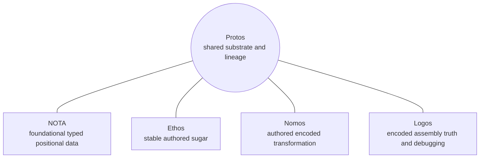
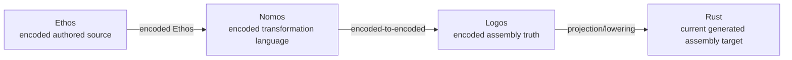
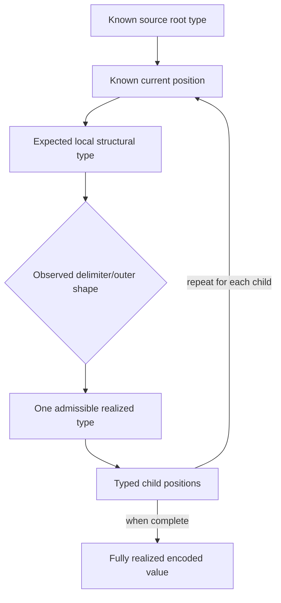

# Tentative Agent Synthesis: Psyche Vision from First Principles

> **Status: TENTATIVE, NON-AUTHORITATIVE, AND PENDING PSYCHE REVIEW.** This
> report is an agent synthesis of the desired state, character, boundaries, and
> constraints of Protos. It is not an implementation plan and does not become
> design authority through being written here. Any accepted result must be
> deliberately ported into a more authoritative surface after psyche review.

## Reading rule

The newest firsthand psyche account controls conflicts. Code, tests, beads,
reports, and prior agent conclusions remain useful evidence, but repetition or
successful implementation does not turn them into psyche authority. The
controlling correction is preserved independently in the
[Codex transcript](/home/li/.codex/sessions/2026/07/30/rollout-2026-07-30T11-12-27-019fb24b-ea61-7440-88d3-9679e407131a.jsonl:2488)
and the
[Claude transcript](/home/li/.claude/projects/-home-li-primary/df3857a3-2c92-4545-9659-d43727d969cb.jsonl:447).

## Authority and status legend

| Mark | Meaning in this report |
| --- | --- |
| **Psyche ruling** | Firsthand psyche statement, or a verbatim preservation consistent with the controlling correction. |
| **Tentative synthesis** | Agent inference that appears to join the rulings coherently. It awaits review. |
| **Historical evidence** | A real design, syntax, behavior, or implementation that may illuminate lineage but does not prescribe the destination. |
| **Contradiction** | Two inherited claims cannot both control; the newest firsthand statement wins where it resolves the conflict. |
| **Unknown** | The evidence does not establish an answer. Current code must not silently answer it. |

## Direct psyche rulings that survive the reset

### 1. Ethos authoring is the destination

The ordinary stabilized activity is to write Ethos. Nomos exists so the
Ethos-to-Logos transformation can itself be authored and changed. Logos is the
truthful assembly-like encoded representation and debugging surface beneath
Ethos. Rust is the current generated assembly target, valued for its
correctness checks rather than its beauty as authored source.

The earlier verbatim vision distinguishes three related languages with their
own syntax and a shared textual-form/encoded-form mechanism, with NOTA as the
foundational fourth member of the family
([verbatim vision](/git/github.com/LiGoldragon/protos-engine/design/ProtosEngine/PsycheVisionReacquisition-2026-07-29.md:84)).
It characterizes Ethos as the stable sugar, Nomos as the modifiable
transformation language, and Logos as the true assembly-level representation
([language roles](/git/github.com/LiGoldragon/protos-engine/design/ProtosEngine/PsycheVisionReacquisition-2026-07-29.md:91)).
The controlling account makes the destination explicit: eventually “we're only
going to be writing ethos,” while Rust is “our new assembly language”
([firsthand transcript](/home/li/.codex/sessions/2026/07/30/rollout-2026-07-30T11-12-27-019fb24b-ea61-7440-88d3-9679e407131a.jsonl:2488)).

### 2. An Ethos source file has a known root structural type

The foundational fact is not a token meaning. It is that an Ethos file is
already known as an Ethos file and is read as a specialized, typed root
structure. Its sections or positions are not discovered as arbitrary global
syntax. The reader knows the structural type expected at the current position
before it interprets the local form.

This is the direct correction to the failed train: “The ethos source file is a
struct” and “we know the structural type of each of these positions”
([Codex transcript](/home/li/.codex/sessions/2026/07/30/rollout-2026-07-30T11-12-27-019fb24b-ea61-7440-88d3-9679e407131a.jsonl:2488)).
The Claude session records the preceding correction that even a statement such
as “`X.[...]` declares an enum” is true only at a particular position because
Protos is positional
([Claude transcript](/home/li/.claude/projects/-home-li-primary/df3857a3-2c92-4545-9659-d43727d969cb.jsonl:447)).

### 3. Meaning is position-local

The same textual shape may denote different realized types in different
positions. A dotted prefix followed by square brackets, braces, parentheses,
or another object has no single context-free ontology. Its admissible meaning
comes from the structural type of the position in which it occurs.

This is not a relaxation of typing. It is how strict typing removes redundant
surface labels: position contributes information. The firsthand rule that
fields are positional and authored field names are forbidden is preserved in
the
[psyche-vision handover](/home/li/primary/reports/logos/psyche-vision-handover-2026-07-19.md:217).

### 4. NOTA is foundational, but Ethos is not merely a NOTA superclass

The controlling firsthand correction distinguishes NOTA, whose recursive type
is fully known and filled by positional values, from Ethos, whose root and
current position are known while that position may admit multiple possible
realized types
([Codex transcript](/home/li/.codex/sessions/2026/07/30/rollout-2026-07-30T11-12-27-019fb24b-ea61-7440-88d3-9679e407131a.jsonl:2488),
[Claude corroboration](/home/li/.claude/projects/-home-li-primary/df3857a3-2c92-4545-9659-d43727d969cb.jsonl:447)).
The current NOTA architecture independently corroborates that expected type is
already known at every NOTA value position, so its raw reader discovers
delimiter structure rather than guessing semantic types from content
([implementation corroboration](/git/github.com/LiGoldragon/nota/ARCHITECTURE.md:12)).

Ethos's outer structure selects one locally admissible typed possibility and
thereby assigns expected types to its children. The family resemblance among
NOTA, Ethos, Nomos, and Logos is delimiter use, capitalization, and
typed-inner-block parsing, not inheritance from one universal NOTA grammar
([proto-language correction](/home/li/primary/reports/logos/textual-form-vision-design-v2.md:380)).

### 5. Compact positional omission is intentional

Field labels that the type and position already provide should not be repeated
throughout authored data. The compactness is not merely cosmetic: repeated
keys make high-frequency reading noisier for both people and agents. A shared
structural contract makes omission informative rather than ambiguous. This is
the same positional lineage that made NOTA preferable to JSON-like repetition
in the controlling account
([firsthand transcript](/home/li/.codex/sessions/2026/07/30/rollout-2026-07-30T11-12-27-019fb24b-ea61-7440-88d3-9679e407131a.jsonl:2488)).

### 6. Structural parsing is meant to remain extensible

The desired language must not freeze because all meaning has been embedded in
one conventional, convoluted parser. Typed local grammars and elegant use of
delimiters are intended to let the language gain new forms without rewriting a
single global grammar whose interactions nobody can safely understand.

The shared structure tree is therefore not printer or help metadata. Its
primary identity is the data-driven encoder/decoder through which a language
moves between textual and encoded form
([structure-tree ruling](/home/li/primary/reports/logos/textual-form-vision-design-v2.md:241)).
Partially resolved blocks also have real transitional types representing the
set of realized types they may still become
([transitional types](/home/li/primary/reports/logos/textual-form-vision-design-v2.md:131)).

### 7. Nomos transforms encoded form to encoded form

Nomos is not string templating. A transformer is written in textual Nomos,
decoded into its true encoded form, and performs typed transformation between
the Ethos and Logos encoded universes. It neither manipulates Rust text nor
constructs output through string templates
([encoded-only ruling](/git/github.com/LiGoldragon/protos-engine/design/ProtosEngine/PsycheVisionReacquisition-2026-07-29.md:154)).
The Nomos engine must know the relevant Ethos and Logos type universes and may
need the complete Ethos population rather than one isolated declaration
([whole-universe account](/git/github.com/LiGoldragon/protos-engine/design/ProtosEngine/PsycheVisionReacquisition-2026-07-29.md:172)).

### 8. Source consistency outranks implementation preservation

The desired source model must be internally coherent even when the current
implementation reflects a different model. The psyche explicitly expects
“rewrit[ing] significant portions of many parts”
([firsthand statement](/home/li/.codex/sessions/2026/07/30/rollout-2026-07-30T11-12-27-019fb24b-ea61-7440-88d3-9679e407131a.jsonl:2525)).
Minimizing churn is not a design constraint. This does not command immediate
rewriting; it removes existing architecture as an authority over the vision.

### 9. Two orthogonal rulings remain in force

- For ScopeOf, `All` is a whole-tree wildcard. The identity-exact reading is
  rejected
  ([direct ruling](/home/li/primary/design/Nomos/allMatchesAllScopeOf-2026-07-31.md:9)).
  Further ScopeOf design remains paused until the root language model is
  accepted.
- The Rust-source tuple prohibition is separate from Protos positionality.
  Multi-field Rust tuples and tuple structs are forbidden; named Rust fields
  are correct Rust style. This does not authorize authored field names in
  Protos
  ([firsthand Rust ruling](/home/li/.codex/sessions/2026/07/30/rollout-2026-07-30T11-12-27-019fb24b-ea61-7440-88d3-9679e407131a.jsonl:1488)).

## Tentative synthesis of the desired system

Everything in this section is an agent inference awaiting psyche review.

### The language family and its stable direction



The connections show shared textual/encoded mechanisms and structural lineage
among four distinct languages. They do not make NOTA the source, superclass,
or grammar of the other three.

Separately, the desired transformation relationship is:



This is a desired language relationship, not a pipeline implementation
proposal. Its central direction is that ordinary authors spend their attention
at Ethos while Nomos and Logos become stable, inspectable substrate.

### Structural reading is recursive type refinement



The decisive inversion is that the reader does not ask globally, “What does
this token sequence mean?” It asks, “At this already-known typed position,
which admissible realized form does this outer structure select?”

### NOTA and Ethos differ in when recursive type closure is known

```text
NOTA
known root type
  -> child type already fixed
     -> grandchild type already fixed
        -> values fill the complete recursive type

Ethos, tentatively
known root structural type
  -> position admits a typed set of realized forms
     -> outer structure selects one form
        -> selected form fixes the child positions
           -> the same refinement repeats
```

The Ethos side does not imply dynamic or weak typing. A not-yet-realized block
can have a real transitional type whose alternatives are statically
constrained. The older static-disjointness ruling is compatible with this
picture, but its universal application to the reacquired Ethos grammar remains
for review
([static-disjointness record](/home/li/primary/reports/logos/textual-form-vision-design-v2.md:53)).

### Desired character

Subject to review, Protos should feel:

- **Ethos-first:** day-to-day authoring is not forced to speak the substrate's
  implementation vocabulary.
- **Strict without redundant ceremony:** typing comes from the structural
  contract and position, not repeated labels.
- **Locally expressive:** the same compact structural cue can be reused where
  different position types give it unambiguous local meanings.
- **Extensible by typed structure:** a new local realized form need not become
  a special case in a monolithic parser.
- **Encoded-form honest:** text is a reversible mouth of typed encoded values,
  not the semantic truth itself.
- **Inspectable below the sugar:** Logos remains a truthful representation for
  understanding what Ethos and Nomos produced.
- **Comfortable with reconstruction:** code that implements a mistaken source
  ontology is replaceable even if its tests pass.

## Illustrative syntax, deliberately invented

Every form in this subsection is **INVENTED**, non-canonical notation. These
examples illustrate positional interpretation only. They propose no keywords,
root fields, delimiters, or grammar.

### INVENTED example A: identical surface, different typed positions

```text
<position-alpha>  Thing.[A B]    # INVENTED: alpha realizes AlphaForm
<position-beta>   Thing.[A B]    # INVENTED: beta realizes BetaForm
```

The text does not prove either meaning. The enclosing position supplies the
local grammar that makes each reading possible.

### INVENTED example B: alternatives inside one known position

```text
<position-gamma>  Thing.[A B]    # INVENTED alternative GammaOne
<position-gamma>  Thing.{A B}    # INVENTED alternative GammaTwo
<position-gamma>  Thing.(A B)    # INVENTED alternative GammaThree
```

The controlling account names dotted-prefix brackets, braces, parentheses,
plain delimiter blocks, and dotted symbols as possibilities to investigate.
It does not rule that all exist or assign their meanings
([firsthand transcript](/home/li/.codex/sessions/2026/07/30/rollout-2026-07-30T11-12-27-019fb24b-ea61-7440-88d3-9679e407131a.jsonl:2488)).

### INVENTED example C: recursive refinement, not a grammar

```text
<known-root-position>                 # INVENTED
  Outer.<locally-admissible-form>     # INVENTED
    <known-child-position>            # INVENTED
      Inner.<another-local-form>      # INVENTED
```

This depicts nested expected positions. It deliberately avoids choosing
whether dotted remainders associate rightward, recursively become independent
objects, or obey some other rule.

### Non-invented but unsettled syntax evidence

The psyche recalls a Nomos placeholder marked by `$` and a spliced placeholder
using `$` with an `@`-like marker, but does not confirm the exact order. The
possibility of another marker for recursive transformation was raised, not
ruled. Therefore this report does not print a guessed canonical spelling.

## Boundaries: what this vision does not authorize

This report does not authorize:

- a specific Ethos root record or section order;
- globally assigning one meaning to dot, square brackets, braces, or
  parentheses;
- retaining or deleting any particular codec, carrier, engine, or repository;
- choosing an authored recursion surface;
- designing ScopeOf's trait target or transformer;
- treating a passing implementation witness as proof of desired architecture;
- migrating archives or breaking compatibility;
- editing design logs, architecture documents, READMEs, standards, skills, or
  other authoritative surfaces.

## Why the previous train became misdirected

### It answered the token question before the position question

The prior reasoning repeatedly tried to decide whether `X.[...]` globally
meant enum declaration, application, new type, or transformer. From first
principles that question is incomplete. Meaning begins with the typed source
position. The Claude session shows the exact failure: an agent turned the
psyche's position-specific correction into another proposed global rule and
was corrected again
([initial exchange](/home/li/.claude/projects/-home-li-primary/df3857a3-2c92-4545-9659-d43727d969cb.jsonl:367),
[positional correction](/home/li/.claude/projects/-home-li-primary/df3857a3-2c92-4545-9659-d43727d969cb.jsonl:447)).

### It promoted a partial codec into the language ontology

The current `core-ethos` documentation calls the six-slot codec canonical
([README](/git/github.com/LiGoldragon/core-ethos/README.md:5),
[architecture](/git/github.com/LiGoldragon/core-ethos/ARCHITECTURE.md:3)).
The code factually carries Imports, Input, Output, Types, Generics, and Impls
positions, but five delegate to empty forms and only Types admits populated
content
([record](/git/github.com/LiGoldragon/core-ethos/src/whole.rs:572),
[six-slot constructor](/git/github.com/LiGoldragon/core-ethos/src/whole.rs:593),
[delegates](/git/github.com/LiGoldragon/core-ethos/src/whole.rs:605)).
Its item vocabulary admits only current newtype and enumeration carriers
([item enum](/git/github.com/LiGoldragon/core-ethos/src/whole.rs:164)).

Those are implementation observations. They do not establish the final root
fields or local grammars. The compact grammar report is useful as an index of
what the codec currently accepts, but its global-looking assignments and
right-recursive application rule must be demoted accordingly
([dot account](/home/li/primary/reports/EthosPositionalGrammar-2026-07-31.md:69),
[Types forms](/home/li/primary/reports/EthosPositionalGrammar-2026-07-31.md:85),
[right recursion](/home/li/primary/reports/EthosPositionalGrammar-2026-07-31.md:164),
[compact summary](/home/li/primary/reports/EthosPositionalGrammar-2026-07-31.md:337)).
The report itself warns that its cited design logs were not fully reread
([scope warning](/home/li/primary/reports/EthosPositionalGrammar-2026-07-31.md:349)).

### It mistook implementation convergence for psyche convergence

Agents, repositories, tests, and reports repeatedly agreed about encoded IDs,
Capsules, recursive evaluation, and a six-slot surface. That agreement proves
that a coherent implementation train existed. It does not prove that the train
began from the correct source-language model. Evidence must be weighted by
origin, not repetition.

### It designed ScopeOf's middle before recovering the language's ends

`DomainScope.ScopeOf.Domain` was promoted as the irreducible authored input and
even proposed as a special encoded ScopeOf carrier
([three-atom study](/home/li/primary/reports/ScopeOfDomainStudy-2026-07-31.md:112),
[open syntax question](/home/li/primary/reports/ScopeOfDomainStudy-2026-07-31.md:188),
[special parse proposal](/home/li/primary/reports/NomosAuthoredRulesDesign-2026-07-29.md:872)).
The mega correction explains why that was premature: without the enclosing
Ethos position and its admitted realized types, the three atoms do not specify
their own ontology. ScopeOf's `All` behavior remains ruled, but the surrounding
source and transformer design does not.

### It let compatibility concerns shape unreviewed source design

Archive stability, evaluator reuse, and minimal change are legitimate
implementation concerns only after the desired source model is known. The
psyche's rewrite expectation explicitly prevents current architecture from
becoming a hidden design constraint. Reacquisition is not a command to destroy
working code; it is a refusal to preserve that code merely because it exists.

## Historical and implementation evidence, carefully demoted

### Existing position-directed machinery is useful prior art

Earlier Nomos work already described two passes: first discover structural
boundaries, then evaluate each block under the typed vocabulary of its document
position
([two-pass account](/home/li/primary/reports/NomosAuthoredRulesDesign-2026-07-29.md:1493)).
A result-template position selected `Template(Logos)` because its structural
position required that grammar, not because its content globally announced it
([position-directed template](/home/li/primary/reports/NomosAuthoredRulesDesign-2026-07-29.md:1507)).
This supports the reacquired principle but does not prove the Ethos root was
modeled correctly.

### Current Nomos recursion is delegated assent, not psyche conviction

The implemented authored algebra, recursive compilation, source-graph
preflight, evaluator contract, and `InsertAt` behavior were accepted at
delegated-assent grade. The repository explicitly preserves that limitation
([README grade](/git/github.com/LiGoldragon/core-nomos/README.md:97),
[architecture grade](/git/github.com/LiGoldragon/core-nomos/ARCHITECTURE.md:150)).
Their behavior is real; their exact place in the desired authored language is
unsettled.

### Historical syntax must retain its status

The following are real historical or implemented surfaces, not syntax proposed
by this report:

- `Realize.<binding>`, `Splice.<binding>`, and `Invoke.<name>`;
- declarations such as `ScopeOfStep.Recursive.Enumeration`;
- internal `RecursiveInvoke` compiled from an authored self-invocation;
- the deliberately unpromoted agent-era proposal `InsertAt.items 3 value`,
  recorded while the implementation did not yet compile
  ([contemporaneous commentary](/home/li/.codex/sessions/2026/07/30/rollout-2026-07-30T11-12-27-019fb24b-ea61-7440-88d3-9679e407131a.jsonl:1922)),
  and later typed compound forms;
- `DomainScope.ScopeOf.Domain` as a legacy declaration shape.

They may expose capabilities or constraints worth recovering. None may be
treated as canonical until seated within the reviewed root and position-local
grammar.

## Contradictions preserved rather than averaged away

1. **Global enum syntax versus positional syntax.** Older reports assign
   `X.[...]` an enum meaning. The controlling psyche statement says that is
   true only at a particular position. The positional account controls.
2. **Canonical six slots versus unknown root.** Current documentation calls the
   six-slot record canonical. The mega correction says not to follow the old
   schema blindly and returns the root fields and local type table to review.
3. **One authored `Invoke` versus unresolved recursion surface.** One session
   selected authored `Invoke` with internal `RecursiveInvoke` at
   delegated-assent grade; the later work order explicitly says the
   `Invoke`/`Fold` surface is not ruled. The authored surface remains unknown.
4. **Identity-exact `All` versus whole-tree wildcard.** The identity-exact lean
   is directly rejected. Whole-tree wildcard is the surviving ruling.
5. **Rust as current assembly target versus possible deeper lowering.** The
   evidence consistently treats Rust as the current generated assembly
   language and Logos as Protos assembly truth. This report does not settle a
   longer-term direct LLVM destination.
6. **Session references.** The active request names Codex session
   `019fb24b-ea61-7440-88d3-9679e407131a` and Claude session
   `df3857a3-2c92-4545-9659-d43727d969cb`. The reacquisition bead points to
   earlier Codex and Claude session IDs. It is unknown whether those are
   upstream source sessions or stale pointers.

## Unknowns requiring psyche review

- The exact Ethos root positions, their order, delimiters, and cardinalities.
- Whether any historical six-slot role survives unchanged.
- The set of admissible realized types at each root and recursive child
  position.
- The exact role of dotted prefixes, plain delimiters, bare symbols, and
  capitalization in each local grammar.
- Whether dotted remainders recursively re-enter structural decoding and, if
  so, with what associativity and expected type.
- How a type-declaration position distinguishes an ordinary new type from a
  Nomos transformer application.
- Whether static disjointness is universal for every position-local set of
  alternatives.
- The exact placeholder and splice-marker spelling in Nomos.
- How recursive transformation is represented in authored syntax.
- Which parts of `Template(X)`, `Recursive`, `InsertAt`, computed landing
  types, and whole-population evaluation survive the root correction.
- The reviewed Rust target and exact Ethos input for ScopeOf.
- Whether `All` also participates in symmetric domain-to-scope matching beyond
  the ruled whole-tree wildcard behavior.
- How plural Logos outputs and generated helper identities belong in the
  corrected language model.
- Which current components are sound mechanisms under a wrong surface model,
  and which embody the wrong model themselves.
- The ultimate lowering boundary beyond the current Rust target.

Unknowns are not defects in this report. Preserving them is required to avoid
another implementation-shaped hallucination of psyche vision.

## Tracker state and pause boundary

The tracker bead `protos-engine-po2.25` records reacquisition from typed
structural-source fundamentals. It blocks ScopeOf bead `protos-engine-po2.7`
([dependency record](/home/li/.codex/sessions/2026/07/30/rollout-2026-07-30T11-12-27-019fb24b-ea61-7440-88d3-9679e407131a.jsonl:2522))
and explicitly allows substantial cross-component rewriting rather than
preserving architecture to minimize churn
([recorded disposition](/home/li/.codex/sessions/2026/07/30/rollout-2026-07-30T11-12-27-019fb24b-ea61-7440-88d3-9679e407131a.jsonl:2532)).
That state is a pause and review boundary, not an implementation schedule.

## Possible authoritative homes after review

These are future destinations, not edits authorized by this report:

- Firsthand psyche rulings may be appended to an appropriate dated design log.
- Accepted system shape and invariants may belong in the owning repository's
  `ARCHITECTURE.md`.
- Accepted supported author-facing behavior may belong in the owning
  repository's `README.md`.
- Cross-repository rules may belong in
  `/git/github.com/LiGoldragon/standards`.

The result should be deliberately decomposed by authority and ownership rather
than copying this tentative report wholesale into one canonical document.

## Tentative conclusion

> **This conclusion remains a non-authoritative agent synthesis pending psyche
> review and deliberate porting.**

The recovered center of gravity is not a six-slot codec, a global dot operator,
a ScopeOf special case, or the current evaluator algebra. It is a language
family in which Ethos becomes the stable authored surface; Nomos performs
modifiable typed encoded-to-encoded transformation; Logos exposes assembly
truth; and each textual form is decoded structurally under types supplied by
its known position.

Ethos is therefore tentatively understood as a known root structural type whose
positions admit constrained realized forms. Surface compactness follows from
that shared type knowledge. Extensibility follows from local structural
grammars rather than a frozen global parser. Correctness follows from typed
encoded forms and real transitional types, not from repeating labels or
guessing semantics from token content.

This account becomes design only if the psyche reviews it, corrects it, and
deliberately ports the accepted parts into their authoritative homes.
